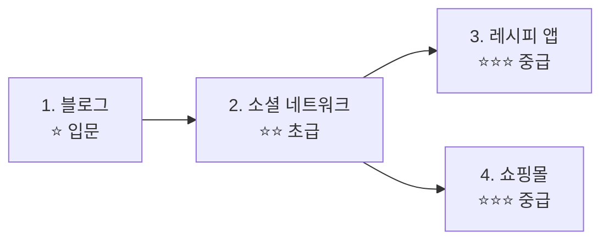

# 실전 프로젝트 쿡북


💡 bkend로 실전 앱을 처음부터 끝까지 구축하는 단계별 튜토리얼입니다.


## 개요

이 쿡북 시리즈는 bkend의 **인증**, **동적 테이블**, **스토리지**를 활용하여 실제 서비스를 만드는 방법을 안내합니다. 각 쿡북은 두 가지 방식으로 따라할 수 있습니다:

| 트랙 | 방식 | 대상 |
|------|------|------|
| **콘솔 + REST API** | 콘솔 UI에서 설정하고, curl/JavaScript로 데이터 처리 | 앱 개발자 |
| **MCP (AI 도구)** | AI에게 자연어로 요청하여 백엔드 구축 | AI 에이전트 사용자 |

***

## 쿡북 목록

| # | 쿡북 | 난이도 | 주요 기능 | 동적 테이블 |
|:-:|------|:------:|----------|-----------|
| 1 | [블로그](./blog/) | ⭐ | 게시글 CRUD, 이미지, 태그, 북마크 | articles, tags, bookmarks |
| 2 | [소셜 네트워크](./social-network/) | ⭐⭐ | 프로필, 게시물, 댓글, 팔로우, 피드 | profiles, posts, comments, likes, follows |
| 3 | [레시피 앱](./recipe-app/) | ⭐⭐⭐ | 레시피, 재료, 식단 계획, 쇼핑 목록 | recipes, ingredients, meal_plans, shopping_lists, cooking_logs |
| 4 | [쇼핑몰](./shopping-mall/) | ⭐⭐⭐ | 상품, 장바구니, 주문, 리뷰 | products, carts, orders, reviews |

***

## 학습 순서



### 입문자

**블로그**부터 시작하세요. 테이블 생성, 데이터 CRUD, 파일 업로드의 기본을 배울 수 있습니다.

### 경험자

관심 있는 쿡북을 바로 선택하세요. 각 쿡북은 독립적으로 진행할 수 있습니다.

***

## 각 쿡북 구조

```
{쿡북}/
├── README.md                    # 소개 + 테이블 설계
├── quick-start.md               # 빠르게 시작하기
└── full-guide/
    ├── 00-overview.md           # 프로젝트 개요
    ├── 01-auth.md               # 인증 설정
    ├── 02-{기능}.md             # 핵심 기능 1
    ├── 03-{기능}.md             # 핵심 기능 2
    ├── 04-{기능}.md             # 핵심 기능 3
    ├── 05-{기능}.md             # 핵심 기능 4
    ├── 06-ai-prompts.md         # AI 프롬프트 모음
    └── 99-troubleshooting.md    # 문제 해결
```

***

## 사전 준비

쿡북을 시작하기 전에 아래 항목을 준비하세요.

| 항목 | 설명 | 참고 문서 |
|------|------|----------|
| bkend 계정 | 콘솔에서 회원가입 | [콘솔 회원가입](../ko/console/02-signup-login.md) |
| 프로젝트 생성 | 콘솔에서 새 프로젝트 생성 | [프로젝트 관리](../ko/console/04-project-management.md) |
| API Key | 콘솔 → **API 키**에서 발급 | [API 키 관리](../ko/console/11-api-keys.md) |
| AI 도구 (선택) | Claude Code 또는 Cursor 설치 | [AI 도구 연동](../ko/ai-tools/01-overview.md) |

***

## 사용하는 bkend 기능

| bkend 기능 | 쿡북에서 활용 | 참고 문서 |
|-----------|-------------|----------|
| 인증 | 이메일 회원가입/로그인, 소셜 로그인 | [인증 개요](../ko/authentication/01-overview.md) |
| 동적 테이블 | 데이터 CRUD, 필터링, 페이지네이션 | [데이터베이스 개요](../ko/database/01-overview.md) |
| 스토리지 | 이미지/파일 업로드 | [스토리지 개요](../ko/storage/01-overview.md) |
| MCP 도구 | AI로 테이블/데이터 관리 | [AI 도구 연동](../ko/ai-tools/01-overview.md) |

***

## 참고 문서

- [빠른 시작 가이드](../ko/getting-started/02-quickstart.md) — bkend 첫 설정
- [앱에서 bkend 연동하기](../ko/getting-started/06-app-integration.md) — bkendFetch 헬퍼
- [에러 처리 가이드](../ko/guides/11-error-handling.md) — 공통 에러 대응
