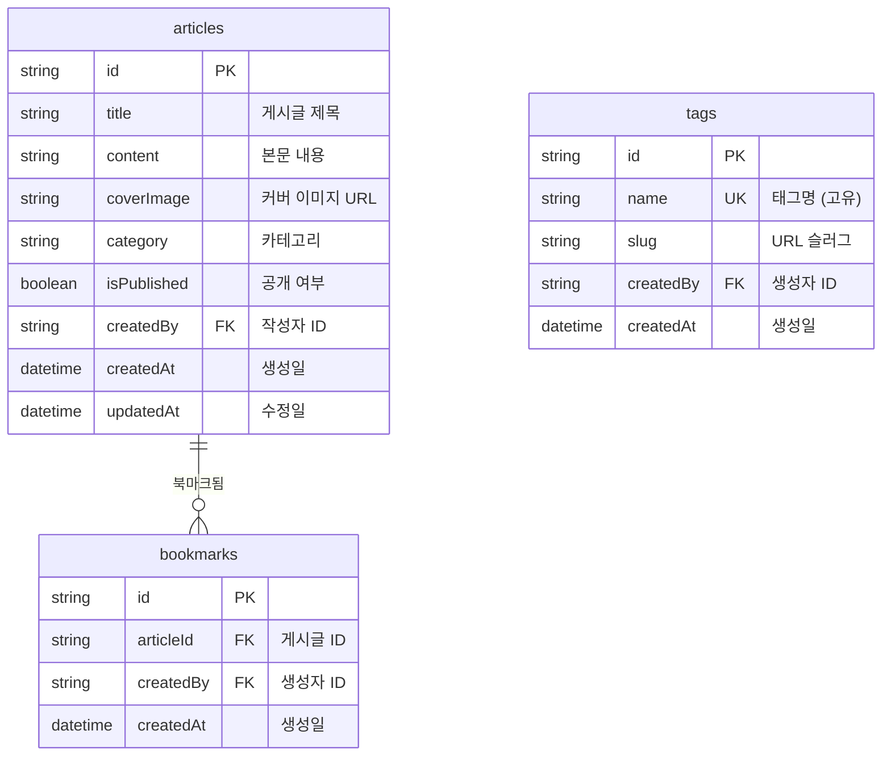

# 블로그 쿡북


💡 bkend로 개인 블로그를 처음부터 끝까지 구축합니다. 게시글 CRUD, 이미지 첨부, 태그 분류, 북마크 기능을 단계별로 구현하세요.


## 완성 모습

이 쿡북을 완료하면 다음 기능을 갖춘 개인 블로그를 만들 수 있습니다.

| 기능 | 설명 |
|------|------|
| 회원가입 / 로그인 | 이메일 기반 인증 |
| 게시글 CRUD | 게시글 작성, 조회, 수정, 삭제 |
| 커버 이미지 | 게시글에 이미지 첨부 |
| 태그 분류 | 태그로 게시글 분류 |
| 북마크 | 관심 게시글 저장 |

***

## 난이도

⭐ **입문** — bkend를 처음 사용하는 분에게 적합합니다. 기본적인 테이블 설계와 데이터 CRUD를 배울 수 있습니다.

| 항목 | 내용 |
|------|------|
| 예상 학습시간 | Quick Start 5분, Full Guide 2시간 |
| 플랫폼 | 웹 + 앱 |

***

## 사용하는 bkend 기능

| bkend 기능 | 쿡북에서 활용 | 참고 문서 |
|-----------|-------------|----------|
| 인증 | 이메일 회원가입 / 로그인, 토큰 관리 | [인증 개요](../../ko/authentication/01-overview.md) |
| 동적 테이블 | articles, tags, bookmarks 데이터 CRUD | [데이터베이스 개요](../../ko/database/01-overview.md) |
| 스토리지 | 게시글 커버 이미지 업로드 | [스토리지 개요](../../ko/storage/01-overview.md) |
| MCP 도구 | AI로 테이블 생성 및 데이터 관리 | [AI 도구 연동](../../ko/ai-tools/01-overview.md) |

***

## 테이블 설계

***

## 학습 순서

| 순서 | 챕터 | 핵심 내용 |
|:----:|------|----------|
| - | [빠른 시작](quick-start.md) | 5분 만에 게시글 작성 체험 |
| 0 | [프로젝트 개요](full-guide/00-overview.md) | 전체 구조, 테이블 설계, API 요약 |
| 1 | [인증 설정](full-guide/01-auth.md) | 이메일 회원가입/로그인, 토큰 관리 |
| 2 | [게시글 CRUD](full-guide/02-articles.md) | 게시글 작성, 조회, 수정, 삭제 |
| 3 | [이미지 첨부](full-guide/03-files.md) | 커버 이미지 업로드, 게시글에 연결 |
| 4 | [태그 관리](full-guide/04-tags.md) | 태그 생성, 게시글에 태그 할당 |
| 5 | [북마크](full-guide/05-bookmarks.md) | 관심 게시글 저장, 북마크 목록 |
| 6 | [AI 프롬프트 모음](full-guide/06-ai-prompts.md) | AI 활용 시나리오 |
| 99 | [문제 해결](full-guide/99-troubleshooting.md) | 자주 발생하는 에러 대응 |

***

## 사전 준비

| 항목 | 설명 | 참고 문서 |
|------|------|----------|
| bkend 계정 | 콘솔에서 회원가입 | [콘솔 회원가입](../../ko/console/02-signup-login.md) |
| 프로젝트 생성 | 콘솔에서 새 프로젝트 생성 | [프로젝트 관리](../../ko/console/04-project-management.md) |
| API Key | 콘솔 → **API 키**에서 발급 | [API 키 관리](../../ko/console/11-api-keys.md) |
| AI 도구 (선택) | Claude Code 또는 Cursor 설치 | [AI 도구 연동](../../ko/ai-tools/01-overview.md) |

***

## 참고 문서

- [빠른 시작 가이드](../../ko/getting-started/02-quickstart.md) — bkend 첫 설정
- [앱에서 bkend 연동하기](../../ko/getting-started/06-app-integration.md) — bkendFetch 헬퍼
- [에러 처리 가이드](../../ko/guides/11-error-handling.md) — 공통 에러 대응

***

## 다음 단계

- [5분 만에 시작하기](quick-start.md) — 바로 체험하고 싶다면
- [프로젝트 개요](full-guide/00-overview.md) — 전체 구조를 먼저 이해하고 싶다면
