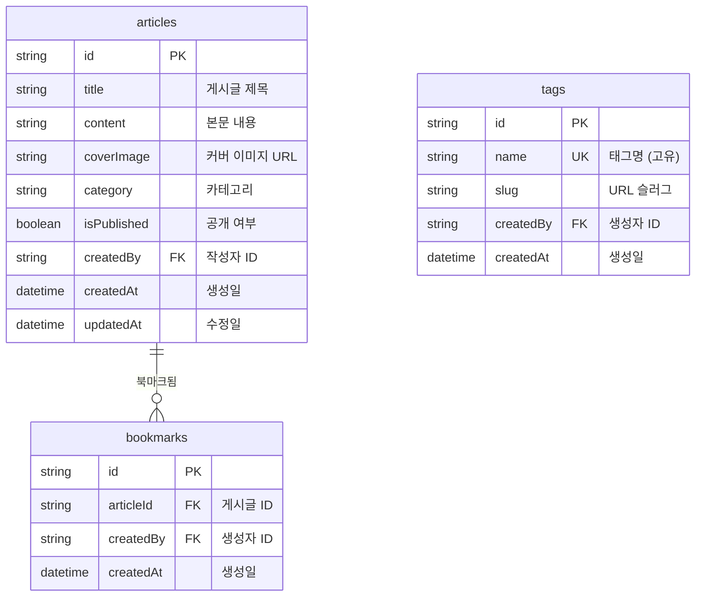
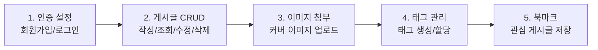

# 프로젝트 개요


💡 블로그 프로젝트의 전체 구조를 이해합니다. 어떤 기능을 만들고, 어떤 테이블과 API를 사용하는지 한눈에 확인하세요.


## 완성 모습

이 가이드를 완료하면 다음 기능을 갖춘 개인 블로그를 만들 수 있습니다.

| 기능 | 설명 |
|------|------|
| 이메일 인증 | 회원가입, 로그인, 토큰 관리 |
| 게시글 CRUD | 작성, 조회, 수정, 삭제, 공개/비공개 전환 |
| 커버 이미지 | 스토리지에 이미지 업로드 후 게시글에 연결 |
| 태그 분류 | 태그 생성, 게시글별 태그 할당 |
| 북마크 | 관심 게시글 저장 및 목록 조회 |

***

## 사전 준비

이 가이드를 시작하기 전에 아래 항목을 완료하세요.




| 순서 | 항목 | 참고 문서 |
|:----:|------|----------|
| 1 | bkend 콘솔 회원가입 | [콘솔 회원가입](../../../ko/console/02-signup-login.md) |
| 2 | 프로젝트 생성 | [프로젝트 관리](../../../ko/console/04-project-management.md) |
| 3 | AI 도구 설치 | [AI 도구 개요](../../../ko/ai-tools/01-overview.md) |
| 4 | MCP OAuth 연결 | [OAuth 설정](../../../ko/ai-tools/03-oauth-setup.md) |


✅ **AI에게 이렇게 말해보세요**
"bkend에 연결된 프로젝트 목록을 보여줘"

프로젝트 목록이 표시되면 준비 완료입니다.





| 순서 | 항목 | 참고 문서 |
|:----:|------|----------|
| 1 | bkend 콘솔 회원가입 | [콘솔 회원가입](../../../ko/console/02-signup-login.md) |
| 2 | 프로젝트 생성 | [프로젝트 관리](../../../ko/console/04-project-management.md) |
| 3 | API Key 발급 | [API 키 관리](../../../ko/console/11-api-keys.md) |





⚠️ 여기서 말하는 "회원가입"은 **bkend 콘솔 계정** 생성입니다. 앱 사용자의 회원가입은 [인증 설정](01-auth.md)에서 구현합니다.


***

## 사용 기능 요약

| bkend 기능 | 사용 목적 | 관련 챕터 |
|-----------|----------|----------|
| 인증 | 이메일 회원가입/로그인 | [01-auth](01-auth.md) |
| 동적 테이블 | articles, tags, bookmarks CRUD | [02-articles](02-articles.md), [04-tags](04-tags.md), [05-bookmarks](05-bookmarks.md) |
| 스토리지 | 커버 이미지 업로드 | [03-files](03-files.md) |
| MCP 도구 | AI로 테이블/데이터 관리 | [06-ai-prompts](06-ai-prompts.md) |

***

## 테이블 설계

블로그에서 사용하는 3개의 동적 테이블입니다. `id`, `createdBy`, `createdAt`, `updatedAt`은 시스템이 자동 생성하는 필드입니다.

### 필드 설명

#### articles

| 필드 | 타입 | 필수 | 설명 |
|------|------|:----:|------|
| `title` | String | ✅ | 게시글 제목 |
| `content` | String | ✅ | 본문 내용 (Markdown 지원) |
| `coverImage` | String | - | 커버 이미지 URL (스토리지 업로드 후 설정) |
| `category` | String | - | 카테고리 (예: `tech`, `life`, `travel`) |
| `isPublished` | Boolean | - | 공개 여부 (기본값: `false`) |

#### tags

| 필드 | 타입 | 필수 | 설명 |
|------|------|:----:|------|
| `name` | String | ✅ | 태그명 (고유값) |
| `slug` | String | - | URL 슬러그 (예: `javascript`) |

#### bookmarks

| 필드 | 타입 | 필수 | 설명 |
|------|------|:----:|------|
| `articleId` | String | ✅ | 북마크할 게시글 ID |

***

## 전체 구현 흐름

***

## API 엔드포인트 요약

블로그에서 사용하는 주요 REST API 엔드포인트입니다.

### 인증 API

| Method | 엔드포인트 | 설명 |
|:------:|-----------|------|
| POST | `/v1/auth/email/signup` | 이메일 회원가입 |
| POST | `/v1/auth/email/signin` | 이메일 로그인 |
| POST | `/v1/auth/refresh` | 토큰 갱신 |
| GET | `/v1/auth/me` | 내 정보 조회 |

### 데이터 API (동적 테이블)

| Method | 엔드포인트 | 설명 |
|:------:|-----------|------|
| POST | `/v1/data/{tableName}` | 데이터 생성 |
| GET | `/v1/data/{tableName}/{id}` | 단건 조회 |
| GET | `/v1/data/{tableName}` | 목록 조회 |
| PATCH | `/v1/data/{tableName}/{id}` | 데이터 수정 |
| DELETE | `/v1/data/{tableName}/{id}` | 데이터 삭제 |

### 스토리지 API

| Method | 엔드포인트 | 설명 |
|:------:|-----------|------|
| POST | `/v1/files/upload` | 파일 업로드 |
| GET | `/v1/files/{fileId}` | 파일 메타데이터 조회 |


💡 모든 API 요청에는 `X-Project-Id`와 `X-Environment` 헤더가 필요합니다. 인증이 필요한 API에는 `Authorization: Bearer {accessToken}` 헤더도 추가하세요.


***

## 학습 순서

| 순서 | 챕터 | 핵심 내용 | 사용 API |
|:----:|------|----------|----------|
| 1 | [인증 설정](01-auth.md) | 회원가입, 로그인, 토큰 관리 | 인증 API |
| 2 | [게시글 CRUD](02-articles.md) | 게시글 작성, 조회, 수정, 삭제 | `/v1/data/articles` |
| 3 | [이미지 첨부](03-files.md) | 커버 이미지 업로드, 게시글에 연결 | `/v1/files/upload` |
| 4 | [태그 관리](04-tags.md) | 태그 생성, 게시글에 태그 할당 | `/v1/data/tags` |
| 5 | [북마크](05-bookmarks.md) | 관심 게시글 저장, 북마크 목록 | `/v1/data/bookmarks` |
| 6 | [AI 프롬프트 모음](06-ai-prompts.md) | MCP AI 활용 시나리오 | MCP 도구 |
| 99 | [문제 해결](99-troubleshooting.md) | 자주 발생하는 에러 대응 | - |

***

## 참고 문서

- [데이터베이스 개요](../../../ko/database/01-overview.md) — 동적 테이블 개념
- [스토리지 개요](../../../ko/storage/01-overview.md) — 파일 업로드 개념
- [blog-web 예제 프로젝트](../../../examples/blog-web/) — 이 쿡북을 Next.js로 구현한 전체 코드

## 다음 단계

[인증 설정](01-auth.md)에서 이메일 회원가입과 로그인을 구현합니다.
