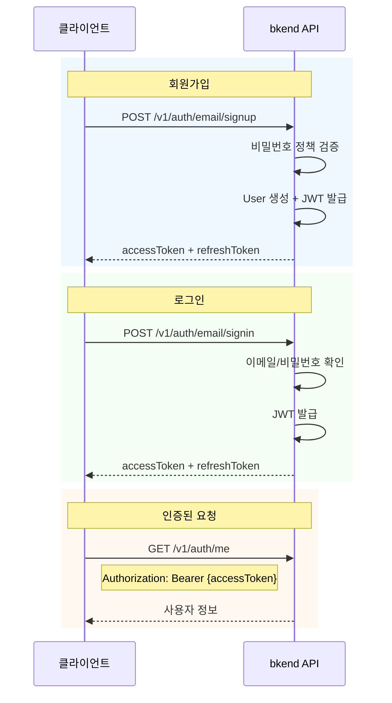

# 인증 설정


💡 블로그 앱에 이메일 회원가입과 로그인을 구현합니다. 인증을 완료하면 Access Token을 발급받아 게시글 CRUD 등 인증이 필요한 API를 호출할 수 있습니다.


## 개요

블로그 앱은 이메일 기반 인증을 사용합니다.

| 기능 | 설명 | 엔드포인트 |
|------|------|-----------|
| 회원가입 | 이메일 + 비밀번호로 계정 생성 | `POST /v1/auth/email/signup` |
| 로그인 | 이메일 + 비밀번호로 토큰 발급 | `POST /v1/auth/email/signin` |
| 토큰 갱신 | Refresh Token으로 새 Access Token 발급 | `POST /v1/auth/refresh` |
| 내 정보 확인 | 현재 로그인한 사용자 정보 조회 | `GET /v1/auth/me` |

***

## 인증 흐름



***

## 1단계: 회원가입

이메일과 비밀번호로 새 계정을 생성합니다.




### curl

```bash
curl -X POST https://api-client.bkend.ai/v1/auth/email/signup \
  -H "Content-Type: application/json" \
  -H "X-Project-Id: {project_id}" \
  -H "X-Environment: dev" \
  -d '{
    "method": "password",
    "email": "blogger@example.com",
    "password": "MyP@ssw0rd!",
    "name": "홍길동"
  }'
```

### bkendFetch

```javascript
import { bkendFetch } from './bkend.js';

const result = await bkendFetch('/v1/auth/email/signup', {
  method: 'POST',
  body: {
    method: 'password',
    email: 'blogger@example.com',
    password: 'MyP@ssw0rd!',
    name: '홍길동',
  },
});

// 토큰 저장
localStorage.setItem('accessToken', result.accessToken);
localStorage.setItem('refreshToken', result.refreshToken);
```

### 요청 파라미터

| 파라미터 | 타입 | 필수 | 설명 |
|---------|------|:----:|------|
| `method` | `string` | ✅ | `"password"` 고정 |
| `email` | `string` | ✅ | 사용자 이메일 주소 |
| `password` | `string` | ✅ | 비밀번호 (최소 8자) |
| `name` | `string` | ✅ | 사용자 이름 |

### 성공 응답

```json
{
  "accessToken": "eyJhbGciOiJIUzI1NiIs...",
  "refreshToken": "eyJhbGciOiJIUzI1NiIs...",
  "tokenType": "Bearer",
  "expiresIn": 3600
}
```





⚠️ 회원가입은 앱에서 사용자가 직접 수행하는 기능입니다. MCP 도구가 아닌 REST API로 구현하세요.


인증 관련 API는 앱의 프론트엔드에서 REST API를 직접 호출합니다. MCP 도구는 테이블 생성, 데이터 관리 등 백엔드 설정 작업에 사용합니다.




***

## 2단계: 로그인

등록한 이메일과 비밀번호로 로그인하여 토큰을 발급받습니다.




### curl

```bash
curl -X POST https://api-client.bkend.ai/v1/auth/email/signin \
  -H "Content-Type: application/json" \
  -H "X-Project-Id: {project_id}" \
  -H "X-Environment: dev" \
  -d '{
    "method": "password",
    "email": "blogger@example.com",
    "password": "MyP@ssw0rd!"
  }'
```

### bkendFetch

```javascript
const result = await bkendFetch('/v1/auth/email/signin', {
  method: 'POST',
  body: {
    method: 'password',
    email: 'blogger@example.com',
    password: 'MyP@ssw0rd!',
  },
});

// 토큰 저장
localStorage.setItem('accessToken', result.accessToken);
localStorage.setItem('refreshToken', result.refreshToken);
```

### 요청 파라미터

| 파라미터 | 타입 | 필수 | 설명 |
|---------|------|:----:|------|
| `method` | `string` | ✅ | `"password"` 고정 |
| `email` | `string` | ✅ | 등록된 이메일 주소 |
| `password` | `string` | ✅ | 비밀번호 |

### 성공 응답

```json
{
  "accessToken": "eyJhbGciOiJIUzI1NiIs...",
  "refreshToken": "eyJhbGciOiJIUzI1NiIs...",
  "tokenType": "Bearer",
  "expiresIn": 3600
}
```

| 필드 | 타입 | 설명 |
|------|------|------|
| `accessToken` | `string` | JWT Access Token — API 인증에 사용 |
| `refreshToken` | `string` | JWT Refresh Token — Access Token 갱신에 사용 |
| `tokenType` | `string` | 토큰 타입 (`"Bearer"`) |
| `expiresIn` | `number` | Access Token 만료 시간 (초) |





⚠️ 로그인은 앱에서 사용자가 직접 수행하는 기능입니다. MCP 도구가 아닌 REST API로 구현하세요.


인증 관련 API는 앱의 프론트엔드에서 REST API를 직접 호출합니다.




***

## 3단계: 토큰 저장

발급받은 토큰을 앱에서 관리합니다. `bkendFetch` 헬퍼가 자동으로 `Authorization` 헤더에 토큰을 포함합니다.

### 토큰 유효 시간

| 토큰 | 유효 시간 | 용도 |
|------|:---------:|------|
| Access Token | 1시간 | API 인증 |
| Refresh Token | 30일 | Access Token 갱신 |

### 토큰 갱신

Access Token이 만료되면 Refresh Token으로 새 토큰을 발급받으세요.

```bash
curl -X POST https://api-client.bkend.ai/v1/auth/refresh \
  -H "Content-Type: application/json" \
  -H "X-Project-Id: {project_id}" \
  -H "X-Environment: dev" \
  -d '{
    "refreshToken": "{refresh_token}"
  }'
```

```javascript
// bkendFetch 헬퍼는 401 응답 시 자동으로 토큰을 갱신합니다.
// 별도 처리 없이 bkendFetch를 사용하면 됩니다.
```


💡 `bkendFetch` 헬퍼의 자동 토큰 갱신 로직은 [앱에서 bkend 연동하기](../../../ko/getting-started/06-app-integration.md)에서 확인할 수 있습니다.


***

## 4단계: 인증 상태 확인

현재 로그인한 사용자 정보를 조회합니다.




### curl

```bash
curl -X GET https://api-client.bkend.ai/v1/auth/me \
  -H "Authorization: Bearer {accessToken}" \
  -H "X-Project-Id: {project_id}" \
  -H "X-Environment: dev"
```

### bkendFetch

```javascript
const user = await bkendFetch('/v1/auth/me');

console.log(user);
// { id: "user_abc123", email: "blogger@example.com", name: "홍길동", ... }
```

### 성공 응답

```json
{
  "id": "user_abc123",
  "email": "blogger@example.com",
  "name": "홍길동",
  "emailVerified": false,
  "createdAt": "2026-02-08T10:00:00Z"
}
```





⚠️ 인증 상태 확인은 앱에서 REST API로 구현합니다.






✅ `/v1/auth/me`에서 사용자 정보가 반환되면 인증 설정이 완료된 것입니다. 이제 게시글 CRUD를 구현할 준비가 되었습니다.


***

## 에러 처리

### 회원가입 에러

| 에러 코드 | HTTP | 설명 |
|----------|:----:|------|
| `auth/invalid-email` | 400 | 이메일 형식이 올바르지 않음 |
| `auth/invalid-password-format` | 400 | 비밀번호 정책 위반 (최소 8자) |
| `auth/email-already-exists` | 409 | 이미 등록된 이메일 |

### 로그인 에러

| 에러 코드 | HTTP | 설명 |
|----------|:----:|------|
| `auth/invalid-email` | 400 | 이메일 형식이 올바르지 않음 |
| `auth/invalid-credentials` | 401 | 이메일 또는 비밀번호 불일치 |
| `auth/account-banned` | 403 | 이용이 정지된 계정 |

### 토큰 에러

| 에러 코드 | HTTP | 설명 |
|----------|:----:|------|
| `auth/token-expired` | 401 | Access Token 만료 → 토큰 갱신 필요 |
| `auth/invalid-refresh-token` | 401 | Refresh Token 만료 → 재로그인 필요 |

***

## 참고 문서

- [이메일 회원가입](../../../ko/authentication/02-email-signup.md) — 회원가입 상세
- [이메일 로그인](../../../ko/authentication/03-email-signin.md) — 로그인 상세
- [토큰 관리](../../../ko/authentication/20-token-management.md) — 토큰 저장 및 갱신 패턴

## 다음 단계

[게시글 CRUD](02-articles.md)에서 articles 테이블을 생성하고 게시글을 작성합니다.
