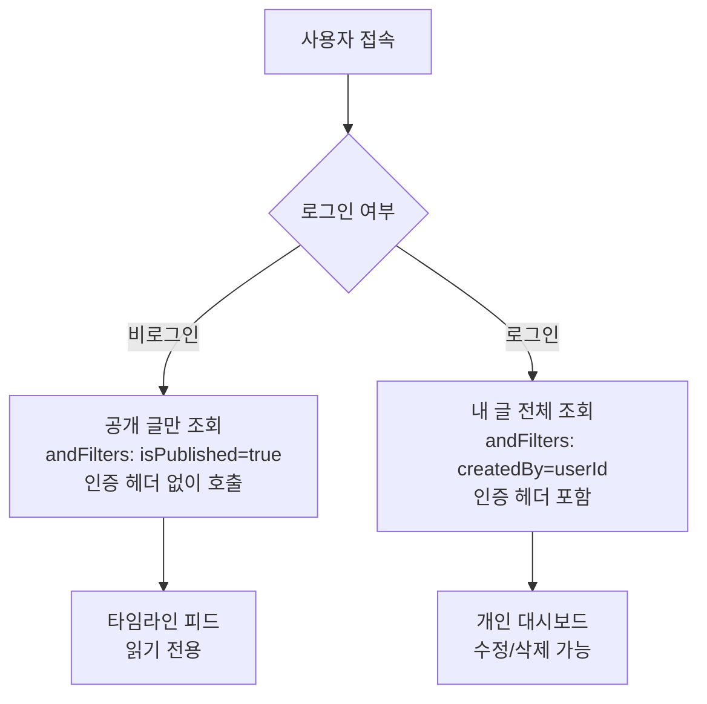
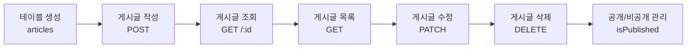

# 게시글 CRUD 구현하기


💡 블로그의 핵심인 게시글 테이블을 생성하고, 게시글 작성/조회/수정/삭제를 구현합니다.


## 개요

블로그 게시글의 전체 CRUD(생성, 조회, 수정, 삭제)를 구현합니다.

| 기능 | 설명 | API 엔드포인트 |
|------|------|---------------|
| 테이블 생성 | articles 테이블 생성 | 콘솔 UI / MCP |
| 게시글 작성 | 제목, 본문, 카테고리 입력 | `POST /v1/data/articles` |
| 게시글 조회 | ID로 단건 조회 | `GET /v1/data/articles/{id}` |
| 게시글 목록 | 필터/정렬/페이지네이션 | `GET /v1/data/articles` |
| 게시글 수정 | 부분 필드 수정 | `PATCH /v1/data/articles/{id}` |
| 게시글 삭제 | 게시글 삭제 | `DELETE /v1/data/articles/{id}` |

### 선행 조건

| 필요 항목 | 설명 | 참조 |
|----------|------|------|
| 인증 설정 완료 | Access Token 발급 | [01-auth.md](01-auth.md) |

***

## 1단계: articles 테이블 생성

게시글 데이터를 저장할 `articles` 테이블을 생성합니다.

### 테이블 스키마

| 필드 | 타입 | 필수 | 설명 |
|------|------|:----:|------|
| `title` | String | ✅ | 게시글 제목 |
| `content` | String | ✅ | 본문 내용 (Markdown 지원) |
| `coverImage` | String | - | 커버 이미지 URL |
| `category` | String | - | 카테고리 (예: `tech`, `life`, `travel`) |
| `isPublished` | Boolean | - | 공개 여부 (기본값: `false`) |


💡 `id`, `createdBy`, `createdAt`, `updatedAt`은 시스템이 자동 생성하는 필드입니다. 직접 정의하지 않아도 됩니다.






✅ **AI에게 이렇게 말해보세요**
"블로그 글을 저장하고 싶어요. 제목, 본문, 대표 이미지, 카테고리, 공개 여부를 관리할 수 있게 해주세요. 만들기 전에 어떤 구조로 만들지 먼저 보여주세요."



💡 AI가 아래와 비슷한 구조를 제안하는지 확인하세요.

| 필드 | 설명 | 예시 값 |
|------|------|---------|
| title | 게시글 제목 | "나의 첫 블로그" |
| content | 본문 내용 | "안녕하세요..." |
| coverImage | 대표 이미지 URL | (업로드 후 연결) |
| category | 카테고리 | "여행" |
| isPublished | 공개 여부 | `true` / `false` |





bkend 콘솔에서 테이블을 생성합니다.

1. **콘솔** > **테이블 관리** 메뉴로 이동합니다.
2. **테이블 추가** 버튼을 클릭합니다.
3. 테이블 이름에 `articles`를 입력합니다.
4. 위 스키마 표의 필드를 하나씩 추가합니다.
5. **저장** 버튼을 클릭합니다.

<!-- 📸 IMG: 콘솔에서 articles 테이블 생성 화면 -->


💡 테이블 관리에 대한 자세한 내용은 [테이블 관리](../../../ko/console/07-table-management.md)를 참고하세요.





***

## 2단계: 게시글 작성





✅ **AI에게 이렇게 말해보세요**
"블로그에 새 글을 작성해주세요. 제목은 '제주도 3박4일 여행기', 카테고리는 '여행'으로요. 아직 공개하지 말고 초안으로 저장해주세요."





### curl

```bash
curl -X POST https://api-client.bkend.ai/v1/data/articles \
  -H "Content-Type: application/json" \
  -H "X-API-Key: {pk_publishable_key}" \
  -H "Authorization: Bearer {accessToken}" \
  -d '{
    "title": "제주도 3박4일 여행기",
    "content": "# 제주도 여행\n\n첫째 날, 공항에 도착하자마자...",
    "category": "travel",
    "isPublished": false
  }'
```

### bkendFetch

```javascript
import { bkendFetch } from './bkend.js';

const article = await bkendFetch('/v1/data/articles', {
  method: 'POST',
  body: {
    title: '제주도 3박4일 여행기',
    content: '# 제주도 여행\n\n첫째 날, 공항에 도착하자마자...',
    category: 'travel',
    isPublished: false,
  },
});

console.log(article.id); // 생성된 게시글 ID
```

### 요청 파라미터

| 파라미터 | 타입 | 필수 | 설명 |
|---------|------|:----:|------|
| `title` | `string` | ✅ | 게시글 제목 |
| `content` | `string` | ✅ | 본문 내용 |
| `coverImage` | `string` | - | 커버 이미지 URL |
| `category` | `string` | - | 카테고리 |
| `isPublished` | `boolean` | - | 공개 여부 (기본값: `false`) |

### 성공 응답 (201 Created)

```json
{
  "id": "507f1f77bcf86cd799439011",
  "title": "제주도 3박4일 여행기",
  "content": "# 제주도 여행\n\n첫째 날, 공항에 도착하자마자...",
  "category": "travel",
  "isPublished": false,
  "createdBy": "user-uuid-1234",
  "createdAt": "2026-02-08T10:00:00.000Z"
}
```




***

## 3단계: 게시글 조회

### 단건 조회

ID를 사용하여 특정 게시글을 조회합니다.





✅ **AI에게 이렇게 말해보세요**
"방금 작성한 글 내용을 보여주세요"





### curl

```bash
curl -X GET https://api-client.bkend.ai/v1/data/articles/{id} \
  -H "X-API-Key: {pk_publishable_key}" \
  -H "Authorization: Bearer {accessToken}"
```

### bkendFetch

```javascript
const article = await bkendFetch(`/v1/data/articles/${articleId}`);

console.log(article.title);    // "제주도 3박4일 여행기"
console.log(article.category); // "travel"
```

### 성공 응답 (200 OK)

```json
{
  "id": "507f1f77bcf86cd799439011",
  "title": "제주도 3박4일 여행기",
  "content": "# 제주도 여행\n\n첫째 날, 공항에 도착하자마자...",
  "category": "travel",
  "isPublished": false,
  "createdBy": "user-uuid-1234",
  "createdAt": "2026-02-08T10:00:00.000Z",
  "updatedAt": "2026-02-08T10:00:00.000Z"
}
```




***

## 4단계: 게시글 목록 조회

게시글을 목록으로 조회합니다. 필터링, 정렬, 페이지네이션을 지원합니다.





✅ **AI에게 이렇게 말해보세요**
"여행 카테고리 글 중에서 최신순으로 5개만 보여주세요"



✅ **공개된 글만 보려면**
"공개된 글만 최신순으로 보여주세요"





### curl — 기본 목록 조회

```bash
curl -X GET "https://api-client.bkend.ai/v1/data/articles?page=1&limit=10&sortBy=createdAt&sortDirection=desc" \
  -H "X-API-Key: {pk_publishable_key}" \
  -H "Authorization: Bearer {accessToken}"
```

### curl — 카테고리별 필터링

```bash
curl -X GET "https://api-client.bkend.ai/v1/data/articles?page=1&limit=10&sortBy=createdAt&sortDirection=desc&andFilters=%7B%22category%22%3A%22travel%22%7D" \
  -H "X-API-Key: {pk_publishable_key}" \
  -H "Authorization: Bearer {accessToken}"
```

### bkendFetch

```javascript
// 기본 목록 조회
const result = await bkendFetch('/v1/data/articles?page=1&limit=10&sortBy=createdAt&sortDirection=desc');

console.log(result.items);      // 게시글 배열
console.log(result.pagination); // 페이지네이션 정보

// 카테고리별 필터링
const filters = JSON.stringify({ category: 'travel' });
const travelPosts = await bkendFetch(
  `/v1/data/articles?page=1&limit=10&sortBy=createdAt&sortDirection=desc&andFilters=${encodeURIComponent(filters)}`
);

// 공개된 게시글만 조회
const publishedFilters = JSON.stringify({ isPublished: true });
const publishedPosts = await bkendFetch(
  `/v1/data/articles?page=1&limit=10&andFilters=${encodeURIComponent(publishedFilters)}`
);
```

### 쿼리 파라미터

| 파라미터 | 타입 | 기본값 | 설명 |
|---------|------|:------:|------|
| `page` | `number` | `1` | 페이지 번호 |
| `limit` | `number` | `20` | 페이지당 항목 수 (1~100) |
| `sortBy` | `string` | - | 정렬 필드 (`createdAt`, `title` 등) |
| `sortDirection` | `string` | `desc` | `asc` 또는 `desc` |
| `andFilters` | `JSON` | - | AND 조건 필터 |
| `search` | `string` | - | 검색어 (부분 일치) |

### 성공 응답 (200 OK)

```json
{
  "items": [
    {
      "id": "507f1f77bcf86cd799439011",
      "title": "제주도 3박4일 여행기",
      "category": "travel",
      "isPublished": false,
      "createdBy": "user-uuid-1234",
      "createdAt": "2026-02-08T10:00:00.000Z"
    },
    {
      "id": "507f1f77bcf86cd799439012",
      "title": "부산 먹방 투어",
      "category": "food",
      "isPublished": true,
      "createdBy": "user-uuid-1234",
      "createdAt": "2026-02-07T09:00:00.000Z"
    }
  ],
  "pagination": {
    "total": 25,
    "page": 1,
    "limit": 10,
    "totalPages": 3,
    "hasNext": true,
    "hasPrev": false
  }
}
```




***

## 5단계: 게시글 수정

변경할 필드만 요청에 포함하면 됩니다 (Partial Update).





✅ **AI에게 이렇게 말해보세요**
"방금 작성한 여행 글 제목을 '제주도 3박4일 여행기 (수정)'으로 바꿔주세요"



✅ **글을 공개하려면**
"이 글을 공개해주세요"





### curl — 제목 수정

```bash
curl -X PATCH https://api-client.bkend.ai/v1/data/articles/{id} \
  -H "Content-Type: application/json" \
  -H "X-API-Key: {pk_publishable_key}" \
  -H "Authorization: Bearer {accessToken}" \
  -d '{
    "title": "제주도 3박4일 여행기 (수정)"
  }'
```

### curl — 공개 상태로 변경

```bash
curl -X PATCH https://api-client.bkend.ai/v1/data/articles/{id} \
  -H "Content-Type: application/json" \
  -H "X-API-Key: {pk_publishable_key}" \
  -H "Authorization: Bearer {accessToken}" \
  -d '{
    "isPublished": true
  }'
```

### bkendFetch

```javascript
// 제목 수정
const updated = await bkendFetch(`/v1/data/articles/${articleId}`, {
  method: 'PATCH',
  body: {
    title: '제주도 3박4일 여행기 (수정)',
  },
});

// 공개 상태로 변경
await bkendFetch(`/v1/data/articles/${articleId}`, {
  method: 'PATCH',
  body: {
    isPublished: true,
  },
});
```

### 성공 응답 (200 OK)

```json
{
  "id": "507f1f77bcf86cd799439011",
  "title": "제주도 3박4일 여행기 (수정)",
  "content": "# 제주도 여행\n\n첫째 날, 공항에 도착하자마자...",
  "category": "travel",
  "isPublished": true,
  "createdBy": "user-uuid-1234",
  "createdAt": "2026-02-08T10:00:00.000Z",
  "updatedAt": "2026-02-08T14:30:00.000Z"
}
```


⚠️ `id`, `createdBy`, `createdAt`은 수정할 수 없습니다. `updatedAt`은 자동으로 갱신됩니다.





***

## 6단계: 게시글 삭제





✅ **AI에게 이렇게 말해보세요**
"'제주도 3박4일 여행기' 글을 삭제해주세요"





### curl

```bash
curl -X DELETE https://api-client.bkend.ai/v1/data/articles/{id} \
  -H "X-API-Key: {pk_publishable_key}" \
  -H "Authorization: Bearer {accessToken}"
```

### bkendFetch

```javascript
await bkendFetch(`/v1/data/articles/${articleId}`, {
  method: 'DELETE',
});
```

### 성공 응답 (200 OK)

```json
{
  "success": true
}
```


🚨 **위험** — 삭제된 게시글은 복구할 수 없습니다. 삭제 전 사용자에게 확인을 요청하세요.





***

## 에러 처리

### 게시글 생성/수정 에러

| HTTP 상태 | 에러 코드 | 원인 | 처리 방법 |
|:---------:|----------|------|----------|
| 400 | `data/validation-error` | 필수 필드 누락 또는 타입 불일치 | 요청 바디에 `title`, `content` 포함 확인 |
| 401 | `common/authentication-required` | 인증 토큰 만료 | 토큰 갱신 후 재시도 |
| 403 | `data/permission-denied` | 권한 없음 | 해당 테이블의 create/update 권한 확인 |
| 404 | `data/table-not-found` | 테이블 미존재 | 1단계에서 테이블 생성 확인 |
| 404 | `data/not-found` | 존재하지 않는 게시글 | ID 확인 |

***

## 공개/비공개 흐름

`isPublished` 필드를 활용하여 비로그인 사용자에게는 공개 글만 보여주고, 로그인한 작성자에게는 드래프트도 표시할 수 있습니다.



### 공개 글 목록 조회 (인증 불필요)





✅ **AI에게 이렇게 말해보세요**
"공개된 블로그 글을 최신순으로 보여주세요"





```bash
curl -X GET "https://api-client.bkend.ai/v1/data/articles?page=1&limit=10&sortBy=createdAt&sortDirection=desc&andFilters=%7B%22isPublished%22%3Atrue%7D" \
  -H "X-API-Key: {pk_publishable_key}"
```


💡 공개 글 조회에는 `Authorization` 헤더가 필요하지 않습니다. `X-API-Key`만 전송하세요.





### 내 글 목록 조회 (인증 필요)





✅ **AI에게 이렇게 말해보세요**
"내가 작성한 글 목록을 보여주세요. 드래프트도 포함해서요."





```bash
curl -X GET "https://api-client.bkend.ai/v1/data/articles?page=1&limit=10&sortBy=createdAt&sortDirection=desc&andFilters=%7B%22createdBy%22%3A%22{userId}%22%7D" \
  -H "X-API-Key: {pk_publishable_key}" \
  -H "Authorization: Bearer {accessToken}"
```




***

## 전체 흐름 요약



***

## 참고 문서

- [데이터 생성](../../../ko/database/03-insert.md) — POST API 상세
- [단건 데이터 조회](../../../ko/database/04-select.md) — GET API 상세
- [데이터 목록 조회](../../../ko/database/05-list.md) — 필터/정렬/페이지네이션 상세
- [데이터 수정](../../../ko/database/06-update.md) — PATCH API 상세
- [테이블 관리](../../../ko/console/07-table-management.md) — 콘솔에서 테이블 관리

## 다음 단계

[이미지 업로드](03-files.md)에서 커버 이미지를 업로드하고 게시글에 연결합니다.
