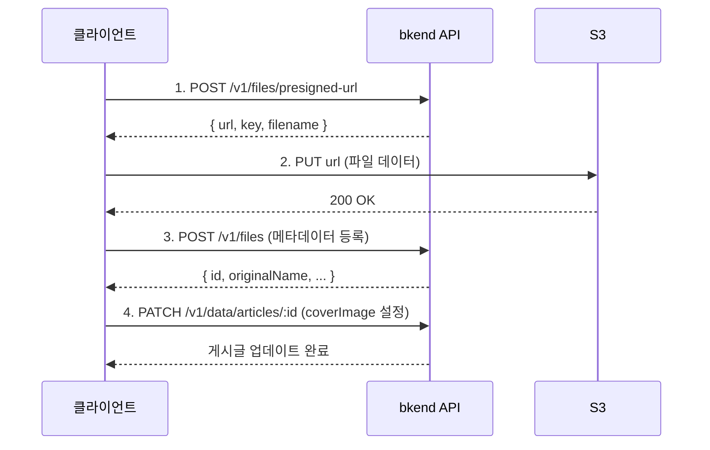

# 이미지 업로드 구현하기


💡 블로그 게시글에 커버 이미지를 업로드하고 연결합니다. Presigned URL 방식으로 안전하게 파일을 업로드할 수 있습니다.


## 개요

이미지 업로드는 3단계로 진행됩니다:

1. **Presigned URL 발급** — bkend API에서 업로드용 URL을 받습니다.
2. **S3 업로드** — 발급받은 URL로 파일을 직접 업로드합니다.
3. **게시글에 연결** — 업로드한 이미지 URL을 게시글의 `coverImage`에 설정합니다.

| 기능 | 설명 | API 엔드포인트 |
|------|------|---------------|
| Presigned URL 발급 | 업로드용 URL 생성 | `POST /v1/files/presigned-url` |
| 메타데이터 등록 | 파일 정보 저장 | `POST /v1/files` |
| 파일 조회 | 파일 정보 확인 | `GET /v1/files/{fileId}` |
| 파일 삭제 | 파일 삭제 | `DELETE /v1/files/{fileId}` |

### 선행 조건

| 필요 항목 | 설명 | 참조 |
|----------|------|------|
| 인증 설정 완료 | Access Token 발급 | [01-auth.md](01-auth.md) |
| articles 테이블 | 이미지를 연결할 게시글 | [02-articles.md](02-articles.md) |

***

## 업로드 흐름



***

## 1단계: Presigned URL 발급





⚠️ 파일 업로드는 클라이언트에서 직접 수행하는 기능입니다. Presigned URL 발급과 S3 업로드는 REST API로 구현하세요.


MCP 도구는 테이블/데이터 관리에 사용합니다. 파일 업로드 후 게시글에 이미지를 연결하는 작업은 MCP로 수행할 수 있습니다.


✅ **이미지 업로드 후 게시글에 연결하려면**
"게시글에 대표 이미지를 설정하고 싶어요. 이 이미지 URL을 사용해주세요: (URL)"





### curl

```bash
curl -X POST https://api-client.bkend.ai/v1/files/presigned-url \
  -H "Content-Type: application/json" \
  -H "Authorization: Bearer {accessToken}" \
  -H "X-Project-Id: {project_id}" \
  -H "X-Environment: dev" \
  -d '{
    "filename": "cover-jeju.jpg",
    "contentType": "image/jpeg",
    "fileSize": 2048000,
    "visibility": "public",
    "category": "images"
  }'
```

### bkendFetch

```javascript
import { bkendFetch } from './bkend.js';

const presigned = await bkendFetch('/v1/files/presigned-url', {
  method: 'POST',
  body: {
    filename: 'cover-jeju.jpg',
    contentType: 'image/jpeg',
    fileSize: 2048000,
    visibility: 'public',
    category: 'images',
  },
});

console.log(presigned.url); // S3 업로드 URL
console.log(presigned.key); // 파일 식별 키
```

### 요청 파라미터

| 파라미터 | 타입 | 필수 | 설명 |
|---------|------|:----:|------|
| `filename` | `string` | ✅ | 원본 파일명 |
| `contentType` | `string` | ✅ | MIME 타입 (예: `image/jpeg`) |
| `fileSize` | `number` | - | 파일 크기 (바이트) |
| `visibility` | `string` | - | `public`, `private`(기본값), `protected`, `shared` |
| `category` | `string` | - | `images`, `documents`, `media`, `attachments` 등 |

### 성공 응답 (200 OK)

```json
{
  "url": "https://s3.amazonaws.com/bucket/...",
  "key": "{서버가_생성한_키}",
  "filename": "cover-jeju.jpg",
  "contentType": "image/jpeg"
}
```


⚠️ Presigned URL은 **15분** 동안만 유효합니다. 만료 전에 업로드를 완료하세요.





***

## 2단계: S3에 파일 업로드

발급받은 Presigned URL로 파일을 직접 업로드합니다.

```javascript
// Presigned URL로 파일 업로드
await fetch(presigned.url, {
  method: 'PUT',
  headers: {
    'Content-Type': file.type,
  },
  body: file, // File 또는 Blob 객체
});
```


⚠️ S3 업로드 시에는 `Authorization` 헤더를 포함하지 마세요. Presigned URL 자체에 인증 정보가 포함되어 있습니다.


***

## 3단계: 메타데이터 등록

S3 업로드 완료 후, bkend API에 파일 메타데이터를 등록합니다.





⚠️ 메타데이터 등록은 클라이언트에서 REST API로 수행합니다.





### curl

```bash
curl -X POST https://api-client.bkend.ai/v1/files \
  -H "Content-Type: application/json" \
  -H "Authorization: Bearer {accessToken}" \
  -H "X-Project-Id: {project_id}" \
  -H "X-Environment: dev" \
  -d '{
    "s3Key": "{presigned 응답의 key}",
    "originalName": "cover-jeju.jpg",
    "mimeType": "image/jpeg",
    "size": 2048000,
    "visibility": "public"
  }'
```

### bkendFetch

```javascript
const fileMetadata = await bkendFetch('/v1/files', {
  method: 'POST',
  body: {
    s3Key: presigned.key,
    originalName: 'cover-jeju.jpg',
    mimeType: 'image/jpeg',
    size: 2048000,
    visibility: 'public',
  },
});

console.log(fileMetadata.id); // 파일 ID
```

### 요청 파라미터

| 파라미터 | 타입 | 필수 | 설명 |
|---------|------|:----:|------|
| `s3Key` | `string` | ✅ | Presigned URL 응답의 `key` |
| `originalName` | `string` | ✅ | 원본 파일명 |
| `mimeType` | `string` | ✅ | MIME 타입 |
| `size` | `number` | ✅ | 파일 크기 (바이트) |
| `visibility` | `string` | - | `public`, `private`(기본값), `protected`, `shared` |

### 성공 응답 (201 Created)

```json
{
  "id": "file-uuid-1234",
  "originalName": "cover-jeju.jpg",
  "mimeType": "image/jpeg",
  "size": 2048000,
  "visibility": "public",
  "ownerId": "user-uuid-1234",
  "createdAt": "2026-02-08T10:30:00.000Z"
}
```




***

## 4단계: 게시글에 이미지 연결

업로드한 이미지를 게시글의 `coverImage` 필드에 설정합니다.





✅ **AI에게 이렇게 말해보세요**
"제주도 여행 글의 대표 이미지를 이 URL로 설정해주세요: https://cdn.example.com/cover-jeju.jpg"





### curl

```bash
curl -X PATCH https://api-client.bkend.ai/v1/data/articles/{articleId} \
  -H "Content-Type: application/json" \
  -H "Authorization: Bearer {accessToken}" \
  -H "X-Project-Id: {project_id}" \
  -H "X-Environment: dev" \
  -d '{
    "coverImage": "https://cdn.example.com/cover-jeju.jpg"
  }'
```

### bkendFetch — 전체 업로드 플로우

```javascript
import { bkendFetch } from './bkend.js';

async function uploadCoverImage(file, articleId) {
  // 1. Presigned URL 발급
  const presigned = await bkendFetch('/v1/files/presigned-url', {
    method: 'POST',
    body: {
      filename: file.name,
      contentType: file.type,
      fileSize: file.size,
      visibility: 'public',
      category: 'images',
    },
  });

  // 2. S3에 파일 업로드 (bkendFetch 사용 금지 — Authorization 헤더 불필요)
  await fetch(presigned.url, {
    method: 'PUT',
    headers: { 'Content-Type': file.type },
    body: file,
  });

  // 3. 메타데이터 등록
  const metadata = await bkendFetch('/v1/files', {
    method: 'POST',
    body: {
      s3Key: presigned.key,
      originalName: file.name,
      mimeType: file.type,
      size: file.size,
      visibility: 'public',
    },
  });

  // 4. 게시글에 이미지 연결
  await bkendFetch(`/v1/data/articles/${articleId}`, {
    method: 'PATCH',
    body: {
      coverImage: metadata.url || presigned.url,
    },
  });

  return metadata;
}

// HTML 파일 입력과 함께 사용
const fileInput = document.querySelector('input[type="file"]');
fileInput.addEventListener('change', async (e) => {
  const file = e.target.files[0];
  const result = await uploadCoverImage(file, articleId);
  console.log('커버 이미지 설정 완료:', result.id);
});
```




***

## 5단계: 파일 메타데이터 조회





✅ **AI에게 이렇게 말해보세요**
"업로드한 이미지 정보를 확인해주세요"





### curl

```bash
curl -X GET https://api-client.bkend.ai/v1/files/{fileId} \
  -H "Authorization: Bearer {accessToken}" \
  -H "X-Project-Id: {project_id}" \
  -H "X-Environment: dev"
```

### bkendFetch

```javascript
const file = await bkendFetch(`/v1/files/${fileId}`);

console.log(file.originalName); // "cover-jeju.jpg"
console.log(file.mimeType);     // "image/jpeg"
console.log(file.size);         // 2048000
```

### 성공 응답 (200 OK)

```json
{
  "id": "file-uuid-1234",
  "originalName": "cover-jeju.jpg",
  "mimeType": "image/jpeg",
  "size": 2048000,
  "visibility": "public",
  "ownerId": "user-uuid-1234",
  "createdAt": "2026-02-08T10:30:00.000Z"
}
```




***

## 6단계: 이미지 삭제





✅ **AI에게 이렇게 말해보세요**
"방금 확인한 이미지 파일을 삭제해주세요"





### curl

```bash
curl -X DELETE https://api-client.bkend.ai/v1/files/{fileId} \
  -H "Authorization: Bearer {accessToken}" \
  -H "X-Project-Id: {project_id}" \
  -H "X-Environment: dev"
```

### bkendFetch

```javascript
await bkendFetch(`/v1/files/${fileId}`, {
  method: 'DELETE',
});
```

### 성공 응답 (200 OK)

```json
{
  "success": true
}
```


🚨 **위험** — 삭제된 파일은 복구할 수 없습니다. 삭제 전 사용자에게 확인을 요청하세요.



⚠️ 파일을 삭제하면 게시글의 `coverImage`에 설정된 URL이 더 이상 유효하지 않습니다. 파일 삭제 후 게시글의 `coverImage`도 함께 초기화하세요.





***

## 에러 처리

| HTTP 상태 | 에러 코드 | 원인 | 처리 방법 |
|:---------:|----------|------|----------|
| 400 | `file/invalid-name` | 유효하지 않은 파일명 | 파일명에 특수문자 확인 |
| 400 | `file/file-too-large` | 파일 크기 초과 | 파일 크기 축소 후 재시도 |
| 400 | `file/invalid-format` | 지원하지 않는 형식 | 지원 형식 확인 (JPEG, PNG, GIF, WebP) |
| 401 | `common/authentication-required` | 인증 토큰 만료 | 토큰 갱신 후 재시도 |
| 403 | `file/access-denied` | 파일 접근 권한 없음 | 소유자/관리자 확인 |
| 404 | `file/not-found` | 파일 미존재 | 파일 ID 확인 |

***

## 참고 문서

- [단일 파일 업로드](../../../ko/storage/02-upload-single.md) — Presigned URL 업로드 상세
- [파일 메타데이터](../../../ko/storage/04-file-metadata.md) — 메타데이터 등록/관리 상세
- [파일 삭제](../../../ko/storage/07-file-delete.md) — 파일 삭제 상세
- [앱에서 bkend 연동하기](../../../ko/getting-started/06-app-integration.md) — bkendFetch 헬퍼 설정

## 다음 단계

[태그 관리](04-tags.md)에서 태그를 생성하고 게시글에 태그를 할당합니다.
