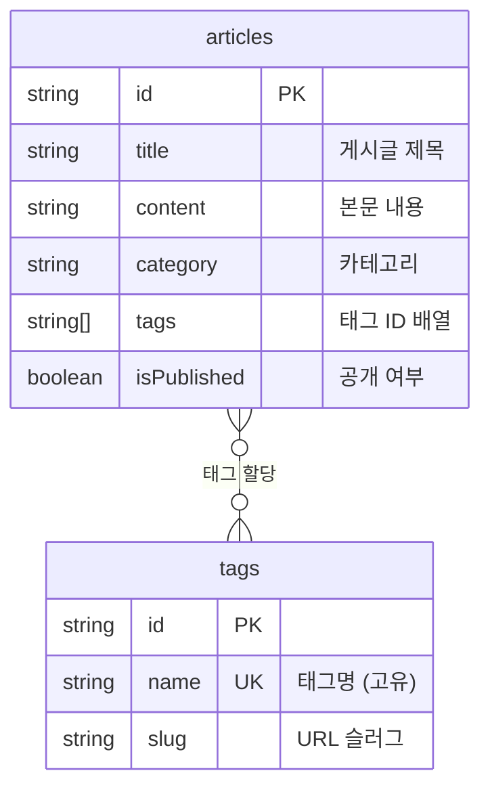

# 태그 관리 구현하기


💡 태그를 생성하고 게시글에 할당하여 콘텐츠를 분류합니다. 태그별 게시글 필터링도 구현합니다.


## 개요

블로그의 태그 시스템을 구현합니다. `tags` 테이블에 태그를 관리하고, `articles` 테이블의 `tags` 필드를 활용하여 게시글에 태그를 연결합니다.

| 기능 | 설명 | API 엔드포인트 |
|------|------|---------------|
| 테이블 생성 | tags 테이블 생성 | 콘솔 UI / MCP |
| 태그 생성 | 새 태그 추가 | `POST /v1/data/tags` |
| 태그 목록 | 전체 태그 조회 | `GET /v1/data/tags` |
| 태그 수정 | 태그 정보 변경 | `PATCH /v1/data/tags/{id}` |
| 태그 삭제 | 태그 삭제 | `DELETE /v1/data/tags/{id}` |
| 게시글에 태그 연결 | articles.tags 필드 업데이트 | `PATCH /v1/data/articles/{id}` |

### 선행 조건

| 필요 항목 | 설명 | 참조 |
|----------|------|------|
| 인증 설정 완료 | Access Token 발급 | [01-auth.md](01-auth.md) |
| articles 테이블 | 태그를 연결할 게시글 | [02-articles.md](02-articles.md) |

***

## 태그 연결 구조



***

## 1단계: tags 테이블 생성

태그 데이터를 저장할 `tags` 테이블을 생성합니다.

### 테이블 스키마

| 필드 | 타입 | 필수 | 설명 |
|------|------|:----:|------|
| `name` | String | ✅ | 태그명 (고유값) |
| `slug` | String | - | URL 슬러그 (예: `javascript`) |

### articles 테이블에 tags 필드 추가

`articles` 테이블에 태그 ID 배열을 저장할 `tags` 필드를 추가합니다.

| 필드 | 타입 | 설명 |
|------|------|------|
| `tags` | Array(String) | 태그 ID 배열 |





✅ **AI에게 이렇게 말해보세요**
"블로그 글에 태그를 붙이고 싶어요. 태그 이름과 URL용 식별자를 관리할 수 있게 해주세요. 같은 이름의 태그는 중복으로 만들 수 없어야 해요. 그리고 게시글에도 태그를 여러 개 연결할 수 있게 해주세요. 만들기 전에 어떤 구조로 만들지 먼저 보여주세요."



💡 AI가 아래와 비슷한 구조를 제안하는지 확인하세요.

| 필드 | 설명 | 예시 값 |
|------|------|---------|
| name | 태그 이름 | "여행" |
| slug | URL용 식별자 | "travel" |





bkend 콘솔에서 테이블을 생성합니다.

**tags 테이블 생성:**

1. **콘솔** > **테이블 관리** 메뉴로 이동합니다.
2. **테이블 추가** 버튼을 클릭합니다.
3. 테이블 이름에 `tags`를 입력합니다.
4. 위 스키마 표의 필드를 추가합니다.
5. **저장** 버튼을 클릭합니다.

**articles 테이블에 tags 필드 추가:**

1. **테이블 관리**에서 `articles` 테이블을 선택합니다.
2. **필드 추가** 버튼을 클릭합니다.
3. 필드명 `tags`, 타입 `Array(String)`으로 설정합니다.
4. **저장** 버튼을 클릭합니다.




***

## 2단계: 태그 생성





✅ **AI에게 이렇게 말해보세요**
"블로그에서 사용할 태그를 만들어주세요: 여행, 맛집, 기술, 일상"



💡 여러 태그를 한 번에 요청하면 AI가 자동으로 하나씩 만들어줍니다.





### curl

```bash
curl -X POST https://api-client.bkend.ai/v1/data/tags \
  -H "Content-Type: application/json" \
  -H "Authorization: Bearer {accessToken}" \
  -H "X-Project-Id: {project_id}" \
  -H "X-Environment: dev" \
  -d '{
    "name": "여행",
    "slug": "travel"
  }'
```

### bkendFetch

```javascript
import { bkendFetch } from './bkend.js';

const tag = await bkendFetch('/v1/data/tags', {
  method: 'POST',
  body: {
    name: '여행',
    slug: 'travel',
  },
});

console.log(tag.id); // 생성된 태그 ID
```

### 여러 태그 한 번에 생성

```javascript
const tagNames = [
  { name: '여행', slug: 'travel' },
  { name: '맛집', slug: 'food' },
  { name: '기술', slug: 'tech' },
  { name: '일상', slug: 'life' },
];

const tags = await Promise.all(
  tagNames.map(tag =>
    bkendFetch('/v1/data/tags', {
      method: 'POST',
      body: tag,
    })
  )
);

console.log(tags.map(t => `${t.name}: ${t.id}`));
```

### 성공 응답 (201 Created)

```json
{
  "id": "tag-uuid-travel",
  "name": "여행",
  "slug": "travel",
  "createdBy": "user-uuid-1234",
  "createdAt": "2026-02-08T11:00:00.000Z"
}
```




***

## 3단계: 태그 목록 조회





✅ **AI에게 이렇게 말해보세요**
"현재 만들어진 태그 목록을 보여주세요"





### curl

```bash
curl -X GET "https://api-client.bkend.ai/v1/data/tags?sortBy=name&sortDirection=asc" \
  -H "Authorization: Bearer {accessToken}" \
  -H "X-Project-Id: {project_id}" \
  -H "X-Environment: dev"
```

### bkendFetch

```javascript
// 전체 태그 목록 (이름순)
const result = await bkendFetch('/v1/data/tags?sortBy=name&sortDirection=asc');

console.log(result.items);
// [{ id: "...", name: "기술", slug: "tech" }, { id: "...", name: "맛집", slug: "food" }, ...]
```

### 성공 응답 (200 OK)

```json
{
  "items": [
    {
      "id": "tag-uuid-tech",
      "name": "기술",
      "slug": "tech",
      "createdAt": "2026-02-08T11:00:00.000Z"
    },
    {
      "id": "tag-uuid-food",
      "name": "맛집",
      "slug": "food",
      "createdAt": "2026-02-08T11:00:00.000Z"
    },
    {
      "id": "tag-uuid-travel",
      "name": "여행",
      "slug": "travel",
      "createdAt": "2026-02-08T11:00:00.000Z"
    }
  ],
  "pagination": {
    "total": 3,
    "page": 1,
    "limit": 20,
    "totalPages": 1,
    "hasNext": false,
    "hasPrev": false
  }
}
```




***

## 4단계: 게시글에 태그 연결

게시글의 `tags` 필드에 태그 ID 배열을 저장하여 태그를 연결합니다.





✅ **AI에게 이렇게 말해보세요**
"제주도 여행 글에 '여행', '맛집' 태그를 달아주세요"



✅ **태그를 제거하려면**
"이 글에 달린 태그를 전부 제거해주세요"





### curl

```bash
curl -X PATCH https://api-client.bkend.ai/v1/data/articles/{articleId} \
  -H "Content-Type: application/json" \
  -H "Authorization: Bearer {accessToken}" \
  -H "X-Project-Id: {project_id}" \
  -H "X-Environment: dev" \
  -d '{
    "tags": ["tag-uuid-travel", "tag-uuid-food"]
  }'
```

### bkendFetch

```javascript
// 게시글에 태그 연결
await bkendFetch(`/v1/data/articles/${articleId}`, {
  method: 'PATCH',
  body: {
    tags: ['tag-uuid-travel', 'tag-uuid-food'],
  },
});

// 태그 교체 (기존 태그를 새 태그로 대체)
await bkendFetch(`/v1/data/articles/${articleId}`, {
  method: 'PATCH',
  body: {
    tags: ['tag-uuid-tech'],
  },
});

// 태그 모두 제거
await bkendFetch(`/v1/data/articles/${articleId}`, {
  method: 'PATCH',
  body: {
    tags: [],
  },
});
```


💡 `tags` 필드에 새 배열을 설정하면 기존 태그가 완전히 대체됩니다. 태그를 추가하려면 기존 태그 목록을 먼저 조회한 후 합쳐서 업데이트하세요.





***

## 5단계: 태그별 게시글 필터링

특정 태그가 할당된 게시글을 조회합니다.





✅ **AI에게 이렇게 말해보세요**
"'여행' 태그가 달린 글을 보여주세요"



✅ **여러 태그로 필터링하려면**
"'여행'과 '맛집' 태그가 모두 달린 글을 보여주세요"





### curl — 특정 태그의 게시글 조회

```bash
curl -X GET "https://api-client.bkend.ai/v1/data/articles?andFilters=%7B%22tags%22%3A%22tag-uuid-travel%22%7D&sortBy=createdAt&sortDirection=desc" \
  -H "Authorization: Bearer {accessToken}" \
  -H "X-Project-Id: {project_id}" \
  -H "X-Environment: dev"
```

### bkendFetch

```javascript
// 특정 태그가 포함된 게시글 조회
const filters = JSON.stringify({ tags: 'tag-uuid-travel' });
const travelPosts = await bkendFetch(
  `/v1/data/articles?andFilters=${encodeURIComponent(filters)}&sortBy=createdAt&sortDirection=desc`
);

console.log(travelPosts.items); // "여행" 태그가 달린 게시글 목록
```

### 태그와 함께 게시글 목록 표시

```javascript
// 1. 태그 목록 조회
const tagsResult = await bkendFetch('/v1/data/tags');
const tagMap = {};
tagsResult.items.forEach(tag => {
  tagMap[tag.id] = tag.name;
});

// 2. 게시글 목록 조회
const articlesResult = await bkendFetch('/v1/data/articles?page=1&limit=10');

// 3. 태그 이름으로 매핑하여 표시
articlesResult.items.forEach(article => {
  const tagNames = (article.tags || []).map(tagId => tagMap[tagId] || tagId);
  console.log(`${article.title} — 태그: ${tagNames.join(', ')}`);
});
```




***

## 6단계: 태그 수정 및 삭제





✅ **태그를 수정하려면**
"'여행' 태그 이름을 '해외여행'으로 바꿔주세요"



✅ **태그를 삭제하려면**
"'일상' 태그를 삭제해주세요"





### 태그 수정

```bash
curl -X PATCH https://api-client.bkend.ai/v1/data/tags/{tagId} \
  -H "Content-Type: application/json" \
  -H "Authorization: Bearer {accessToken}" \
  -H "X-Project-Id: {project_id}" \
  -H "X-Environment: dev" \
  -d '{
    "name": "해외여행",
    "slug": "overseas-travel"
  }'
```

```javascript
await bkendFetch(`/v1/data/tags/${tagId}`, {
  method: 'PATCH',
  body: {
    name: '해외여행',
    slug: 'overseas-travel',
  },
});
```

### 태그 삭제

```bash
curl -X DELETE https://api-client.bkend.ai/v1/data/tags/{tagId} \
  -H "Authorization: Bearer {accessToken}" \
  -H "X-Project-Id: {project_id}" \
  -H "X-Environment: dev"
```

```javascript
await bkendFetch(`/v1/data/tags/${tagId}`, {
  method: 'DELETE',
});
```


⚠️ 태그를 삭제해도 게시글의 `tags` 배열에 남아있는 태그 ID는 자동 제거되지 않습니다. 필요 시 관련 게시글의 `tags` 필드도 업데이트하세요.





***

## 에러 처리

| HTTP 상태 | 에러 코드 | 원인 | 처리 방법 |
|:---------:|----------|------|----------|
| 400 | `data/validation-error` | 필수 필드 누락 | `name` 필드 포함 확인 |
| 401 | `common/authentication-required` | 인증 토큰 만료 | 토큰 갱신 후 재시도 |
| 403 | `data/permission-denied` | 권한 없음 | 해당 테이블의 권한 확인 |
| 404 | `data/not-found` | 존재하지 않는 태그 | 태그 ID 확인 |
| 409 | `data/duplicate-value` | 동일한 태그명 존재 | 태그명 중복 확인 |

***

## 참고 문서

- [데이터 생성](../../../ko/database/03-insert.md) — POST API 상세
- [데이터 목록 조회](../../../ko/database/05-list.md) — 필터/정렬/페이지네이션 상세
- [데이터 수정](../../../ko/database/06-update.md) — PATCH API 상세
- [에러 처리](../../../ko/guides/11-error-handling.md) — 에러 코드 및 처리 패턴

## 다음 단계

[북마크 기능](05-bookmarks.md)에서 관심 게시글을 저장하고 관리합니다.
