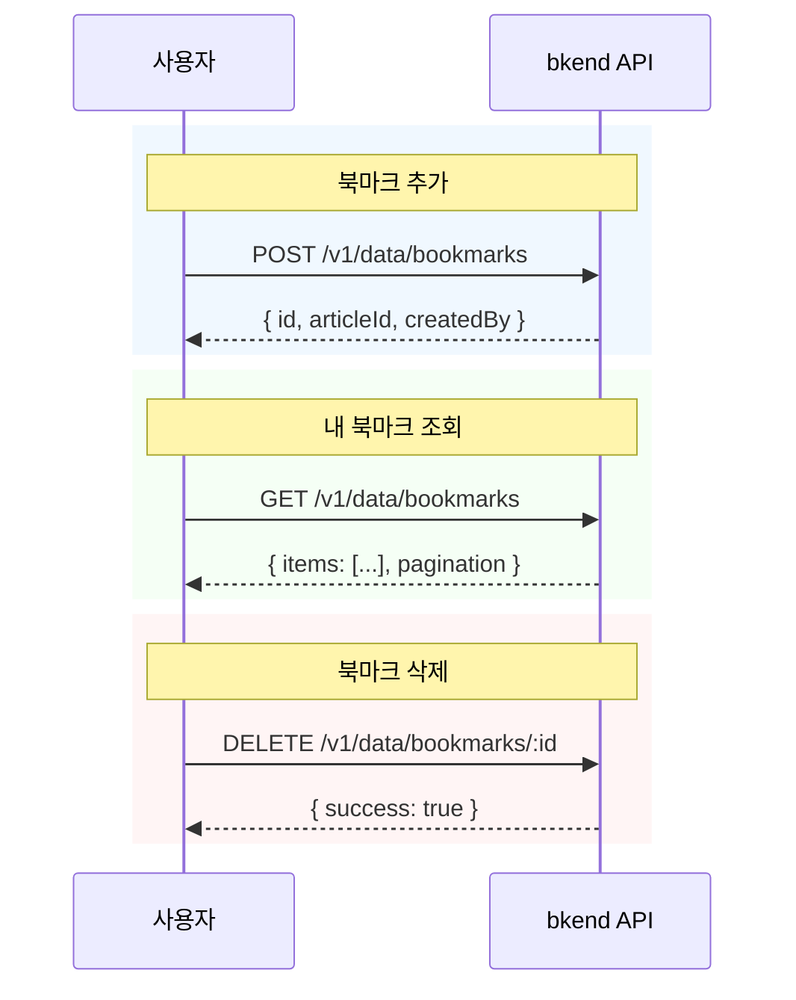

# 북마크 기능 구현하기


💡 관심 있는 게시글을 북마크에 저장하고 관리합니다. 북마크 추가/삭제 토글과 내 북마크 목록 조회를 구현합니다.


## 개요

블로그의 북마크 기능을 구현합니다. 사용자가 관심 있는 게시글을 저장하고, 저장한 게시글 목록을 조회할 수 있습니다.

| 기능 | 설명 | API 엔드포인트 |
|------|------|---------------|
| 테이블 생성 | bookmarks 테이블 생성 | 콘솔 UI / MCP |
| 북마크 추가 | 게시글 북마크 | `POST /v1/data/bookmarks` |
| 내 북마크 목록 | 북마크한 게시글 조회 | `GET /v1/data/bookmarks` |
| 북마크 삭제 | 북마크 해제 | `DELETE /v1/data/bookmarks/{id}` |

### 선행 조건

| 필요 항목 | 설명 | 참조 |
|----------|------|------|
| 인증 설정 완료 | Access Token 발급 | [01-auth.md](01-auth.md) |
| articles 테이블 | 북마크할 게시글 | [02-articles.md](02-articles.md) |

***

## 북마크 흐름



***

## 1단계: bookmarks 테이블 생성

북마크 데이터를 저장할 `bookmarks` 테이블을 생성합니다.

### 테이블 스키마

| 필드 | 타입 | 필수 | 설명 |
|------|------|:----:|------|
| `articleId` | String | ✅ | 북마크할 게시글 ID |


💡 `createdBy` 필드는 시스템이 자동으로 설정합니다. 로그인한 사용자의 ID가 자동 저장되므로, 별도로 `userId` 필드를 만들 필요가 없습니다.





bkend 콘솔에서 테이블을 생성합니다.

1. **콘솔** > **테이블 관리** 메뉴로 이동합니다.
2. **테이블 추가** 버튼을 클릭합니다.
3. 테이블 이름에 `bookmarks`를 입력합니다.
4. `articleId` 필드를 추가합니다 (타입: String, 필수: 예).
5. **저장** 버튼을 클릭합니다.

<!-- 📸 IMG: 콘솔에서 bookmarks 테이블 생성 화면 -->





✅ **AI에게 이렇게 말해보세요**
"사용자가 관심 있는 글을 북마크할 수 있게 하고 싶어요. 어떤 글을 북마크했는지 저장할 수 있게 해주세요. 같은 글을 중복으로 북마크하면 안 돼요. 만들기 전에 어떤 구조로 만들지 먼저 보여주세요."



💡 AI가 아래와 비슷한 구조를 제안하는지 확인하세요.

| 필드 | 설명 | 예시 값 |
|------|------|---------|
| articleId | 북마크한 글 | (게시글 ID) |





***

## 2단계: 북마크 추가




### curl

```bash
curl -X POST https://api-client.bkend.ai/v1/data/bookmarks \
  -H "Content-Type: application/json" \
  -H "Authorization: Bearer {accessToken}" \
  -H "X-Project-Id: {project_id}" \
  -H "X-Environment: dev" \
  -d '{
    "articleId": "507f1f77bcf86cd799439011"
  }'
```

### bkendFetch

```javascript
import { bkendFetch } from './bkend.js';

const bookmark = await bkendFetch('/v1/data/bookmarks', {
  method: 'POST',
  body: {
    articleId: '507f1f77bcf86cd799439011',
  },
});

console.log(bookmark.id); // 생성된 북마크 ID
```

### 성공 응답 (201 Created)

```json
{
  "id": "bookmark-uuid-1234",
  "articleId": "507f1f77bcf86cd799439011",
  "createdBy": "user-uuid-1234",
  "createdAt": "2026-02-08T12:00:00.000Z"
}
```





✅ **AI에게 이렇게 말해보세요**
"제주도 여행 글을 북마크에 저장해주세요"





***

## 3단계: 내 북마크 목록 조회




### curl

```bash
curl -X GET "https://api-client.bkend.ai/v1/data/bookmarks?sortBy=createdAt&sortDirection=desc" \
  -H "Authorization: Bearer {accessToken}" \
  -H "X-Project-Id: {project_id}" \
  -H "X-Environment: dev"
```

### bkendFetch

```javascript
// 내 북마크 목록 (최신순)
const result = await bkendFetch('/v1/data/bookmarks?sortBy=createdAt&sortDirection=desc');

console.log(result.items);      // 북마크 배열
console.log(result.pagination); // 페이지네이션 정보
```

### 성공 응답 (200 OK)

```json
{
  "items": [
    {
      "id": "bookmark-uuid-1234",
      "articleId": "507f1f77bcf86cd799439011",
      "createdBy": "user-uuid-1234",
      "createdAt": "2026-02-08T12:00:00.000Z"
    },
    {
      "id": "bookmark-uuid-5678",
      "articleId": "507f1f77bcf86cd799439012",
      "createdBy": "user-uuid-1234",
      "createdAt": "2026-02-07T15:00:00.000Z"
    }
  ],
  "pagination": {
    "total": 2,
    "page": 1,
    "limit": 20,
    "totalPages": 1,
    "hasNext": false,
    "hasPrev": false
  }
}
```

### 북마크한 게시글 상세 정보 함께 조회

북마크 목록에서 `articleId`를 추출한 후, 게시글 상세 정보를 함께 조회합니다.

```javascript
// 1. 내 북마크 목록 조회
const bookmarks = await bkendFetch('/v1/data/bookmarks?sortBy=createdAt&sortDirection=desc');

// 2. articleId 목록 추출
const articleIds = bookmarks.items.map(b => b.articleId);

// 3. 각 게시글 상세 조회
const articles = await Promise.all(
  articleIds.map(id => bkendFetch(`/v1/data/articles/${id}`))
);

// 4. 북마크 + 게시글 정보 결합
const bookmarkList = bookmarks.items.map((bookmark, index) => ({
  bookmarkId: bookmark.id,
  bookmarkedAt: bookmark.createdAt,
  article: articles[index],
}));

bookmarkList.forEach(item => {
  console.log(`[${item.bookmarkedAt}] ${item.article.title}`);
});
```





✅ **AI에게 이렇게 말해보세요**
"내가 북마크한 글 목록을 보여주세요"



✅ **북마크한 글의 제목까지 보려면**
"내 북마크 목록에 글 제목도 함께 보여주세요"


AI가 북마크 목록을 조회한 후, 각 게시글의 상세 정보를 함께 조회합니다.




***

## 4단계: 북마크 삭제




### curl

```bash
curl -X DELETE https://api-client.bkend.ai/v1/data/bookmarks/{bookmarkId} \
  -H "Authorization: Bearer {accessToken}" \
  -H "X-Project-Id: {project_id}" \
  -H "X-Environment: dev"
```

### bkendFetch

```javascript
await bkendFetch(`/v1/data/bookmarks/${bookmarkId}`, {
  method: 'DELETE',
});
```

### 성공 응답 (200 OK)

```json
{
  "success": true
}
```





✅ **AI에게 이렇게 말해보세요**
"제주도 여행 글의 북마크를 해제해주세요"


AI가 해당 게시글의 북마크를 찾아서 삭제합니다.




***

## 5단계: 북마크 토글

북마크 추가/삭제를 하나의 함수로 구현합니다.




### bkendFetch — 토글 구현

```javascript
async function toggleBookmark(articleId) {
  // 1. 해당 게시글의 북마크 존재 여부 확인
  const filters = JSON.stringify({ articleId });
  const result = await bkendFetch(
    `/v1/data/bookmarks?andFilters=${encodeURIComponent(filters)}`
  );

  if (result.items.length > 0) {
    // 2a. 북마크가 있으면 삭제
    await bkendFetch(`/v1/data/bookmarks/${result.items[0].id}`, {
      method: 'DELETE',
    });
    return { bookmarked: false };
  } else {
    // 2b. 북마크가 없으면 추가
    const bookmark = await bkendFetch('/v1/data/bookmarks', {
      method: 'POST',
      body: { articleId },
    });
    return { bookmarked: true, bookmarkId: bookmark.id };
  }
}

// 사용 예시
const result = await toggleBookmark('507f1f77bcf86cd799439011');
console.log(result.bookmarked ? '북마크 추가됨' : '북마크 해제됨');
```

### 게시글 목록에서 북마크 상태 표시

```javascript
async function getArticlesWithBookmarkStatus(page = 1) {
  // 1. 게시글 목록 조회
  const articles = await bkendFetch(`/v1/data/articles?page=${page}&limit=10`);

  // 2. 내 북마크 목록 조회
  const bookmarks = await bkendFetch('/v1/data/bookmarks?limit=100');
  const bookmarkedIds = new Set(bookmarks.items.map(b => b.articleId));

  // 3. 북마크 상태 표시
  return articles.items.map(article => ({
    ...article,
    isBookmarked: bookmarkedIds.has(article.id),
  }));
}

const articles = await getArticlesWithBookmarkStatus();
articles.forEach(article => {
  const icon = article.isBookmarked ? '[v]' : '[ ]';
  console.log(`${icon} ${article.title}`);
});
```





✅ **AI에게 이렇게 말해보세요**
"이 글의 북마크를 토글해주세요. 이미 북마크되어 있으면 해제하고, 아니면 추가해주세요."


AI가 순차적으로 처리합니다:

1. 해당 글의 북마크 존재 여부 확인
2. 결과에 따라 추가 또는 삭제




***

## 6단계: 북마크 수 집계

게시글별 북마크 수를 확인합니다.




### bkendFetch

```javascript
// 특정 게시글의 북마크 수 확인
async function getBookmarkCount(articleId) {
  const filters = JSON.stringify({ articleId });
  const result = await bkendFetch(
    `/v1/data/bookmarks?andFilters=${encodeURIComponent(filters)}&limit=1`
  );

  return result.pagination.total;
}

const count = await getBookmarkCount('507f1f77bcf86cd799439011');
console.log(`북마크 수: ${count}`);
```


💡 `limit=1`로 설정하면 실제 데이터는 1건만 가져오지만, `pagination.total`에서 전체 수를 확인할 수 있습니다.






✅ **AI에게 이렇게 말해보세요**
"제주도 여행 글에 북마크가 몇 개인지 확인해주세요"





***

## 에러 처리

| HTTP 상태 | 에러 코드 | 원인 | 처리 방법 |
|:---------:|----------|------|----------|
| 400 | `data/validation-error` | 필수 필드 누락 | `articleId` 포함 확인 |
| 401 | `common/authentication-required` | 인증 토큰 만료 | 토큰 갱신 후 재시도 |
| 403 | `data/permission-denied` | 권한 없음 | 로그인 상태 확인 |
| 404 | `data/not-found` | 존재하지 않는 북마크 | 북마크 ID 확인 |
| 409 | `data/duplicate-value` | 이미 북마크한 게시글 | 토글 패턴 사용 (5단계 참고) |

***

## 참고 문서

- [데이터 생성](../../../ko/database/03-insert.md) — POST API 상세
- [데이터 목록 조회](../../../ko/database/05-list.md) — 필터/정렬/페이지네이션 상세
- [데이터 삭제](../../../ko/database/07-delete.md) — DELETE API 상세
- [에러 처리](../../../ko/guides/11-error-handling.md) — 에러 코드 및 처리 패턴

## 다음 단계

[AI 프롬프트 모음](06-ai-prompts.md)에서 AI에게 요청할 수 있는 프롬프트를 시나리오별로 확인합니다.
