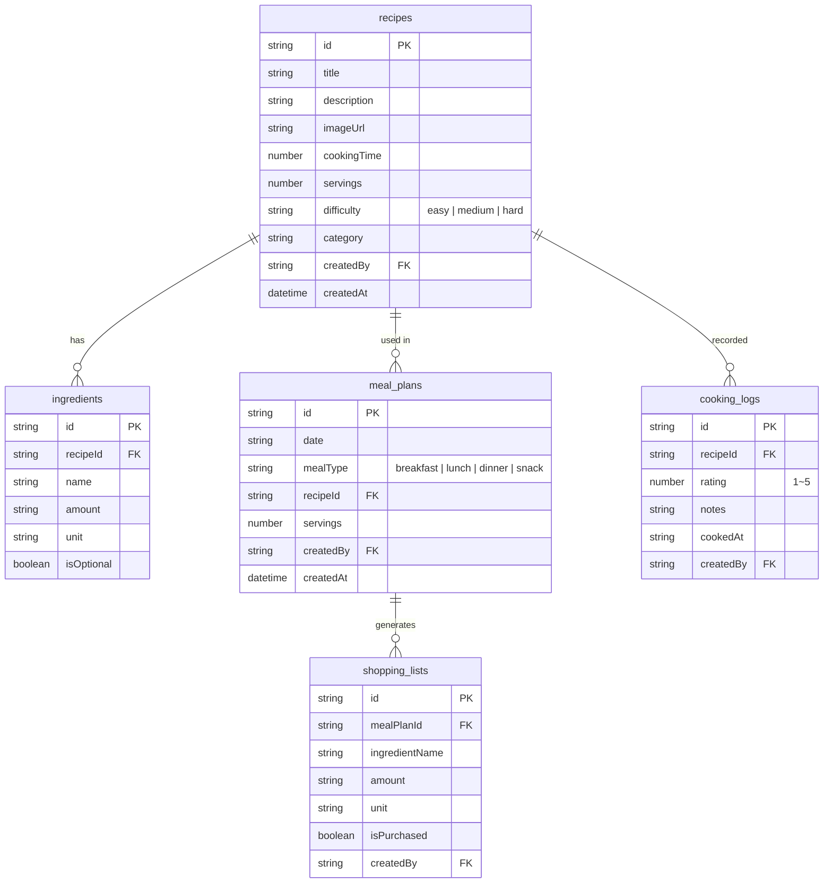

# 레시피 앱 쿡북


💡 bkend로 레시피 관리 앱을 처음부터 끝까지 만들어보는 단계별 튜토리얼입니다.


## 완성 모습

이 쿡북을 완료하면 다음 기능을 갖춘 **레시피 관리 앱**을 만들 수 있습니다:

- 레시피 등록/검색/수정/삭제
- 재료 관리 및 수량 추적
- 주간 식단 계획 (아침/점심/저녁/간식)
- 식단 기반 쇼핑 목록 자동 생성
- 요리 완료 기록 및 평점

| 항목 | 내용 |
|------|------|
| 난이도 | ⭐⭐⭐ 중급 |
| 플랫폼 | 웹 |
| 예상 학습시간 | Quick Start 10분, Full Guide 4시간 |

***

## 사용하는 bkend 기능

| bkend 기능 | 쿡북에서 활용 | 참고 문서 |
|-----------|-------------|----------|
| 이메일 인증 | 회원가입/로그인 | [이메일 회원가입](../../ko/authentication/02-email-signup.md) |
| 동적 테이블 | 레시피, 재료, 식단, 쇼핑 목록, 요리 기록 CRUD | [데이터베이스 개요](../../ko/database/01-overview.md) |
| 스토리지 | 요리 사진 업로드 | [스토리지 개요](../../ko/storage/01-overview.md) |
| MCP 도구 | AI로 테이블/데이터 관리 | [AI 도구 연동](../../ko/ai-tools/01-overview.md) |

***

## 테이블 설계

***

## 학습 순서

| 챕터 | 제목 | 내용 |
|:----:|------|------|
| - | [Quick Start](quick-start.md) | 10분 만에 첫 레시피 등록하기 |
| 00 | [개요](full-guide/00-overview.md) | 프로젝트 구조 및 테이블 설계 |
| 01 | [인증](full-guide/01-auth.md) | 이메일 회원가입/로그인 |
| 02 | [레시피](full-guide/02-recipes.md) | 레시피 CRUD + 이미지 |
| 03 | [재료](full-guide/03-ingredients.md) | 재료 관리 |
| 04 | [식단 계획](full-guide/04-meal-plan.md) | 주간 식단 구성 |
| 05 | [쇼핑 목록](full-guide/05-shopping-list.md) | 쇼핑 목록 자동 생성 |
| 06 | [AI 시나리오](full-guide/06-ai-prompts.md) | AI 활용 레시피 추천 |
| 99 | [문제 해결](full-guide/99-troubleshooting.md) | FAQ 및 에러 대응 |

***

## 사전 준비

쿡북을 시작하기 전에 아래 항목을 준비하세요.

| 항목 | 설명 | 참고 문서 |
|------|------|----------|
| bkend 계정 | 콘솔에서 회원가입 | [콘솔 회원가입](../../ko/console/02-signup-login.md) |
| 프로젝트 생성 | 콘솔에서 새 프로젝트 생성 | [프로젝트 관리](../../ko/console/04-project-management.md) |
| API Key | 콘솔 → **MCP** → **새 토큰 생성** | [API 키 관리](../../ko/console/11-api-keys.md) |
| AI 도구 (선택) | Claude Code 또는 Cursor 설치 | [AI 도구 연동](../../ko/ai-tools/01-overview.md) |

***

## 다음 단계

바로 시작하려면 [Quick Start](quick-start.md)를 따라하세요. 상세 구현을 원하면 [Full Guide](./full-guide/)로 이동하세요.
