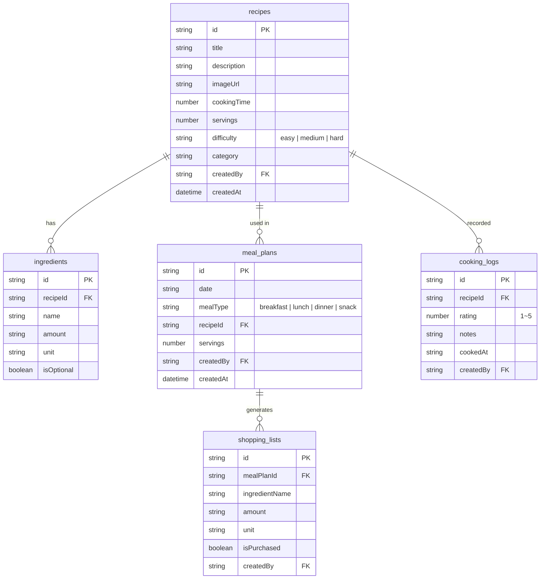
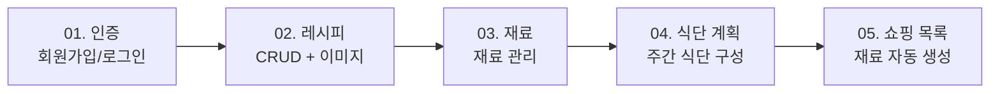

# 00. 프로젝트 개요


💡 레시피 앱의 전체 구조, 테이블 설계, 구현 흐름을 이해하세요.


## 완성 모습

이 쿡북을 완료하면 다음 기능을 갖춘 레시피 관리 앱을 만들 수 있습니다:

- **레시피 관리** — 레시피 등록, 검색, 수정, 삭제, 이미지 첨부
- **재료 관리** — 레시피별 재료 등록, 수량/단위 관리
- **식단 계획** — 날짜별/끼니별 레시피 배정
- **쇼핑 목록** — 식단 기반 재료 목록 자동 생성, 구매 체크
- **요리 기록** — 요리 완료 후 평점/메모 기록

***

## 사전 준비

이 가이드를 시작하기 전에 아래 항목을 완료하세요.




| 순서 | 항목 | 참고 문서 |
|:----:|------|----------|
| 1 | bkend 콘솔 회원가입 | [콘솔 회원가입](../../../ko/console/02-signup-login.md) |
| 2 | 프로젝트 생성 | [프로젝트 관리](../../../ko/console/04-project-management.md) |
| 3 | AI 도구 설치 | [AI 도구 개요](../../../ko/ai-tools/01-overview.md) |
| 4 | MCP OAuth 연결 | [OAuth 설정](../../../ko/ai-tools/03-oauth-setup.md) |


✅ **AI에게 이렇게 말해보세요**
"bkend에 연결된 프로젝트 목록을 보여줘"

프로젝트 목록이 표시되면 준비 완료입니다.





| 순서 | 항목 | 참고 문서 |
|:----:|------|----------|
| 1 | bkend 콘솔 회원가입 | [콘솔 회원가입](../../../ko/console/02-signup-login.md) |
| 2 | 프로젝트 생성 | [프로젝트 관리](../../../ko/console/04-project-management.md) |
| 3 | API Key 발급 | [API 키 관리](../../../ko/console/11-api-keys.md) |





⚠️ 여기서 말하는 "회원가입"은 **bkend 콘솔 계정** 생성입니다. 앱 사용자의 회원가입은 [인증](01-auth.md)에서 구현합니다.


***

## 사용 기능 요약

| bkend 기능 | 쿡북에서 활용 | 참고 문서 |
|-----------|-------------|----------|
| 이메일 인증 | 회원가입, 로그인, 토큰 관리 | [이메일 회원가입](../../../ko/authentication/02-email-signup.md) |
| 동적 테이블 | recipes, ingredients, meal_plans, shopping_lists, cooking_logs | [데이터베이스 개요](../../../ko/database/01-overview.md) |
| 데이터 CRUD | `/v1/data/{tableName}` 엔드포인트 | [데이터 등록](../../../ko/database/03-insert.md) |
| 스토리지 | 요리 사진 업로드 | [단건 업로드](../../../ko/storage/02-upload-single.md) |
| MCP 도구 | AI로 테이블 생성/데이터 관리 | [AI 도구 연동](../../../ko/ai-tools/01-overview.md) |

***

## 테이블 설계

5개의 동적 테이블을 사용합니다. 모든 데이터는 `/v1/data/{tableName}` 엔드포인트를 통해 CRUD합니다.

### 테이블별 설명

| 테이블 | 용도 | 주요 필드 |
|--------|------|----------|
| `recipes` | 레시피 정보 | title, description, cookingTime, servings, difficulty, category |
| `ingredients` | 레시피별 재료 | recipeId, name, amount, unit, isOptional |
| `meal_plans` | 날짜/끼니별 식단 | date, mealType, recipeId, servings |
| `shopping_lists` | 쇼핑 목록 | mealPlanId, ingredientName, amount, unit, isPurchased |
| `cooking_logs` | 요리 완료 기록 | recipeId, rating, notes, cookedAt |


💡 모든 동적 테이블은 `_id`, `createdBy`, `createdAt`, `updatedAt` 필드가 자동으로 추가됩니다.


***

## 전체 구현 흐름

각 챕터는 이전 챕터의 결과를 활용합니다:

1. **인증** — 회원가입/로그인으로 Access Token을 발급받습니다.
2. **레시피** — 토큰을 사용하여 레시피 데이터를 CRUD합니다.
3. **재료** — 레시피에 연결된 재료를 관리합니다.
4. **식단 계획** — 레시피를 날짜/끼니에 배정합니다.
5. **쇼핑 목록** — 식단의 재료를 모아 쇼핑 목록을 생성합니다.

***

## API 엔드포인트 요약

이 쿡북에서 사용하는 REST API 엔드포인트입니다. 모든 요청에는 `Authorization`, `X-Project-Id`, `X-Environment` 헤더가 필요합니다.

### 인증 API

| Method | 엔드포인트 | 설명 |
|--------|-----------|------|
| POST | `/v1/auth/email/signup` | 이메일 회원가입 |
| POST | `/v1/auth/email/signin` | 이메일 로그인 |
| POST | `/v1/auth/refresh` | 토큰 갱신 |
| GET | `/v1/auth/me` | 내 정보 조회 |

### 데이터 API

| Method | 엔드포인트 | 설명 |
|--------|-----------|------|
| POST | `/v1/data/{tableName}` | 데이터 등록 |
| GET | `/v1/data/{tableName}` | 데이터 목록 조회 |
| GET | `/v1/data/{tableName}/{id}` | 데이터 상세 조회 |
| PATCH | `/v1/data/{tableName}/{id}` | 데이터 수정 |
| DELETE | `/v1/data/{tableName}/{id}` | 데이터 삭제 |

### 스토리지 API

| Method | 엔드포인트 | 설명 |
|--------|-----------|------|
| POST | `/v1/files/upload` | 파일 업로드 |
| GET | `/v1/files/{fileId}` | 파일 메타데이터 조회 |


⚠️ `{tableName}`에는 `recipes`, `ingredients`, `meal_plans`, `shopping_lists`, `cooking_logs`를 넣으세요.


***

## 학습 순서

| 순서 | 챕터 | 내용 | 예상 시간 |
|:----:|------|------|:---------:|
| 1 | [인증](01-auth.md) | 이메일 회원가입/로그인 | 30분 |
| 2 | [레시피](02-recipes.md) | 레시피 CRUD + 이미지 | 60분 |
| 3 | [재료](03-ingredients.md) | 재료 관리 | 30분 |
| 4 | [식단 계획](04-meal-plan.md) | 주간 식단 구성 | 40분 |
| 5 | [쇼핑 목록](05-shopping-list.md) | 쇼핑 목록 자동 생성 | 30분 |
| 6 | [AI 시나리오](06-ai-prompts.md) | AI 활용 레시피 추천 | 20분 |

***

## 참고 문서

- [앱에서 bkend 연동하기](../../../ko/getting-started/06-app-integration.md) — bkendFetch 헬퍼 함수
- [에러 처리 가이드](../../../ko/guides/11-error-handling.md) — 공통 에러 코드 및 대응
- [recipe-web 예제 프로젝트](../../../examples/recipe-web/) — 이 쿡북의 웹 구현 코드
- [recipe-app 예제 프로젝트](../../../examples/recipe-app/) — 이 쿡북의 앱 구현 코드

***

## 다음 단계

[01. 인증](01-auth.md)에서 이메일 회원가입과 로그인을 설정하세요.
