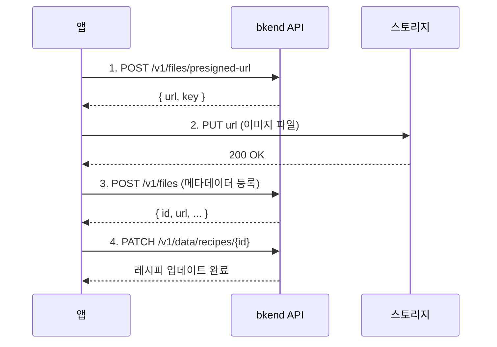

# 02. 레시피 구현하기


💡 레시피 테이블을 생성하고 CRUD와 이미지 업로드를 구현하세요.


## 개요

이 챕터에서는 레시피 앱의 핵심인 레시피 데이터를 관리합니다:

- `recipes` 테이블 생성
- 레시피 등록 (제목, 설명, 조리시간, 난이도, 인분)
- 레시피 이미지 업로드 (Presigned URL)
- 레시피 목록 조회 (필터: 난이도, 조리시간)
- 레시피 수정/삭제
- 내 레시피 조회

### 선행 조건

| 필요 항목 | 설명 | 참조 |
|----------|------|------|
| 인증 완료 | Access Token 발급 | [01. 인증](01-auth.md) |
| 프로젝트 | bkend 프로젝트 생성 완료 | [빠른 시작](../../../ko/getting-started/02-quickstart.md) |

***

## 1단계: recipes 테이블 생성

레시피 데이터를 저장할 테이블을 생성하세요.

### 테이블 구조

| 필드 | 타입 | 필수 | 설명 |
|------|------|:----:|------|
| `title` | `string` | ✅ | 레시피 제목 |
| `description` | `string` | ✅ | 레시피 설명 |
| `cookingTime` | `number` | ✅ | 조리 시간 (분) |
| `difficulty` | `string` | ✅ | 난이도 (`easy`, `medium`, `hard`) |
| `servings` | `number` | ✅ | 인분 수 |
| `category` | `string` | - | 카테고리 (한식, 양식, 일식 등) |
| `imageUrl` | `string` | - | 대표 이미지 URL |


💡 `id`, `createdBy`, `createdAt`, `updatedAt` 필드는 자동으로 추가됩니다.






✅ **AI에게 이렇게 말해보세요**

"레시피를 저장하고 싶어요. 레시피 이름, 설명, 조리 시간, 난이도, 몇 인분인지, 카테고리, 사진을 관리할 수 있게 해주세요. 만들기 전에 어떤 구조로 만들지 먼저 보여주세요."



💡 AI가 아래와 비슷한 구조를 제안하는지 확인하세요.


| 필드 | 설명 | 예시 값 |
|------|------|---------|
| title | 레시피 이름 | "김치찌개" |
| description | 간단 설명 | "매콤한 김치찌개" |
| cookingTime | 조리 시간(분) | 30 |
| difficulty | 난이도 | "easy" / "medium" / "hard" |
| servings | 인분 | 2 |
| category | 카테고리 | "한식" |
| imageUrl | 레시피 사진 URL | (업로드 후 연결) |




1. **테이블 관리** 메뉴로 이동하세요.
2. **테이블 추가** 버튼을 클릭하세요.
3. 테이블 이름에 `recipes`를 입력하세요.
4. 위 테이블 구조에 맞게 필드를 추가하세요.
5. `difficulty` 필드는 **Enum** 타입으로 `easy`, `medium`, `hard` 값을 설정하세요.
6. **저장** 버튼을 클릭하세요.

<!-- 📸 IMG: recipes 테이블 생성 화면 -->




### 난이도 기준

| 난이도 | 값 | 설명 |
|-------|-----|------|
| 쉬움 | `easy` | 초보자도 가능, 재료 5개 이하 |
| 보통 | `medium` | 기본 요리 경험 필요 |
| 어려움 | `hard` | 숙련된 요리 경험 필요 |

***

## 2단계: 레시피 등록

테이블이 생성되었으면 레시피를 등록하세요.





✅ **AI에게 이렇게 말해보세요**

"새 레시피를 등록해주세요. 김치찌개, 조리시간 30분, 난이도 쉬움, 2인분, 한식이에요. 설명은 '돼지고기와 잘 익은 김치로 만드는 얼큰한 찌개'로 해주세요."





```bash
curl -X POST https://api-client.bkend.ai/v1/data/recipes \
  -H "Content-Type: application/json" \
  -H "X-API-Key: {pk_publishable_key}" \
  -H "Authorization: Bearer {accessToken}" \
  -d '{
    "title": "김치찌개",
    "description": "돼지고기와 잘 익은 김치로 만드는 얼큰한 찌개입니다.",
    "cookingTime": 30,
    "difficulty": "easy",
    "servings": 2,
    "category": "한식"
  }'
```

**응답 (201 Created):**

```json
{
  "id": "6612a3f4b1c2d3e4f5a6b7c8",
  "title": "김치찌개",
  "description": "돼지고기와 잘 익은 김치로 만드는 얼큰한 찌개입니다.",
  "cookingTime": 30,
  "difficulty": "easy",
  "servings": 2,
  "category": "한식",
  "createdBy": "user_abc123",
  "createdAt": "2025-01-15T10:00:00.000Z",
  "updatedAt": "2025-01-15T10:00:00.000Z"
}
```

**bkendFetch 헬퍼 사용:**

```javascript
const recipe = await bkendFetch('/v1/data/recipes', {
  method: 'POST',
  body: {
    title: '김치찌개',
    description: '돼지고기와 잘 익은 김치로 만드는 얼큰한 찌개입니다.',
    cookingTime: 30,
    difficulty: 'easy',
    servings: 2,
    category: '한식',
  },
});

console.log('레시피 ID:', recipe.id);
```




### 요청 파라미터

| 파라미터 | 타입 | 필수 | 설명 |
|---------|------|:----:|------|
| `title` | `string` | ✅ | 레시피 제목 (최대 200자) |
| `description` | `string` | ✅ | 레시피 설명 |
| `cookingTime` | `number` | ✅ | 조리 시간 (분 단위) |
| `difficulty` | `string` | ✅ | `easy`, `medium`, `hard` |
| `servings` | `number` | ✅ | 인분 수 |
| `category` | `string` | - | 카테고리 |
| `imageUrl` | `string` | - | 대표 이미지 URL |


⚠️ `id`, `createdBy`, `createdAt`, `updatedAt`는 시스템이 자동 설정합니다. 요청에 포함하지 마세요.


***

## 3단계: 레시피 이미지 업로드

레시피에 대표 이미지를 첨부하려면 Presigned URL 방식을 사용하세요.







✅ **AI에게 이렇게 말해보세요**

"김치찌개 레시피에 사진을 추가하고 싶어요. 이미지 파일을 업로드하고 레시피에 연결해주세요."


AI가 이미지 업로드와 레시피 연결을 순차적으로 처리합니다.




**Step 1: Presigned URL 발급**

```bash
curl -X POST https://api-client.bkend.ai/v1/files/presigned-url \
  -H "Content-Type: application/json" \
  -H "X-API-Key: {pk_publishable_key}" \
  -H "Authorization: Bearer {accessToken}" \
  -d '{
    "filename": "kimchi-jjigae.jpg",
    "contentType": "image/jpeg",
    "fileSize": 2048000,
    "visibility": "public",
    "category": "images"
  }'
```

**Step 2: 스토리지에 파일 업로드**

```bash
curl -X PUT "{발급받은_presigned_url}" \
  -H "Content-Type: image/jpeg" \
  --data-binary @kimchi-jjigae.jpg
```

**Step 3: 메타데이터 등록**

```bash
curl -X POST https://api-client.bkend.ai/v1/files \
  -H "Content-Type: application/json" \
  -H "X-API-Key: {pk_publishable_key}" \
  -H "Authorization: Bearer {accessToken}" \
  -d '{
    "s3Key": "{발급받은_key}",
    "originalName": "kimchi-jjigae.jpg",
    "mimeType": "image/jpeg",
    "size": 2048000,
    "visibility": "public"
  }'
```

**Step 4: 레시피에 이미지 연결**

```bash
curl -X PATCH https://api-client.bkend.ai/v1/data/recipes/{recipeId} \
  -H "Content-Type: application/json" \
  -H "X-API-Key: {pk_publishable_key}" \
  -H "Authorization: Bearer {accessToken}" \
  -d '{
    "imageUrl": "{파일_다운로드_URL}"
  }'
```

**bkendFetch 헬퍼로 통합:**

```javascript
async function uploadRecipeImage(recipeId, file) {
  // 1. Presigned URL 발급
  const presigned = await bkendFetch('/v1/files/presigned-url', {
    method: 'POST',
    body: {
      filename: file.name,
      contentType: file.type,
      fileSize: file.size,
      visibility: 'public',
      category: 'images',
    },
  });

  // 2. 스토리지에 파일 업로드 (Presigned URL은 bkendFetch 사용 금지)
  await fetch(presigned.url, {
    method: 'PUT',
    headers: { 'Content-Type': file.type },
    body: file,
  });

  // 3. 메타데이터 등록
  const metadata = await bkendFetch('/v1/files', {
    method: 'POST',
    body: {
      s3Key: presigned.key,
      originalName: file.name,
      mimeType: file.type,
      size: file.size,
      visibility: 'public',
    },
  });

  // 4. 레시피에 이미지 연결
  await bkendFetch(`/v1/data/recipes/${recipeId}`, {
    method: 'PATCH',
    body: { imageUrl: metadata.url },
  });

  return metadata;
}
```





⚠️ Presigned URL은 **15분** 동안만 유효합니다. 발급 후 즉시 업로드를 완료하세요.


***

## 4단계: 레시피 목록 조회

등록된 레시피를 다양한 조건으로 조회하세요.





✅ **AI에게 이렇게 말해보세요**

"쉬운 난이도 레시피만 조리시간 짧은 순으로 보여주세요."



✅ **30분 이내 레시피 조회**

"30분 안에 만들 수 있는 레시피를 보여주세요."





**전체 목록 조회:**

```bash
curl -X GET "https://api-client.bkend.ai/v1/data/recipes?page=1&limit=20&sortBy=createdAt&sortDirection=desc" \
  -H "X-API-Key: {pk_publishable_key}" \
  -H "Authorization: Bearer {accessToken}"
```

**응답 예시:**

```json
{
  "items": [
    {
      "id": "6612a3f4b1c2d3e4f5a6b7c8",
      "title": "김치찌개",
      "description": "돼지고기와 잘 익은 김치로 만드는 얼큰한 찌개입니다.",
      "cookingTime": 30,
      "difficulty": "easy",
      "servings": 2,
      "category": "한식",
      "createdAt": "2025-01-15T10:00:00.000Z"
    }
  ],
  "pagination": {
    "total": 1,
    "page": 1,
    "limit": 20,
    "totalPages": 1,
    "hasNext": false,
    "hasPrev": false
  }
}
```

**난이도별 필터링:**

```bash
curl -X GET "https://api-client.bkend.ai/v1/data/recipes?andFilters=%7B%22difficulty%22%3A%22easy%22%7D&sortBy=cookingTime&sortDirection=asc" \
  -H "X-API-Key: {pk_publishable_key}" \
  -H "Authorization: Bearer {accessToken}"
```

**조리시간 범위 필터링 (bkendFetch):**

```javascript
// 쉬운 레시피만 조회
const easyRecipes = await bkendFetch(
  '/v1/data/recipes?andFilters=' +
  encodeURIComponent(JSON.stringify({ difficulty: 'easy' })) +
  '&sortBy=cookingTime&sortDirection=asc'
);

// 30분 이내 레시피 조회
const quickRecipes = await bkendFetch(
  '/v1/data/recipes?andFilters=' +
  encodeURIComponent(JSON.stringify({
    cookingTime: { $lte: 30 }
  })) +
  '&sortBy=createdAt&sortDirection=desc'
);

// 카테고리별 조회
const koreanRecipes = await bkendFetch(
  '/v1/data/recipes?andFilters=' +
  encodeURIComponent(JSON.stringify({ category: '한식' }))
);
```




### 필터링 옵션 요약

| 필터 조건 | 파라미터 예시 | 설명 |
|----------|-------------|------|
| 난이도별 | `{ "difficulty": "easy" }` | easy, medium, hard |
| 조리시간 이하 | `{ "cookingTime": { "$lte": 30 } }` | 30분 이내 |
| 카테고리별 | `{ "category": "한식" }` | 특정 카테고리 |
| 인분 수 | `{ "servings": 2 }` | 특정 인분 |

***

## 5단계: 레시피 상세 조회

특정 레시피의 상세 정보를 조회하세요.





✅ **AI에게 이렇게 말해보세요**

"김치찌개 레시피의 상세 정보를 보여주세요."





```bash
curl -X GET https://api-client.bkend.ai/v1/data/recipes/{recipeId} \
  -H "X-API-Key: {pk_publishable_key}" \
  -H "Authorization: Bearer {accessToken}"
```

```javascript
const recipe = await bkendFetch(`/v1/data/recipes/${recipeId}`);
console.log(recipe.title);        // "김치찌개"
console.log(recipe.cookingTime);   // 30
console.log(recipe.difficulty);    // "easy"
```




***

## 6단계: 레시피 수정

레시피 정보를 수정하세요.





✅ **AI에게 이렇게 말해보세요**

"김치찌개 레시피를 수정해주세요. 4인분으로 바꾸고, 조리시간도 40분으로 변경해주세요. 설명도 '4인분으로 넉넉하게 끓이는 김치찌개'로 바꿔주세요."





```bash
curl -X PATCH https://api-client.bkend.ai/v1/data/recipes/{recipeId} \
  -H "Content-Type: application/json" \
  -H "X-API-Key: {pk_publishable_key}" \
  -H "Authorization: Bearer {accessToken}" \
  -d '{
    "servings": 4,
    "cookingTime": 40,
    "description": "4인분으로 넉넉하게 끓이는 김치찌개입니다."
  }'
```

```javascript
const updated = await bkendFetch(`/v1/data/recipes/${recipeId}`, {
  method: 'PATCH',
  body: {
    servings: 4,
    cookingTime: 40,
    description: '4인분으로 넉넉하게 끓이는 김치찌개입니다.',
  },
});
```




***

## 7단계: 레시피 삭제

더 이상 필요 없는 레시피를 삭제하세요.





✅ **AI에게 이렇게 말해보세요**

"김치찌개 레시피를 삭제해주세요."





```bash
curl -X DELETE https://api-client.bkend.ai/v1/data/recipes/{recipeId} \
  -H "X-API-Key: {pk_publishable_key}" \
  -H "Authorization: Bearer {accessToken}"
```

```javascript
await bkendFetch(`/v1/data/recipes/${recipeId}`, {
  method: 'DELETE',
});
```





🚨 **위험** — 삭제된 데이터는 복구할 수 없습니다. 삭제 전에 반드시 확인하세요.


***

## 8단계: 내 레시피 조회

로그인한 사용자가 직접 등록한 레시피만 조회하세요.





✅ **AI에게 이렇게 말해보세요**

"내가 등록한 레시피 목록을 보여주세요."





```bash
curl -X GET "https://api-client.bkend.ai/v1/data/recipes?andFilters=%7B%22createdBy%22%3A%22{userId}%22%7D&sortBy=createdAt&sortDirection=desc" \
  -H "X-API-Key: {pk_publishable_key}" \
  -H "Authorization: Bearer {accessToken}"
```

```javascript
// 내 레시피 조회
const myRecipes = await bkendFetch(
  '/v1/data/recipes?andFilters=' +
  encodeURIComponent(JSON.stringify({ createdBy: userId })) +
  '&sortBy=createdAt&sortDirection=desc'
);

console.log(`내 레시피 ${myRecipes.pagination.total}개`);
myRecipes.items.forEach(r => {
  console.log(`- ${r.title} (${r.difficulty}, ${r.cookingTime}분)`);
});
```




***

## 에러 처리

### 주요 에러 코드

| HTTP 상태 | 에러 코드 | 설명 | 해결 방법 |
|:---------:|----------|------|----------|
| 400 | `data/validation-error` | 필수 필드 누락 또는 형식 오류 | title, description, cookingTime, difficulty, servings 확인 |
| 401 | `common/authentication-required` | 인증 토큰 누락 또는 만료 | 토큰 갱신 후 재시도 |
| 404 | `data/not-found` | 존재하지 않는 레시피 | 레시피 ID 확인 |
| 403 | `common/forbidden` | 다른 사용자의 레시피 수정/삭제 시도 | 본인 레시피만 수정 가능 |

```javascript
try {
  const recipe = await bkendFetch('/v1/data/recipes', {
    method: 'POST',
    body: { title: '김치찌개' }, // 필수 필드 누락
  });
} catch (error) {
  if (error.message.includes('data/validation-error')) {
    console.error('필수 필드를 모두 입력하세요.');
  }
}
```

***

## 참고 문서

- [테이블 관리](../../../ko/console/07-table-management.md) — 콘솔에서 테이블 생성/관리
- [데이터 생성](../../../ko/database/03-insert.md) — REST API 데이터 등록 상세
- [데이터 목록 조회](../../../ko/database/05-list.md) — 필터링, 정렬, 페이지네이션
- [단일 파일 업로드](../../../ko/storage/02-upload-single.md) — Presigned URL 업로드 상세

***

## 다음 단계

[03. 재료](03-ingredients.md)에서 레시피별 재료 관리를 구현하세요.
