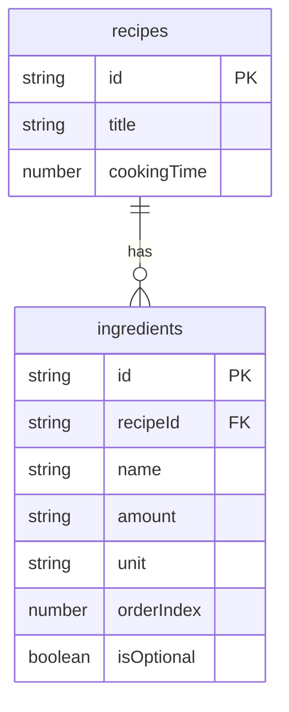

# 03. 재료 관리 구현하기


💡 레시피에 연결된 재료를 등록하고 관리하세요.


## 개요

이 챕터에서는 레시피별 재료를 관리합니다:

- `ingredients` 테이블 생성
- 레시피에 재료 추가 (1:N 관계)
- 재료 목록 조회 (recipeId로 필터)
- 재료 수정/삭제
- 단위 변환 팁



### 선행 조건

| 필요 항목 | 설명 | 참조 |
|----------|------|------|
| 인증 완료 | Access Token 발급 | [01. 인증](01-auth.md) |
| recipes 테이블 | 재료를 연결할 레시피 | [02. 레시피](02-recipes.md) |

***

## 1단계: ingredients 테이블 생성

레시피별 재료를 저장할 테이블을 생성하세요.

### 테이블 구조

| 필드 | 타입 | 필수 | 설명 |
|------|------|:----:|------|
| `recipeId` | `string` | ✅ | 연결된 레시피 ID |
| `name` | `string` | ✅ | 재료명 |
| `amount` | `string` | ✅ | 수량 (예: "300", "1/2") |
| `unit` | `string` | ✅ | 단위 (예: "g", "개", "큰술") |
| `orderIndex` | `number` | - | 표시 순서 |
| `isOptional` | `boolean` | - | 선택 재료 여부 (기본값: false) |





✅ **AI에게 이렇게 말해보세요**

"레시피마다 재료를 따로 관리하고 싶어요. 어떤 레시피의 재료인지, 재료 이름, 양, 단위, 순서, 선택 재료 여부를 저장할 수 있게 해주세요. 만들기 전에 어떤 구조로 만들지 먼저 보여주세요."



💡 AI가 아래와 비슷한 구조를 제안하는지 확인하세요.


| 필드 | 설명 | 예시 값 |
|------|------|---------|
| recipeId | 어떤 레시피의 재료인지 | (레시피 ID) |
| name | 재료 이름 | "김치" |
| amount | 양 | "200" |
| unit | 단위 | "g" |
| orderIndex | 순서 | 1 |
| isOptional | 선택 재료 여부 | false |




1. **테이블 관리** 메뉴로 이동하세요.
2. **테이블 추가** 버튼을 클릭하세요.
3. 테이블 이름에 `ingredients`를 입력하세요.
4. 위 테이블 구조에 맞게 필드를 추가하세요.
5. **저장** 버튼을 클릭하세요.

<!-- 📸 IMG: ingredients 테이블 생성 화면 -->




### 주요 단위 참고

| 카테고리 | 단위 | 예시 |
|---------|------|------|
| 무게 | g, kg | 돼지고기 200g |
| 부피 | ml, L, 컵 | 물 2컵 |
| 계량 | 큰술, 작은술 | 간장 2큰술 |
| 개수 | 개, 모, 대, 쪽 | 두부 1/2모, 대파 1대 |
| 기타 | 약간, 적당량 | 소금 약간 |

***

## 2단계: 재료 추가

레시피에 재료를 추가하세요. `recipeId`로 레시피와 연결됩니다.





✅ **AI에게 이렇게 말해보세요**

"김치찌개 레시피에 재료를 추가해주세요. 김치 300g, 돼지고기 200g, 두부 반 모, 대파 1대, 고춧가루 1큰술은 선택 재료예요."


AI가 각 재료를 순차적으로 등록합니다.




**재료 1개 추가:**

```bash
curl -X POST https://api-client.bkend.ai/v1/data/ingredients \
  -H "Content-Type: application/json" \
  -H "X-API-Key: {pk_publishable_key}" \
  -H "Authorization: Bearer {accessToken}" \
  -d '{
    "recipeId": "{recipeId}",
    "name": "김치",
    "amount": "300",
    "unit": "g",
    "orderIndex": 1,
    "isOptional": false
  }'
```

**응답 (201 Created):**

```json
{
  "id": "6612b1a2c3d4e5f6a7b8c9d0",
  "recipeId": "6612a3f4b1c2d3e4f5a6b7c8",
  "name": "김치",
  "amount": "300",
  "unit": "g",
  "orderIndex": 1,
  "isOptional": false,
  "createdBy": "user_abc123",
  "createdAt": "2025-01-15T10:30:00.000Z"
}
```

**bkendFetch로 여러 재료 추가:**

```javascript
const ingredients = [
  { name: '김치', amount: '300', unit: 'g', orderIndex: 1 },
  { name: '돼지고기', amount: '200', unit: 'g', orderIndex: 2 },
  { name: '두부', amount: '1/2', unit: '모', orderIndex: 3 },
  { name: '대파', amount: '1', unit: '대', orderIndex: 4 },
  { name: '고춧가루', amount: '1', unit: '큰술', orderIndex: 5, isOptional: true },
];

for (const ingredient of ingredients) {
  await bkendFetch('/v1/data/ingredients', {
    method: 'POST',
    body: JSON.stringify({
      recipeId,
      ...ingredient,
      isOptional: ingredient.isOptional || false,
    }),
  });
}

console.log(`${ingredients.length}개 재료 추가 완료`);
```




***

## 3단계: 재료 목록 조회

특정 레시피의 재료 목록을 조회하세요.





✅ **AI에게 이렇게 말해보세요**

"김치찌개에 들어가는 재료 목록을 보여주세요."





```bash
curl -X GET "https://api-client.bkend.ai/v1/data/ingredients?andFilters=%7B%22recipeId%22%3A%22{recipeId}%22%7D&sortBy=orderIndex&sortDirection=asc" \
  -H "X-API-Key: {pk_publishable_key}" \
  -H "Authorization: Bearer {accessToken}"
```

**응답 예시:**

```json
{
  "items": [
    { "id": "...", "name": "김치", "amount": "300", "unit": "g", "orderIndex": 1, "isOptional": false },
    { "id": "...", "name": "돼지고기", "amount": "200", "unit": "g", "orderIndex": 2, "isOptional": false },
    { "id": "...", "name": "두부", "amount": "1/2", "unit": "모", "orderIndex": 3, "isOptional": false },
    { "id": "...", "name": "대파", "amount": "1", "unit": "대", "orderIndex": 4, "isOptional": false },
    { "id": "...", "name": "고춧가루", "amount": "1", "unit": "큰술", "orderIndex": 5, "isOptional": true }
  ],
  "pagination": { "currentPage": 1, "totalItems": 5 }
}
```

**bkendFetch 사용:**

```javascript
async function getIngredients(recipeId) {
  const result = await bkendFetch(
    '/v1/data/ingredients?andFilters=' +
    encodeURIComponent(JSON.stringify({ recipeId })) +
    '&sortBy=orderIndex&sortDirection=asc'
  );

  // 필수 재료와 선택 재료 분리
  const required = result.items.filter(i => !i.isOptional);
  const optional = result.items.filter(i => i.isOptional);

  console.log('필수 재료:');
  required.forEach(i => console.log(`  - ${i.name} ${i.amount}${i.unit}`));

  if (optional.length > 0) {
    console.log('선택 재료:');
    optional.forEach(i => console.log(`  - ${i.name} ${i.amount}${i.unit}`));
  }

  return result.items;
}
```




***

## 4단계: 재료 수정

재료의 수량이나 단위를 수정하세요.





✅ **AI에게 이렇게 말해보세요**

"김치찌개 재료에서 김치 양을 500g으로 바꿔주세요."





```bash
curl -X PATCH https://api-client.bkend.ai/v1/data/ingredients/{ingredientId} \
  -H "Content-Type: application/json" \
  -H "X-API-Key: {pk_publishable_key}" \
  -H "Authorization: Bearer {accessToken}" \
  -d '{
    "amount": "500",
    "unit": "g"
  }'
```

```javascript
// 김치 양을 500g으로 수정
await bkendFetch(`/v1/data/ingredients/${ingredientId}`, {
  method: 'PATCH',
  body: JSON.stringify({
    amount: '500',
    unit: 'g',
  }),
});
```




***

## 5단계: 재료 삭제

불필요한 재료를 삭제하세요.





✅ **AI에게 이렇게 말해보세요**

"김치찌개 재료에서 고춧가루를 빼주세요."





```bash
curl -X DELETE https://api-client.bkend.ai/v1/data/ingredients/{ingredientId} \
  -H "X-API-Key: {pk_publishable_key}" \
  -H "Authorization: Bearer {accessToken}"
```

```javascript
await bkendFetch(`/v1/data/ingredients/${ingredientId}`, {
  method: 'DELETE',
});
```




***

## 단위 변환 팁

레시피의 인분 수가 변경될 때 재료 양도 비례해서 조정하세요.

```javascript
/**
 * 인분 수 변경에 따른 재료 양 계산
 * @param {string} originalAmount - 원래 수량 (예: "300", "1/2")
 * @param {number} originalServings - 원래 인분 수
 * @param {number} newServings - 변경할 인분 수
 * @returns {string} 변환된 수량
 */
function convertAmount(originalAmount, originalServings, newServings) {
  // 분수 처리 (예: "1/2" → 0.5)
  let numericAmount;
  if (originalAmount.includes('/')) {
    const [numerator, denominator] = originalAmount.split('/').map(Number);
    numericAmount = numerator / denominator;
  } else {
    numericAmount = parseFloat(originalAmount);
  }

  const ratio = newServings / originalServings;
  const converted = numericAmount * ratio;

  // 소수점 처리
  return converted % 1 === 0 ? String(converted) : converted.toFixed(1);
}

// 2인분 → 4인분 변환 예시
console.log(convertAmount('300', 2, 4));  // "600"
console.log(convertAmount('1/2', 2, 4));  // "1"
console.log(convertAmount('1', 2, 4));    // "2"
```

### 주요 단위 변환표

| 변환 | 기준 |
|------|------|
| 1큰술 | 15ml |
| 1작은술 | 5ml |
| 1컵 | 200ml |
| 1꼬집 | 약 1g |
| 약간 | 1/4 작은술 |


💡 "약간", "적당량" 같은 감각적 단위는 인분 수와 무관하게 고정하는 것이 일반적입니다.


***

## 에러 처리

### 주요 에러 코드

| HTTP 상태 | 에러 코드 | 설명 | 해결 방법 |
|:---------:|----------|------|----------|
| 400 | `VALIDATION_ERROR` | 필수 필드 누락 | recipeId, name, amount, unit 확인 |
| 404 | `NOT_FOUND` | 존재하지 않는 재료 | 재료 ID 확인 |
| 403 | `FORBIDDEN` | 권한 없음 | 본인이 등록한 재료만 수정/삭제 가능 |

***

## 참고 문서

- [테이블 관리](../../../ko/console/07-table-management.md) — 콘솔에서 테이블 생성/관리
- [데이터 생성](../../../ko/database/03-insert.md) — REST API 데이터 등록 상세
- [데이터 목록 조회](../../../ko/database/05-list.md) — 필터링 및 정렬

***

## 다음 단계

[04. 식단 계획](04-meal-plan.md)에서 주간 식단 계획을 구현하세요.
