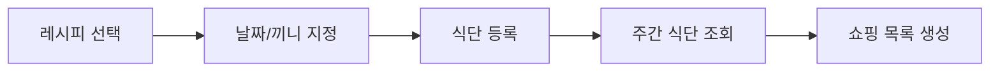

# 04. 식단 계획 구현하기


💡 날짜별/끼니별 식단 계획을 등록하고 주간 식단을 관리하세요.


## 개요

이 챕터에서는 식단 계획 기능을 구현합니다:

- `meal_plans` 테이블 생성
- 날짜별 식단 등록 (아침, 점심, 저녁, 간식)
- 주간 식단 조회 (날짜 범위 필터)
- 식단 수정/삭제



### 선행 조건

| 필요 항목 | 설명 | 참조 |
|----------|------|------|
| 인증 완료 | Access Token 발급 | [01. 인증](01-auth.md) |
| recipes 테이블 | 식단에 배정할 레시피 | [02. 레시피](02-recipes.md) |

***

## 1단계: meal_plans 테이블 생성

식단 계획 데이터를 저장할 테이블을 생성하세요.

### 테이블 구조

| 필드 | 타입 | 필수 | 설명 |
|------|------|:----:|------|
| `date` | `string` | ✅ | 날짜 (YYYY-MM-DD 형식) |
| `mealType` | `string` | ✅ | 끼니 타입 (`breakfast`, `lunch`, `dinner`, `snack`) |
| `recipeId` | `string` | ✅ | 배정된 레시피 ID |
| `servings` | `number` | - | 인분 수 (기본값: 2) |
| `notes` | `string` | - | 메모 |


💡 `createdBy` 필드가 자동으로 추가되므로, 사용자별 식단이 자동으로 분리됩니다.





1. **테이블 관리** 메뉴로 이동하세요.
2. **테이블 추가** 버튼을 클릭하세요.
3. 테이블 이름에 `meal_plans`를 입력하세요.
4. 위 테이블 구조에 맞게 필드를 추가하세요.
5. `mealType` 필드는 **Enum** 타입으로 `breakfast`, `lunch`, `dinner`, `snack` 값을 설정하세요.
6. **저장** 버튼을 클릭하세요.

<!-- 📸 IMG: meal_plans 테이블 생성 화면 -->





✅ **AI에게 이렇게 말해보세요**

"날짜별로 식단을 계획하고 싶어요. 날짜, 끼니(아침/점심/저녁/간식), 어떤 레시피인지, 몇 인분인지, 메모를 저장할 수 있게 해주세요. 만들기 전에 어떤 구조로 만들지 먼저 보여주세요."



💡 AI가 아래와 비슷한 구조를 제안하는지 확인하세요.


| 필드 | 설명 | 예시 값 |
|------|------|---------|
| date | 날짜 | "2026-02-10" |
| mealType | 식사 종류 | "breakfast" / "lunch" / "dinner" / "snack" |
| recipeId | 어떤 레시피인지 | (레시피 ID) |
| servings | 인분 | 2 |
| notes | 메모 | "매운맛 줄이기" |




### 끼니 타입

| 값 | 한국어 | 설명 |
|----|--------|------|
| `breakfast` | 아침 | 아침 식사 |
| `lunch` | 점심 | 점심 식사 |
| `dinner` | 저녁 | 저녁 식사 |
| `snack` | 간식 | 간식/야식 |

***

## 2단계: 식단 등록

날짜와 끼니를 지정하여 레시피를 배정하세요.




**저녁 식단 등록:**

```bash
curl -X POST https://api-client.bkend.ai/v1/data/meal_plans \
  -H "Content-Type: application/json" \
  -H "Authorization: Bearer {accessToken}" \
  -H "X-Project-Id: {project_id}" \
  -H "X-Environment: dev" \
  -d '{
    "date": "2025-01-20",
    "mealType": "dinner",
    "recipeId": "{recipeId}",
    "servings": 2,
    "notes": "김치찌개와 밥"
  }'
```

**응답 (201 Created):**

```json
{
  "id": "6614c2d3e4f5a6b7c8d9e0f1",
  "date": "2025-01-20",
  "mealType": "dinner",
  "recipeId": "6612a3f4b1c2d3e4f5a6b7c8",
  "servings": 2,
  "notes": "김치찌개와 밥",
  "createdBy": "user_abc123",
  "createdAt": "2025-01-15T11:00:00.000Z"
}
```

**하루 전체 식단 등록 (bkendFetch):**

```javascript
const dailyMeals = [
  { mealType: 'breakfast', recipeId: recipeToastId, notes: '토스트와 커피' },
  { mealType: 'lunch', recipeId: recipeBibimbapId, notes: '비빔밥' },
  { mealType: 'dinner', recipeId: recipeKimchiId, notes: '김치찌개와 밥' },
];

for (const meal of dailyMeals) {
  await bkendFetch('/v1/data/meal_plans', {
    method: 'POST',
    body: JSON.stringify({
      date: '2025-01-20',
      ...meal,
      servings: 2,
    }),
  });
}

console.log('하루 식단 등록 완료');
```





✅ **AI에게 이렇게 말해보세요**

"1월 20일 저녁에 김치찌개 2인분으로 식단을 등록해주세요."



✅ **하루 전체 식단 한번에 등록**

"1월 20일 식단을 짜주세요. 아침은 토스트, 점심은 비빔밥, 저녁은 김치찌개로 해주세요."





***

## 3단계: 특정 날짜 식단 조회

특정 날짜의 식단을 조회하세요.




```bash
curl -X GET "https://api-client.bkend.ai/v1/data/meal_plans?andFilters=%7B%22date%22%3A%222025-01-20%22%7D&sortBy=mealType&sortDirection=asc" \
  -H "Authorization: Bearer {accessToken}" \
  -H "X-Project-Id: {project_id}" \
  -H "X-Environment: dev"
```

**응답 예시:**

```json
{
  "items": [
    {
      "id": "...",
      "date": "2025-01-20",
      "mealType": "breakfast",
      "recipeId": "recipe_toast_001",
      "servings": 1,
      "notes": "토스트와 커피"
    },
    {
      "id": "...",
      "date": "2025-01-20",
      "mealType": "dinner",
      "recipeId": "6612a3f4b1c2d3e4f5a6b7c8",
      "servings": 2,
      "notes": "김치찌개와 밥"
    }
  ],
  "pagination": { "currentPage": 1, "totalItems": 2 }
}
```

```javascript
// 특정 날짜 식단 조회
const todayMeals = await bkendFetch(
  '/v1/data/meal_plans?andFilters=' +
  encodeURIComponent(JSON.stringify({ date: '2025-01-20' })) +
  '&sortBy=mealType&sortDirection=asc'
);

const mealTypeMap = {
  breakfast: '아침',
  lunch: '점심',
  dinner: '저녁',
  snack: '간식',
};

todayMeals.items.forEach(meal => {
  console.log(`${mealTypeMap[meal.mealType]}: ${meal.notes || meal.recipeId}`);
});
```





✅ **AI에게 이렇게 말해보세요**

"1월 20일에 뭐 먹기로 했는지 보여주세요."





***

## 4단계: 주간 식단 조회

날짜 범위를 지정하여 주간 식단을 한눈에 확인하세요.




```bash
curl -X GET "https://api-client.bkend.ai/v1/data/meal_plans?andFilters=%7B%22date%22%3A%7B%22%24gte%22%3A%222025-01-20%22%2C%22%24lte%22%3A%222025-01-26%22%7D%7D&sortBy=date&sortDirection=asc&limit=50" \
  -H "Authorization: Bearer {accessToken}" \
  -H "X-Project-Id: {project_id}" \
  -H "X-Environment: dev"
```

**bkendFetch로 주간 식단 조회:**

```javascript
async function getWeeklyMealPlan(startDate, endDate) {
  const result = await bkendFetch(
    '/v1/data/meal_plans?andFilters=' +
    encodeURIComponent(JSON.stringify({
      date: { $gte: startDate, $lte: endDate }
    })) +
    '&sortBy=date&sortDirection=asc&limit=50'
  );

  // 날짜별로 그룹화
  const grouped = {};
  result.items.forEach(meal => {
    if (!grouped[meal.date]) {
      grouped[meal.date] = {};
    }
    grouped[meal.date][meal.mealType] = meal;
  });

  return grouped;
}

// 사용 예시
const weekPlan = await getWeeklyMealPlan('2025-01-20', '2025-01-26');

Object.entries(weekPlan).forEach(([date, meals]) => {
  console.log(`\n${date}:`);
  if (meals.breakfast) console.log(`  아침: ${meals.breakfast.notes}`);
  if (meals.lunch) console.log(`  점심: ${meals.lunch.notes}`);
  if (meals.dinner) console.log(`  저녁: ${meals.dinner.notes}`);
  if (meals.snack) console.log(`  간식: ${meals.snack.notes}`);
});
```





✅ **AI에게 이렇게 말해보세요**

"1월 20일부터 26일까지 이번 주 식단을 날짜별로 정리해서 보여주세요."






💡 주간 식단은 최대 28개 항목(7일 x 4끼니)이므로 `limit=50`을 설정하면 모두 조회됩니다.


***

## 5단계: 식단 수정

이미 등록된 식단의 메뉴나 인분 수를 변경하세요.




**메뉴 변경:**

```bash
curl -X PATCH https://api-client.bkend.ai/v1/data/meal_plans/{mealPlanId} \
  -H "Content-Type: application/json" \
  -H "Authorization: Bearer {accessToken}" \
  -H "X-Project-Id: {project_id}" \
  -H "X-Environment: dev" \
  -d '{
    "recipeId": "{newRecipeId}",
    "notes": "된장찌개로 변경"
  }'
```

```javascript
// 저녁 메뉴를 된장찌개로 변경
await bkendFetch(`/v1/data/meal_plans/${mealPlanId}`, {
  method: 'PATCH',
  body: JSON.stringify({
    recipeId: newRecipeId,
    notes: '된장찌개로 변경',
  }),
});
```

**인분 수 변경:**

```javascript
// 2인분 → 4인분으로 변경
await bkendFetch(`/v1/data/meal_plans/${mealPlanId}`, {
  method: 'PATCH',
  body: JSON.stringify({ servings: 4 }),
});
```





✅ **AI에게 이렇게 말해보세요**

"1월 20일 저녁 메뉴를 된장찌개로 바꿔주세요."





***

## 6단계: 식단 삭제

더 이상 필요 없는 식단 항목을 삭제하세요.




```bash
curl -X DELETE https://api-client.bkend.ai/v1/data/meal_plans/{mealPlanId} \
  -H "Authorization: Bearer {accessToken}" \
  -H "X-Project-Id: {project_id}" \
  -H "X-Environment: dev"
```

```javascript
await bkendFetch(`/v1/data/meal_plans/${mealPlanId}`, {
  method: 'DELETE',
});
```





✅ **AI에게 이렇게 말해보세요**

"1월 20일 저녁 식단을 삭제해주세요."





***

## 실전 예제: 주간 식단 UI

주간 식단을 테이블 형태로 표시하는 예시입니다.

```javascript
async function renderWeeklyPlan(startDate) {
  const days = [];
  const start = new Date(startDate);

  // 7일간의 날짜 생성
  for (let i = 0; i < 7; i++) {
    const d = new Date(start);
    d.setDate(d.getDate() + i);
    days.push(d.toISOString().split('T')[0]);
  }

  const endDate = days[6];

  // 식단 조회
  const result = await bkendFetch(
    '/v1/data/meal_plans?andFilters=' +
    encodeURIComponent(JSON.stringify({
      date: { $gte: startDate, $lte: endDate }
    })) +
    '&sortBy=date&sortDirection=asc&limit=50'
  );

  // 레시피 ID 수집 후 상세 조회
  const recipeIds = [...new Set(result.items.map(m => m.recipeId))];
  const recipes = {};
  for (const id of recipeIds) {
    const recipe = await bkendFetch(`/v1/data/recipes/${id}`);
    recipes[id] = recipe;
  }

  // 날짜별/끼니별 정리
  const dayNames = ['일', '월', '화', '수', '목', '금', '토'];
  const mealTypes = ['breakfast', 'lunch', 'dinner', 'snack'];

  days.forEach(date => {
    const dayMeals = result.items.filter(m => m.date === date);
    const dayName = dayNames[new Date(date).getDay()];
    console.log(`${date} (${dayName})`);

    mealTypes.forEach(type => {
      const meal = dayMeals.find(m => m.mealType === type);
      const label = { breakfast: '아침', lunch: '점심', dinner: '저녁', snack: '간식' }[type];
      if (meal) {
        const recipeName = recipes[meal.recipeId]?.title || '알 수 없음';
        console.log(`  ${label}: ${recipeName} (${meal.servings}인분)`);
      }
    });
  });
}
```

***

## 에러 처리

### 주요 에러 코드

| HTTP 상태 | 에러 코드 | 설명 | 해결 방법 |
|:---------:|----------|------|----------|
| 400 | `VALIDATION_ERROR` | 필수 필드 누락 | date, mealType, recipeId 확인 |
| 400 | `VALIDATION_ERROR` | 잘못된 mealType 값 | breakfast, lunch, dinner, snack 중 선택 |
| 404 | `NOT_FOUND` | 존재하지 않는 식단 | 식단 ID 확인 |
| 403 | `FORBIDDEN` | 권한 없음 | 본인의 식단만 수정/삭제 가능 |

***

## 참고 문서

- [테이블 관리](../../../ko/console/07-table-management.md) — 콘솔에서 테이블 생성/관리
- [데이터 생성](../../../ko/database/03-insert.md) — REST API 데이터 등록 상세
- [데이터 목록 조회](../../../ko/database/05-list.md) — 필터링, 정렬, 페이지네이션

***

## 다음 단계

[05. 쇼핑 목록](05-shopping-list.md)에서 식단 기반 쇼핑 목록을 구현하세요.
