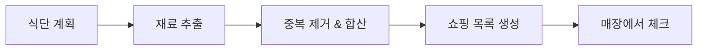

# 05. 쇼핑 목록 구현하기


💡 식단 계획의 재료를 모아 쇼핑 목록을 생성하고 구매 체크를 관리하세요.


## 개요

이 챕터에서는 쇼핑 목록 기능을 구현합니다:

- `shopping_lists` 테이블 생성
- 쇼핑 목록 생성 (수동 + 레시피 기반)
- 항목 체크/해제
- 쇼핑 목록 조회/수정/삭제
- 레시피 재료에서 자동 생성 개념



### 선행 조건

| 필요 항목 | 설명 | 참조 |
|----------|------|------|
| 인증 완료 | Access Token 발급 | [01. 인증](01-auth.md) |
| recipes 테이블 | 재료 추출용 레시피 | [02. 레시피](02-recipes.md) |
| ingredients 테이블 | 재료 데이터 | [03. 재료](03-ingredients.md) |
| meal_plans 테이블 | 식단 기반 생성 (선택) | [04. 식단 계획](04-meal-plan.md) |

***

## 1단계: shopping_lists 테이블 생성

쇼핑 목록 데이터를 저장할 테이블을 생성하세요.

### 테이블 구조

| 필드 | 타입 | 필수 | 설명 |
|------|------|:----:|------|
| `name` | `string` | ✅ | 쇼핑 목록 이름 (예: "이번 주 장보기") |
| `date` | `string` | - | 장보기 예정일 (YYYY-MM-DD) |
| `items` | `array` | ✅ | 쇼핑 항목 배열 |
| `totalItems` | `number` | - | 전체 항목 수 |
| `checkedItems` | `number` | - | 체크된 항목 수 |

### items 배열 구조

각 항목은 다음 형태의 객체입니다:

```json
{
  "name": "김치",
  "amount": "300",
  "unit": "g",
  "checked": false,
  "recipeId": "6612a3f4b1c2d3e4f5a6b7c8"
}
```





✅ **AI에게 이렇게 말해보세요**

"장보기 목록을 관리하고 싶어요. 목록 이름, 날짜, 사야 할 항목들(재료 이름, 양, 단위, 샀는지 여부)을 저장할 수 있게 해주세요. 만들기 전에 어떤 구조로 만들지 먼저 보여주세요."



💡 AI가 아래와 비슷한 구조를 제안하는지 확인하세요.


| 필드 | 설명 | 예시 값 |
|------|------|---------|
| name | 목록 이름 | "이번 주 장보기" |
| date | 날짜 | "2026-02-10" |
| items | 쇼핑 항목들 | [{name, amount, unit, checked}] |
| totalItems | 전체 항목 수 | 4 |
| checkedItems | 구매 완료 수 | 0 |




1. **테이블 관리** 메뉴로 이동하세요.
2. **테이블 추가** 버튼을 클릭하세요.
3. 테이블 이름에 `shopping_lists`를 입력하세요.
4. 위 테이블 구조에 맞게 필드를 추가하세요.
5. `items` 필드는 **Array** 타입(내부 Object)으로 설정하세요.
6. **저장** 버튼을 클릭하세요.

<!-- 📸 IMG: shopping_lists 테이블 생성 화면 -->




***

## 2단계: 쇼핑 목록 생성

### 수동 생성

직접 항목을 지정하여 쇼핑 목록을 만드세요.





✅ **AI에게 이렇게 말해보세요**

"이번 주 장보기 목록을 만들어주세요. 김치 1포기, 돼지고기 500g, 두부 2모, 대파 1단이 필요해요."





```bash
curl -X POST https://api-client.bkend.ai/v1/data/shopping_lists \
  -H "Content-Type: application/json" \
  -H "Authorization: Bearer {accessToken}" \
  -H "X-Project-Id: {project_id}" \
  -H "X-Environment: dev" \
  -d '{
    "name": "이번 주 장보기",
    "date": "2025-01-25",
    "items": [
      { "name": "김치", "amount": "1", "unit": "포기", "checked": false },
      { "name": "돼지고기", "amount": "500", "unit": "g", "checked": false },
      { "name": "두부", "amount": "2", "unit": "모", "checked": false },
      { "name": "대파", "amount": "1", "unit": "단", "checked": false }
    ],
    "totalItems": 4,
    "checkedItems": 0
  }'
```

**응답 (201 Created):**

```json
{
  "id": "6616d4e5f6a7b8c9d0e1f2a3",
  "name": "이번 주 장보기",
  "date": "2025-01-25",
  "items": [
    { "name": "김치", "amount": "1", "unit": "포기", "checked": false },
    { "name": "돼지고기", "amount": "500", "unit": "g", "checked": false },
    { "name": "두부", "amount": "2", "unit": "모", "checked": false },
    { "name": "대파", "amount": "1", "unit": "단", "checked": false }
  ],
  "totalItems": 4,
  "checkedItems": 0,
  "createdBy": "user_abc123",
  "createdAt": "2025-01-15T12:00:00.000Z"
}
```




### 레시피 재료 기반 자동 생성

레시피의 재료를 조회하여 쇼핑 목록을 자동으로 만드는 패턴입니다.





✅ **AI에게 이렇게 말해보세요**

"김치찌개와 비빔밥에 들어가는 재료를 합쳐서 장보기 목록을 만들어주세요. 같은 재료는 양을 합산해주세요."


AI가 각 레시피의 재료를 조회하고, 같은 재료를 합산한 뒤, 장보기 목록을 생성합니다.




```javascript
/**
 * 레시피 ID 목록에서 쇼핑 목록 자동 생성
 * @param {string[]} recipeIds - 레시피 ID 배열
 * @param {string} listName - 쇼핑 목록 이름
 */
async function createShoppingListFromRecipes(recipeIds, listName) {
  // 1. 각 레시피의 재료 조회
  const allIngredients = [];
  for (const recipeId of recipeIds) {
    const result = await bkendFetch(
      '/v1/data/ingredients?andFilters=' +
      encodeURIComponent(JSON.stringify({ recipeId }))
    );
    allIngredients.push(...result.items);
  }

  // 2. 같은 재료 합산 (이름 + 단위 기준)
  const merged = {};
  allIngredients.forEach(ing => {
    const key = `${ing.name}_${ing.unit}`;
    if (merged[key]) {
      const prev = parseFloat(merged[key].amount);
      const curr = parseFloat(ing.amount);
      merged[key].amount = String(prev + curr);
    } else {
      merged[key] = {
        name: ing.name,
        amount: ing.amount,
        unit: ing.unit,
        checked: false,
        recipeId: ing.recipeId,
      };
    }
  });

  const items = Object.values(merged);

  // 3. 쇼핑 목록 생성
  const shoppingList = await bkendFetch('/v1/data/shopping_lists', {
    method: 'POST',
    body: JSON.stringify({
      name: listName,
      date: new Date().toISOString().split('T')[0],
      items,
      totalItems: items.length,
      checkedItems: 0,
    }),
  });

  console.log(`쇼핑 목록 생성 완료: ${items.length}개 항목`);
  return shoppingList;
}

// 사용 예시
const list = await createShoppingListFromRecipes(
  [recipeKimchiId, recipeBibimbapId],
  '이번 주 장보기'
);
```





💡 주간 식단의 모든 레시피 재료를 합산하면 효율적인 장보기 목록이 됩니다. [04. 식단 계획](04-meal-plan.md)에서 주간 식단을 먼저 구성하세요.


***

## 3단계: 쇼핑 목록 조회

### 내 쇼핑 목록 전체 조회





✅ **AI에게 이렇게 말해보세요**

"내 장보기 목록을 보여주세요."





```bash
curl -X GET "https://api-client.bkend.ai/v1/data/shopping_lists?sortBy=createdAt&sortDirection=desc" \
  -H "Authorization: Bearer {accessToken}" \
  -H "X-Project-Id: {project_id}" \
  -H "X-Environment: dev"
```

```javascript
const myLists = await bkendFetch(
  '/v1/data/shopping_lists?sortBy=createdAt&sortDirection=desc'
);

myLists.items.forEach(list => {
  const progress = list.totalItems > 0
    ? Math.round((list.checkedItems / list.totalItems) * 100)
    : 0;
  console.log(`${list.name} - ${progress}% 완료 (${list.checkedItems}/${list.totalItems})`);
});
```




### 특정 쇼핑 목록 상세 조회





✅ **AI에게 이렇게 말해보세요**

"이번 주 장보기 목록에 뭐가 있는지 상세하게 보여주세요."





```bash
curl -X GET https://api-client.bkend.ai/v1/data/shopping_lists/{listId} \
  -H "Authorization: Bearer {accessToken}" \
  -H "X-Project-Id: {project_id}" \
  -H "X-Environment: dev"
```

```javascript
const list = await bkendFetch(`/v1/data/shopping_lists/${listId}`);

console.log(`${list.name} (${list.date})`);
console.log('---');
list.items.forEach(item => {
  const check = item.checked ? '[x]' : '[ ]';
  console.log(`${check} ${item.name} ${item.amount}${item.unit}`);
});
```




***

## 4단계: 항목 체크/해제

매장에서 구매한 항목을 체크하세요. `items` 배열 전체를 업데이트합니다.





✅ **AI에게 이렇게 말해보세요**

"김치랑 두부는 샀어요. 장보기 목록에서 체크해주세요."


AI가 목록을 확인한 뒤, 해당 항목을 구매 완료로 표시합니다.


✅ **체크 해제**

"김치를 다시 체크 해제해주세요."





```javascript
/**
 * 쇼핑 목록 항목 체크/해제
 * @param {string} listId - 쇼핑 목록 ID
 * @param {string} itemName - 체크할 항목 이름
 * @param {boolean} checked - 체크 여부
 */
async function toggleItem(listId, itemName, checked) {
  // 1. 현재 목록 조회
  const list = await bkendFetch(`/v1/data/shopping_lists/${listId}`);

  // 2. 해당 항목 체크 상태 변경
  const updatedItems = list.items.map(item => {
    if (item.name === itemName) {
      return { ...item, checked };
    }
    return item;
  });

  // 3. 체크된 항목 수 계산
  const checkedCount = updatedItems.filter(i => i.checked).length;

  // 4. 업데이트
  await bkendFetch(`/v1/data/shopping_lists/${listId}`, {
    method: 'PATCH',
    body: JSON.stringify({
      items: updatedItems,
      checkedItems: checkedCount,
    }),
  });

  console.log(`${itemName} ${checked ? '체크' : '체크 해제'} 완료`);
}

// 사용 예시
await toggleItem(listId, '김치', true);    // 김치 구매 완료
await toggleItem(listId, '두부', true);    // 두부 구매 완료
await toggleItem(listId, '김치', false);   // 김치 체크 해제
```

**여러 항목 한번에 체크:**

```javascript
async function checkMultipleItems(listId, itemNames) {
  const list = await bkendFetch(`/v1/data/shopping_lists/${listId}`);

  const updatedItems = list.items.map(item => ({
    ...item,
    checked: itemNames.includes(item.name) ? true : item.checked,
  }));

  const checkedCount = updatedItems.filter(i => i.checked).length;

  await bkendFetch(`/v1/data/shopping_lists/${listId}`, {
    method: 'PATCH',
    body: JSON.stringify({
      items: updatedItems,
      checkedItems: checkedCount,
    }),
  });

  console.log(`${itemNames.join(', ')} 체크 완료`);
}

// 김치와 두부를 한번에 체크
await checkMultipleItems(listId, ['김치', '두부']);
```




***

## 5단계: 쇼핑 목록에 항목 추가/제거

### 항목 추가





✅ **AI에게 이렇게 말해보세요**

"장보기 목록에 고춧가루 1봉을 추가해주세요."





```javascript
async function addItem(listId, newItem) {
  const list = await bkendFetch(`/v1/data/shopping_lists/${listId}`);

  const updatedItems = [...list.items, { ...newItem, checked: false }];

  await bkendFetch(`/v1/data/shopping_lists/${listId}`, {
    method: 'PATCH',
    body: JSON.stringify({
      items: updatedItems,
      totalItems: updatedItems.length,
    }),
  });
}

// 고춧가루 추가
await addItem(listId, { name: '고춧가루', amount: '1', unit: '봉' });
```




### 항목 제거





✅ **AI에게 이렇게 말해보세요**

"장보기 목록에서 대파를 빼주세요."





```javascript
async function removeItem(listId, itemName) {
  const list = await bkendFetch(`/v1/data/shopping_lists/${listId}`);

  const updatedItems = list.items.filter(item => item.name !== itemName);
  const checkedCount = updatedItems.filter(i => i.checked).length;

  await bkendFetch(`/v1/data/shopping_lists/${listId}`, {
    method: 'PATCH',
    body: JSON.stringify({
      items: updatedItems,
      totalItems: updatedItems.length,
      checkedItems: checkedCount,
    }),
  });
}

// 대파 제거
await removeItem(listId, '대파');
```




***

## 6단계: 진행 상태 확인

쇼핑 진행률을 확인하세요.





✅ **AI에게 이렇게 말해보세요**

"장보기 진행 상황이 어떻게 되나요? 아직 안 산 것들을 보여주세요."





```javascript
async function getProgress(listId) {
  const list = await bkendFetch(`/v1/data/shopping_lists/${listId}`);

  const total = list.items.length;
  const checked = list.items.filter(i => i.checked).length;
  const remaining = list.items.filter(i => !i.checked);
  const progress = total > 0 ? Math.round((checked / total) * 100) : 0;

  console.log(`장보기 진행: ${checked}/${total} (${progress}%)`);
  console.log('');

  // 체크된 항목
  list.items.filter(i => i.checked).forEach(i => {
    console.log(`  [x] ${i.name} ${i.amount}${i.unit}`);
  });

  // 남은 항목
  remaining.forEach(i => {
    console.log(`  [ ] ${i.name} ${i.amount}${i.unit}`);
  });

  return { progress, remaining };
}

await getProgress(listId);
// 장보기 진행: 2/4 (50%)
//   [x] 김치 1포기
//   [x] 두부 2모
//   [ ] 돼지고기 500g
//   [ ] 대파 1단
```




***

## 7단계: 쇼핑 목록 삭제

완료된 쇼핑 목록을 삭제하세요.





✅ **AI에게 이렇게 말해보세요**

"이번 주 장보기 목록을 삭제해주세요."





```bash
curl -X DELETE https://api-client.bkend.ai/v1/data/shopping_lists/{listId} \
  -H "Authorization: Bearer {accessToken}" \
  -H "X-Project-Id: {project_id}" \
  -H "X-Environment: dev"
```

```javascript
await bkendFetch(`/v1/data/shopping_lists/${listId}`, {
  method: 'DELETE',
});
```




***

## 쇼핑 목록 공유

쇼핑 목록을 다른 사용자와 공유하려면 목록 ID를 전달하는 방식을 사용합니다.


💡 현재 bkend의 동적 테이블은 `createdBy` 기반 소유권을 사용합니다. 다른 사용자에게 목록을 공유하려면, 공유받을 사용자가 같은 데이터를 조회할 수 있도록 테이블 권한을 `public: read`로 설정하거나, 앱 레벨에서 공유 링크를 생성하는 방식을 사용하세요.


```javascript
// 쇼핑 목록 공유 링크 생성 예시 (앱 레벨)
function generateShareLink(listId) {
  return `https://myapp.com/shopping-list/${listId}`;
}

// 공유받은 목록 조회 (테이블 권한이 public read일 때)
const sharedList = await bkendFetch(`/v1/data/shopping_lists/${listId}`);
```

***

## 에러 처리

### 주요 에러 코드

| HTTP 상태 | 에러 코드 | 설명 | 해결 방법 |
|:---------:|----------|------|----------|
| 400 | `VALIDATION_ERROR` | 필수 필드 누락 | name, items 확인 |
| 400 | `VALIDATION_ERROR` | items 형식 오류 | 각 항목에 name, amount, unit, checked 포함 |
| 404 | `NOT_FOUND` | 존재하지 않는 목록 | 목록 ID 확인 |
| 403 | `FORBIDDEN` | 권한 없음 | 본인의 목록만 수정/삭제 가능 |

***

## 참고 문서

- [테이블 관리](../../../ko/console/07-table-management.md) — 콘솔에서 테이블 생성/관리
- [데이터 생성](../../../ko/database/03-insert.md) — REST API 데이터 등록 상세
- [데이터 수정](../../../ko/database/06-update.md) — 데이터 업데이트 상세
- [앱에서 bkend 연동하기](../../../ko/getting-started/06-app-integration.md) — bkendFetch 헬퍼

***

## 다음 단계

[06. AI 시나리오](06-ai-prompts.md)에서 냉장고 파먹기, 주간 식단 자동 생성 등 AI 활용 시나리오를 학습하세요.
