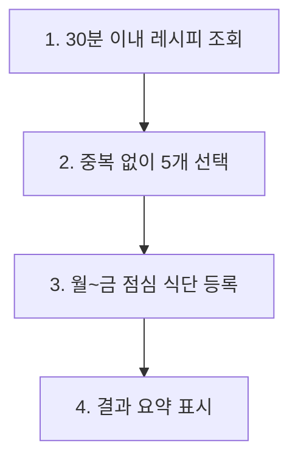
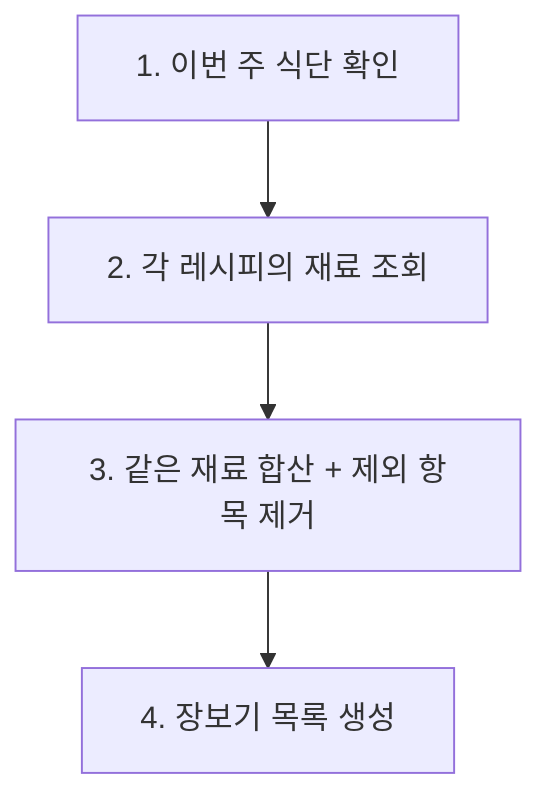

# 06. AI 프롬프트 모음


💡 레시피 앱의 각 기능을 AI에게 자연어로 요청하는 프롬프트 레퍼런스입니다. MCP 도구가 연결된 AI 클라이언트(Claude Code, Cursor 등)에서 그대로 사용하세요.


## 이 장에서 다루는 것

- 레시피, 재료, 식단, 쇼핑 목록, 조리 기록 관련 AI 프롬프트
- 테이블 초기 세팅부터 일상 사용까지 프롬프트 모음
- 여러 기능을 조합한 복합 시나리오 프롬프트

***

## 테이블 초기 세팅

프로젝트를 처음 시작할 때, AI에게 필요한 데이터 구조를 한번에 만들어달라고 요청하세요.


✅ **AI에게 이렇게 말해보세요**

"레시피 앱을 만들고 싶어요. 레시피, 재료, 식단 계획, 장보기 목록, 요리 기록을 관리할 수 있게 해주세요. 만들기 전에 어떤 구조로 만들지 먼저 보여주세요."



💡 AI가 아래와 비슷한 구조를 제안하는지 확인하세요.


**recipes (레시피)**

| 필드 | 설명 | 예시 값 |
|------|------|---------|
| title | 레시피 이름 | "김치찌개" |
| description | 간단 설명 | "매콤한 김치찌개" |
| cookingTime | 조리 시간(분) | 30 |
| difficulty | 난이도 | "easy" / "medium" / "hard" |
| servings | 인분 | 2 |
| category | 카테고리 | "한식" |
| imageUrl | 레시피 사진 URL | (업로드 후 연결) |

**ingredients (재료)**

| 필드 | 설명 | 예시 값 |
|------|------|---------|
| recipeId | 어떤 레시피의 재료인지 | (레시피 ID) |
| name | 재료 이름 | "김치" |
| amount | 양 | "200" |
| unit | 단위 | "g" |
| orderIndex | 순서 | 1 |
| isOptional | 선택 재료 여부 | false |

**meal_plans (식단 계획)**

| 필드 | 설명 | 예시 값 |
|------|------|---------|
| date | 날짜 | "2026-02-10" |
| mealType | 식사 종류 | "breakfast" / "lunch" / "dinner" / "snack" |
| recipeId | 어떤 레시피인지 | (레시피 ID) |
| servings | 인분 | 2 |
| notes | 메모 | "매운맛 줄이기" |

**shopping_lists (장보기 목록)**

| 필드 | 설명 | 예시 값 |
|------|------|---------|
| name | 목록 이름 | "이번 주 장보기" |
| date | 날짜 | "2026-02-10" |
| items | 쇼핑 항목들 | [{name, amount, unit, checked}] |

**cooking_logs (요리 기록)**

| 필드 | 설명 | 예시 값 |
|------|------|---------|
| recipeId | 어떤 레시피를 만들었는지 | (레시피 ID) |
| date | 조리 날짜 | "2026-02-10" |
| rating | 평점 (1~5) | 4 |
| notes | 메모 | "소금 조금 덜 넣기" |


✅ **구조 확인 후**

"좋아요, 이 구조로 만들어주세요."



✅ **현재 만들어진 구조 확인**

"지금 프로젝트에 어떤 데이터 구조가 있는지 보여주세요."


***

## 레시피 관리

### 레시피 등록


✅ **AI에게 이렇게 말해보세요**

"새 레시피를 등록해주세요. 김치찌개, 조리시간 30분, 난이도 쉬움, 2인분, 한식이에요. 설명은 '돼지고기와 잘 익은 김치로 만드는 얼큰한 찌개'로 해주세요."



✅ **여러 레시피 한번에 등록**

"파스타 레시피 3개를 등록해주세요. 까르보나라(20분, 보통 난이도), 알리오올리오(15분, 쉬움), 봉골레(25분, 보통)으로요."


### 레시피 수정


✅ **AI에게 이렇게 말해보세요**

"김치찌개 레시피를 수정해주세요. 4인분으로 바꾸고, 조리시간도 40분으로 변경해주세요."



✅ **AI에게 이렇게 말해보세요**

"비빔밥 레시피 난이도를 쉬움으로 바꿔주세요."


### 레시피 삭제


✅ **AI에게 이렇게 말해보세요**

"김치찌개 레시피를 삭제해주세요."


### 이미지 업로드


✅ **AI에게 이렇게 말해보세요**

"김치찌개 레시피에 사진을 추가하고 싶어요. 이미지 파일을 업로드하고 레시피에 연결해주세요."



💡 AI가 이미지 업로드와 레시피 연결을 자동으로 처리합니다. 상세 흐름은 [02. 레시피](02-recipes.md)를 참고하세요.


### 레시피 검색/필터링


✅ **AI에게 이렇게 말해보세요**

"쉬운 난이도 레시피만 조리시간 짧은 순으로 보여주세요."



✅ **AI에게 이렇게 말해보세요**

"30분 안에 만들 수 있는 한식 레시피를 보여주세요."



✅ **AI에게 이렇게 말해보세요**

"내가 등록한 레시피 목록을 보여주세요."


***

## 재료 관리

### 재료 추가


✅ **AI에게 이렇게 말해보세요**

"김치찌개 레시피에 재료를 추가해주세요. 김치 300g, 돼지고기 200g, 두부 반 모, 대파 1대, 고춧가루 1큰술은 선택 재료예요."



✅ **AI에게 이렇게 말해보세요**

"까르보나라 재료를 등록해주세요. 스파게티면 200g, 베이컨 100g, 계란 2개, 파마산치즈 50g, 생크림 100ml이에요."


### 재료 수정


✅ **AI에게 이렇게 말해보세요**

"김치찌개 재료에서 김치 양을 500g으로 바꿔주세요."



✅ **AI에게 이렇게 말해보세요**

"김치찌개 재료에서 고춧가루를 필수 재료로 바꿔주세요."


### 재료 삭제


✅ **AI에게 이렇게 말해보세요**

"김치찌개 재료에서 고춧가루를 빼주세요."


### 재료 조회 / 인분 변환


✅ **AI에게 이렇게 말해보세요**

"김치찌개에 들어가는 재료 목록을 보여주세요. 필수 재료와 선택 재료를 구분해서요."



✅ **AI에게 이렇게 말해보세요**

"김치찌개를 4인분으로 만들려면 재료가 얼마나 필요한가요? 2인분 기준에서 계산해주세요."


***

## 식단 계획

### 날짜별 식단 등록


✅ **AI에게 이렇게 말해보세요**

"1월 20일 저녁에 김치찌개 2인분으로 식단을 등록해주세요."



✅ **하루 전체 식단 한번에 등록**

"1월 20일 식단을 짜주세요. 아침은 토스트, 점심은 비빔밥, 저녁은 김치찌개로 해주세요."



✅ **조건부 식단 등록**

"내일 점심에 간단히 먹을 수 있는 걸로 식단을 등록해주세요. 조리시간 15분 이내로요."


### 식단 조회


✅ **AI에게 이렇게 말해보세요**

"이번 주 식단을 날짜별로 정리해서 보여주세요."



✅ **AI에게 이렇게 말해보세요**

"1월 20일에 뭐 먹기로 했는지 보여주세요."


### 식단 수정


✅ **AI에게 이렇게 말해보세요**

"1월 20일 저녁 메뉴를 된장찌개로 바꿔주세요."



✅ **AI에게 이렇게 말해보세요**

"1월 22일 점심을 4인분으로 변경해주세요."


***

## 장보기 목록

### 직접 만들기


✅ **AI에게 이렇게 말해보세요**

"이번 주 장보기 목록을 만들어주세요. 김치 1포기, 돼지고기 500g, 두부 2모, 대파 1단이 필요해요."


### 레시피 재료에서 자동 생성


✅ **AI에게 이렇게 말해보세요**

"김치찌개와 비빔밥에 들어가는 재료를 합쳐서 장보기 목록을 만들어주세요. 같은 재료는 양을 합산해주세요."



✅ **AI에게 이렇게 말해보세요**

"이번 주 식단에 들어가는 모든 재료를 모아서 장보기 목록을 만들어주세요."



💡 AI가 식단에서 레시피를 찾고, 각 레시피의 재료를 조회한 뒤, 같은 재료를 합산하여 장보기 목록을 자동으로 만듭니다.


### 구매 체크


✅ **AI에게 이렇게 말해보세요**

"김치랑 두부는 샀어요. 장보기 목록에서 체크해주세요."



✅ **진행 상황 확인**

"장보기 진행 상황이 어떻게 되나요? 아직 안 산 것들을 보여주세요."


### 항목 추가/제거


✅ **AI에게 이렇게 말해보세요**

"장보기 목록에 고춧가루 1봉을 추가해주세요."



✅ **AI에게 이렇게 말해보세요**

"장보기 목록에서 대파를 빼주세요."


***

## 요리 기록

요리를 완료하면 기록을 남기고, 메모와 평점을 관리하세요.

### 요리 완료 기록


✅ **AI에게 이렇게 말해보세요**

"오늘 점심에 김치찌개를 만들었어요. 평점 4점이고, 메모는 '매운맛이 딱 좋았다'로 기록해주세요."



✅ **AI에게 이렇게 말해보세요**

"어제 저녁에 까르보나라를 만들었어요. 평점 3점, 면이 좀 퍼졌다고 메모해주세요."



💡 AI가 아래와 비슷한 정보를 저장합니다.


| 필드 | 설명 | 예시 값 |
|------|------|---------|
| recipeId | 어떤 레시피를 만들었는지 | (레시피 ID) |
| date | 조리 날짜 | "2026-02-10" |
| rating | 평점 (1~5) | 4 |
| notes | 메모 | "매운맛이 딱 좋았다" |

### 요리 기록 조회


✅ **AI에게 이렇게 말해보세요**

"이번 달에 어떤 요리를 했는지 보여주세요."



✅ **AI에게 이렇게 말해보세요**

"김치찌개를 몇 번이나 만들었는지, 평균 평점은 얼마인지 알려주세요."


### 요리 기록 수정/삭제


✅ **AI에게 이렇게 말해보세요**

"마지막 요리 기록의 평점을 5점으로 바꿔주세요."



✅ **AI에게 이렇게 말해보세요**

"어제 등록한 요리 기록을 삭제해주세요."


***

## 복합 시나리오

여러 기능을 한번에 요청하는 프롬프트입니다. AI가 필요한 작업을 순차적으로 처리합니다.

### 주간 식단 자동 구성


✅ **AI에게 이렇게 말해보세요**

"이번 주 월요일부터 금요일까지 점심 식단을 짜주세요. 30분 안에 만들 수 있는 레시피로 골라주시고, 같은 메뉴가 겹치지 않게 해주세요."


AI 처리 흐름:

### 냉장고 파먹기 + 식단 등록


✅ **AI에게 이렇게 말해보세요**

"냉장고에 닭가슴살, 양파, 마늘이 있어요. 이 재료로 만들 수 있는 레시피를 찾아서, 오늘 저녁 식단으로 등록해주세요."


AI 처리 흐름:

1. 닭가슴살, 양파, 마늘이 포함된 레시피 탐색
2. 매칭 레시피 추천
3. 선택한 레시피로 오늘 저녁 식단 등록

### 식단에서 장보기 목록 자동 생성


✅ **AI에게 이렇게 말해보세요**

"이번 주 식단에 필요한 재료를 모아서 장보기 목록을 만들어주세요. 같은 재료는 합산하고, 집에 이미 있는 쌀, 간장, 소금은 빼주세요."


AI 처리 흐름:

### 월간 요리 리포트


✅ **AI에게 이렇게 말해보세요**

"이번 달 요리 리포트를 만들어주세요. 몇 번 요리했는지, 자주 만든 레시피 TOP 5, 평균 평점, 카테고리별 분포를 정리해주세요."


AI 처리 흐름:

1. 이번 달 요리 기록 전체 조회
2. 각 레시피 상세 정보 확인
3. 통계 분석 및 리포트 생성

### 레시피 + 재료 한번에 등록


✅ **AI에게 이렇게 말해보세요**

"된장찌개 레시피를 등록하고, 재료도 함께 추가해주세요. 된장 2큰술, 두부 1모, 감자 1개, 호박 반 개, 양파 반 개, 대파 1대, 고추 1개예요."


AI 처리 흐름:

1. 된장찌개 레시피 생성
2. 각 재료를 순차적으로 추가

### 식단 변경 + 장보기 목록 업데이트


✅ **AI에게 이렇게 말해보세요**

"수요일 저녁을 김치찌개에서 된장찌개로 바꿔주세요. 그리고 장보기 목록에서 김치는 빼고 된장을 추가해주세요."


AI 처리 흐름:

1. 수요일 저녁 식단 확인
2. 레시피 변경
3. 장보기 목록에서 항목 수정

***

## 프롬프트 작성 팁

효과적인 AI 프롬프트를 작성하는 팁입니다.

| 원칙 | 좋은 예시 | 나쁜 예시 |
|------|----------|----------|
| 구체적으로 말하기 | "김치찌개, 30분, 2인분, 쉬움" | "레시피 하나 등록해줘" |
| 조건 명시하기 | "30분 이내, 한식만" | "빠르게 만들 수 있는 거" |
| 결과 형태 지정 | "날짜별로 정리해서 보여주세요" | "식단 보여줘" |
| 한번에 여러 작업 | "레시피 등록하고 재료도 추가해주세요" | (각각 따로 요청) |
| 먼저 확인받기 | "만들기 전에 어떤 구조인지 보여주세요" | (바로 만들어 달라고만 요청) |


⚠️ AI가 잘못된 데이터를 수정하거나 삭제하지 않도록, 레시피 이름이나 날짜를 정확하게 지정하세요. 모호한 표현 대신 구체적인 값을 사용하는 것이 안전합니다.


***

## 참고 문서

- [AI 도구 연동](../../../ko/ai-tools/01-overview.md) —MCP 도구 설정 및 연동 가이드
- [데이터 목록 조회](../../../ko/database/05-list.md) —필터링, 정렬, 페이지네이션 상세

***

## 다음 단계

[99. 문제 해결](99-troubleshooting.md)에서 레시피 앱 개발 시 자주 발생하는 오류와 해결 방법을 확인하세요.
