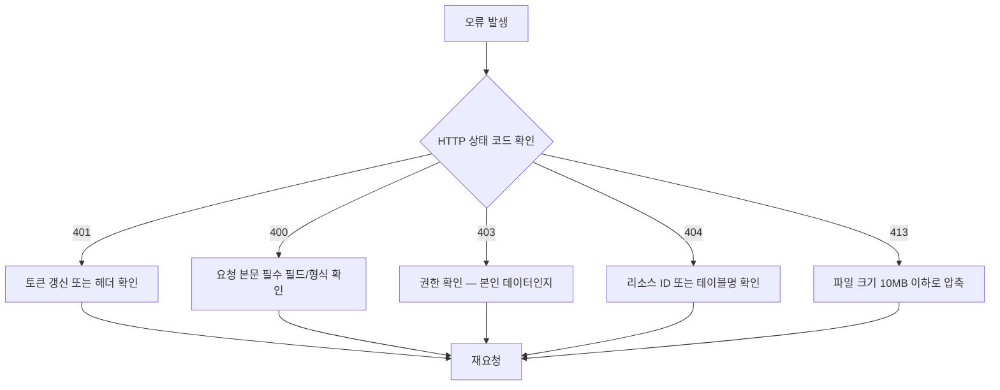

# 99. 문제 해결


💡 레시피 앱 개발 시 자주 발생하는 오류와 해결 방법을 안내합니다.


## 이 장에서 다루는 것

- 인증, 레시피, 재료, 식단, 쇼핑 목록별 오류 대응
- MCP 도구 관련 문제 해결
- 자주 묻는 질문

***

## 인증 관련

### 401 Unauthorized — 토큰 만료 또는 누락

```json
{
  "statusCode": 401,
  "message": "Unauthorized: Invalid or expired token"
}
```

**원인:** Access Token이 만료되었거나 요청에 포함되지 않았습니다.

**해결 방법:**




토큰을 갱신한 뒤 재요청하세요.

```bash
curl -X POST https://api-client.bkend.ai/v1/auth/refresh \
  -H "Content-Type: application/json" \
  -H "X-API-Key: {pk_publishable_key}" \
  -d '{
    "refreshToken": "{refreshToken}"
  }'
```

갱신된 `accessToken`을 `Authorization: Bearer {accessToken}` 헤더에 다시 설정하세요.




bkendFetch 헬퍼에 자동 갱신 로직을 추가하면 편리합니다. 상세 패턴은 [토큰 관리](../../../ko/authentication/20-token-management.md)를 참고하세요.




### 401 Unauthorized — 헤더 누락

```json
{
  "statusCode": 401,
  "message": "X-API-Key header is required"
}
```

**원인:** 필수 헤더(`X-API-Key`, `Authorization`)가 누락되었습니다.

**해결 방법:** 모든 API 요청에 필수 헤더를 포함하세요.

| 헤더 | 값 | 설명 |
|------|-----|------|
| `X-API-Key` | `{pk_publishable_key}` | Publishable Key (`pk_` 접두사) |
| `Authorization` | `Bearer {accessToken}` | 인증 토큰 |

***

## 레시피 관련

### 레시피 등록 실패 — 필수 필드 누락

```json
{
  "statusCode": 400,
  "message": "Validation failed: title is required"
}
```

**원인:** `title`, `description`, `cookingTime`, `difficulty`, `servings` 중 하나 이상이 누락되었습니다.

**해결 방법:** 필수 필드를 모두 포함하여 요청하세요.

```bash
curl -X POST https://api-client.bkend.ai/v1/data/recipes \
  -H "Content-Type: application/json" \
  -H "X-API-Key: {pk_publishable_key}" \
  -H "Authorization: Bearer {accessToken}" \
  -d '{
    "title": "김치찌개",
    "description": "돼지고기와 김치로 만드는 찌개",
    "cookingTime": 30,
    "difficulty": "easy",
    "servings": 2
  }'
```

### 이미지 업로드 실패 — 파일 크기 초과

```json
{
  "statusCode": 413,
  "message": "File size exceeds limit"
}
```

**원인:** 업로드 파일이 허용 용량을 초과했습니다.

**해결 방법:**

- 이미지를 **10MB 이하**로 압축하세요.
- 해상도를 낮추거나, WebP 형식으로 변환하면 용량을 줄일 수 있습니다.

### 이미지 업로드 실패 — Presigned URL 만료

```json
{
  "statusCode": 403,
  "message": "Request has expired"
}
```

**원인:** Presigned URL 발급 후 15분이 경과하여 만료되었습니다.

**해결 방법:** Presigned URL을 다시 발급받은 뒤 즉시 업로드하세요.


⚠️ Presigned URL은 발급 후 **15분** 동안만 유효합니다.


### 레시피 필터 결과 없음

레시피 목록 조회 시 `items` 배열이 비어 있는 경우입니다.

**가능한 원인:**

| 원인 | 확인 방법 |
|------|----------|
| 필터 조건이 너무 엄격 | 조건을 하나씩 제거하며 테스트 |
| `difficulty` 값 오타 | `easy`, `medium`, `hard` 정확히 입력 |
| 데이터가 없음 | 필터 없이 전체 목록 먼저 조회 |

**해결 방법:** 필터를 제거한 뒤 전체 데이터를 먼저 확인하세요.

```bash
# 필터 없이 전체 조회
curl -X GET "https://api-client.bkend.ai/v1/data/recipes?page=1&limit=10" \
  -H "X-API-Key: {pk_publishable_key}" \
  -H "Authorization: Bearer {accessToken}"
```

***

## 재료 관련

### 중복 재료 등록

같은 레시피에 동일한 재료를 여러 번 등록하면 중복 항목이 생깁니다.

**원인:** `ingredients` 테이블에는 중복 방지 제약이 없으므로, 같은 `recipeId` + `name` 조합이 여러 건 생길 수 있습니다.

**해결 방법:** 재료 추가 전에 기존 재료를 조회하여 중복 여부를 확인하세요.

```javascript
async function addIngredientSafe(recipeId, ingredient) {
  // 1. 기존 재료 확인
  const existing = await bkendFetch(
    '/v1/data/ingredients?andFilters=' +
    encodeURIComponent(JSON.stringify({
      recipeId,
      name: ingredient.name,
    }))
  );

  if (existing.pagination.totalItems > 0) {
    // 이미 존재하면 수량 업데이트
    await bkendFetch(`/v1/data/ingredients/${existing.items[0].id}`, {
      method: 'PATCH',
      body: JSON.stringify({
        amount: ingredient.amount,
        unit: ingredient.unit,
      }),
    });
    console.log(`${ingredient.name} 수량 업데이트 완료`);
  } else {
    // 없으면 새로 추가
    await bkendFetch('/v1/data/ingredients', {
      method: 'POST',
      body: JSON.stringify({ recipeId, ...ingredient }),
    });
    console.log(`${ingredient.name} 추가 완료`);
  }
}
```

### 단위 오류

재료의 `unit` 필드에 일관되지 않은 단위가 입력된 경우입니다.

**원인:** `unit` 필드에 자유 텍스트가 허용되어 같은 단위가 다르게 입력될 수 있습니다. 예: `g` vs `그램`, `큰 술` vs `큰술`

**해결 방법:** 앱에서 허용할 단위 목록을 정하고, 입력 시 드롭다운으로 선택하게 하세요.

| 카테고리 | 권장 단위 |
|---------|----------|
| 무게 | `g`, `kg` |
| 부피 | `ml`, `L`, `컵` |
| 계량 | `큰술`, `작은술` |
| 개수 | `개`, `모`, `대`, `쪽`, `단` |
| 기타 | `약간`, `적당량` |

***

## 식단 관련

### 날짜 형식 오류

```json
{
  "statusCode": 400,
  "message": "Validation failed: date format is invalid"
}
```

**원인:** 날짜 형식이 `YYYY-MM-DD`가 아닙니다.

**해결 방법:**

```json
// 잘못된 형식
{ "date": "01/20/2025" }
{ "date": "2025.01.20" }
{ "date": "1월 20일" }

// 올바른 형식 (ISO 8601)
{ "date": "2025-01-20" }
```

### 잘못된 mealType 값

```json
{
  "statusCode": 400,
  "message": "Validation failed: mealType must be one of breakfast, lunch, dinner, snack"
}
```

**원인:** `mealType` 필드에 허용되지 않는 값이 입력되었습니다.

**해결 방법:** 아래 4개 값 중 하나만 사용하세요.

| 값 | 의미 |
|----|------|
| `breakfast` | 아침 |
| `lunch` | 점심 |
| `dinner` | 저녁 |
| `snack` | 간식 |

### 같은 날짜/끼니 중복 등록

같은 날짜에 같은 `mealType`으로 여러 식단을 등록할 수 있습니다 (시스템에서 중복 방지를 하지 않음).

**해결 방법:** 등록 전에 해당 날짜/끼니에 기존 식단이 있는지 확인하세요.

```javascript
async function setMealPlan(date, mealType, recipeId, servings) {
  // 1. 기존 식단 확인
  const existing = await bkendFetch(
    '/v1/data/meal_plans?andFilters=' +
    encodeURIComponent(JSON.stringify({ date, mealType }))
  );

  if (existing.pagination.totalItems > 0) {
    // 이미 존재하면 업데이트
    await bkendFetch(`/v1/data/meal_plans/${existing.items[0].id}`, {
      method: 'PATCH',
      body: JSON.stringify({ recipeId, servings }),
    });
    console.log(`${date} ${mealType} 식단 업데이트 완료`);
  } else {
    // 없으면 새로 등록
    await bkendFetch('/v1/data/meal_plans', {
      method: 'POST',
      body: JSON.stringify({ date, mealType, recipeId, servings }),
    });
    console.log(`${date} ${mealType} 식단 등록 완료`);
  }
}
```

***

## 쇼핑 목록 관련

### 레시피 기반 자동 생성 시 재료가 누락됨

**원인:** 레시피에 재료(`ingredients`)가 등록되지 않았습니다.

**해결 방법:**

1. 해당 레시피의 재료가 등록되어 있는지 확인하세요.
2. 재료가 없으면 [03. 재료](03-ingredients.md)를 참고하여 먼저 등록하세요.

```bash
# 레시피 재료 확인
curl -X GET "https://api-client.bkend.ai/v1/data/ingredients?andFilters=%7B%22recipeId%22%3A%22{recipeId}%22%7D" \
  -H "X-API-Key: {pk_publishable_key}" \
  -H "Authorization: Bearer {accessToken}"
```

### 항목 합산 오류

같은 재료인데 단위가 달라서 합산되지 않는 경우입니다.

**원인:** 재료 이름은 같지만 단위가 다릅니다. 예: "양파 1개" + "양파 100g"

**해결 방법:**

- 단위를 통일하여 재료를 등록하세요.
- 앱 레벨에서 합산 로직 작성 시, `name`과 `unit`이 모두 같은 경우에만 합산하세요.

```javascript
// 같은 이름 + 같은 단위만 합산
const merged = {};
items.forEach(item => {
  const key = `${item.name}_${item.unit}`;
  if (merged[key]) {
    const prev = parseFloat(merged[key].amount);
    const curr = parseFloat(item.amount);
    merged[key].amount = String(prev + curr);
  } else {
    merged[key] = { ...item };
  }
});
```


💡 "양파 1개"와 "양파 100g"처럼 단위가 다른 항목은 별도 행으로 표시하는 것이 실용적입니다.


### 쇼핑 목록 체크 상태가 초기화됨

**원인:** `items` 배열 전체를 업데이트할 때, 기존 `checked` 상태를 포함하지 않고 덮어썼습니다.

**해결 방법:** 반드시 현재 목록을 먼저 조회한 뒤, 해당 항목의 `checked` 값만 변경하여 전체 배열을 업데이트하세요. [05. 쇼핑 목록](05-shopping-list.md)의 항목 체크/해제 패턴을 참고하세요.

***

## MCP 도구 관련

### AI가 테이블을 찾지 못하는 경우

AI에게 데이터 조회를 요청했지만, 테이블이 없다는 응답이 돌아오는 경우입니다.

**가능한 원인:**

| 원인 | 확인 방법 |
|------|----------|
| 테이블이 아직 생성되지 않음 | 콘솔 → **테이블 관리**에서 확인 |
| 테이블 이름 오타 | `recipe` (X) → `recipes` (O) |
| 다른 프로젝트/환경에 연결됨 | MCP 설정의 프로젝트 ID, 환경 확인 |

**해결 방법:**


✅ **AI에게 이렇게 말해보세요**

"현재 프로젝트에 있는 테이블 목록 보여줘."


테이블이 없으면 콘솔이나 AI를 통해 먼저 생성하세요. [02. 레시피](02-recipes.md)부터 각 챕터의 1단계를 참고하세요.

### MCP 연결 실패

```text
Error: Failed to connect to MCP server
```

**확인 사항:**

1. **MCP 서버 설정 확인** — AI 클라이언트(Claude Code, Cursor 등)의 MCP 설정에 올바른 서버 URL과 API 키가 입력되어 있는지 확인하세요.
2. **네트워크 연결** — 인터넷 연결 상태를 확인하세요.
3. **API 키 만료** — 콘솔 → **MCP** 메뉴에서 토큰이 유효한지 확인하세요.
4. **AI 클라이언트 재시작** — 설정 변경 후 클라이언트를 재시작하세요.

**설정 확인:**

```json
{
  "mcpServers": {
    "bkend": {
      "url": "https://mcp.bkend.ai/mcp",
      "headers": {
        "Authorization": "Bearer {mcp_api_key}"
      }
    }
  }
}
```


⚠️ MCP API 키는 콘솔에서 발급받은 키를 사용하세요. REST API의 Access Token과는 다릅니다.


### AI 응답이 예상과 다른 경우

AI가 잘못된 테이블이나 필드를 참조하는 경우입니다.

**해결 방법:**

- 테이블 이름과 필드명을 **정확하게** 지정하세요.
- 모호한 표현 대신 구체적인 값을 사용하세요.

| 모호한 요청 | 구체적인 요청 |
|------------|-------------|
| "레시피 하나 지워줘" | "김치찌개 레시피 삭제해줘" |
| "식단 바꿔줘" | "1월 20일 저녁을 된장찌개로 바꿔줘" |
| "장보기 목록 업데이트해줘" | "이번 주 장보기 목록에서 김치 체크해줘" |

***

## 공통 에러 코드 요약

| HTTP 상태 | 에러 | 설명 | 해결 방법 |
|:---------:|------|------|----------|
| 400 | `VALIDATION_ERROR` | 필수 필드 누락 또는 형식 오류 | 요청 본문의 필수 필드와 데이터 형식 확인 |
| 401 | `UNAUTHORIZED` | 인증 토큰 누락 또는 만료 | 토큰 갱신 후 재시도 |
| 403 | `FORBIDDEN` | 권한 없음 (다른 사용자 데이터 접근 시도) | 본인 데이터만 수정/삭제 가능 |
| 404 | `NOT_FOUND` | 요청한 리소스가 존재하지 않음 | ID 확인, 삭제 여부 확인 |
| 413 | `PAYLOAD_TOO_LARGE` | 파일 크기 초과 | 10MB 이하로 압축 |

***

## 자주 묻는 질문

### Q: 삭제된 레시피를 복구할 수 있나요?

A: 동적 테이블의 데이터는 삭제 시 영구 삭제됩니다. 복구가 불가능하므로 삭제 전에 반드시 확인하세요.

### Q: 식단 계획을 다른 사용자와 공유할 수 있나요?

A: 기본적으로 데이터는 `createdBy` 필드로 소유자가 구분됩니다. 공유하려면 테이블 권한을 `public: read`로 설정하거나, 앱 레벨에서 공유 링크를 구현하세요.

### Q: 레시피에 여러 이미지를 첨부할 수 있나요?

A: `imageUrl` 필드는 대표 이미지 1개용입니다. 여러 이미지가 필요하면 별도 테이블(예: `recipe_images`)을 만들어 `recipeId`와 연결하는 방식을 사용하세요.

### Q: 조리 기록의 평점 범위는?

A: `rating` 필드는 `number` 타입이므로 앱에서 1~5 범위를 직접 검증해야 합니다. 스키마에서 `min: 1`, `max: 5`를 설정하면 서버 측에서도 검증됩니다.

### Q: 한번에 여러 데이터를 등록할 수 있나요?

A: 현재 동적 테이블 API는 건별 등록만 지원합니다. 여러 건을 등록하려면 반복 호출하세요. AI에게 "재료 5개 추가해줘"라고 요청하면 AI가 순차적으로 처리합니다.

***

## 디버깅 체크리스트

문제가 발생했을 때 아래 순서로 확인하세요.



1. **에러 메시지 확인** — 응답의 `message` 필드를 읽으세요.
2. **요청 헤더 확인** — `X-API-Key`, `Authorization` 헤더가 모두 있는지 확인하세요.
3. **요청 본문 확인** — 필수 필드가 빠지지 않았는지, 데이터 타입이 올바른지 확인하세요.
4. **테이블 존재 확인** — 콘솔에서 테이블이 생성되어 있는지 확인하세요.
5. **네트워크 확인** — API 서버에 접근 가능한 상태인지 확인하세요.

***

## 참고 문서

- [에러 처리 가이드](../../../ko/guides/11-error-handling.md) — 공통 에러 코드 및 대응 패턴
- [토큰 관리](../../../ko/authentication/20-token-management.md) — Access Token 갱신 및 관리

***

## 다음 단계

레시피 앱 쿡북을 완료했습니다. 다른 쿡북도 확인해보세요.

- [레시피 앱 쿡북 README](../README.md) — 전체 구성 다시 확인
- [블로그 쿡북](../../blog/README.md) — 블로그 백엔드 구축하기
- [쇼핑몰 쿡북](../../shopping-mall/README.md) — 쇼핑몰 백엔드 구축하기
- [소셜 네트워크 쿡북](../../social-network/README.md) — SNS 백엔드 구축하기
