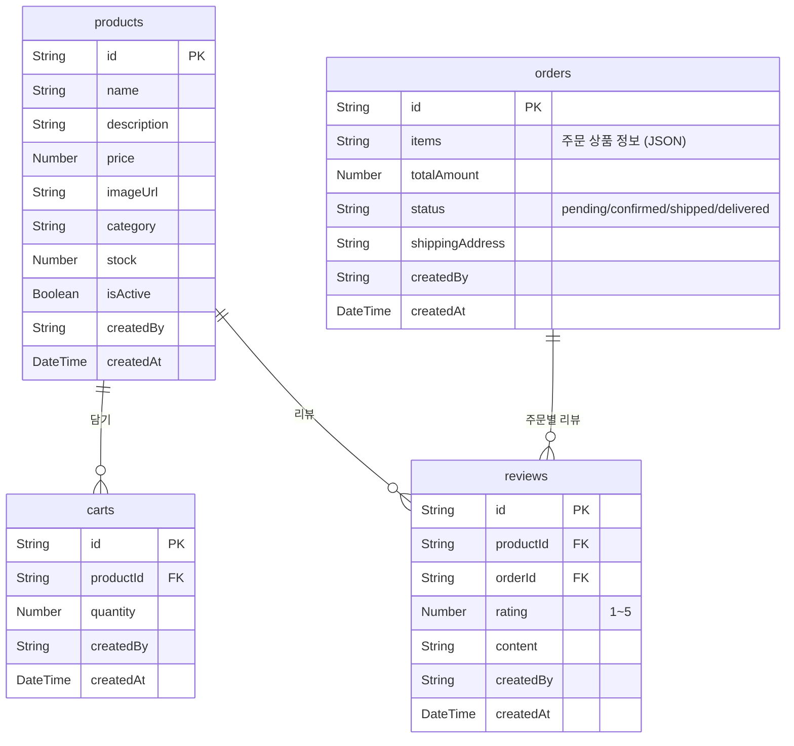

# 쇼핑몰 쿡북


💡 bkend의 인증, 데이터베이스, 스토리지 기능을 활용하여 온라인 쇼핑몰을 구축하세요. 상품 카탈로그, 장바구니, 주문 관리, 리뷰+별점 기능을 단계별로 구현합니다.


## 완성 모습

이 쿡북을 완료하면 다음 기능을 갖춘 쇼핑몰 앱을 만들 수 있습니다.

- **상품 카탈로그** — 상품 등록, 카테고리 분류, 재고 관리
- **장바구니** — 상품 담기, 수량 변경, 삭제
- **주문 관리** — 주문 생성, 상태 추적 (pending → confirmed → shipped → delivered)
- **리뷰 + 별점** — 구매 상품에 대한 리뷰 작성 및 평점

***

## 사용하는 bkend 기능

| bkend 기능 | 쇼핑몰에서의 용도 | 관련 챕터 |
|-----------|------------------|----------|
| 이메일 인증 | 회원가입/로그인 | [01-auth](full-guide/01-auth.md) |
| 동적 테이블 | products, carts, orders, reviews 데이터 저장 | [02](full-guide/02-stores.md)~[05](full-guide/05-reviews.md) |
| REST API | 앱에서 상품/주문/리뷰 CRUD | 전체 |
| MCP (AI 도구) | AI로 상품 등록, 주문 현황 분석 | [06-ai-prompts](full-guide/06-ai-prompts.md) |
| 스토리지 | 상품 이미지 업로드 | [03-products](full-guide/03-products.md) |

***

## 테이블 설계

***

## 학습 순서

| 챕터 | 제목 | 내용 | 예상 시간 |
|:----:|------|------|:---------:|
| 00 | [개요](full-guide/00-overview.md) | 프로젝트 구조, 테이블 설계, 주문 상태 흐름 | 15분 |
| 01 | [인증](full-guide/01-auth.md) | 이메일 회원가입/로그인, 토큰 관리 | 30분 |
| 02 | [상품](full-guide/03-products.md) | 상품 CRUD, 카테고리, 재고 관리 | 45분 |
| 03 | [주문](full-guide/04-orders.md) | 장바구니 → 주문 생성, 상태 관리 | 45분 |
| 04 | [리뷰](full-guide/05-reviews.md) | 리뷰 작성, 별점 평가 | 30분 |
| 05 | [AI 시나리오](full-guide/06-ai-prompts.md) | AI 활용 자동화 사례 | 30분 |
| 99 | [문제 해결](full-guide/99-troubleshooting.md) | FAQ 및 에러 대응 | - |


✅ **빠르게 시작하고 싶다면** [Quick Start](quick-start.md)에서 10분 만에 상품 등록부터 조회까지 체험하세요.


***

## 사전 준비

| 항목 | 확인 위치 | 설명 |
|------|----------|------|
| bkend 프로젝트 | 콘솔 → **프로젝트 설정** | 프로젝트가 생성되어 있어야 합니다 |
| 이메일 인증 활성화 | 콘솔 → **인증** → **이메일** | 이메일/비밀번호 로그인 활성화 |
| 테이블 생성 | 콘솔 → **테이블** 또는 MCP | products, carts, orders, reviews 테이블 |
| API Key | 콘솔 → **MCP** → **새 토큰 생성** | REST API 접근용 (앱 연동 시) |

***

## 난이도

| 항목 | 내용 |
|------|------|
| 난이도 | ⭐⭐⭐ 중급 |
| 플랫폼 | 웹 |
| 예상 학습시간 | Quick Start 10분, Full Guide 3시간 |

***

## 참고 문서

- [shopping-mall-web 예제 프로젝트](../../examples/shopping-mall-web/) — 이 쿡북을 Next.js로 구현한 전체 코드

***

## 다음 단계

- [Quick Start](quick-start.md) — 10분 만에 상품 등록하기
- [Full Guide](full-guide/00-overview.md) — 처음부터 끝까지 상세 구현
