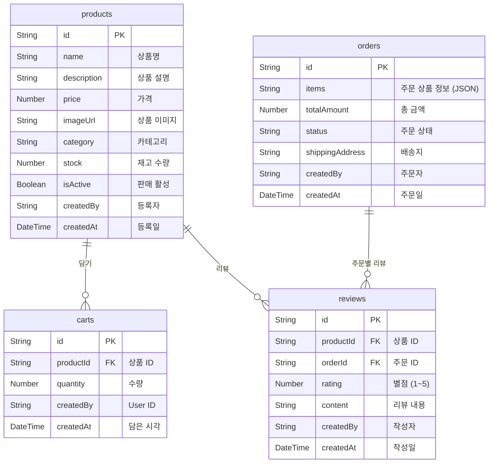
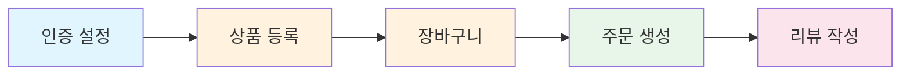
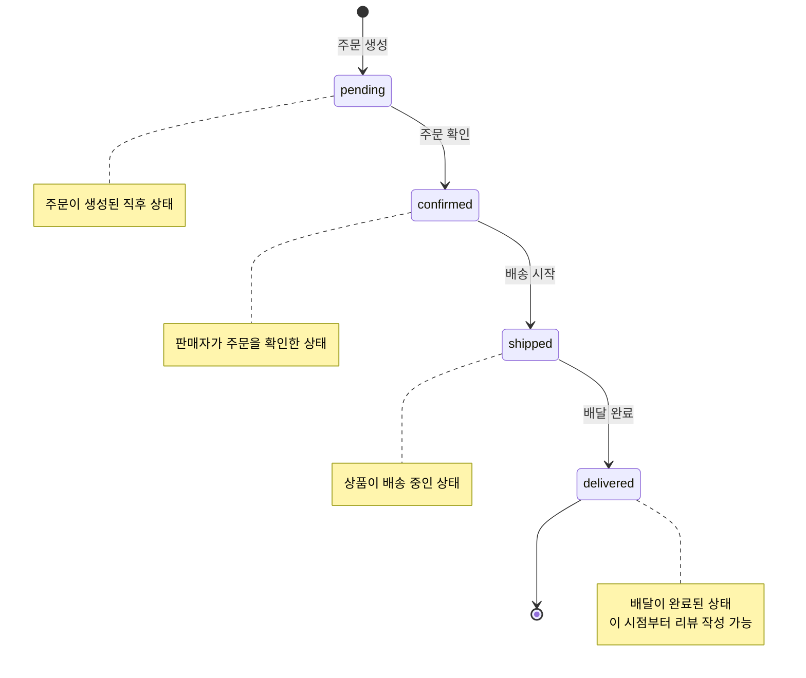

# 00. 쇼핑몰 개요


💡 쇼핑몰 프로젝트의 전체 구조, 테이블 설계, 주문 상태 흐름을 이해하세요.


## 이 장에서 배우는 것

- 완성될 쇼핑몰의 기능 구성
- 4개 동적 테이블의 설계와 관계
- 주문 상태 흐름 (pending → confirmed → shipped → delivered)
- 전체 구현 순서

***

## 완성 모습

쇼핑몰 앱은 다음 기능으로 구성됩니다.

| 기능 | 설명 |
|------|------|
| 상품 카탈로그 | 상품 등록/수정/삭제, 카테고리 분류, 재고 관리 |
| 장바구니 | 상품 담기, 수량 변경, 삭제 |
| 주문 관리 | 주문 생성, 배송지 입력, 4단계 상태 추적 |
| 리뷰 + 별점 | 배달 완료된 상품에 리뷰 작성, 1~5점 평점 |


⚠️ 이 쿡북에서는 실제 결제 처리(PG 연동)를 다루지 않습니다. 주문 상태 관리에 집중합니다.


***

## 사전 준비

이 가이드를 시작하기 전에 아래 항목을 완료하세요.




| 순서 | 항목 | 참고 문서 |
|:----:|------|----------|
| 1 | bkend 콘솔 회원가입 | [콘솔 회원가입](../../../ko/console/02-signup-login.md) |
| 2 | 프로젝트 생성 | [프로젝트 관리](../../../ko/console/04-project-management.md) |
| 3 | AI 도구 설치 | [AI 도구 개요](../../../ko/ai-tools/01-overview.md) |
| 4 | MCP OAuth 연결 | [OAuth 설정](../../../ko/ai-tools/03-oauth-setup.md) |


✅ **AI에게 이렇게 말해보세요**
"bkend에 연결된 프로젝트 목록을 보여줘"

프로젝트 목록이 표시되면 준비 완료입니다.





| 순서 | 항목 | 참고 문서 |
|:----:|------|----------|
| 1 | bkend 콘솔 회원가입 | [콘솔 회원가입](../../../ko/console/02-signup-login.md) |
| 2 | 프로젝트 생성 | [프로젝트 관리](../../../ko/console/04-project-management.md) |
| 3 | API Key 발급 | [API 키 관리](../../../ko/console/11-api-keys.md) |





⚠️ 여기서 말하는 "회원가입"은 **bkend 콘솔 계정** 생성입니다. 앱 사용자의 회원가입은 [인증](01-auth.md)에서 구현합니다.


***

## 사용 기능 요약

| bkend 기능 | 용도 | 테이블 / API |
|-----------|------|-------------|
| 이메일 인증 | 회원가입, 로그인 | `/v1/auth/email/signup`, `/v1/auth/email/signin` |
| 동적 테이블 | 상품, 장바구니, 주문, 리뷰 데이터 | `/v1/data/{tableName}` |
| 스토리지 | 상품 이미지 업로드 | `/v1/files` |
| MCP (AI 도구) | AI 기반 상품 관리, 주문 분석 | MCP tool 호출 |

***

## 테이블 설계

### 테이블별 설명

| 테이블 | 용도 | 핵심 필드 |
|--------|------|----------|
| `products` | 상품 카탈로그 | name, price, category, stock, isActive |
| `carts` | 장바구니 | productId, quantity |
| `orders` | 주문 내역 | items(JSON), totalAmount, status, shippingAddress |
| `reviews` | 상품 리뷰 | productId, orderId, rating, content |


💡 `createdBy`와 `createdAt`은 bkend가 자동으로 생성하는 시스템 필드입니다. 요청 시 직접 입력할 필요가 없습니다.


***

## 전체 구현 흐름

| 단계 | 챕터 | 설명 |
|:----:|------|------|
| 1 | [01-auth](01-auth.md) | 이메일 회원가입/로그인, 토큰 저장 |
| 2 | [03-products](03-products.md) | 상품 CRUD, 카테고리 분류, 이미지 업로드 |
| 3 | [04-orders](04-orders.md) | 장바구니 담기 → 주문 생성 → 상태 추적 |
| 4 | [05-reviews](05-reviews.md) | 배달 완료 후 리뷰 + 별점 작성 |
| 5 | [06-ai-prompts](06-ai-prompts.md) | AI로 상품 등록, 재고 분석, 리뷰 요약 |

***

## 주문 상태 흐름

쇼핑몰의 주문은 4단계 상태를 순서대로 거칩니다.

| 상태 | 의미 | 전환 조건 |
|------|------|----------|
| `pending` | 주문 대기 | 주문 생성 시 자동 설정 |
| `confirmed` | 주문 확인 | 판매자가 주문 확인 |
| `shipped` | 배송 중 | 배송 시작 시 |
| `delivered` | 배달 완료 | 배달 완료 확인 |


💡 주문 상태는 `orders` 테이블의 `status` 필드를 업데이트하여 변경합니다. `PATCH /v1/data/orders/{id}`를 사용하세요.


***

## API 엔드포인트 요약

모든 데이터 CRUD는 `/v1/data/{tableName}` 패턴을 사용합니다.

| 기능 | 메서드 | 엔드포인트 | 설명 |
|------|:------:|-----------|------|
| 상품 등록 | POST | `/v1/data/products` | 새 상품 생성 |
| 상품 목록 | GET | `/v1/data/products` | 상품 목록 조회 (필터/정렬/페이징) |
| 상품 상세 | GET | `/v1/data/products/{id}` | 단건 조회 |
| 상품 수정 | PATCH | `/v1/data/products/{id}` | 가격, 재고 등 부분 수정 |
| 상품 삭제 | DELETE | `/v1/data/products/{id}` | 상품 삭제 |
| 장바구니 담기 | POST | `/v1/data/carts` | 상품을 장바구니에 추가 |
| 장바구니 조회 | GET | `/v1/data/carts` | 내 장바구니 목록 |
| 장바구니 삭제 | DELETE | `/v1/data/carts/{id}` | 장바구니에서 제거 |
| 주문 생성 | POST | `/v1/data/orders` | 새 주문 생성 |
| 주문 목록 | GET | `/v1/data/orders` | 내 주문 내역 |
| 주문 상태 변경 | PATCH | `/v1/data/orders/{id}` | status 필드 업데이트 |
| 리뷰 작성 | POST | `/v1/data/reviews` | 상품 리뷰 생성 |
| 리뷰 목록 | GET | `/v1/data/reviews` | 상품별 리뷰 조회 |

***

## 참고 문서

- [데이터 삽입 (Insert)](../../ko/database/03-insert.md) — 동적 테이블에 데이터 생성하기
- [데이터 조회 (Select / List)](../../ko/database/04-select.md) — 필터, 정렬, 페이징
- [shopping-mall-web 예제 프로젝트](../../../examples/shopping-mall-web/) — 이 쿡북을 Next.js로 구현한 전체 코드

***

## 다음 단계

[01. 인증](01-auth.md)에서 이메일 회원가입과 로그인을 설정합니다.
