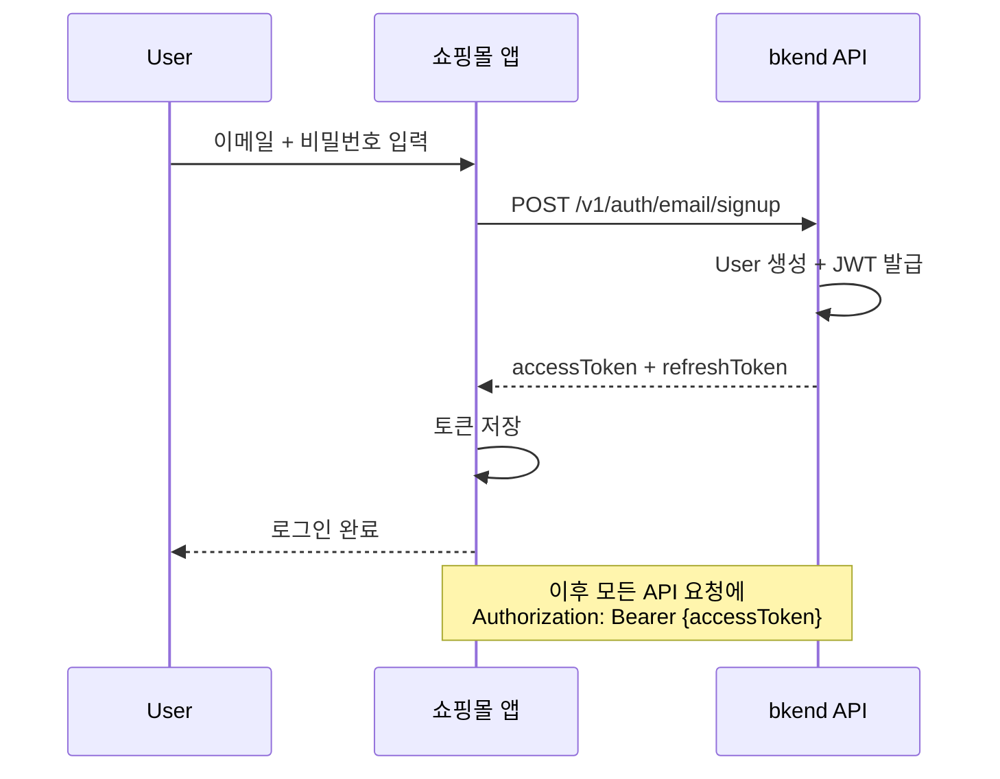

# 01. 인증


💡 이메일 회원가입/로그인을 설정하고, 발급받은 토큰으로 쇼핑몰 API를 호출할 수 있도록 준비하세요.


## 이 장에서 배우는 것

- 이메일/비밀번호 회원가입
- 이메일/비밀번호 로그인
- 토큰 저장 및 bkendFetch 헬퍼 설정
- 인증 상태 확인

***

## 인증 흐름

쇼핑몰 앱은 이메일/비밀번호 방식으로 인증합니다. 회원가입하면 즉시 Access Token과 Refresh Token이 발급됩니다.



***

## 1단계: 회원가입




✅ **AI에게 이렇게 말해보세요**
"쇼핑몰 앱의 이메일 회원가입과 로그인 코드를 만들어줘. bkendFetch 헬퍼를 사용해서 구현해줘."



💡 회원가입과 로그인은 사용자가 앱에서 직접 수행하는 기능입니다. AI에게 코드 생성을 요청하고, 생성된 코드를 앱에 추가하세요. 구현 코드는 **콘솔 + REST API** 탭에서도 확인할 수 있습니다.




```bash
curl -X POST https://api-client.bkend.ai/v1/auth/email/signup \
  -H "Content-Type: application/json" \
  -H "X-Project-Id: {project_id}" \
  -H "X-Environment: dev" \
  -d '{
    "method": "password",
    "email": "user@example.com",
    "password": "abc123",
    "name": "홍길동"
  }'
```

**응답:**

```json
{
  "accessToken": "eyJhbGciOiJIUzI1NiIs...",
  "refreshToken": "dGhpcyBpcyBhIHJlZnJl...",
  "tokenType": "Bearer",
  "expiresIn": 3600
}
```

| 파라미터 | 타입 | 필수 | 설명 |
|---------|------|:----:|------|
| `method` | String | ✅ | `"password"` 고정 |
| `email` | String | ✅ | 이메일 주소 |
| `password` | String | ✅ | 비밀번호 (최소 6자) |
| `name` | String | ✅ | 사용자 이름 |




⚠️ 비밀번호는 최소 6자 이상이어야 합니다.


***

## 2단계: 로그인




✅ **AI에게 이렇게 말해보세요**
"로그인 후 토큰을 localStorage에 저장하고, 401 에러 시 자동 갱신하는 코드를 만들어줘."



💡 AI가 토큰 관리 로직이 포함된 완성 코드를 생성합니다. 생성된 코드의 상세 구현은 **콘솔 + REST API** 탭을 참고하세요.




```bash
curl -X POST https://api-client.bkend.ai/v1/auth/email/signin \
  -H "Content-Type: application/json" \
  -H "X-Project-Id: {project_id}" \
  -H "X-Environment: dev" \
  -d '{
    "method": "password",
    "email": "user@example.com",
    "password": "abc123"
  }'
```

**응답:**

```json
{
  "accessToken": "eyJhbGciOiJIUzI1NiIs...",
  "refreshToken": "dGhpcyBpcyBhIHJlZnJl...",
  "tokenType": "Bearer",
  "expiresIn": 3600
}
```

| 파라미터 | 타입 | 필수 | 설명 |
|---------|------|:----:|------|
| `method` | String | ✅ | `"password"` 고정 |
| `email` | String | ✅ | 가입한 이메일 |
| `password` | String | ✅ | 비밀번호 |



***

## 3단계: 토큰 저장 (bkendFetch 설정)

로그인 성공 후 반환된 토큰을 저장하고, 이후 모든 API 호출에 자동으로 포함되도록 fetch 헬퍼를 설정하세요.

```javascript
// bkend.js — 프로젝트에 이 파일을 추가하세요

const API_BASE = 'https://api-client.bkend.ai';
const PROJECT_ID = '{project_id}';  // 콘솔에서 확인
const ENVIRONMENT = 'dev';

/**
 * bkend API 호출 헬퍼
 */
export async function bkendFetch(path, options = {}) {
  const accessToken = localStorage.getItem('accessToken');

  const response = await fetch(`${API_BASE}${path}`, {
    ...options,
    headers: {
      'Content-Type': 'application/json',
      'X-Project-Id': PROJECT_ID,
      'X-Environment': ENVIRONMENT,
      ...(accessToken && { 'Authorization': `Bearer ${accessToken}` }),
      ...options.headers,
    },
  });

  // 401 응답 시 토큰 갱신 시도
  if (response.status === 401) {
    const newToken = await refreshAccessToken();
    if (newToken) {
      return fetch(`${API_BASE}${path}`, {
        ...options,
        headers: {
          'Content-Type': 'application/json',
          'X-Project-Id': PROJECT_ID,
          'X-Environment': ENVIRONMENT,
          'Authorization': `Bearer ${newToken}`,
          ...options.headers,
        },
      }).then(r => r.json());
    }
  }

  return response.json();
}

/**
 * 토큰 갱신
 */
async function refreshAccessToken() {
  const refreshToken = localStorage.getItem('refreshToken');
  if (!refreshToken) return null;

  const response = await fetch(`${API_BASE}/v1/auth/refresh`, {
    method: 'POST',
    headers: {
      'Content-Type': 'application/json',
      'X-Project-Id': PROJECT_ID,
      'X-Environment': ENVIRONMENT,
    },
    body: JSON.stringify({ refreshToken }),
  });

  const result = await response.json();
  if (result.accessToken) {
    localStorage.setItem('accessToken', result.accessToken);
    localStorage.setItem('refreshToken', result.refreshToken);
    return result.accessToken;
  }

  // Refresh Token도 만료된 경우
  localStorage.clear();
  window.location.href = '/login';
  return null;
}
```

### 토큰 저장 예시

```javascript
// 회원가입 또는 로그인 성공 후
const result = await bkendFetch('/v1/auth/email/signin', {
  method: 'POST',
  body: JSON.stringify({
    method: 'password',
    email: 'user@example.com',
    password: 'abc123',
  }),
});

// 토큰 저장
localStorage.setItem('accessToken', result.accessToken);
localStorage.setItem('refreshToken', result.refreshToken);
// 쇼핑몰 메인 페이지로 이동
window.location.href = '/';
```


💡 `bkendFetch` 헬퍼에 대한 자세한 설명은 [앱에서 bkend 연동하기](../../../ko/getting-started/06-app-integration.md) 문서를 참고하세요.


***

## 4단계: 인증 상태 확인




✅ **AI에게 이렇게 말해보세요**
"현재 로그인한 사용자 정보를 표시하는 프로필 컴포넌트를 만들어줘. /v1/auth/me API를 사용해줘."




저장된 토큰으로 현재 로그인된 사용자 정보를 확인하세요.

```bash
curl -X GET https://api-client.bkend.ai/v1/auth/me \
  -H "Authorization: Bearer {accessToken}" \
  -H "X-Project-Id: {project_id}" \
  -H "X-Environment: dev"
```

**응답:**

```json
{
  "id": "user_abc123",
  "email": "user@example.com",
  "name": "홍길동",
  "emailVerified": false,
  "createdAt": "2026-02-08T10:00:00Z"
}
```



***

## 에러 처리

### 인증 에러 코드

| HTTP 상태 | 에러 코드 | 설명 | 해결 방법 |
|:---------:|----------|------|----------|
| 400 | `auth/invalid-password-format` | 비밀번호 정책 미충족 | 최소 6자 이상 |
| 400 | `auth/invalid-email` | 이메일 형식이 올바르지 않음 | 이메일 형식 확인 |
| 401 | `auth/invalid-credentials` | 이메일 또는 비밀번호 오류 | 입력 내용 재확인 |
| 401 | `auth/token-expired` | Access Token 만료 | Refresh Token으로 갱신 |
| 409 | `auth/email-already-exists` | 이미 가입된 이메일 | 로그인 또는 비밀번호 찾기 |
| 429 | `auth/rate-limit` | 요청 횟수 초과 | 잠시 후 재시도 |

### JavaScript 에러 처리 예시

```javascript
const result = await bkendFetch('/v1/auth/email/signin', {
  method: 'POST',
  body: JSON.stringify({ method: 'password', email, password }),
});

if (result.code) {
  // 에러 응답인 경우
  switch (result.code) {
    case 'auth/invalid-credentials':
      alert('이메일 또는 비밀번호가 올바르지 않습니다.');
      break;
    case 'auth/token-expired':
      // bkendFetch 헬퍼가 자동으로 갱신 시도
      break;
    default:
      alert(result.message || '로그인에 실패했습니다.');
  }
}
```

***

## 토큰 유효 시간

| 토큰 | 만료 | 용도 |
|------|:----:|------|
| Access Token | 1시간 | API 요청의 `Authorization` 헤더 |
| Refresh Token | 장기 (서버 설정) | 만료된 Access Token 갱신 |

***

## 참고 문서

- [이메일 회원가입](../../../ko/authentication/02-email-signup.md) — 회원가입 상세 가이드
- [이메일 로그인](../../../ko/authentication/03-email-signin.md) — 로그인 상세 가이드
- [토큰 저장 및 갱신](../../../ko/authentication/20-token-management.md) — 토큰 관리 패턴

***

## 다음 단계

[02. 상품](02-products.md)에서 상품 등록, 카테고리 분류, 재고 관리를 학습합니다.
