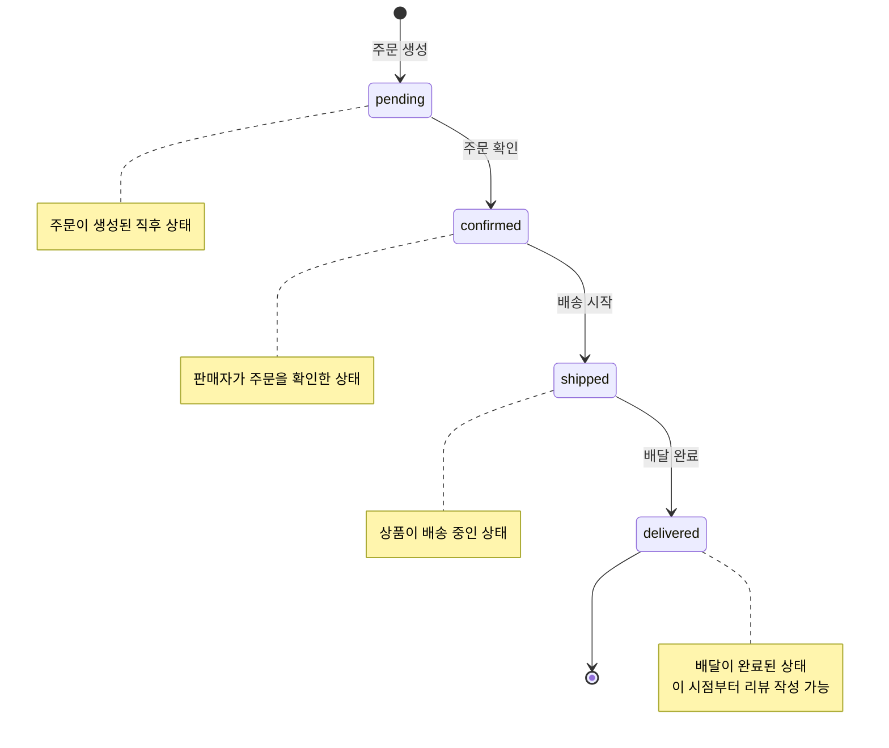
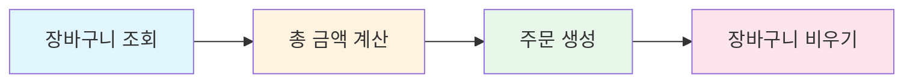

# 04. 주문 관리 구현하기


💡 주문 테이블을 생성하고, 장바구니 상품을 주문으로 변환하여 주문 상태를 관리하세요.


## 개요

이 장에서는 쇼핑몰의 주문 관리 기능을 구현합니다.

- `orders` 테이블 생성
- 주문 상태 4단계: pending → confirmed → shipped → delivered
- 주문 생성 (장바구니 → 주문 변환)
- 주문 목록/상세 조회
- 주문 상태 변경


⚠️ 이 쿡북에서는 실제 결제 처리(PG 연동)를 다루지 않습니다. 동적 테이블로 주문 상태만 관리합니다.


### 선행 조건

| 항목 | 설명 | 참조 |
|------|------|------|
| 인증 설정 | Access Token 필요 | [01-auth](01-auth.md) |
| products 테이블 | 상품이 등록되어 있어야 합니다 | [02-products](02-products.md) |
| carts 테이블 | 장바구니에 상품이 있어야 합니다 | [03-cart](03-cart.md) |

***

## 주문 상태 흐름

주문은 4단계 상태를 순서대로 거칩니다.



| 상태 | 의미 | 전환 주체 |
|------|------|----------|
| `pending` | 주문 대기 | 주문 생성 시 자동 |
| `confirmed` | 주문 확인 | 판매자 |
| `shipped` | 배송 중 | 판매자 |
| `delivered` | 배달 완료 | 판매자/시스템 |

***

## 1단계: orders 테이블 생성

주문 데이터를 저장할 `orders` 테이블을 생성하세요.

### 테이블 스키마

| 필드 | 타입 | 필수 | 설명 |
|------|------|:----:|------|
| `items` | String | ✅ | 주문 상품 정보 (JSON 문자열) |
| `totalPrice` | Number | ✅ | 총 주문 금액 |
| `status` | String | ✅ | 주문 상태 (pending/confirmed/shipped/delivered) |
| `shippingAddress` | String | ✅ | 배송지 주소 |
| `recipientName` | String | - | 수령인 이름 |
| `recipientPhone` | String | - | 수령인 연락처 |




✅ **AI에게 이렇게 말해보세요**

"주문 관리 기능을 만들고 싶어요. 주문 상품 목록, 총 금액, 주문 상태, 배송 주소, 수령인 이름, 수령인 연락처를 저장할 수 있게 해주세요. 만들기 전에 어떤 구조로 만들지 먼저 보여주세요."



💡 AI가 아래와 비슷한 구조를 제안하는지 확인하세요.


| 필드 | 설명 | 예시 값 |
|------|------|---------|
| items | 주문 상품 목록 | [{상품명, 가격, 수량}] |
| totalPrice | 총 금액 | 59800 |
| status | 주문 상태 | "pending" / "confirmed" / "shipped" / "delivered" |
| shippingAddress | 배송 주소 | "서울시 강남구..." |
| recipientName | 수령인 이름 | "김고객" |
| recipientPhone | 수령인 연락처 | "010-1234-5678" |



1. 콘솔에서 **테이블** 메뉴로 이동하세요.
2. **새 테이블 추가**를 클릭하세요.
3. 테이블 이름에 `orders`를 입력하세요.
4. 위 스키마대로 필드를 추가하세요.
5. **저장**을 클릭하면 테이블이 생성됩니다.

<!-- 📸 IMG: 콘솔에서 orders 테이블 생성 화면 -->



***

## 2단계: 주문 생성

장바구니에 담긴 상품을 주문으로 변환하세요.

### 주문 생성 흐름






✅ **AI에게 이렇게 말해보세요**

"장바구니에 담긴 상품으로 주문해주세요. 배송지는 서울시 서초구 반포대로 45, 수령인 김고객, 연락처 010-1234-5678이에요. 주문 후 장바구니는 비워주세요."


AI가 장바구니를 확인하고, 총 금액을 계산한 뒤, 주문을 생성하고 장바구니를 비웁니다.




### 2-1. 장바구니 조회

```bash
curl -X GET "https://api-client.bkend.ai/v1/data/carts" \
  -H "Authorization: Bearer {accessToken}" \
  -H "X-Project-Id: {project_id}" \
  -H "X-Environment: dev"
```

### 2-2. 주문 생성

```bash
curl -X POST https://api-client.bkend.ai/v1/data/orders \
  -H "Content-Type: application/json" \
  -H "Authorization: Bearer {accessToken}" \
  -H "X-Project-Id: {project_id}" \
  -H "X-Environment: dev" \
  -d '{
    "items": "[{\"productId\":\"product_abc123\",\"name\":\"프리미엄 면 티셔츠\",\"price\":29000,\"quantity\":2},{\"productId\":\"product_def456\",\"name\":\"슬림핏 청바지\",\"price\":49000,\"quantity\":1}]",
    "totalPrice": 107000,
    "status": "pending",
    "shippingAddress": "서울시 서초구 반포대로 45",
    "recipientName": "김고객",
    "recipientPhone": "010-1234-5678"
  }'
```

**bkendFetch 예시:**

```javascript
// 1. 장바구니 조회
const cart = await bkendFetch('/v1/data/carts');
const cartItems = cart.items;

// 2. 상품 정보 조합 및 총 금액 계산
let totalPrice = 0;
const orderItems = [];

for (const item of cartItems) {
  const product = await bkendFetch(`/v1/data/products/${item.productId}`);
  const price = product.price;
  totalPrice += price * item.quantity;
  orderItems.push({
    productId: item.productId,
    name: product.name,
    price: price,
    quantity: item.quantity,
  });
}

// 3. 주문 생성
const order = await bkendFetch('/v1/data/orders', {
  method: 'POST',
  body: JSON.stringify({
    items: JSON.stringify(orderItems),
    totalPrice: totalPrice,
    status: 'pending',
    shippingAddress: '서울시 서초구 반포대로 45',
    recipientName: '김고객',
    recipientPhone: '010-1234-5678',
  }),
});

console.log('주문 생성 완료:', order);

// 4. 장바구니 비우기
for (const item of cartItems) {
  await bkendFetch(`/v1/data/carts/${item.id}`, { method: 'DELETE' });
}
```

**응답 예시:**

```json
{
  "id": "order_xyz789",
  "items": "[{\"productId\":\"product_abc123\",\"name\":\"프리미엄 면 티셔츠\",\"price\":29000,\"quantity\":2},{\"productId\":\"product_def456\",\"name\":\"슬림핏 청바지\",\"price\":49000,\"quantity\":1}]",
  "totalPrice": 107000,
  "status": "pending",
  "shippingAddress": "서울시 서초구 반포대로 45",
  "recipientName": "김고객",
  "recipientPhone": "010-1234-5678",
  "createdBy": "user_abc123",
  "createdAt": "2025-01-15T12:00:00Z"
}
```



***

## 3단계: 주문 목록 조회

내 주문 내역을 확인하세요.




✅ **AI에게 이렇게 말해보세요**

"내 주문 내역을 최근 순서로 보여주세요."


AI가 주문 목록을 최신순으로 보여줍니다.


✅ **상태별 조회도 가능합니다:**

"배송 중인 주문만 보여주세요."




```bash
curl -X GET "https://api-client.bkend.ai/v1/data/orders?sortBy=createdAt&sortDirection=desc" \
  -H "Authorization: Bearer {accessToken}" \
  -H "X-Project-Id: {project_id}" \
  -H "X-Environment: dev"
```

### 상태별 필터

```bash
curl -X GET "https://api-client.bkend.ai/v1/data/orders?andFilters=%7B%22status%22%3A%22pending%22%7D" \
  -H "Authorization: Bearer {accessToken}" \
  -H "X-Project-Id: {project_id}" \
  -H "X-Environment: dev"
```

**bkendFetch 예시:**

```javascript
// 내 주문 목록 (최신순)
const orders = await bkendFetch('/v1/data/orders?sortBy=createdAt&sortDirection=desc');

orders.items.forEach(order => {
  const items = JSON.parse(order.items);
  console.log(`주문 ${order.id}: ${order.status}, ${order.totalPrice}원`);
  items.forEach(item => {
    console.log(`  - ${item.name} x ${item.quantity}`);
  });
});
```

**응답 예시:**

```json
{
  "items": [
    {
      "id": "order_xyz789",
      "items": "[{\"productId\":\"product_abc123\",\"name\":\"프리미엄 면 티셔츠\",\"price\":29000,\"quantity\":2}]",
      "totalPrice": 58000,
      "status": "pending",
      "shippingAddress": "서울시 서초구 반포대로 45",
      "createdAt": "2025-01-15T12:00:00Z"
    }
  ],
  "pagination": {
    "total": 1,
    "page": 1,
    "limit": 20,
    "totalPages": 1,
    "hasNext": false,
    "hasPrev": false
  }
}
```



***

## 4단계: 주문 상세 조회

특정 주문의 상세 정보를 확인하세요.




✅ **AI에게 이렇게 말해보세요**

"가장 최근 주문의 상세 정보를 보여주세요."


AI가 주문에 포함된 상품, 금액, 배송지, 현재 상태 등을 보여줍니다.



```bash
curl -X GET https://api-client.bkend.ai/v1/data/orders/{order_id} \
  -H "Authorization: Bearer {accessToken}" \
  -H "X-Project-Id: {project_id}" \
  -H "X-Environment: dev"
```

**bkendFetch 예시:**

```javascript
const order = await bkendFetch(`/v1/data/orders/${orderId}`);
const items = JSON.parse(order.items);

console.log('주문 상태:', order.status);
console.log('배송지:', order.shippingAddress);
console.log('총 금액:', order.totalPrice);
items.forEach(item => {
  console.log(`  ${item.name}: ${item.price}원 x ${item.quantity}개`);
});
```



***

## 5단계: 주문 상태 변경

주문 상태를 다음 단계로 변경하세요.




✅ **AI에게 이렇게 말해보세요**

"가장 최근 주문 상태를 '배송 중'으로 바꿔주세요."


AI가 주문 상태를 변경합니다.


✅ **단계별 변경 예시:**

- "주문 상태를 '주문 확인'으로 바꿔주세요."
- "주문 상태를 '배송 중'으로 바꿔주세요."
- "주문 상태를 '배달 완료'로 바꿔주세요."



💡 주문 상태는 아래 순서를 따릅니다.

| 말하는 표현 | 저장되는 값 |
|------------|-----------|
| 주문 대기 | pending |
| 주문 확인 | confirmed |
| 배송 중 | shipped |
| 배달 완료 | delivered |





### 주문 확인 (pending → confirmed)

```bash
curl -X PATCH https://api-client.bkend.ai/v1/data/orders/{order_id} \
  -H "Content-Type: application/json" \
  -H "Authorization: Bearer {accessToken}" \
  -H "X-Project-Id: {project_id}" \
  -H "X-Environment: dev" \
  -d '{
    "status": "confirmed"
  }'
```

### 배송 시작 (confirmed → shipped)

```bash
curl -X PATCH https://api-client.bkend.ai/v1/data/orders/{order_id} \
  -H "Content-Type: application/json" \
  -H "Authorization: Bearer {accessToken}" \
  -H "X-Project-Id: {project_id}" \
  -H "X-Environment: dev" \
  -d '{
    "status": "shipped"
  }'
```

### 배달 완료 (shipped → delivered)

```bash
curl -X PATCH https://api-client.bkend.ai/v1/data/orders/{order_id} \
  -H "Content-Type: application/json" \
  -H "Authorization: Bearer {accessToken}" \
  -H "X-Project-Id: {project_id}" \
  -H "X-Environment: dev" \
  -d '{
    "status": "delivered"
  }'
```

**bkendFetch 예시:**

```javascript
// 주문 상태 변경 함수
async function updateOrderStatus(orderId, newStatus) {
  const result = await bkendFetch(`/v1/data/orders/${orderId}`, {
    method: 'PATCH',
    body: JSON.stringify({ status: newStatus }),
  });

  console.log(`주문 ${orderId}: ${newStatus}로 변경 완료`);
  return result;
}

// 사용 예시
await updateOrderStatus('order_xyz789', 'confirmed');  // 주문 확인
await updateOrderStatus('order_xyz789', 'shipped');     // 배송 시작
await updateOrderStatus('order_xyz789', 'delivered');   // 배달 완료
```




⚠️ 주문 상태는 순서대로만 변경할 수 있습니다. `pending` 상태에서 바로 `delivered`로 변경하지 마세요. 비즈니스 로직에서 유효성을 검증하세요.


***

## 주문 상태별 화면 구성 예시

앱에서 주문 상태에 따라 다른 UI를 보여주는 패턴입니다.

```javascript
function getStatusDisplay(status) {
  const statusMap = {
    pending: { label: '주문 대기', color: '#FFA500' },
    confirmed: { label: '주문 확인', color: '#2196F3' },
    shipped: { label: '배송 중', color: '#9C27B0' },
    delivered: { label: '배달 완료', color: '#4CAF50' },
  };

  return statusMap[status] || { label: '알 수 없음', color: '#999' };
}

// 사용 예시
const { label, color } = getStatusDisplay(order.status);
console.log(`상태: ${label}`); // "상태: 배송 중"
```

***

## 에러 처리

| HTTP 상태 | 에러 코드 | 설명 | 해결 방법 |
|:---------:|----------|------|----------|
| 400 | `INVALID_INPUT` | 필수 필드 누락 | items, totalPrice, status, shippingAddress 확인 |
| 401 | `UNAUTHORIZED` | 인증 실패 | Access Token 확인 |
| 404 | `NOT_FOUND` | 주문 없음 | 주문 ID 확인 |

***

## 참고 문서

- [데이터 삽입 (Insert)](../../../ko/database/03-insert.md) — 동적 테이블에 데이터 생성하기
- [데이터 수정 (Update)](../../../ko/database/06-update.md) — 데이터 부분 수정 (PATCH)
- [데이터 조회 (Select)](../../../ko/database/04-select.md) — 단건 조회
- [에러 처리](../../../ko/guides/11-error-handling.md) — 에러 코드 및 대응 방법

***

## 다음 단계

[05. 리뷰](05-reviews.md)에서 배달 완료된 상품에 대한 리뷰와 별점 기능을 구현합니다.
