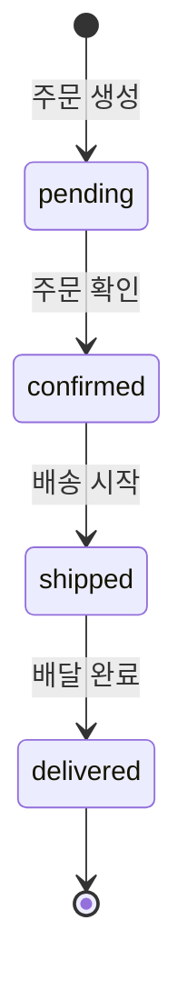

# 99. 문제 해결


💡 쇼핑몰 앱 개발 중 자주 발생하는 오류와 해결 방법을 안내합니다.


***

## 인증 관련

### 401 Unauthorized

```json
{
  "error": {
    "code": 401,
    "message": "Unauthorized: Invalid or expired token"
  }
}
```

**원인**: Access Token이 만료되었거나 유효하지 않습니다.

**해결 방법**:

1. Refresh Token으로 Access Token을 갱신하세요.
2. Refresh Token도 만료된 경우 다시 로그인하세요.
3. `Authorization` 헤더에 `Bearer` 접두사가 포함되어 있는지 확인하세요.

```javascript
// bkendFetch 헬퍼를 사용하면 401 발생 시 자동으로 토큰을 갱신합니다.
const result = await bkendFetch('/v1/data/products');
```


💡 `bkendFetch` 헬퍼의 자동 토큰 갱신 로직은 [01-auth](01-auth.md)에서 설정합니다.


### 토큰 만료 시간

| 토큰 | 만료 | 갱신 방법 |
|------|:----:|----------|
| Access Token | 1시간 | Refresh Token으로 갱신 |
| Refresh Token | 장기 (서버 설정) | 재로그인 필요 |

### 403 Forbidden

```json
{
  "error": {
    "code": 403,
    "message": "Forbidden: Insufficient permissions"
  }
}
```

**원인**: 다른 사용자의 리소스에 접근했거나 권한이 부족합니다.

**해결 방법**:

1. 본인이 생성한 리소스인지 확인하세요.
2. `X-API-Key` 헤더에 올바른 Publishable Key가 설정되어 있는지 확인하세요.

***

## 상품 관련

### 상품 등록 실패

```json
{
  "error": {
    "code": 400,
    "message": "Bad Request: Missing required fields"
  }
}
```

**원인**: 필수 필드가 누락되었습니다.

**필수 필드 확인**:

| 필드 | 타입 | 필수 |
|------|------|:----:|
| `name` | String | ✅ |
| `description` | String | ✅ |
| `price` | Number | ✅ |
| `category` | String | ✅ |
| `stock` | Number | ✅ |

```bash
# 올바른 등록 요청
curl -X POST https://api-client.bkend.ai/v1/data/products \
  -H "Content-Type: application/json" \
  -H "X-API-Key: {pk_publishable_key}" \
  -H "Authorization: Bearer {accessToken}" \
  -d '{
    "name": "프리미엄 면 티셔츠",
    "description": "부드러운 100% 면 소재 티셔츠",
    "price": 29000,
    "category": "의류",
    "stock": 100
  }'
```

### 이미지 업로드 실패

#### 파일 크기 초과

```json
{
  "error": {
    "code": 413,
    "message": "Payload Too Large: File size exceeds limit"
  }
}
```

**해결 방법**:

1. 이미지 크기를 줄여서 재업로드하세요.
2. 더 낮은 해상도를 사용하세요.

#### 지원하지 않는 형식

```json
{
  "error": {
    "code": 415,
    "message": "Unsupported Media Type"
  }
}
```

**지원 형식**: JPEG, PNG, GIF, WebP

#### Presigned URL 만료

**원인**: Presigned URL은 발급 후 **15분** 동안만 유효합니다.

**해결 방법**: 새 Presigned URL을 발급받으세요.

```bash
curl -X POST https://api-client.bkend.ai/v1/files/presigned-url \
  -H "Content-Type: application/json" \
  -H "X-API-Key: {pk_publishable_key}" \
  -H "Authorization: Bearer {accessToken}" \
  -d '{
    "filename": "product-image.jpg",
    "contentType": "image/jpeg"
  }'
```

### 재고가 음수로 표시됨

**원인**: 동시 주문으로 인해 재고 차감이 겹칠 수 있습니다.

**해결 방법**:

1. 수동으로 재고를 0으로 업데이트하세요.
2. `isActive`를 `false`로 변경하여 품절 표시를 하세요.

```bash
curl -X PATCH https://api-client.bkend.ai/v1/data/products/{product_id} \
  -H "Content-Type: application/json" \
  -H "X-API-Key: {pk_publishable_key}" \
  -H "Authorization: Bearer {accessToken}" \
  -d '{
    "stock": 0,
    "isActive": false
  }'
```


⚠️ 재고 차감 로직은 앱에서 구현해야 합니다. 주문 생성 시 상품 재고를 확인하고 차감하는 코드를 작성하세요.


### 상품 조회 안 됨 (404)

```json
{
  "error": {
    "code": 404,
    "message": "Not Found"
  }
}
```

**가능한 원인**:

1. 삭제된 상품
2. 잘못된 상품 ID
3. 다른 프로젝트/환경의 데이터

**해결 방법**: 상품 목록을 조회하여 올바른 ID를 확인하세요.

```bash
curl -X GET "https://api-client.bkend.ai/v1/data/products" \
  -H "X-API-Key: {pk_publishable_key}" \
  -H "Authorization: Bearer {accessToken}"
```

***

## 장바구니 관련

### 동일 상품 중복 추가

**증상**: 같은 상품을 장바구니에 두 번 추가하면 별도 항목으로 생성됩니다.

**원인**: bkend의 동적 테이블은 중복 체크를 자동으로 수행하지 않습니다.

**해결 방법 (앱에서 구현)**:

```javascript
// 장바구니에 추가하기 전에 중복 확인
async function addToCart(productId, quantity) {
  // 1. 기존 장바구니에서 같은 상품 확인
  const cart = await bkendFetch(
    `/v1/data/carts?andFilters=${encodeURIComponent(JSON.stringify({ productId }))}`
  );

  if (cart.items.length > 0) {
    // 2. 이미 있으면 수량만 업데이트
    const existing = cart.items[0];
    return bkendFetch(`/v1/data/carts/${existing.id}`, {
      method: 'PATCH',
      body: {
        quantity: existing.quantity + quantity,
      },
    });
  }

  // 3. 없으면 새로 추가
  return bkendFetch('/v1/data/carts', {
    method: 'POST',
    body: { productId, quantity },
  });
}
```

### 수량 0 또는 음수 문제

**증상**: 수량을 0이나 음수로 설정해도 에러가 발생하지 않습니다.

**원인**: 동적 테이블은 Number 타입의 범위를 자동으로 제한하지 않습니다.

**해결 방법 (앱에서 구현)**:

```javascript
async function updateCartQuantity(cartItemId, quantity) {
  if (quantity <= 0) {
    // 수량이 0 이하면 장바구니에서 삭제
    return bkendFetch(`/v1/data/carts/${cartItemId}`, {
      method: 'DELETE',
    });
  }

  return bkendFetch(`/v1/data/carts/${cartItemId}`, {
    method: 'PATCH',
    body: { quantity },
  });
}
```

***

## 주문 관련

### 주문 생성 실패

```json
{
  "error": {
    "code": 400,
    "message": "Bad Request: Missing required fields"
  }
}
```

**필수 필드 확인**:

| 필드 | 타입 | 설명 |
|------|------|------|
| `items` | String | 주문 상품 정보 (JSON 문자열) |
| `totalPrice` | Number | 총 금액 |
| `status` | String | 주문 상태 (기본: `pending`) |
| `shippingAddress` | String | 배송지 주소 |


⚠️ `items` 필드는 JSON 문자열로 저장해야 합니다. 객체가 아닌 `JSON.stringify()`로 변환한 문자열을 전달하세요.


```javascript
// 올바른 예
const order = await bkendFetch('/v1/data/orders', {
  method: 'POST',
  body: {
    items: JSON.stringify([
      { productId: 'product_abc123', name: '프리미엄 면 티셔츠', price: 29000, quantity: 2 }
    ]),
    totalPrice: 58000,
    status: 'pending',
    shippingAddress: '서울시 서초구 반포대로 45',
  },
});
```

### 주문 상태 전환 오류

**증상**: 주문 상태가 예상대로 변경되지 않습니다.

**올바른 상태 전환 순서**:



| 현재 상태 | 가능한 다음 상태 |
|----------|:---------------:|
| `pending` | `confirmed` |
| `confirmed` | `shipped` |
| `shipped` | `delivered` |
| `delivered` | (최종 상태) |


⚠️ bkend의 동적 테이블은 상태 전환 규칙을 자동으로 강제하지 않습니다. 앱에서 유효한 상태 전환인지 검증하는 로직을 구현하세요.


```javascript
const VALID_TRANSITIONS = {
  pending: ['confirmed'],
  confirmed: ['shipped'],
  shipped: ['delivered'],
  delivered: [],
};

async function updateOrderStatus(orderId, newStatus) {
  // 1. 현재 주문 조회
  const order = await bkendFetch(`/v1/data/orders/${orderId}`);
  const currentStatus = order.status;

  // 2. 유효성 검증
  if (!VALID_TRANSITIONS[currentStatus]?.includes(newStatus)) {
    throw new Error(
      `${currentStatus}에서 ${newStatus}로 변경할 수 없습니다.`
    );
  }

  // 3. 상태 변경
  return bkendFetch(`/v1/data/orders/${orderId}`, {
    method: 'PATCH',
    body: { status: newStatus },
  });
}
```

### 빈 주문 생성

**증상**: `items`가 빈 배열인 주문이 생성됩니다.

**원인**: 장바구니가 비어 있는 상태에서 주문을 생성한 경우입니다.

**해결 방법 (앱에서 구현)**:

```javascript
async function createOrderFromCart(shippingInfo) {
  const cart = await bkendFetch('/v1/data/carts');

  if (cart.items.length === 0) {
    throw new Error('장바구니가 비어 있습니다.');
  }

  // 주문 생성 진행...
}
```

***

## 리뷰 관련

### 중복 리뷰

**증상**: 같은 상품, 같은 주문에 대해 리뷰가 여러 개 생성됩니다.

**원인**: 동적 테이블은 복합 유니크 제약을 자동으로 적용하지 않습니다.

**해결 방법 (앱에서 구현)**:

```javascript
async function writeReview(productId, orderId, rating, content) {
  // 기존 리뷰 확인
  const existing = await bkendFetch(
    `/v1/data/reviews?andFilters=${encodeURIComponent(JSON.stringify({ productId, orderId }))}`
  );

  if (existing.items.length > 0) {
    throw new Error('이미 리뷰를 작성한 상품입니다. 수정하시겠습니까?');
  }

  return bkendFetch('/v1/data/reviews', {
    method: 'POST',
    body: { productId, orderId, rating, content },
  });
}
```

### 별점 범위 오류

**증상**: 별점이 1~5 범위를 벗어난 값으로 저장됩니다.

**원인**: 동적 테이블은 Number 타입의 범위를 자동으로 제한하지 않습니다.

**해결 방법 (앱에서 구현)**:

```javascript
function validateRating(rating) {
  const num = Number(rating);
  if (!Number.isInteger(num) || num < 1 || num > 5) {
    throw new Error('별점은 1~5 사이의 정수여야 합니다.');
  }
  return num;
}
```

### 배달 전 리뷰 작성 방지

**증상**: 배달 완료되지 않은 주문에 대해 리뷰가 작성됩니다.

**해결 방법 (앱에서 구현)**:

```javascript
async function writeReviewWithValidation(orderId, productId, rating, content) {
  // 주문 상태 확인
  const order = await bkendFetch(`/v1/data/orders/${orderId}`);

  if (order.status !== 'delivered') {
    throw new Error('배달 완료된 주문에 대해서만 리뷰를 작성할 수 있습니다.');
  }

  return bkendFetch('/v1/data/reviews', {
    method: 'POST',
    body: { productId, orderId, rating, content },
  });
}
```

***

## MCP 도구 관련

### AI가 테이블을 찾지 못함

**증상**: AI에게 "상품 등록해줘"라고 요청했으나 테이블을 찾지 못합니다.

**가능한 원인**:

1. 테이블이 아직 생성되지 않았습니다.
2. 테이블 이름이 다릅니다 (예: `product` vs `products`).
3. MCP 연결이 올바른 프로젝트/환경에 연결되어 있지 않습니다.

**해결 방법**:


✅ **AI에게 이렇게 말해보세요**

"현재 프로젝트에 어떤 테이블이 있는지 보여줘."


테이블이 없으면 [02-products](02-products.md)의 1단계부터 테이블을 생성하세요.

### MCP 서버 연결 실패

**증상**: AI 클라이언트에서 MCP 도구 호출이 실패합니다.

**확인 사항**:

1. MCP 서버 URL이 올바른지 확인하세요.
2. API 키가 유효한지 확인하세요.
3. 네트워크 연결 상태를 확인하세요.
4. AI 클라이언트의 MCP 설정을 확인하세요.

```json
{
  "mcpServers": {
    "bkend": {
      "url": "https://mcp.bkend.ai/mcp",
      "headers": {
        "Authorization": "Bearer {api_key}"
      }
    }
  }
}
```


💡 MCP 서버 URL과 API 키는 콘솔 → **MCP** 메뉴에서 확인할 수 있습니다.


### AI 응답이 예상과 다름

**증상**: AI가 올바르지 않은 도구를 호출하거나 잘못된 파라미터를 전달합니다.

**해결 방법**:

1. 요청을 더 구체적으로 작성하세요.
2. 상품명이나 ID를 정확하게 지정하세요.
3. 복잡한 작업은 단계별로 나눠서 요청하세요.

```text
❌ "상품 정리해줘"
✅ "재고 0인 상품을 찾아서 목록으로 보여줘"
```

***

## 쿼리 관련

### 필터 구문 오류

```json
{
  "error": {
    "code": 400,
    "message": "Bad Request: Invalid filter syntax"
  }
}
```

**올바른 필터 구문**:

```bash
# 카테고리 필터
?andFilters={"category":"의류"}

# 가격 범위 필터
?andFilters={"price":{"$gte":10000,"$lte":50000}}

# 불리언 필터
?andFilters={"isActive":true}
```


💡 URL에서 사용할 때는 `andFilters` 값을 `encodeURIComponent()`로 인코딩하세요.


### 정렬 필드 오류

```json
{
  "error": {
    "code": 400,
    "message": "Bad Request: Invalid sort field"
  }
}
```

**올바른 정렬 구문**:

```bash
# 가격 오름차순
?sortBy=price&sortDirection=asc

# 최신순 (내림차순)
?sortBy=createdAt&sortDirection=desc
```

***

## FAQ

### Q: 주문을 삭제할 수 있나요?

A: 동적 테이블에서 DELETE API로 삭제할 수 있지만, 비즈니스 관점에서 주문 기록은 삭제하지 않는 것을 권장합니다. 대신 주문 상태를 관리하세요.

### Q: 재고가 마이너스가 됐어요

A: 동시 주문으로 발생할 수 있습니다. 수동으로 재고를 0으로 설정하고, `isActive`를 `false`로 변경하세요. 앱에서 주문 전 재고 검증 로직을 구현하는 것이 좋습니다.

### Q: `items` 필드를 JSON으로 저장하는 이유는?

A: bkend의 동적 테이블은 중첩 객체(nested object)를 직접 지원하지 않으므로, 주문 상품 목록을 JSON 문자열로 직렬화하여 저장합니다. 조회 시 `JSON.parse()`로 파싱하세요.

### Q: 리뷰 평점이 자동 계산되나요?

A: bkend에는 집계(aggregation) 기능이 없으므로, 리뷰 목록을 조회한 후 앱에서 평균을 계산해야 합니다. [05-reviews](05-reviews.md)의 4단계를 참고하세요.

### Q: Presigned URL로 업로드한 이미지가 안 보여요

A: Presigned URL은 일정 시간 후 만료됩니다. 파일 메타데이터를 조회하여 다운로드 URL을 받고, 상품의 `imageUrl`에 저장하면 이미지에 접근할 수 있습니다. 다운로드 URL이 만료된 경우 파일 메타데이터를 다시 조회하세요.

***

## 디버깅 체크리스트

문제가 해결되지 않을 때, 다음 순서로 확인하세요.

### 1. 요청 헤더 확인

```text
✅ X-API-Key: {pk_publishable_key}
✅ Authorization: Bearer {accessToken}
✅ Content-Type: application/json (POST/PATCH 요청)
```

### 2. 테이블 상태 확인

```text
✅ products 테이블 존재 여부
✅ carts 테이블 존재 여부
✅ orders 테이블 존재 여부
✅ reviews 테이블 존재 여부
```

### 3. 데이터 정합성 확인

```text
✅ 장바구니의 productId가 실제 존재하는 상품인지
✅ 주문의 items에 포함된 상품이 유효한지
✅ 리뷰의 productId와 orderId가 유효한지
✅ 주문 상태가 올바른 값인지 (pending/confirmed/shipped/delivered)
```

### 4. 환경 확인

```text
✅ 올바른 프로젝트에 연결되어 있는지
✅ X-API-Key가 올바른 환경(dev/staging/prod)의 키인지
✅ MCP 연결이 활성 상태인지
```

***

## 참고 문서

- [에러 처리](../../../ko/guides/11-error-handling.md) — 에러 코드 및 대응 방법
- [토큰 저장 및 갱신](../../../ko/authentication/20-token-management.md) — 토큰 관리 패턴
- [파일 업로드](../../../ko/storage/02-upload-single.md) — Presigned URL 업로드 가이드

***

## 다음 단계

- [쇼핑몰 쿡북 README](../README.md)로 돌아가서 전체 구조를 다시 확인하세요.
- 다른 쿡북도 둘러보세요: [블로그 쿡북](../../blog/README.md), [레시피 앱 쿡북](../../recipe-app/README.md), [소셜 네트워크 쿡북](../../social-network/README.md)
