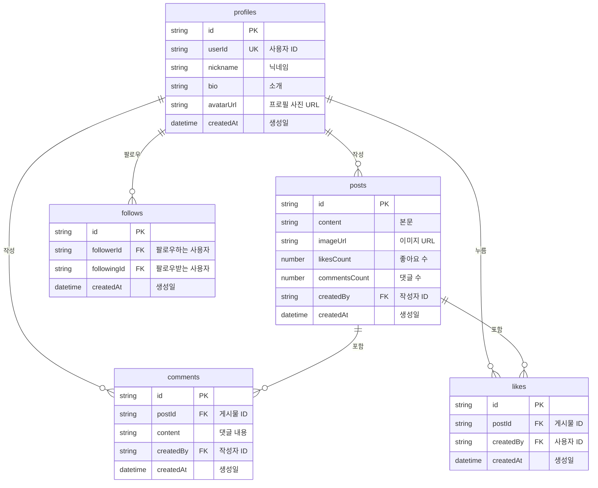

# 소셜 네트워크 쿡북


💡 bkend로 프로필, 게시물, 팔로우, 피드를 갖춘 소셜 네트워크를 구축하세요.


## 개요

이 쿡북에서는 **동적 테이블**과 **REST API**를 활용하여 소셜 네트워크 앱을 구축합니다. 프로필 관리, 게시물 작성, 댓글과 좋아요, 팔로우 관계, 피드 구성까지 핵심 기능을 단계별로 구현합니다.

| 항목 | 내용 |
|------|------|
| 난이도 | ⭐⭐ 초급 |
| 플랫폼 | 웹 + 앱 |
| 주요 기능 | 동적 테이블 CRUD, 인증, 파일 업로드 |
| 예상 학습시간 | Quick Start 10분, Full Guide 3시간 |

***

## 완성 모습

- **프로필**: 닉네임, 소개, 프로필 사진 관리
- **게시물**: 텍스트/이미지 게시물 작성, 조회, 삭제
- **댓글 & 좋아요**: 게시물에 댓글 달기, 좋아요 누르기
- **팔로우**: 다른 사용자 팔로우/언팔로우
- **피드**: 팔로우한 사용자의 게시물 타임라인

***

## 사용하는 bkend 기능

| 기능 | 설명 | 관련 문서 |
|------|------|----------|
| 인증 | Google OAuth + 이메일 로그인 | [인증 개요](../../ko/authentication/01-overview.md) |
| 동적 테이블 | profiles, posts, comments, likes, follows 테이블 | [데이터베이스 개요](../../ko/database/01-overview.md) |
| 파일 업로드 | 프로필 사진, 게시물 이미지 | [파일 업로드](../../ko/storage/02-upload-single.md) |
| 데이터 CRUD | REST API로 데이터 생성/조회/수정/삭제 | [데이터 생성](../../ko/database/03-insert.md) |

***

## 테이블 설계

***

## 학습 순서

| 순서 | 문서 | 내용 | 예상 시간 |
|:----:|------|------|:---------:|
| - | [Quick Start](quick-start.md) | 10분 만에 프로필 생성 + 게시물 작성 | 10분 |
| 0 | [개요](full-guide/00-overview.md) | 프로젝트 구조 및 API 설계 | 15분 |
| 1 | [인증](full-guide/01-auth.md) | Google OAuth + 이메일 로그인 | 30분 |
| 2 | [프로필](full-guide/02-profiles.md) | 프로필 CRUD | 20분 |
| 3 | [게시물](full-guide/03-posts.md) | 게시물 + 댓글 + 좋아요 | 40분 |
| 4 | [팔로우](full-guide/04-follows.md) | 팔로우 관계 관리 | 20분 |
| 5 | [피드](full-guide/05-feeds.md) | 피드 구성 및 페이지네이션 | 25분 |
| 6 | [AI 시나리오](full-guide/06-ai-prompts.md) | AI 활용 사례 | 15분 |
| 99 | [문제 해결](full-guide/99-troubleshooting.md) | FAQ 및 에러 대응 | - |

***

## 사전 준비

시작하기 전에 다음을 준비하세요.

1. **bkend 프로젝트 생성** — [빠른 시작](../../ko/getting-started/02-quickstart.md)을 참고하세요.
2. **API 키 발급** — [API 키 관리](../../ko/security/02-api-keys.md)를 참고하세요.
3. **테이블 생성** — 콘솔 또는 MCP로 `profiles`, `posts`, `comments`, `likes`, `follows` 테이블을 생성하세요.


✅ **AI에게 이렇게 말해보세요**

"소셜 네트워크에 필요한 profiles, posts, comments, likes, follows 테이블을 만들어줘"


***

## 다음 단계

- 빠르게 체험하려면 [Quick Start](quick-start.md)부터 시작하세요.
- 상세하게 학습하려면 [Full Guide](full-guide/00-overview.md)를 따라가세요.
