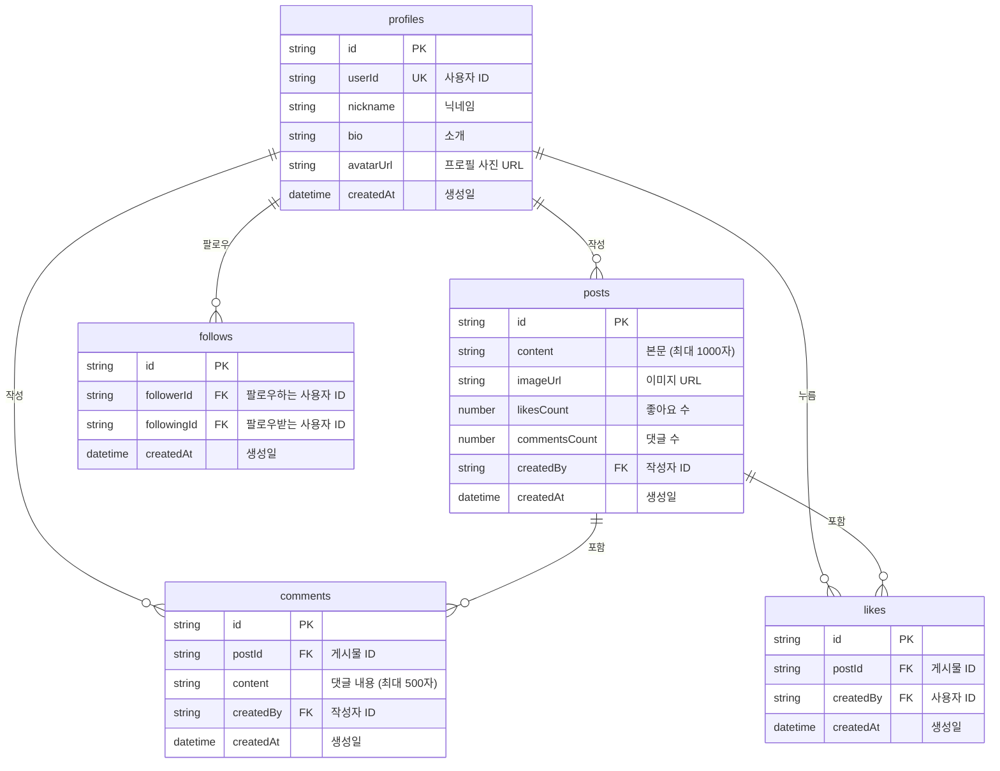
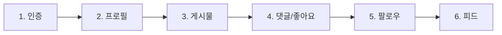

# 00. 소셜 네트워크 개요


💡 소셜 네트워크 앱의 전체 구조와 테이블 설계를 이해하세요.


## 이 장에서 배우는 것

- 소셜 네트워크 앱의 완성 모습
- 동적 테이블 설계 및 관계
- API 엔드포인트 구조
- 전체 구현 흐름

***

## 완성 모습

이 쿡북을 완료하면 다음 기능을 갖춘 소셜 네트워크를 구현할 수 있습니다.

| 기능 | 설명 |
|------|------|
| **회원가입/로그인** | Google OAuth + 이메일 인증 |
| **프로필 관리** | 닉네임, 소개, 프로필 사진 |
| **게시물 작성** | 텍스트/이미지 게시물 CRUD |
| **댓글** | 게시물에 댓글 달기 |
| **좋아요** | 게시물에 좋아요 누르기 |
| **팔로우** | 사용자 간 팔로우/언팔로우 |
| **피드** | 팔로우한 사용자의 게시물 타임라인 |

***

## 사용 기능 요약

| bkend 기능 | 용도 | 사용 테이블/API |
|-----------|------|----------------|
| 인증 | 회원가입, 로그인, 토큰 관리 | `/v1/auth/*` |
| 동적 테이블 | 비즈니스 데이터 저장 | `/v1/data/{tableName}` |
| 파일 업로드 | 프로필 사진, 게시물 이미지 | `/v1/files` |

***

## 테이블 설계

### 시스템 필드

모든 동적 테이블은 다음 필드를 자동으로 포함합니다.

| 필드 | 타입 | 설명 |
|------|------|------|
| `id` | String | 고유 식별자 (자동 생성) |
| `createdBy` | String | 생성자 사용자 ID (자동 설정) |
| `createdAt` | DateTime | 생성 시각 (자동 설정) |
| `updatedAt` | DateTime | 수정 시각 (자동 설정) |


⚠️ 시스템 필드는 서버에서 자동으로 설정됩니다. 요청에 포함하지 마세요.


***

## 전체 구현 흐름

| 단계 | 설명 | 주요 API |
|:----:|------|---------|
| 1 | Google OAuth 또는 이메일로 로그인 | `/v1/auth/*` |
| 2 | 로그인 후 프로필 생성/조회 | `/v1/data/profiles` |
| 3 | 텍스트/이미지 게시물 작성 | `/v1/data/posts` |
| 4 | 게시물에 댓글 달기, 좋아요 누르기 | `/v1/data/comments`, `/v1/data/likes` |
| 5 | 다른 사용자 팔로우/언팔로우 | `/v1/data/follows` |
| 6 | 팔로우한 사용자의 게시물 피드 | `/v1/data/posts` (필터 조합) |

***

## API 엔드포인트 요약

### 인증

| Method | 엔드포인트 | 설명 |
|--------|-----------|------|
| GET | `/v1/auth/google/authorize` | Google 로그인 URL 생성 |
| POST | `/v1/auth/email/signup` | 이메일 회원가입 |
| POST | `/v1/auth/email/signin` | 이메일 로그인 |
| POST | `/v1/auth/refresh` | 토큰 갱신 |

### 데이터 CRUD

모든 동적 테이블은 동일한 엔드포인트 구조를 사용합니다.

| Method | 엔드포인트 | 설명 |
|--------|-----------|------|
| POST | `/v1/data/{tableName}` | 데이터 생성 |
| GET | `/v1/data/{tableName}/{id}` | 단건 조회 |
| GET | `/v1/data/{tableName}` | 목록 조회 (필터/정렬/페이징) |
| PATCH | `/v1/data/{tableName}/{id}` | 데이터 수정 |
| DELETE | `/v1/data/{tableName}/{id}` | 데이터 삭제 |


💡 `{tableName}` 자리에 `profiles`, `posts`, `comments`, `likes`, `follows`를 넣어 사용하세요. 모든 테이블이 동일한 CRUD API를 공유합니다.


### 파일

| Method | 엔드포인트 | 설명 |
|--------|-----------|------|
| POST | `/v1/files` | 파일 업로드 |
| GET | `/v1/files/{id}` | 파일 메타데이터 조회 |
| GET | `/v1/files/{id}/download` | 파일 다운로드 |
| DELETE | `/v1/files/{id}` | 파일 삭제 |

***

## 접근 권한

| 테이블 | 생성 | 조회 | 수정 | 삭제 |
|--------|------|------|------|------|
| profiles | 로그인 사용자 | 모든 사용자 | 본인만 | 본인만 |
| posts | 로그인 사용자 | 모든 사용자 | 작성자만 | 작성자만 |
| comments | 로그인 사용자 | 모든 사용자 | 작성자만 | 작성자만 |
| likes | 로그인 사용자 | - | - | 본인만 |
| follows | 로그인 사용자 | 모든 사용자 | - | 본인만 |

***

## 학습 순서

| 챕터 | 제목 | 내용 |
|:----:|------|------|
| 01 | [인증](01-auth.md) | Google OAuth + 이메일 로그인 |
| 02 | [프로필](02-profiles.md) | 프로필 CRUD |
| 03 | [게시물](03-posts.md) | 게시물 + 댓글 + 좋아요 |
| 04 | [팔로우](04-follows.md) | 팔로우 관계 관리 |
| 05 | [피드](05-feeds.md) | 피드 구성 및 페이지네이션 |
| 06 | [AI 시나리오](06-ai-prompts.md) | AI 활용 사례 |
| 99 | [문제 해결](99-troubleshooting.md) | FAQ 및 에러 대응 |

***

## 참고 문서

- [데이터베이스 개요](../../../ko/database/01-overview.md) — 동적 테이블 개념
- [핵심 개념](../../../ko/getting-started/03-core-concepts.md) — bkend 아키텍처
- [social-network-app 예제 프로젝트](../../../examples/social-network-app/) — 이 쿡북을 Flutter로 구현한 전체 코드

***

## 다음 단계

[01. 인증](01-auth.md)에서 Google OAuth와 이메일 로그인을 구현하세요.
