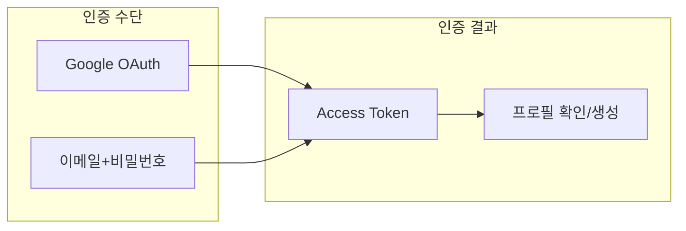
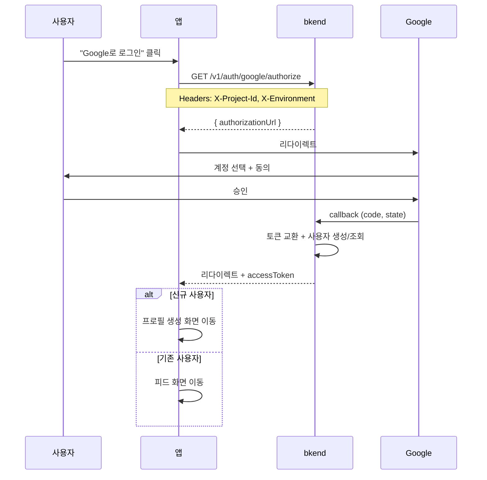
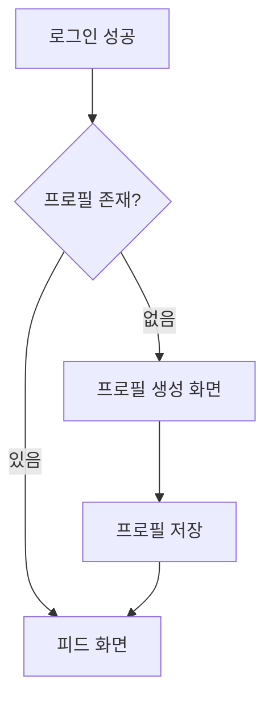

# 01. 인증


💡 Google OAuth와 이메일 회원가입으로 소셜 네트워크 로그인을 구현하세요.


## 이 장에서 배우는 것

- Google OAuth 로그인 흐름
- 이메일 회원가입 대안
- 토큰 저장 및 관리
- 로그인 후 프로필 연동

***

## 인증 흐름 개요

소셜 네트워크 앱은 **Google OAuth**를 기본 로그인으로, **이메일 회원가입**을 대안으로 제공합니다.



***

## 1단계: Google OAuth 설정

### 콘솔에서 인증 제공자 설정

1. bkend 콘솔에서 **인증** > **제공자 설정** 메뉴로 이동하세요.
2. **Google** 제공자를 활성화하세요.
3. Google Cloud Console에서 발급받은 `Client ID`와 `Client Secret`을 입력하세요.
4. **콜백 URL**을 확인하고, Google Cloud Console의 **승인된 리다이렉션 URI**에 등록하세요.


⚠️ `Client Secret`은 절대 프론트엔드 코드에 노출하지 마세요. bkend 콘솔에만 등록합니다.


### Google Cloud Console 설정

1. [Google Cloud Console](https://console.cloud.google.com/)에 접속하세요.
2. **API 및 서비스** > **사용자 인증 정보** > **OAuth 클라이언트 ID** 생성
3. 애플리케이션 유형: **웹 애플리케이션**
4. **승인된 리다이렉션 URI**에 bkend 콜백 URL 추가

***

## 2단계: Google 로그인 구현

### Google OAuth 흐름







✅ **AI에게 이렇게 말해보세요**
"소셜 네트워크 앱의 Google OAuth 로그인과 콜백 처리 코드를 만들어줘. bkendFetch 헬퍼를 사용해줘."



💡 인증은 사용자가 직접 앱에서 수행하는 작업입니다. AI에게 코드 생성을 요청하고, 생성된 코드를 앱에 추가하세요. 구현 코드는 **콘솔 + REST API** 탭에서도 확인할 수 있습니다.





### 인증 URL 생성

```bash
curl -X GET "https://api-client.bkend.ai/v1/auth/google/authorize?redirect=https://myapp.com/auth/callback" \
  -H "X-Project-Id: {project_id}" \
  -H "X-Environment: dev"
```

**응답:**

```json
{
  "authorizationUrl": "https://accounts.google.com/o/oauth2/v2/auth?client_id=...&redirect_uri=...&scope=openid%20email%20profile&response_type=code&state=..."
}
```

### 프론트엔드 구현

```javascript
const handleGoogleLogin = async () => {
  const callbackUrl = window.location.origin + '/auth/callback';

  const response = await fetch(
    `https://api-client.bkend.ai/v1/auth/google/authorize?redirect=${encodeURIComponent(callbackUrl)}`,
    {
      headers: {
        'X-Project-Id': '{project_id}',
        'X-Environment': 'dev',
      },
    }
  );

  const result = await response.json();

  if (result.authorizationUrl) {
    // Google 로그인 페이지로 이동
    window.location.href = result.authorizationUrl;
  }
};
```

### 콜백 처리

Google 인증 완료 후 콜백 URL로 리다이렉트됩니다. URL 파라미터에서 토큰을 추출하세요.

```javascript
// /auth/callback 페이지
const urlParams = new URLSearchParams(window.location.search);
const accessToken = urlParams.get('accessToken');
const refreshToken = urlParams.get('refreshToken');
const isNewUser = urlParams.get('isNewUser');
const error = urlParams.get('error');

if (error) {
  alert(urlParams.get('errorMessage') || '로그인에 실패했습니다.');
  window.location.href = '/login';
} else if (accessToken) {
  // 토큰 저장
  localStorage.setItem('accessToken', accessToken);
  localStorage.setItem('refreshToken', refreshToken);

  // 신규 사용자면 프로필 생성 화면으로
  if (isNewUser === 'true') {
    window.location.href = '/onboarding';
  } else {
    window.location.href = '/feed';
  }
}
```




### 콜백 파라미터

| 성공 시 | 실패 시 |
|---------|---------|
| `accessToken` | `error` |
| `refreshToken` | `errorMessage` |
| `expiresIn` | |
| `isNewUser` | |

***

## 3단계: 이메일 회원가입 대안

Google 계정이 없는 사용자를 위해 이메일 회원가입을 제공하세요.





✅ **AI에게 이렇게 말해보세요**
"이메일 회원가입과 로그인 코드를 만들어줘. bkendFetch 헬퍼를 사용해서 구현해줘."



💡 회원가입과 로그인은 사용자가 앱에서 직접 수행하는 기능입니다. AI에게 코드 생성을 요청하고, 생성된 코드를 앱에 추가하세요. 구현 코드는 **콘솔 + REST API** 탭에서도 확인할 수 있습니다.





### 회원가입

```bash
curl -X POST https://api-client.bkend.ai/v1/auth/email/signup \
  -H "Content-Type: application/json" \
  -H "X-Project-Id: {project_id}" \
  -H "X-Environment: dev" \
  -d '{
    "method": "password",
    "email": "user@example.com",
    "password": "abc123",
    "name": "홍길동"
  }'
```

**응답:**

```json
{
  "accessToken": "eyJhbGciOiJIUzI1NiIs...",
  "refreshToken": "eyJhbGciOiJIUzI1NiIs...",
  "tokenType": "Bearer",
  "expiresIn": 3600
}
```

### 로그인

```bash
curl -X POST https://api-client.bkend.ai/v1/auth/email/signin \
  -H "Content-Type: application/json" \
  -H "X-Project-Id: {project_id}" \
  -H "X-Environment: dev" \
  -d '{
    "method": "password",
    "email": "user@example.com",
    "password": "abc123"
  }'
```

**응답:**

```json
{
  "accessToken": "eyJhbGciOiJIUzI1NiIs...",
  "refreshToken": "eyJhbGciOiJIUzI1NiIs...",
  "tokenType": "Bearer",
  "expiresIn": 3600
}
```




***

## 4단계: 토큰 저장 및 관리

### 토큰 유효 시간

| 토큰 | 유효 시간 | 용도 |
|------|:---------:|------|
| Access Token | 24시간 | API 요청 인증 |
| Refresh Token | 30일 | Access Token 갱신 |

### 토큰 갱신

Access Token이 만료되면 Refresh Token으로 새 토큰을 발급받으세요.





✅ **AI에게 이렇게 말해보세요**
"로그인 후 토큰을 localStorage에 저장하고, 401 에러 시 자동 갱신하는 코드를 만들어줘."



💡 AI가 토큰 관리 로직이 포함된 완성 코드를 생성합니다. 생성된 코드의 상세 구현은 **콘솔 + REST API** 탭을 참고하세요.





```bash
curl -X POST https://api-client.bkend.ai/v1/auth/refresh \
  -H "Content-Type: application/json" \
  -H "X-Project-Id: {project_id}" \
  -H "X-Environment: dev" \
  -d '{
    "refreshToken": "{refreshToken}"
  }'
```

**응답:**

```json
{
  "accessToken": "eyJhbGciOiJIUzI1NiIs...",
  "refreshToken": "eyJhbGciOiJIUzI1NiIs...",
  "expiresIn": 86400
}
```

### 자동 갱신 구현 예시

```javascript
const fetchWithAuth = async (url, options = {}) => {
  let accessToken = localStorage.getItem('accessToken');

  let response = await fetch(url, {
    ...options,
    headers: {
      ...options.headers,
      'Authorization': `Bearer ${accessToken}`,
      'X-Project-Id': '{project_id}',
      'X-Environment': 'dev',
    },
  });

  // 401 응답 시 토큰 갱신 후 재시도
  if (response.status === 401) {
    const refreshToken = localStorage.getItem('refreshToken');

    const refreshResponse = await fetch(
      'https://api-client.bkend.ai/v1/auth/refresh',
      {
        method: 'POST',
        headers: {
          'Content-Type': 'application/json',
          'X-Project-Id': '{project_id}',
          'X-Environment': 'dev',
        },
        body: JSON.stringify({ refreshToken }),
      }
    );

    if (refreshResponse.ok) {
      const data = await refreshResponse.json();
      localStorage.setItem('accessToken', data.accessToken);
      localStorage.setItem('refreshToken', data.refreshToken);

      // 새 토큰으로 재시도
      response = await fetch(url, {
        ...options,
        headers: {
          ...options.headers,
          'Authorization': `Bearer ${data.accessToken}`,
          'X-Project-Id': '{project_id}',
          'X-Environment': 'dev',
        },
      });
    } else {
      // Refresh Token도 만료 → 재로그인
      localStorage.clear();
      window.location.href = '/login';
    }
  }

  return response;
};
```




***

## 로그인 후 프로필 확인

로그인 성공 후, 프로필이 있는지 확인하고 없으면 생성 화면으로 안내하세요.







✅ **AI에게 이렇게 말해보세요**
"내 userId로 profiles 테이블에서 내 프로필 찾아줘"





```javascript
// 로그인 직후 프로필 확인
const checkProfile = async (userId) => {
  const filters = encodeURIComponent(JSON.stringify({ userId }));
  const response = await fetch(
    `https://api-client.bkend.ai/v1/data/profiles?andFilters=${filters}`,
    {
      headers: {
        'Authorization': `Bearer ${accessToken}`,
        'X-Project-Id': '{project_id}',
        'X-Environment': 'dev',
      },
    }
  );

  const result = await response.json();

  if (result.items && result.items.length > 0) {
    // 프로필 있음 → 피드로 이동
    return result.items[0];
  } else {
    // 프로필 없음 → 생성 화면으로
    return null;
  }
};
```




***

## 에러 처리

### 인증 에러 코드

| 에러 코드 | HTTP | 설명 | 해결 방법 |
|----------|:----:|------|----------|
| `auth/invalid-credentials` | 401 | 이메일 또는 비밀번호 오류 | 입력값 확인 |
| `auth/account-exists-different-provider` | 409 | 다른 방식으로 가입된 이메일 | 기존 방식으로 로그인 |
| `auth/oauth-not-configured` | 400 | Google OAuth 미설정 | 콘솔에서 설정 확인 |
| `auth/invalid-oauth-code` | 401 | authorization code 유효하지 않음 | 다시 로그인 시도 |
| `auth/token-expired` | 401 | 토큰 만료 | 토큰 갱신 또는 재로그인 |
| `auth/rate-limit` | 429 | 요청 횟수 초과 | 잠시 후 재시도 |

### Rate Limiting

| 항목 | 제한 |
|------|------|
| 로그인 실패 | 15분 내 5회 |
| 회원가입 | 1시간 내 3회 |

***

## 참고 문서

- [소셜 로그인 개요](../../../ko/authentication/05-social-overview.md) — 소셜 로그인 개념
- [Google OAuth](../../../ko/authentication/06-social-google.md) — Google OAuth 상세 설정
- [토큰 관리](../../../ko/authentication/20-token-management.md) — 토큰 갱신 패턴 상세

***

## 다음 단계

[02. 프로필](02-profiles.md)에서 프로필 CRUD를 구현하세요.
