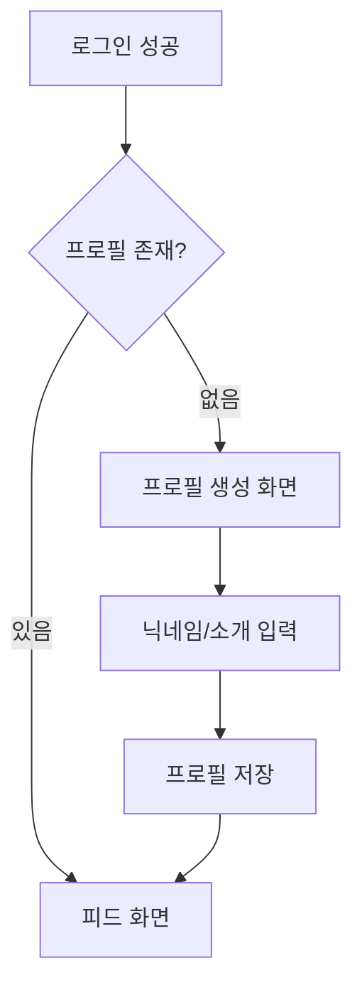
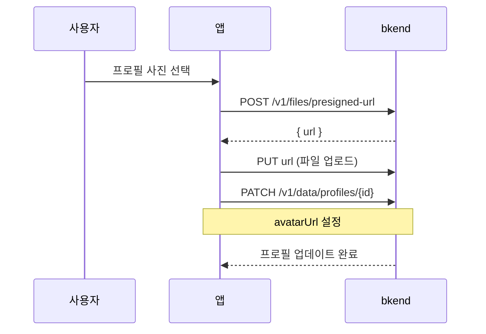

# 02. 프로필 관리 구현하기


💡 사용자 프로필과 아바타 이미지를 관리하는 기능을 구현하세요.


## 개요

회원가입 후 사용자의 닉네임, 소개, 프로필 사진을 설정하고 관리합니다. 프로필은 소셜 네트워크의 기본 단위로, 게시물, 댓글, 팔로우 등 모든 기능과 연결됩니다.

| 항목 | 내용 |
|------|------|
| 테이블 | `profiles` |
| 주요 API | `/v1/data/profiles`, `/v1/files/presigned-url` |
| 선행 조건 | [01. 인증](01-auth.md) 완료 (Access Token 필요) |

***

## 1단계: profiles 테이블 생성





✅ **AI에게 이렇게 말해보세요**

"소셜 네트워크에서 사용자 프로필을 관리하고 싶어요. 닉네임(2~20자), 자기소개(최대 200자), 프로필 사진을 저장할 수 있게 해주세요. 같은 사용자가 프로필을 중복으로 만들 수 없어야 해요. 만들기 전에 어떤 구조로 만들지 먼저 보여주세요."



💡 AI가 아래와 비슷한 구조를 제안하는지 확인하세요.

| 필드 | 설명 | 예시 값 |
|------|------|---------|
| nickname | 닉네임 | "김소셜" |
| bio | 자기소개 | "여행과 맛집을 좋아합니다" |
| avatarUrl | 프로필 사진 URL | (업로드 후 연결) |
| userId | 사용자 식별값 | (사용자 ID) |





1. bkend 콘솔에서 **데이터베이스** > **테이블 관리** 메뉴로 이동하세요.
2. **테이블 추가** 버튼을 클릭하세요.
3. 다음과 같이 설정하세요.

| 필드명 | 타입 | 필수 | 설명 |
|--------|------|:----:|------|
| `nickname` | String | O | 닉네임 (2~20자) |
| `bio` | String | | 소개 (최대 200자) |
| `avatarUrl` | String | | 프로필 사진 URL |
| `userId` | String | O | 사용자 ID (고유) |

4. **저장**을 클릭하면 테이블이 생성됩니다.


💡 테이블 관리에 대한 자세한 내용은 [테이블 관리](../../../ko/console/07-table-management.md)를 참고하세요.





***

## 2단계: 프로필 생성 (회원가입 후 최초 설정)

로그인 후 프로필이 없으면 생성 화면으로 안내합니다.







✅ **AI에게 이렇게 말해보세요**

"내 프로필을 만들어주세요. 닉네임은 '김소셜', 자기소개는 '여행과 맛집을 좋아합니다'로 해주세요."





### 프로필 존재 확인

```bash
curl -X GET "https://api-client.bkend.ai/v1/data/profiles?andFilters=%7B%22userId%22%3A%22{userId}%22%7D" \
  -H "Authorization: Bearer {accessToken}" \
  -H "X-Project-Id: {project_id}" \
  -H "X-Environment: dev"
```

**응답 (프로필 없음):**

```json
{
  "items": [],
  "pagination": {
    "total": 0,
    "page": 1,
    "limit": 25,
    "totalPages": 0,
    "hasNext": false,
    "hasPrev": false
  }
}
```

### 프로필 생성

```bash
curl -X POST https://api-client.bkend.ai/v1/data/profiles \
  -H "Content-Type: application/json" \
  -H "Authorization: Bearer {accessToken}" \
  -H "X-Project-Id: {project_id}" \
  -H "X-Environment: dev" \
  -d '{
    "nickname": "김소셜",
    "bio": "여행과 맛집을 좋아합니다",
    "userId": "{userId}"
  }'
```

**응답 (201 Created):**

```json
{
  "id": "profile_abc123",
  "nickname": "김소셜",
  "bio": "여행과 맛집을 좋아합니다",
  "avatarUrl": null,
  "userId": "user_001",
  "createdBy": "user_001",
  "createdAt": "2025-01-15T10:00:00Z"
}
```

### bkendFetch 구현

```javascript
const API_BASE = 'https://api-client.bkend.ai';

async function bkendFetch(path, options = {}) {
  const response = await fetch(`${API_BASE}${path}`, {
    ...options,
    headers: {
      'Content-Type': 'application/json',
      'X-Project-Id': '{project_id}',
      'X-Environment': 'dev',
      'Authorization': `Bearer ${accessToken}`,
      ...options.headers,
    },
  });

  if (!response.ok) {
    const error = await response.json();
    throw new Error(error.message || '요청 실패');
  }

  return response.json();
}

// 프로필 존재 확인
const checkProfile = async (userId) => {
  const andFilters = encodeURIComponent(JSON.stringify({ userId }));
  const result = await bkendFetch(`/v1/data/profiles?andFilters=${andFilters}`);
  return result.items.length > 0 ? result.items[0] : null;
};

// 프로필 생성
const createProfile = async ({ nickname, bio, userId }) => {
  return bkendFetch('/v1/data/profiles', {
    method: 'POST',
    body: JSON.stringify({ nickname, bio, userId }),
  });
};
```


💡 `bkendFetch` 헬퍼에 대한 자세한 내용은 [앱 통합 가이드](../../../ko/getting-started/06-app-integration.md)를 참고하세요.





***

## 3단계: 프로필 조회





✅ **AI에게 이렇게 말해보세요**

"내 프로필 정보를 보여주세요."





### 내 프로필 조회

```bash
curl -X GET "https://api-client.bkend.ai/v1/data/profiles?andFilters=%7B%22userId%22%3A%22{userId}%22%7D" \
  -H "Authorization: Bearer {accessToken}" \
  -H "X-Project-Id: {project_id}" \
  -H "X-Environment: dev"
```

### ID로 프로필 조회

```bash
curl -X GET https://api-client.bkend.ai/v1/data/profiles/{profileId} \
  -H "Authorization: Bearer {accessToken}" \
  -H "X-Project-Id: {project_id}" \
  -H "X-Environment: dev"
```

**응답:**

```json
{
  "id": "profile_abc123",
  "nickname": "김소셜",
  "bio": "여행과 맛집을 좋아합니다",
  "avatarUrl": "https://cdn.example.com/avatars/avatar_001.jpg",
  "userId": "user_001",
  "createdAt": "2025-01-15T10:00:00Z"
}
```

### bkendFetch 구현

```javascript
// 내 프로필 조회
const getMyProfile = async (userId) => {
  const andFilters = encodeURIComponent(JSON.stringify({ userId }));
  const result = await bkendFetch(`/v1/data/profiles?andFilters=${andFilters}`);
  return result.items[0] || null;
};

// ID로 프로필 조회
const getProfile = async (profileId) => {
  return bkendFetch(`/v1/data/profiles/${profileId}`);
};
```




***

## 4단계: 프로필 수정





✅ **AI에게 이렇게 말해보세요**

"내 닉네임을 '소셜킹'으로, 자기소개를 '여행, 맛집, 일상을 공유합니다'로 바꿔주세요."





### 닉네임/소개 수정

```bash
curl -X PATCH https://api-client.bkend.ai/v1/data/profiles/{profileId} \
  -H "Content-Type: application/json" \
  -H "Authorization: Bearer {accessToken}" \
  -H "X-Project-Id: {project_id}" \
  -H "X-Environment: dev" \
  -d '{
    "nickname": "소셜킹",
    "bio": "여행, 맛집, 일상을 공유합니다"
  }'
```

**응답 (200 OK):**

```json
{
  "id": "profile_abc123",
  "nickname": "소셜킹",
  "bio": "여행, 맛집, 일상을 공유합니다",
  "avatarUrl": "https://cdn.example.com/avatars/avatar_001.jpg",
  "userId": "user_001",
  "updatedAt": "2025-01-16T14:30:00Z"
}
```

### bkendFetch 구현

```javascript
const updateProfile = async (profileId, updates) => {
  return bkendFetch(`/v1/data/profiles/${profileId}`, {
    method: 'PATCH',
    body: JSON.stringify(updates),
  });
};

// 사용 예시
await updateProfile('profile_abc123', {
  nickname: '소셜킹',
  bio: '여행, 맛집, 일상을 공유합니다',
});
```




***

## 5단계: 아바타 이미지 업로드

프로필 사진을 업로드하고 프로필에 연결합니다.







✅ **AI에게 이렇게 말해보세요**

"프로필 사진을 바꾸고 싶어요. 이미지 업로드 준비를 해주세요."



💡 파일 업로드는 사용자가 앱에서 직접 수행합니다. MCP로는 업로드된 파일의 URL을 프로필 사진으로 연결하는 작업을 수행할 수 있습니다.





### Presigned URL 발급

```bash
curl -X POST https://api-client.bkend.ai/v1/files/presigned-url \
  -H "Content-Type: application/json" \
  -H "Authorization: Bearer {accessToken}" \
  -H "X-Project-Id: {project_id}" \
  -H "X-Environment: dev" \
  -d '{
    "filename": "avatar.jpg",
    "contentType": "image/jpeg"
  }'
```

**응답:**

```json
{
  "url": "https://storage.example.com/upload?signature=..."
}
```

### 파일 업로드 (Presigned URL 사용)

```bash
curl -X PUT "{url}" \
  -H "Content-Type: image/jpeg" \
  --data-binary @avatar.jpg
```

### 프로필에 아바타 URL 연결

```bash
curl -X PATCH https://api-client.bkend.ai/v1/data/profiles/{profileId} \
  -H "Content-Type: application/json" \
  -H "Authorization: Bearer {accessToken}" \
  -H "X-Project-Id: {project_id}" \
  -H "X-Environment: dev" \
  -d '{
    "avatarUrl": "{업로드된 파일의 URL}"
  }'
```

### bkendFetch 구현

```javascript
// 아바타 업로드 전체 흐름
const uploadAvatar = async (file, profileId) => {
  // 1. Presigned URL 발급
  const { url } = await bkendFetch(
    '/v1/files/presigned-url',
    {
      method: 'POST',
      body: JSON.stringify({
        filename: file.name,
        contentType: file.type,
      }),
    }
  );

  // 2. 파일 업로드
  await fetch(url, {
    method: 'PUT',
    headers: { 'Content-Type': file.type },
    body: file,
  });

  // 3. 프로필에 아바타 URL 연결
  return bkendFetch(`/v1/data/profiles/${profileId}`, {
    method: 'PATCH',
    body: JSON.stringify({ avatarUrl: '{업로드된 파일의 URL}' }),
  });
};
```


💡 Presigned URL을 사용한 파일 업로드에 대한 자세한 내용은 [파일 업로드](../../../ko/storage/02-upload-single.md)를 참고하세요.





***

## 6단계: 다른 사용자 프로필 보기





✅ **AI에게 이렇게 말해보세요**

"닉네임에 '소셜'이 포함된 사용자를 찾아주세요."





### 닉네임으로 사용자 검색

```bash
curl -X GET "https://api-client.bkend.ai/v1/data/profiles?andFilters=%7B%22nickname%22%3A%7B%22%24contains%22%3A%22소셜%22%7D%7D" \
  -H "Authorization: Bearer {accessToken}" \
  -H "X-Project-Id: {project_id}" \
  -H "X-Environment: dev"
```

**응답:**

```json
{
  "items": [
    {
      "id": "profile_abc123",
      "nickname": "김소셜",
      "bio": "여행과 맛집을 좋아합니다",
      "avatarUrl": "https://cdn.example.com/files/file_avatar_001.jpg",
      "userId": "user_001"
    },
    {
      "id": "profile_def456",
      "nickname": "소셜마스터",
      "bio": "사진 찍는 걸 좋아해요",
      "avatarUrl": "https://cdn.example.com/files/file_avatar_002.jpg",
      "userId": "user_002"
    }
  ],
  "pagination": {
    "total": 2,
    "page": 1,
    "limit": 25,
    "totalPages": 1,
    "hasNext": false,
    "hasPrev": false
  }
}
```

### bkendFetch 구현

```javascript
// 닉네임으로 사용자 검색
const searchProfiles = async (keyword) => {
  const andFilters = encodeURIComponent(
    JSON.stringify({ nickname: { $contains: keyword } })
  );
  return bkendFetch(`/v1/data/profiles?andFilters=${andFilters}`);
};

// 특정 사용자 프로필 조회
const getUserProfile = async (profileId) => {
  return bkendFetch(`/v1/data/profiles/${profileId}`);
};
```




***

## 참고 문서

- [테이블 관리](../../../ko/console/07-table-management.md) — 콘솔에서 테이블 생성/관리
- [데이터 생성](../../../ko/database/03-insert.md) — 데이터 삽입 상세
- [데이터 수정](../../../ko/database/06-update.md) — 데이터 수정 상세
- [파일 업로드](../../../ko/storage/02-upload-single.md) — Presigned URL 업로드 흐름
- [bkendFetch 헬퍼](../../../ko/getting-started/06-app-integration.md) — API 헬퍼 함수 패턴

***

## 다음 단계

[03. 게시물](03-posts.md)에서 게시물, 댓글, 좋아요 기능을 구현하세요.
