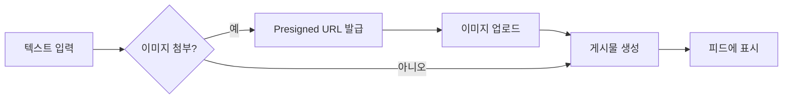
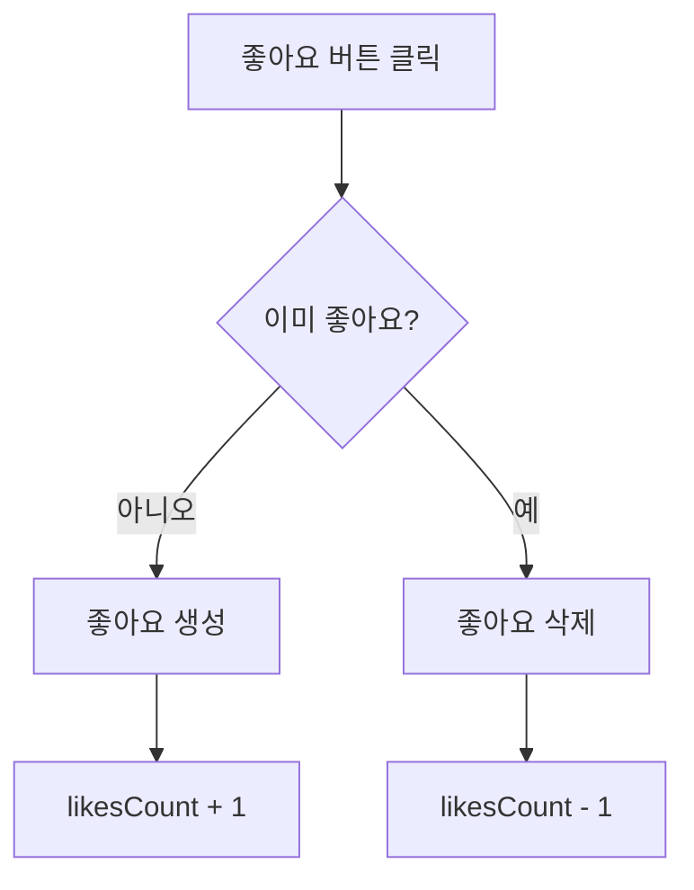

# 03. 게시물 & 댓글 & 좋아요 구현하기


💡 게시물 작성, 댓글, 좋아요 기능을 구현하여 소셜 네트워크의 핵심 상호작용을 완성하세요.


## 개요

소셜 네트워크의 핵심인 게시물 CRUD, 이미지 첨부, 댓글, 좋아요 기능을 구현합니다. 세 개의 테이블이 서로 연결되어 하나의 소셜 피드를 구성합니다.

| 항목 | 내용 |
|------|------|
| 테이블 | `posts`, `comments`, `likes` |
| 주요 API | `/v1/data/posts`, `/v1/data/comments`, `/v1/data/likes`, `/v1/files/presigned-url` |
| 선행 조건 | [02. 프로필](02-profiles.md) 완료 (프로필 생성 필요) |

***

## 1단계: 테이블 생성

세 개의 테이블을 생성합니다.

### posts 테이블





✅ **AI에게 이렇게 말해보세요**

"소셜 네트워크에 게시물을 저장할 곳이 필요해요. 글 내용(최대 1000자), 이미지, 좋아요 수, 댓글 수를 관리할 수 있게 만들어주세요. 만들기 전에 어떤 구조로 만들지 먼저 보여주세요."



💡 AI가 아래와 비슷한 구조를 제안하는지 확인하세요.

| 필드 | 설명 | 예시 값 |
|------|------|---------|
| content | 게시물 내용 | "오늘 날씨가 좋네요" |
| imageUrl | 첨부 이미지 URL | (업로드 후 연결) |
| likesCount | 좋아요 수 | 0 |
| commentsCount | 댓글 수 | 0 |





1. bkend 콘솔에서 **데이터베이스** > **테이블 관리**로 이동하세요.
2. **테이블 추가**를 클릭하고 다음과 같이 설정하세요.

| 필드명 | 타입 | 필수 | 설명 |
|--------|------|:----:|------|
| `content` | String | O | 본문 (최대 1000자) |
| `imageUrl` | String | | 이미지 URL |
| `likesCount` | Number | | 좋아요 수 (기본값: 0) |
| `commentsCount` | Number | | 댓글 수 (기본값: 0) |


💡 `createdBy` 필드는 시스템이 자동으로 설정합니다. 작성자 ID를 별도로 추가할 필요가 없습니다.





### comments 테이블





✅ **AI에게 이렇게 말해보세요**

"게시물에 댓글을 달 수 있게 해주세요. 어떤 게시물에 달린 건지 알 수 있어야 하고, 댓글 내용은 최대 500자까지요. 만들기 전에 구조를 먼저 보여주세요."



💡 AI가 아래와 비슷한 구조를 제안하는지 확인하세요.

| 필드 | 설명 | 예시 값 |
|------|------|---------|
| postId | 댓글 달 게시물 | (게시물 ID) |
| content | 댓글 내용 | "저도 그렇게 생각해요" |





| 필드명 | 타입 | 필수 | 설명 |
|--------|------|:----:|------|
| `postId` | String | O | 게시물 ID |
| `content` | String | O | 댓글 내용 (최대 500자) |




### likes 테이블





✅ **AI에게 이렇게 말해보세요**

"게시물에 좋아요를 누를 수 있게 해주세요. 어떤 게시물에 좋아요를 눌렀는지 기록할 수 있으면 돼요. 만들기 전에 구조를 먼저 보여주세요."



💡 AI가 아래와 비슷한 구조를 제안하는지 확인하세요.

| 필드 | 설명 | 예시 값 |
|------|------|---------|
| postId | 좋아요 한 게시물 | (게시물 ID) |





| 필드명 | 타입 | 필수 | 설명 |
|--------|------|:----:|------|
| `postId` | String | O | 게시물 ID |


⚠️ `createdBy`가 자동 설정되므로 사용자당 하나의 좋아요만 허용하려면 앱 로직에서 중복 체크가 필요합니다.





***

## 2단계: 게시물 작성







✅ **AI에게 이렇게 말해보세요**

"게시물을 올려주세요. 내용은 '오늘 새로운 프로젝트를 시작했습니다!'로요."





### 텍스트 게시물 작성

```bash
curl -X POST https://api-client.bkend.ai/v1/data/posts \
  -H "Content-Type: application/json" \
  -H "X-API-Key: {pk_publishable_key}" \
  -H "Authorization: Bearer {accessToken}" \
  -d '{
    "content": "오늘 새로운 프로젝트를 시작했습니다!"
  }'
```

**응답 (201 Created):**

```json
{
  "id": "post_xyz789",
  "content": "오늘 새로운 프로젝트를 시작했습니다!",
  "imageUrl": null,
  "likesCount": 0,
  "commentsCount": 0,
  "createdBy": "user_001",
  "createdAt": "2025-01-15T10:00:00Z"
}
```

### 이미지 포함 게시물 작성

```javascript
// 1. Presigned URL 발급
const { url } = await bkendFetch(
  '/v1/files/presigned-url',
  {
    method: 'POST',
    body: JSON.stringify({
      filename: 'post-image.jpg',
      contentType: 'image/jpeg',
    }),
  }
);

// 2. 이미지 업로드
await fetch(url, {
  method: 'PUT',
  headers: { 'Content-Type': 'image/jpeg' },
  body: imageFile,
});

// 3. 게시물 생성 (이미지 URL 포함)
const post = await bkendFetch('/v1/data/posts', {
  method: 'POST',
  body: JSON.stringify({
    content: '작업 중인 화면입니다',
    imageUrl: '{업로드된 파일의 URL}',
  }),
});
```

### bkendFetch 구현

```javascript
const API_BASE = 'https://api-client.bkend.ai';

async function bkendFetch(path, options = {}) {
  const response = await fetch(`${API_BASE}${path}`, {
    ...options,
    headers: {
      'Content-Type': 'application/json',
      'X-API-Key': '{pk_publishable_key}',
      'Authorization': `Bearer ${accessToken}`,
      ...options.headers,
    },
  });

  if (!response.ok) {
    const error = await response.json();
    throw new Error(error.message || '요청 실패');
  }

  return response.json();
}

// 게시물 작성
const createPost = async ({ content, imageUrl }) => {
  const body = { content };
  if (imageUrl) body.imageUrl = imageUrl;

  return bkendFetch('/v1/data/posts', {
    method: 'POST',
    body: JSON.stringify(body),
  });
};
```




***

## 3단계: 게시물 조회





✅ **AI에게 이렇게 말해보세요**

"내가 쓴 게시물을 최신순으로 10개 보여주세요."





### 단건 조회

```bash
curl -X GET https://api-client.bkend.ai/v1/data/posts/{postId} \
  -H "X-API-Key: {pk_publishable_key}" \
  -H "Authorization: Bearer {accessToken}"
```

### 특정 사용자 게시물 목록

```bash
curl -X GET "https://api-client.bkend.ai/v1/data/posts?andFilters=%7B%22createdBy%22%3A%22{userId}%22%7D&sortBy=createdAt&sortDirection=desc&limit=20" \
  -H "X-API-Key: {pk_publishable_key}" \
  -H "Authorization: Bearer {accessToken}"
```

**응답:**

```json
{
  "items": [
    {
      "id": "post_xyz789",
      "content": "오늘 새로운 프로젝트를 시작했습니다!",
      "imageUrl": null,
      "likesCount": 5,
      "commentsCount": 2,
      "createdBy": "user_001",
      "createdAt": "2025-01-15T10:00:00Z"
    }
  ],
  "pagination": {
    "total": 1,
    "page": 1,
    "limit": 20,
    "totalPages": 1,
    "hasNext": false,
    "hasPrev": false
  }
}
```

### bkendFetch 구현

```javascript
// 특정 사용자 게시물 조회
const getUserPosts = async (userId, page = 1, limit = 20) => {
  const andFilters = encodeURIComponent(JSON.stringify({ createdBy: userId }));
  const offset = (page - 1) * limit;
  return bkendFetch(
    `/v1/data/posts?andFilters=${andFilters}&sortBy=createdAt&sortDirection=desc&limit=${limit}&offset=${offset}`
  );
};

// 단건 조회
const getPost = async (postId) => {
  return bkendFetch(`/v1/data/posts/${postId}`);
};
```




***

## 4단계: 게시물 수정/삭제





✅ **AI에게 이렇게 말해보세요**

"방금 올린 게시물 내용을 '수정된 내용입니다'로 바꿔주세요."


삭제할 때:


✅ **AI에게 이렇게 말해보세요**

"방금 올린 게시물을 삭제해주세요."





### 게시물 수정

```bash
curl -X PATCH https://api-client.bkend.ai/v1/data/posts/{postId} \
  -H "Content-Type: application/json" \
  -H "X-API-Key: {pk_publishable_key}" \
  -H "Authorization: Bearer {accessToken}" \
  -d '{
    "content": "수정된 게시물 내용입니다"
  }'
```

### 게시물 삭제

```bash
curl -X DELETE https://api-client.bkend.ai/v1/data/posts/{postId} \
  -H "X-API-Key: {pk_publishable_key}" \
  -H "Authorization: Bearer {accessToken}"
```


⚠️ 게시물을 삭제해도 연결된 댓글과 좋아요는 자동으로 삭제되지 않습니다. 앱에서 관련 데이터를 함께 정리하세요.


### bkendFetch 구현

```javascript
// 게시물 수정
const updatePost = async (postId, updates) => {
  return bkendFetch(`/v1/data/posts/${postId}`, {
    method: 'PATCH',
    body: JSON.stringify(updates),
  });
};

// 게시물 삭제
const deletePost = async (postId) => {
  return bkendFetch(`/v1/data/posts/${postId}`, {
    method: 'DELETE',
  });
};
```




***

## 5단계: 댓글 작성/목록





✅ **AI에게 이렇게 말해보세요**

"방금 그 게시물에 '축하합니다! 화이팅!' 댓글을 달아주세요."


댓글 목록을 볼 때:


✅ **AI에게 이렇게 말해보세요**

"그 게시물에 달린 댓글을 전부 보여주세요."





### 댓글 작성

```bash
curl -X POST https://api-client.bkend.ai/v1/data/comments \
  -H "Content-Type: application/json" \
  -H "X-API-Key: {pk_publishable_key}" \
  -H "Authorization: Bearer {accessToken}" \
  -d '{
    "postId": "{postId}",
    "content": "축하합니다! 화이팅!"
  }'
```

**응답 (201 Created):**

```json
{
  "id": "comment_abc123",
  "postId": "post_xyz789",
  "content": "축하합니다! 화이팅!",
  "createdBy": "user_002",
  "createdAt": "2025-01-15T11:00:00Z"
}
```

### 게시물의 댓글 목록 조회

```bash
curl -X GET "https://api-client.bkend.ai/v1/data/comments?andFilters=%7B%22postId%22%3A%22{postId}%22%7D&sortBy=createdAt&sortDirection=asc" \
  -H "X-API-Key: {pk_publishable_key}" \
  -H "Authorization: Bearer {accessToken}"
```

**응답:**

```json
{
  "items": [
    {
      "id": "comment_abc123",
      "postId": "post_xyz789",
      "content": "축하합니다! 화이팅!",
      "createdBy": "user_002",
      "createdAt": "2025-01-15T11:00:00Z"
    },
    {
      "id": "comment_def456",
      "postId": "post_xyz789",
      "content": "대단해요!",
      "createdBy": "user_003",
      "createdAt": "2025-01-15T11:30:00Z"
    }
  ],
  "pagination": {
    "total": 2,
    "page": 1,
    "limit": 25,
    "totalPages": 1,
    "hasNext": false,
    "hasPrev": false
  }
}
```

### bkendFetch 구현

```javascript
// 댓글 작성
const createComment = async (postId, content) => {
  return bkendFetch('/v1/data/comments', {
    method: 'POST',
    body: JSON.stringify({ postId, content }),
  });
};

// 댓글 목록 조회
const getComments = async (postId) => {
  const andFilters = encodeURIComponent(JSON.stringify({ postId }));
  return bkendFetch(
    `/v1/data/comments?andFilters=${andFilters}&sortBy=createdAt&sortDirection=asc`
  );
};

// 댓글 삭제
const deleteComment = async (commentId) => {
  return bkendFetch(`/v1/data/comments/${commentId}`, {
    method: 'DELETE',
  });
};
```




***

## 6단계: 좋아요 토글

좋아요는 추가/삭제로 토글합니다. 이미 좋아요를 눌렀으면 삭제, 누르지 않았으면 생성합니다.







✅ **AI에게 이렇게 말해보세요**

"그 게시물에 좋아요를 눌러주세요."


좋아요를 취소할 때:


✅ **AI에게 이렇게 말해보세요**

"그 게시물의 좋아요를 취소해주세요."





### 좋아요 여부 확인

```bash
curl -X GET "https://api-client.bkend.ai/v1/data/likes?andFilters=%7B%22postId%22%3A%22{postId}%22%2C%22createdBy%22%3A%22{userId}%22%7D" \
  -H "X-API-Key: {pk_publishable_key}" \
  -H "Authorization: Bearer {accessToken}"
```

### 좋아요 추가

```bash
curl -X POST https://api-client.bkend.ai/v1/data/likes \
  -H "Content-Type: application/json" \
  -H "X-API-Key: {pk_publishable_key}" \
  -H "Authorization: Bearer {accessToken}" \
  -d '{
    "postId": "{postId}"
  }'
```

### 좋아요 삭제

```bash
curl -X DELETE https://api-client.bkend.ai/v1/data/likes/{likeId} \
  -H "X-API-Key: {pk_publishable_key}" \
  -H "Authorization: Bearer {accessToken}"
```

### bkendFetch 구현 (토글)

```javascript
// 좋아요 토글
const toggleLike = async (postId, userId) => {
  // 1. 기존 좋아요 확인
  const andFilters = encodeURIComponent(
    JSON.stringify({ postId, createdBy: userId })
  );
  const existing = await bkendFetch(`/v1/data/likes?andFilters=${andFilters}`);

  if (existing.items.length > 0) {
    // 2a. 이미 좋아요 → 삭제
    await bkendFetch(`/v1/data/likes/${existing.items[0].id}`, {
      method: 'DELETE',
    });
    return { liked: false };
  } else {
    // 2b. 좋아요 없음 → 생성
    await bkendFetch('/v1/data/likes', {
      method: 'POST',
      body: JSON.stringify({ postId }),
    });
    return { liked: true };
  }
};
```


💡 좋아요 수(`likesCount`)는 앱에서 별도로 `posts` 테이블을 업데이트해야 합니다. 좋아요 토글 후 게시물의 `likesCount`를 증가/감소시키세요.





***

## 참고 문서

- [데이터 생성](../../../ko/database/03-insert.md) — 데이터 삽입 상세
- [데이터 조회](../../../ko/database/04-select.md) — 단건 조회 상세
- [데이터 목록](../../../ko/database/05-list.md) — 필터, 정렬, 페이지네이션
- [데이터 삭제](../../../ko/database/07-delete.md) — 데이터 삭제 상세
- [파일 업로드](../../../ko/storage/02-upload-single.md) — Presigned URL 업로드 흐름
- [에러 처리](../../../ko/guides/11-error-handling.md) — API 에러 처리 패턴

***

## 다음 단계

[04. 팔로우](04-follows.md)에서 팔로우/언팔로우 시스템을 구현하세요.
