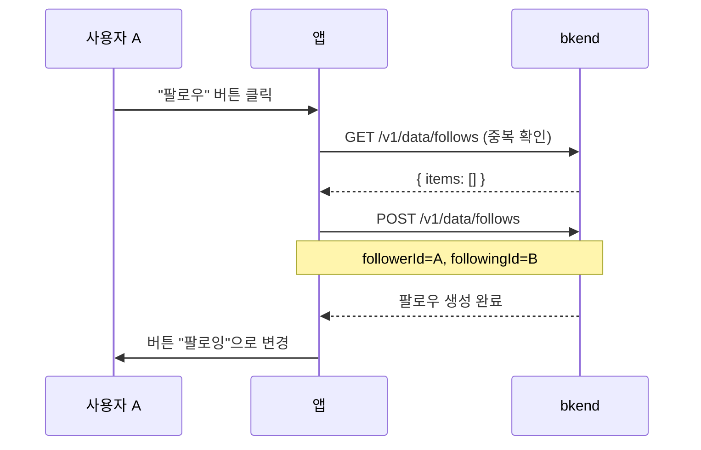
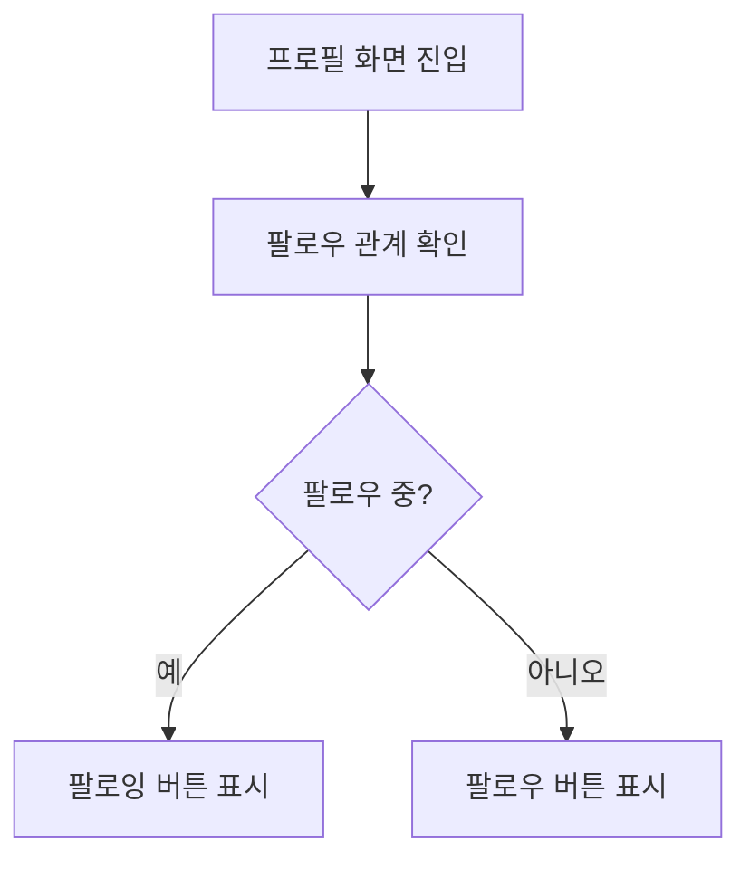

# 04. 팔로우 시스템 구현하기


💡 사용자 간 팔로우/언팔로우 관계를 관리하는 기능을 구현하세요.


## 개요

팔로우 시스템을 통해 사용자 간 관계를 형성합니다. 팔로우한 사용자의 게시물을 피드에서 확인할 수 있으며, 팔로워/팔로잉 목록을 조회할 수 있습니다.

| 항목 | 내용 |
|------|------|
| 테이블 | `follows` |
| 주요 API | `/v1/data/follows` |
| 선행 조건 | [02. 프로필](02-profiles.md) 완료 (프로필 필요) |

***

## 1단계: follows 테이블 생성





✅ **AI에게 이렇게 말해보세요**

"사용자들이 서로 팔로우할 수 있게 해주세요. 누가 누구를 팔로우하는지 기록할 수 있으면 돼요. 만들기 전에 어떤 구조로 만들지 먼저 보여주세요."



💡 AI가 아래와 비슷한 구조를 제안하는지 확인하세요.

| 필드 | 설명 | 예시 값 |
|------|------|---------|
| followerId | 팔로우 하는 사람 | (사용자 ID) |
| followingId | 팔로우 받는 사람 | (사용자 ID) |





1. bkend 콘솔에서 **데이터베이스** > **테이블 관리**로 이동하세요.
2. **테이블 추가**를 클릭하고 다음과 같이 설정하세요.

| 필드명 | 타입 | 필수 | 설명 |
|--------|------|:----:|------|
| `followerId` | String | O | 팔로우하는 사용자 ID |
| `followingId` | String | O | 팔로우받는 사용자 ID |


💡 테이블 관리에 대한 자세한 내용은 [테이블 관리](../../../ko/console/07-table-management.md)를 참고하세요.





***

## 2단계: 팔로우하기







✅ **AI에게 이렇게 말해보세요**

"'김소셜'님을 팔로우해주세요."





### 중복 확인 후 팔로우

```bash
# 1. 이미 팔로우 중인지 확인
curl -X GET "https://api-client.bkend.ai/v1/data/follows?andFilters=%7B%22followerId%22%3A%22{myUserId}%22%2C%22followingId%22%3A%22{targetUserId}%22%7D" \
  -H "X-API-Key: {pk_publishable_key}" \
  -H "Authorization: Bearer {accessToken}"
```

```bash
# 2. 팔로우 생성
curl -X POST https://api-client.bkend.ai/v1/data/follows \
  -H "Content-Type: application/json" \
  -H "X-API-Key: {pk_publishable_key}" \
  -H "Authorization: Bearer {accessToken}" \
  -d '{
    "followerId": "{myUserId}",
    "followingId": "{targetUserId}"
  }'
```

**응답 (201 Created):**

```json
{
  "id": "follow_xyz789",
  "followerId": "user_001",
  "followingId": "user_002",
  "createdBy": "user_001",
  "createdAt": "2025-01-15T10:00:00Z"
}
```

### bkendFetch 구현

```javascript
const API_BASE = 'https://api-client.bkend.ai';

async function bkendFetch(path, options = {}) {
  const response = await fetch(`${API_BASE}${path}`, {
    ...options,
    headers: {
      'Content-Type': 'application/json',
      'X-API-Key': '{pk_publishable_key}',
      'Authorization': `Bearer ${accessToken}`,
      ...options.headers,
    },
  });

  if (!response.ok) {
    const error = await response.json();
    throw new Error(error.message || '요청 실패');
  }

  return response.json();
}

// 팔로우 (중복 확인 포함)
const followUser = async (myUserId, targetUserId) => {
  // 중복 확인
  const andFilters = encodeURIComponent(
    JSON.stringify({
      followerId: myUserId,
      followingId: targetUserId,
    })
  );
  const existing = await bkendFetch(`/v1/data/follows?andFilters=${andFilters}`);

  if (existing.items.length > 0) {
    throw new Error('이미 팔로우 중입니다');
  }

  return bkendFetch('/v1/data/follows', {
    method: 'POST',
    body: JSON.stringify({
      followerId: myUserId,
      followingId: targetUserId,
    }),
  });
};
```




***

## 3단계: 언팔로우





✅ **AI에게 이렇게 말해보세요**

"'김소셜'님을 언팔로우해주세요."





### 팔로우 관계 찾기 후 삭제

```bash
# 1. 팔로우 관계 조회
curl -X GET "https://api-client.bkend.ai/v1/data/follows?andFilters=%7B%22followerId%22%3A%22{myUserId}%22%2C%22followingId%22%3A%22{targetUserId}%22%7D" \
  -H "X-API-Key: {pk_publishable_key}" \
  -H "Authorization: Bearer {accessToken}"
```

```bash
# 2. 팔로우 삭제
curl -X DELETE https://api-client.bkend.ai/v1/data/follows/{followId} \
  -H "X-API-Key: {pk_publishable_key}" \
  -H "Authorization: Bearer {accessToken}"
```

### bkendFetch 구현

```javascript
// 언팔로우
const unfollowUser = async (myUserId, targetUserId) => {
  // 팔로우 관계 찾기
  const andFilters = encodeURIComponent(
    JSON.stringify({
      followerId: myUserId,
      followingId: targetUserId,
    })
  );
  const result = await bkendFetch(`/v1/data/follows?andFilters=${andFilters}`);

  if (result.items.length === 0) {
    throw new Error('팔로우 관계가 없습니다');
  }

  // 삭제
  return bkendFetch(`/v1/data/follows/${result.items[0].id}`, {
    method: 'DELETE',
  });
};
```




***

## 4단계: 팔로워 목록 조회

"나를 팔로우하는 사람들"의 목록을 조회합니다.





✅ **AI에게 이렇게 말해보세요**

"나를 팔로우하는 사람들 목록을 보여주세요."





### 팔로워 목록

```bash
curl -X GET "https://api-client.bkend.ai/v1/data/follows?andFilters=%7B%22followingId%22%3A%22{myUserId}%22%7D&sortBy=createdAt&sortDirection=desc" \
  -H "X-API-Key: {pk_publishable_key}" \
  -H "Authorization: Bearer {accessToken}"
```

**응답:**

```json
{
  "items": [
    {
      "id": "follow_001",
      "followerId": "user_003",
      "followingId": "user_001",
      "createdAt": "2025-01-15T10:00:00Z"
    },
    {
      "id": "follow_002",
      "followerId": "user_004",
      "followingId": "user_001",
      "createdAt": "2025-01-14T09:00:00Z"
    }
  ],
  "pagination": {
    "total": 2,
    "page": 1,
    "limit": 25,
    "totalPages": 1,
    "hasNext": false,
    "hasPrev": false
  }
}
```

### 팔로워 프로필 정보 가져오기

팔로워 ID 목록으로 프로필 정보를 조회합니다.

```javascript
// 팔로워 목록 + 프로필 정보
const getFollowersWithProfiles = async (myUserId) => {
  // 1. 팔로워 목록 조회
  const andFilters = encodeURIComponent(
    JSON.stringify({ followingId: myUserId })
  );
  const follows = await bkendFetch(
    `/v1/data/follows?andFilters=${andFilters}&sortBy=createdAt&sortDirection=desc`
  );

  if (follows.items.length === 0) return [];

  // 2. 팔로워 프로필 조회
  const followerIds = follows.items.map((f) => f.followerId);
  const profileAndFilters = encodeURIComponent(
    JSON.stringify({ userId: { $in: followerIds } })
  );
  const profiles = await bkendFetch(
    `/v1/data/profiles?andFilters=${profileAndFilters}`
  );

  return profiles.items;
};
```




***

## 5단계: 팔로잉 목록 조회

"내가 팔로우하는 사람들"의 목록을 조회합니다.





✅ **AI에게 이렇게 말해보세요**

"내가 팔로우하는 사람들 목록을 보여주세요."





### 팔로잉 목록

```bash
curl -X GET "https://api-client.bkend.ai/v1/data/follows?andFilters=%7B%22followerId%22%3A%22{myUserId}%22%7D&sortBy=createdAt&sortDirection=desc" \
  -H "X-API-Key: {pk_publishable_key}" \
  -H "Authorization: Bearer {accessToken}"
```

**응답:**

```json
{
  "items": [
    {
      "id": "follow_003",
      "followerId": "user_001",
      "followingId": "user_002",
      "createdAt": "2025-01-15T10:00:00Z"
    },
    {
      "id": "follow_004",
      "followerId": "user_001",
      "followingId": "user_005",
      "createdAt": "2025-01-13T08:00:00Z"
    }
  ],
  "pagination": {
    "total": 2,
    "page": 1,
    "limit": 25,
    "totalPages": 1,
    "hasNext": false,
    "hasPrev": false
  }
}
```

### bkendFetch 구현

```javascript
// 팔로잉 목록 + 프로필 정보
const getFollowingWithProfiles = async (myUserId) => {
  const andFilters = encodeURIComponent(
    JSON.stringify({ followerId: myUserId })
  );
  const follows = await bkendFetch(
    `/v1/data/follows?andFilters=${andFilters}&sortBy=createdAt&sortDirection=desc`
  );

  if (follows.items.length === 0) return [];

  const followingIds = follows.items.map((f) => f.followingId);
  const profileAndFilters = encodeURIComponent(
    JSON.stringify({ userId: { $in: followingIds } })
  );
  const profiles = await bkendFetch(
    `/v1/data/profiles?andFilters=${profileAndFilters}`
  );

  return profiles.items;
};
```




***

## 6단계: 팔로우 상태 확인

프로필 화면에서 팔로우 버튼 상태를 결정하는 로직입니다.







✅ **AI에게 이렇게 말해보세요**

"내가 '김소셜'님을 팔로우하고 있는지 확인해주세요."





```javascript
// 팔로우 상태 확인
const checkFollowStatus = async (myUserId, targetUserId) => {
  const andFilters = encodeURIComponent(
    JSON.stringify({
      followerId: myUserId,
      followingId: targetUserId,
    })
  );
  const result = await bkendFetch(`/v1/data/follows?andFilters=${andFilters}`);
  return result.items.length > 0;
};

// 팔로우 토글 (팔로우/언팔로우)
const toggleFollow = async (myUserId, targetUserId) => {
  const isFollowing = await checkFollowStatus(myUserId, targetUserId);

  if (isFollowing) {
    await unfollowUser(myUserId, targetUserId);
    return { following: false };
  } else {
    await followUser(myUserId, targetUserId);
    return { following: true };
  }
};
```




***

## 참고 문서

- [데이터 생성](../../../ko/database/03-insert.md) — 데이터 삽입 상세
- [데이터 목록](../../../ko/database/05-list.md) — 필터, 정렬, 페이지네이션
- [데이터 삭제](../../../ko/database/07-delete.md) — 데이터 삭제 상세
- [테이블 관리](../../../ko/console/07-table-management.md) — 콘솔에서 테이블 생성/관리

***

## 다음 단계

[05. 피드](05-feeds.md)에서 팔로잉 기반 피드를 구성하세요.
