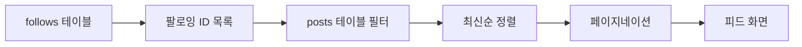
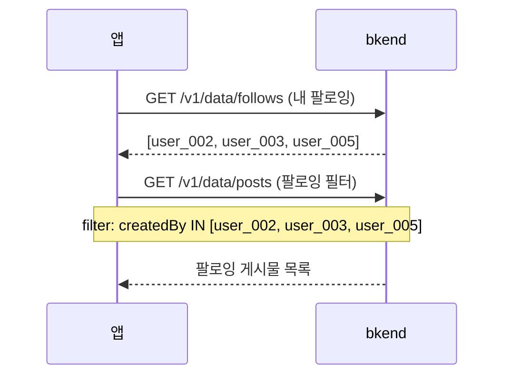

# 05. 피드 구성 구현하기


💡 팔로잉 기반 피드, 페이지네이션, 필터링을 구현하여 소셜 네트워크 타임라인을 완성하세요.


## 개요

팔로우한 사용자의 게시물을 모아서 피드를 구성합니다. 별도 테이블 없이 `posts`와 `follows` 테이블을 조합하여 다양한 피드를 만듭니다.

| 항목 | 내용 |
|------|------|
| 테이블 | `posts` + `follows` (기존 테이블 조합) |
| 주요 API | `/v1/data/posts`, `/v1/data/follows` |
| 선행 조건 | [04. 팔로우](04-follows.md) 완료 |

***

## 피드 구성 전략



피드는 두 단계로 구성합니다.

1. `follows` 테이블에서 내가 팔로우하는 사용자 ID 목록을 조회합니다.
2. `posts` 테이블에서 해당 사용자들의 게시물을 조회합니다.

***

## 1단계: 최신 게시물 피드

전체 공개 게시물을 최신순으로 조회합니다.





✅ **AI에게 이렇게 말해보세요**

"최근에 올라온 게시물 20개를 보여주세요."





### 전체 최신 피드

```bash
curl -X GET "https://api-client.bkend.ai/v1/data/posts?sortBy=createdAt&sortDirection=desc&limit=20" \
  -H "X-API-Key: {pk_publishable_key}" \
  -H "Authorization: Bearer {accessToken}"
```

**응답:**

```json
{
  "items": [
    {
      "id": "post_001",
      "content": "오늘 새로운 프로젝트를 시작했습니다!",
      "imageUrl": "https://cdn.example.com/files/post_img_001.jpg",
      "likesCount": 12,
      "commentsCount": 3,
      "createdBy": "user_002",
      "createdAt": "2025-01-15T10:00:00Z"
    },
    {
      "id": "post_002",
      "content": "맛있는 점심!",
      "imageUrl": null,
      "likesCount": 5,
      "commentsCount": 1,
      "createdBy": "user_003",
      "createdAt": "2025-01-15T09:30:00Z"
    }
  ],
  "pagination": {
    "total": 50,
    "page": 1,
    "limit": 20,
    "totalPages": 3,
    "hasNext": true,
    "hasPrev": false
  }
}
```

### 페이지네이션 (offset 방식)

```bash
# 1페이지 (처음 20개)
curl -X GET "https://api-client.bkend.ai/v1/data/posts?sortBy=createdAt&sortDirection=desc&limit=20&offset=0" \
  -H "X-API-Key: {pk_publishable_key}" \
  -H "Authorization: Bearer {accessToken}"

# 2페이지 (21~40번째)
curl -X GET "https://api-client.bkend.ai/v1/data/posts?sortBy=createdAt&sortDirection=desc&limit=20&offset=20" \
  -H "X-API-Key: {pk_publishable_key}" \
  -H "Authorization: Bearer {accessToken}"
```

### bkendFetch 구현

```javascript
const API_BASE = 'https://api-client.bkend.ai';

async function bkendFetch(path, options = {}) {
  const response = await fetch(`${API_BASE}${path}`, {
    ...options,
    headers: {
      'Content-Type': 'application/json',
      'X-API-Key': '{pk_publishable_key}',
      'Authorization': `Bearer ${accessToken}`,
      ...options.headers,
    },
  });

  if (!response.ok) {
    const error = await response.json();
    throw new Error(error.message || '요청 실패');
  }

  return response.json();
}

// 전체 최신 피드
const getLatestFeed = async (page = 1, limit = 20) => {
  const offset = (page - 1) * limit;
  return bkendFetch(
    `/v1/data/posts?sortBy=createdAt&sortDirection=desc&limit=${limit}&offset=${offset}`
  );
};
```




***

## 2단계: 팔로잉 기반 피드

내가 팔로우하는 사용자들의 게시물만 보여줍니다.







✅ **AI에게 이렇게 말해보세요**

"내가 팔로우하는 사람들의 최신 게시물을 보여주세요."



💡 AI가 자동으로 팔로우 목록을 먼저 확인한 뒤, 해당 사용자들의 게시물을 조회합니다.





### 팔로잉 피드 조회

```javascript
// 팔로잉 피드 (2단계 조합)
const getFollowingFeed = async (myUserId, page = 1, limit = 20) => {
  // 1. 팔로잉 목록 조회
  const followAndFilters = encodeURIComponent(
    JSON.stringify({ followerId: myUserId })
  );
  const follows = await bkendFetch(
    `/v1/data/follows?andFilters=${followAndFilters}`
  );

  if (follows.items.length === 0) {
    return { items: [], pagination: { total: 0, page: 1, limit, totalPages: 0, hasNext: false, hasPrev: false } };
  }

  // 2. 팔로잉 사용자들의 게시물 조회
  const followingIds = follows.items.map((f) => f.followingId);
  const postAndFilters = encodeURIComponent(
    JSON.stringify({ createdBy: { $in: followingIds } })
  );
  const offset = (page - 1) * limit;

  return bkendFetch(
    `/v1/data/posts?andFilters=${postAndFilters}&sortBy=createdAt&sortDirection=desc&limit=${limit}&offset=${offset}`
  );
};
```

### 내 게시물 포함 피드

```javascript
// 내 게시물 + 팔로잉 게시물 통합 피드
const getHomeFeed = async (myUserId, page = 1, limit = 20) => {
  const followAndFilters = encodeURIComponent(
    JSON.stringify({ followerId: myUserId })
  );
  const follows = await bkendFetch(
    `/v1/data/follows?andFilters=${followAndFilters}`
  );

  // 내 ID + 팔로잉 ID 합치기
  const userIds = [myUserId, ...follows.items.map((f) => f.followingId)];
  const postAndFilters = encodeURIComponent(
    JSON.stringify({ createdBy: { $in: userIds } })
  );
  const offset = (page - 1) * limit;

  return bkendFetch(
    `/v1/data/posts?andFilters=${postAndFilters}&sortBy=createdAt&sortDirection=desc&limit=${limit}&offset=${offset}`
  );
};
```


💡 팔로잉 목록은 자주 변경되지 않으므로, 클라이언트에서 캐싱하여 매 요청마다 조회하지 않도록 최적화하세요.





***

## 3단계: 피드 필터링

다양한 조건으로 피드를 필터링합니다.





✅ **AI에게 이렇게 말해보세요**

"오늘 올라온 게시물 중에서 이미지가 있는 것만 보여주세요."





### 이미지가 있는 게시물만

```bash
curl -X GET "https://api-client.bkend.ai/v1/data/posts?andFilters=%7B%22imageUrl%22%3A%7B%22%24ne%22%3Anull%7D%7D&sortBy=createdAt&sortDirection=desc&limit=20" \
  -H "X-API-Key: {pk_publishable_key}" \
  -H "Authorization: Bearer {accessToken}"
```

### 특정 기간 게시물

```bash
# 오늘 게시물만
curl -X GET "https://api-client.bkend.ai/v1/data/posts?andFilters=%7B%22createdAt%22%3A%7B%22%24gte%22%3A%222025-01-15T00%3A00%3A00Z%22%7D%7D&sortBy=createdAt&sortDirection=desc" \
  -H "X-API-Key: {pk_publishable_key}" \
  -H "Authorization: Bearer {accessToken}"
```

### bkendFetch 구현

```javascript
// 이미지 게시물만 조회
const getImageFeed = async (page = 1, limit = 20) => {
  const andFilters = encodeURIComponent(
    JSON.stringify({ imageUrl: { $ne: null } })
  );
  const offset = (page - 1) * limit;
  return bkendFetch(
    `/v1/data/posts?andFilters=${andFilters}&sortBy=createdAt&sortDirection=desc&limit=${limit}&offset=${offset}`
  );
};

// 특정 기간 피드
const getFeedByDateRange = async (startDate, endDate, page = 1, limit = 20) => {
  const andFilters = encodeURIComponent(
    JSON.stringify({
      createdAt: {
        $gte: startDate,
        $lte: endDate,
      },
    })
  );
  const offset = (page - 1) * limit;
  return bkendFetch(
    `/v1/data/posts?andFilters=${andFilters}&sortBy=createdAt&sortDirection=desc&limit=${limit}&offset=${offset}`
  );
};
```




***

## 4단계: 인기 게시물 정렬





✅ **AI에게 이렇게 말해보세요**

"좋아요가 가장 많은 게시물 10개를 보여주세요."


댓글이 많은 순서로 볼 때:


✅ **AI에게 이렇게 말해보세요**

"댓글이 가장 많은 게시물 10개를 보여주세요."





### 좋아요 순 정렬

```bash
curl -X GET "https://api-client.bkend.ai/v1/data/posts?sortBy=likesCount&sortDirection=desc&limit=20" \
  -H "X-API-Key: {pk_publishable_key}" \
  -H "Authorization: Bearer {accessToken}"
```

### 댓글 순 정렬

```bash
curl -X GET "https://api-client.bkend.ai/v1/data/posts?sortBy=commentsCount&sortDirection=desc&limit=20" \
  -H "X-API-Key: {pk_publishable_key}" \
  -H "Authorization: Bearer {accessToken}"
```

### bkendFetch 구현

```javascript
// 인기 게시물 (좋아요 순)
const getPopularFeed = async (page = 1, limit = 20) => {
  const offset = (page - 1) * limit;
  return bkendFetch(
    `/v1/data/posts?sortBy=likesCount&sortDirection=desc&limit=${limit}&offset=${offset}`
  );
};

// 댓글 많은 게시물
const getMostCommentedFeed = async (page = 1, limit = 20) => {
  const offset = (page - 1) * limit;
  return bkendFetch(
    `/v1/data/posts?sortBy=commentsCount&sortDirection=desc&limit=${limit}&offset=${offset}`
  );
};
```

### 피드 탭 구현 예시

```javascript
// 피드 유형별 조회
const getFeed = async (type, myUserId, page = 1) => {
  switch (type) {
    case 'latest':
      return getLatestFeed(page);
    case 'following':
      return getFollowingFeed(myUserId, page);
    case 'popular':
      return getPopularFeed(page);
    case 'images':
      return getImageFeed(page);
    default:
      return getLatestFeed(page);
  }
};
```




***

## 5단계: 무한 스크롤 구현

앱에서 스크롤하면 다음 페이지를 자동으로 로드하는 패턴입니다.





✅ **AI에게 이렇게 말해보세요**

"아까 보여준 피드의 다음 페이지를 보여주세요."



💡 무한 스크롤은 앱에서 구현하는 UI 패턴입니다. MCP에서는 페이지 단위로 조회합니다.





```javascript
// 무한 스크롤 피드 관리
class FeedManager {
  constructor(myUserId) {
    this.myUserId = myUserId;
    this.page = 1;
    this.limit = 20;
    this.hasMore = true;
    this.posts = [];
  }

  // 다음 페이지 로드
  async loadMore() {
    if (!this.hasMore) return;

    const result = await getFollowingFeed(
      this.myUserId,
      this.page,
      this.limit
    );

    this.posts = [...this.posts, ...result.items];
    this.hasMore = this.posts.length < result.pagination.total;
    this.page++;

    return result.items;
  }

  // 새로고침 (처음부터)
  async refresh() {
    this.page = 1;
    this.hasMore = true;
    this.posts = [];
    return this.loadMore();
  }
}

// 사용 예시
const feed = new FeedManager('user_001');

// 첫 로드
await feed.loadMore();

// 스크롤 이벤트에서 추가 로드
window.addEventListener('scroll', async () => {
  if (isNearBottom() && feed.hasMore) {
    await feed.loadMore();
    renderPosts(feed.posts);
  }
});
```


💡 `offset` 방식은 간단하지만, 데이터가 많아지면 성능이 저하될 수 있습니다. 대규모 피드에서는 `createdAt` 기준 커서 방식을 고려하세요.





***

## 6단계: 피드 화면 통합 예시

지금까지 구현한 모든 기능을 하나의 피드 화면으로 통합합니다.





✅ **AI에게 이렇게 말해보세요**

"내 피드를 보여주세요. 각 게시물을 누가 썼는지 프로필 정보도 함께 알려주세요."



💡 AI가 자동으로 여러 단계를 순차적으로 처리합니다.
1. 팔로우 중인 사람 확인
2. 그 사람들의 게시물 조회
3. 각 게시물 작성자의 프로필 조회
4. 결과를 하나로 정리하여 표시





```javascript
// 피드 화면 초기화
const initFeedScreen = async (myUserId) => {
  // 1. 내 프로필 조회
  const profileAndFilters = encodeURIComponent(
    JSON.stringify({ userId: myUserId })
  );
  const profileResult = await bkendFetch(
    `/v1/data/profiles?andFilters=${profileAndFilters}`
  );
  const myProfile = profileResult.items[0];

  // 2. 팔로잉 피드 로드
  const feed = await getFollowingFeed(myUserId, 1, 20);

  // 3. 각 게시물의 작성자 프로필 조회
  const authorIds = [...new Set(feed.items.map((p) => p.createdBy))];
  const authorAndFilters = encodeURIComponent(
    JSON.stringify({ userId: { $in: authorIds } })
  );
  const authors = await bkendFetch(
    `/v1/data/profiles?andFilters=${authorAndFilters}`
  );

  // 4. 게시물에 작성자 정보 매핑
  const authorMap = {};
  authors.items.forEach((a) => {
    authorMap[a.userId] = a;
  });

  const feedWithAuthors = feed.items.map((post) => ({
    ...post,
    author: authorMap[post.createdBy] || null,
  }));

  return {
    myProfile,
    feed: feedWithAuthors,
    total: feed.pagination.total,
  };
};
```




***

## 참고 문서

- [데이터 목록](../../../ko/database/05-list.md) — 필터, 정렬, 페이지네이션 상세
- [데이터 조회](../../../ko/database/04-select.md) — 단건 조회 상세
- [CRUD 앱 패턴](../../../ko/database/12-crud-app-patterns.md) — 앱 통합 CRUD 패턴
- [에러 처리](../../../ko/guides/11-error-handling.md) — API 에러 처리 패턴

***

## 다음 단계

[06. AI 시나리오](06-ai-prompts.md)에서 AI를 활용한 피드 추천, 콘텐츠 분석 등 고급 활용법을 살펴보세요.
