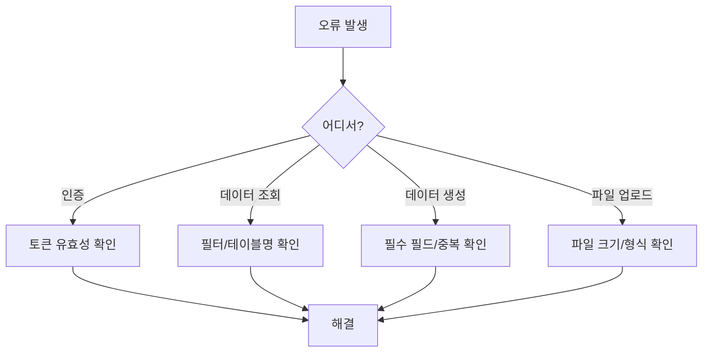

# 99. 문제 해결


💡 소셜 네트워크 앱 개발 중 자주 발생하는 오류와 해결 방법을 정리했습니다. 에러 코드별로 원인과 해결책을 안내합니다.


***

## 인증 관련

### 401 Unauthorized

```json
{
  "error": {
    "code": 401,
    "message": "Unauthorized: Invalid or expired token"
  }
}
```

**원인**: Access Token이 만료되었거나 유효하지 않습니다.

**해결 방법**:

1. Refresh Token으로 새 Access Token을 발급받으세요.

```bash
curl -X POST https://api-client.bkend.ai/v1/auth/refresh \
  -H "Content-Type: application/json" \
  -H "X-Project-Id: {project_id}" \
  -H "X-Environment: dev" \
  -d '{
    "refreshToken": "{refreshToken}"
  }'
```

2. Refresh Token도 만료된 경우 다시 로그인하세요.


⚠️ Access Token의 유효 기간을 확인하고, 만료 전에 갱신하는 로직을 앱에 구현하세요.


### Google OAuth 로그인 실패

```json
{
  "error": {
    "code": 400,
    "message": "Bad Request: Invalid OAuth code"
  }
}
```

**원인**: Google에서 받은 인가 코드가 유효하지 않거나 이미 사용되었습니다.

**해결 방법**:

1. 인가 코드는 **1회만 사용** 가능합니다. 새 로그인 흐름을 시작하세요.
2. 콘솔에서 Google OAuth 설정(Client ID, Redirect URI)이 올바른지 확인하세요.
3. Redirect URI가 Google Cloud Console에 등록된 것과 정확히 일치하는지 확인하세요.

### 토큰 갱신 실패

```json
{
  "error": {
    "code": 401,
    "message": "Unauthorized: Invalid refresh token"
  }
}
```

**원인**: Refresh Token이 만료되었거나 이미 사용(회전)되었습니다.

**해결 방법**:

1. 사용자에게 다시 로그인하도록 안내하세요.
2. 앱에서 Refresh Token 저장 시 최신 값으로 갱신하고 있는지 확인하세요.

***

## 프로필 관련

### 프로필 생성 실패 — 필수 필드 누락

```json
{
  "error": {
    "code": 400,
    "message": "Bad Request: 'nickname' is required"
  }
}
```

**원인**: `nickname` 또는 `userId` 같은 필수 필드가 누락되었습니다.

**해결 방법**:

요청 본문에 필수 필드를 포함하세요.

```json
{
  "nickname": "개발자김",
  "userId": "user_001"
}
```

### 프로필 중복 생성

```json
{
  "error": {
    "code": 409,
    "message": "Conflict: Profile already exists for this user"
  }
}
```

**원인**: 같은 `userId`로 프로필을 두 번 만들려고 했습니다.

**해결 방법**:

1. 기존 프로필을 먼저 조회하세요.

```json
{
  "name": "list_profiles",
  "arguments": {
    "filter": { "userId": "user_001" }
  }
}
```

2. 프로필이 존재하면 `update_profiles`로 수정하세요.

### 아바타 업로드 실패

```json
{
  "error": {
    "code": 413,
    "message": "Payload Too Large: File size exceeds limit"
  }
}
```

**원인**: 업로드 파일의 크기가 허용 한도를 초과했습니다.

**해결 방법**:

1. 이미지를 압축하거나 해상도를 줄여서 재시도하세요.
2. 지원 형식(JPEG, PNG, GIF, WebP)을 확인하세요.

```json
{
  "error": {
    "code": 415,
    "message": "Unsupported Media Type"
  }
}
```

**원인**: 지원하지 않는 파일 형식입니다.

**해결 방법**: JPEG, PNG, GIF, WebP 중 하나로 변환하여 업로드하세요.

***

## 게시물 관련

### 게시물 생성 실패

```json
{
  "error": {
    "code": 400,
    "message": "Bad Request: 'content' is required"
  }
}
```

**원인**: `content` 필드가 비어 있거나 누락되었습니다.

**해결 방법**: 게시물 본문(`content`)을 반드시 포함하세요.

```bash
curl -X POST https://api-client.bkend.ai/v1/data/posts \
  -H "Content-Type: application/json" \
  -H "Authorization: Bearer {accessToken}" \
  -H "X-Project-Id: {project_id}" \
  -H "X-Environment: dev" \
  -d '{
    "content": "게시물 내용을 입력하세요"
  }'
```

### 빈 결과 반환

```json
{
  "data": [],
  "total": 0
}
```

**원인**: 조건에 맞는 게시물이 없습니다.

**확인 사항**:

1. **필터 조건** — 필터 값(createdBy, postId 등)이 올바른지 확인하세요.
2. **환경(Environment)** — `X-Environment` 헤더가 데이터를 생성한 환경과 같은지 확인하세요.
3. **테이블명** — 요청 URL의 테이블명이 정확한지 확인하세요.


💡 `dev` 환경에서 생성한 데이터는 `staging`이나 `prod`에서 조회되지 않습니다.


### 게시물 수정/삭제 권한 없음

```json
{
  "error": {
    "code": 403,
    "message": "Forbidden: You are not the author"
  }
}
```

**원인**: 본인이 작성하지 않은 게시물을 수정 또는 삭제하려고 했습니다.

**해결 방법**: 본인 게시물인지 확인하세요. `createdBy` 필드가 현재 로그인한 사용자 ID와 일치해야 합니다.

### 이미지가 표시되지 않음

**가능한 원인**:

1. **Presigned URL 미사용** — 파일을 업로드하지 않고 `imageUrl`에 임의 URL을 넣은 경우
2. **URL 만료** — Presigned URL은 일정 시간이 지나면 만료됩니다
3. **업로드 실패** — Presigned URL로 파일 업로드가 실패한 경우

**해결 방법**:

1. Presigned URL을 발급받아 실제 파일을 업로드하세요.
2. 파일 메타데이터를 조회하여 다운로드 URL을 받고, `imageUrl`에 저장하세요.
3. 만료된 경우 파일 메타데이터를 다시 조회하여 URL을 갱신하세요.

***

## 팔로우 관련

### 중복 팔로우

```json
{
  "error": {
    "code": 409,
    "message": "Conflict: Already following this user"
  }
}
```

**원인**: 이미 팔로우 중인 사용자를 다시 팔로우하려고 했습니다.

**해결 방법**: 팔로우 전에 기존 관계를 확인하세요.

```json
{
  "name": "list_follows",
  "arguments": {
    "filter": {
      "followerId": "user_001",
      "followingId": "user_002"
    }
  }
}
```

결과가 있으면 이미 팔로우 중이므로, 필요 시 언팔로우 처리하세요.

### 자기 자신 팔로우

```json
{
  "error": {
    "code": 400,
    "message": "Bad Request: Cannot follow yourself"
  }
}
```

**원인**: `followerId`와 `followingId`가 동일합니다.

**해결 방법**: 앱에서 팔로우 요청 시 자기 자신인지 사전 검증하세요.

```javascript
const followUser = async (myUserId, targetUserId) => {
  if (myUserId === targetUserId) {
    throw new Error('자기 자신은 팔로우할 수 없습니다');
  }
  // 팔로우 로직 진행
};
```

### 팔로우 관계를 찾을 수 없음

```json
{
  "error": {
    "code": 404,
    "message": "Follow relationship not found"
  }
}
```

**원인**: 이미 언팔로우했거나 팔로우한 적이 없는 관계를 삭제하려고 했습니다.

**해결 방법**: 언팔로우 전에 `list_follows`로 관계가 존재하는지 확인하세요.

***

## 피드 관련

### 피드가 비어 있음

```json
{
  "data": [],
  "total": 0
}
```

**가능한 원인**:

1. **팔로잉 없음** — 아무도 팔로우하지 않았습니다
2. **팔로잉 사용자의 게시물 없음** — 팔로우한 사용자들이 게시물을 작성하지 않았습니다
3. **필터 조건 오류** — `$in` 배열이 비어 있습니다

**해결 방법**:

1. 먼저 팔로잉 목록을 확인하세요.

```json
{
  "name": "list_follows",
  "arguments": {
    "filter": { "followerId": "user_001" }
  }
}
```

2. 팔로잉이 없다면 다른 사용자를 팔로우하세요.
3. 팔로잉이 있는데 피드가 비어 있다면, 전체 최신 피드를 조회하세요.

```json
{
  "name": "list_posts",
  "arguments": {
    "sort": "createdAt:desc",
    "limit": 20
  }
}
```

### 정렬이 적용되지 않음

```json
// 잘못된 예
{ "sort": "-createdAt" }
{ "sort": { "createdAt": -1 } }
```

**원인**: 정렬 형식이 올바르지 않습니다.

**해결 방법**: `필드명:방향` 형식을 사용하세요.

```json
// 올바른 예
{ "sort": "createdAt:desc" }
{ "sort": "likesCount:desc" }
{ "sort": "createdAt:asc" }
```

### 피드 로딩이 느림

**해결 방법**:

1. `limit` 값을 줄이세요 (20개 이하 권장).
2. 팔로잉 목록을 클라이언트에서 캐싱하여 매 요청마다 조회하지 않도록 하세요.
3. 페이지네이션을 활용하세요.

```javascript
// 캐싱 예시
let cachedFollowingIds = null;

const getFollowingIds = async (myUserId) => {
  if (cachedFollowingIds) return cachedFollowingIds;

  const andFilters = encodeURIComponent(
    JSON.stringify({ followerId: myUserId })
  );
  const follows = await bkendFetch(
    `/v1/data/follows?andFilters=${andFilters}`
  );
  cachedFollowingIds = follows.items.map((f) => f.followingId);
  return cachedFollowingIds;
};
```

***

## MCP 도구 관련

### AI가 테이블을 찾지 못함

```
AI 응답: "posts 테이블을 찾을 수 없습니다."
```

**가능한 원인**:

1. **테이블 미생성** — 테이블을 아직 만들지 않았습니다
2. **프로젝트/환경 불일치** — MCP 연결 설정의 프로젝트나 환경이 다릅니다
3. **테이블명 오타** — 대소문자, 복수형 등 이름이 다릅니다

**해결 방법**:

1. AI에게 테이블 목록을 확인하도록 요청하세요.


✅ **AI에게 이렇게 말해보세요**

"현재 프로젝트에 어떤 테이블이 있는지 보여줘"


2. 테이블이 없다면 생성하세요.


✅ **AI에게 이렇게 말해보세요**

"소셜 네트워크에 필요한 profiles, posts, comments, likes, follows 테이블을 만들어줘"


### MCP 연결 실패

```
Error: Connection refused
```

**확인 사항**:

| 항목 | 확인 방법 |
|------|----------|
| MCP 서버 URL | 설정 파일에서 URL이 올바른지 확인 |
| API 키 | 유효한 API 키가 설정되어 있는지 확인 |
| 프로젝트 ID | 올바른 프로젝트 ID가 입력되어 있는지 확인 |
| 네트워크 | 인터넷 연결 상태 확인 |

**해결 방법**:

1. MCP 클라이언트 설정을 확인하세요.
2. MCP 클라이언트(Claude Desktop, Cursor 등)를 재시작하세요.
3. API 키가 만료되지 않았는지 콘솔에서 확인하세요.

### AI 응답이 예상과 다름

**가능한 원인**:

1. **프롬프트가 모호함** — 구체적인 값이나 ID를 명시하지 않았습니다
2. **데이터 없음** — 요청한 데이터가 존재하지 않습니다

**해결 방법**:

- 구체적인 ID와 값을 포함하여 요청하세요.
- "게시물 보여줘" 대신 "user_001의 최신 게시물 5개 보여줘"처럼 명확하게 작성하세요.

***

## 쿼리 관련

### 필터 문법 오류

```json
{
  "error": {
    "code": 400,
    "message": "Bad Request: Invalid filter syntax"
  }
}
```

**올바른 필터 사용법**:

```bash
# 문자열 필터
?andFilters={"createdBy":"user_001"}

# 비교 연산자
?andFilters={"likesCount":{"$gte":10}}

# 배열 포함
?andFilters={"createdBy":{"$in":["user_001","user_002"]}}

# 복합 조건
?andFilters={"createdBy":"user_001","imageUrl":{"$ne":null}}
```


💡 URL에서 사용할 때는 `andFilters` 값을 `encodeURIComponent()`로 인코딩하세요.


**지원하는 연산자**:

| 연산자 | 설명 | 예시 |
|--------|------|------|
| `$eq` | 같음 | `{ "status": { "$eq": "active" } }` |
| `$ne` | 같지 않음 | `{ "imageUrl": { "$ne": null } }` |
| `$gt`, `$gte` | 초과, 이상 | `{ "likesCount": { "$gte": 10 } }` |
| `$lt`, `$lte` | 미만, 이하 | `{ "likesCount": { "$lt": 100 } }` |
| `$in` | 목록에 포함 | `{ "createdBy": { "$in": ["user_001"] } }` |
| `$nin` | 목록에 미포함 | `{ "status": { "$nin": ["deleted"] } }` |

### API 호출 한도 초과

```json
{
  "error": {
    "code": 429,
    "message": "Too Many Requests"
  }
}
```

**해결 방법**:

1. 요청 간 최소 1초 이상 간격을 두세요.
2. 불필요한 반복 요청을 줄이세요.
3. 가능한 경우 클라이언트에서 응답을 캐싱하세요.

***

## 디버깅 팁

### 요청 전 체크리스트

| 항목 | 확인 |
|------|------|
| `Authorization` 헤더에 유효한 토큰이 있는가? | `Bearer {accessToken}` |
| `X-Project-Id` 헤더가 포함되어 있는가? | 콘솔에서 프로젝트 ID 확인 |
| `X-Environment` 헤더가 올바른가? | `dev` / `staging` / `prod` |
| `Content-Type`이 `application/json`인가? | POST/PATCH 요청 시 필수 |
| URL 경로의 테이블명이 정확한가? | 복수형 확인 (예: `posts`, `profiles`) |

### 단계별 문제 분리

복잡한 기능에서 오류가 발생하면 단계별로 분리하여 확인하세요.




💡 AI에게 "방금 요청에서 오류가 발생했어. 원인을 분석해줘"라고 요청하면, AI가 에러 메시지를 분석하고 해결 방법을 제안합니다.


***

## 자주 묻는 질문

### Q: 게시물을 삭제하면 댓글과 좋아요도 삭제되나요?

A: 아닙니다. 게시물을 삭제해도 연결된 댓글(`comments`)과 좋아요(`likes`)는 자동으로 삭제되지 않습니다. 앱에서 게시물 삭제 시 관련 데이터를 함께 정리하는 로직을 구현하세요.

### Q: 팔로워 수가 실제와 다른 것 같아요

A: `follows` 테이블의 조회 결과에서 `total` 값을 확인하세요. 삭제된 계정의 팔로우 관계가 남아있을 수 있습니다.

### Q: 이미지 URL이 만료되었어요

A: Presigned URL은 일정 시간 후 만료됩니다. 파일 메타데이터를 다시 조회하여 새 다운로드 URL을 받으세요.

### Q: 환경(dev/staging/prod)별로 데이터가 다른가요?

A: 네. 각 환경은 독립된 데이터 저장소를 사용합니다. `dev`에서 생성한 데이터는 `prod`에서 조회되지 않습니다. `X-Environment` 헤더를 확인하세요.

***

## 참고 문서

- [에러 처리 패턴](../../../ko/guides/11-error-handling.md) — API 에러 코드 및 처리 패턴 상세
- [토큰 관리](../../../ko/authentication/20-token-management.md) — 토큰 갱신 및 만료 처리
- [파일 업로드](../../../ko/storage/02-upload-single.md) — Presigned URL 업로드 흐름

***

## 다음 단계

- [소셜 네트워크 쿡북 README](../README.md)로 돌아가서 전체 구조를 다시 확인하세요.
- 다른 쿡북도 살펴보세요:
  - [블로그 쿡북](../../blog/README.md) — 블로그 플랫폼 구축
  - [레시피 앱 쿡북](../../recipe-app/README.md) — 레시피 관리 앱 구축
  - [쇼핑몰 쿡북](../../shopping-mall/README.md) — 쇼핑몰 구축
