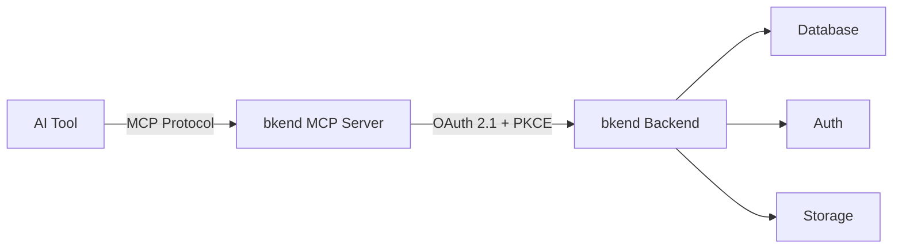
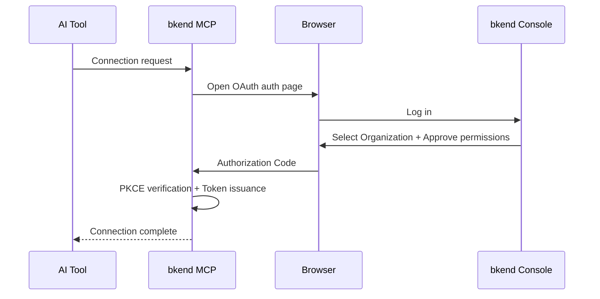

# AI Tool Integration Overview


Use the bkend MCP server to manage your backend with natural language from AI tools like Claude Code and Cursor.


## Overview

bkend connects to AI tools through [MCP (Model Context Protocol)](https://spec.modelcontextprotocol.io/2025-03-26). When you issue natural language commands from an MCP-compatible AI tool, bkend automatically manages Database, Auth, and Storage for you.



***

## Supported AI Tools

| Tool | MCP Support | Auth Method | Documentation |
|------|:--------:|----------|----------|
| Claude Code | ✅ | OAuth 2.1 | [Setup](04-claude-code-setup.md) / [Usage](05-claude-code-usage.md) |
| Claude Desktop | ✅ | OAuth 2.1 | [Setup](04-claude-code-setup.md) |
| Cursor | ✅ | OAuth 2.1 | [Setup](06-cursor-setup.md) / [Usage](07-cursor-usage.md) |
| Antigravity | ✅ | OAuth 2.1 | [Integration](08-antigravity-setup.md) |
| Other MCP Tools | ✅ | OAuth 2.1 | [Other Tools](09-other-tools.md) |

***

## MCP Server Information

| Item | Value |
|------|-----|
| Server URL | `https://api.bkend.ai/mcp` |
| Protocol Version | `2025-03-26` |
| Transport | Streamable HTTP |
| Authentication | [OAuth 2.1](https://datatracker.ietf.org/doc/html/draft-ietf-oauth-v2-1-12) + PKCE |
| Message Format | JSON-RPC 2.0 |

***

## Available Tools

### Fixed Tools

These tools handle session context and documentation search.

| Tool | Description |
|------|------|
| `get_context` | Must be called at session start — provides Organization ID, resource hierarchy, and usage guidelines |
| `search_docs` | Search bkend documentation — API guides, auth implementation, CRUD patterns, code examples, etc. |

### API Tools

These tools invoke management functions on the bkend backend. You can manage Organizations, Projects, Environments, Tables, and more.

> For detailed parameters and responses of each tool, see the [MCP Tools Overview](../mcp/01-overview.md).


MCP tools control **management functions** (table schemas, projects, environments, etc.). They are different from the REST API used for app user data. For REST API integration, see [Integrating bkend in Your App](../getting-started/03-app-integration.md).


***

## Quick Start



```bash
claude mcp add bkend --transport http https://api.bkend.ai/mcp
```


```json
{
  "mcpServers": {
    "mcp-bkend": {
      "type": "http",
      "url": "https://api.bkend.ai/mcp"
    }
  }
}
```


Connect using the following URL from any MCP-compatible tool:

```text
https://api.bkend.ai/mcp
```



***

## Authentication Flow

bkend MCP authenticates using [OAuth 2.1](https://datatracker.ietf.org/doc/html/draft-ietf-oauth-v2-1-12) + PKCE.



> For detailed authentication setup, see [OAuth 2.1 Authentication Setup](03-oauth-setup.md).

***

## Permissions (Scopes)

These are the permissions granted during MCP integration.

| Resource | Read | Create | Update | Delete |
|--------|:----:|:----:|:----:|:----:|
| Organization | ✅ | - | - | - |
| Project | ✅ | ✅ | ✅ | ✅ |
| Environment | ✅ | ✅ | - | ✅ |
| Table Schema | ✅ | ✅ | ✅ | ✅ |
| Table Data | ✅ | ✅ | ✅ | ✅ |

***

## Next Steps

- [Understanding MCP Protocol](02-mcp-protocol.md) — MCP protocol details
- [OAuth 2.1 Authentication Setup](03-oauth-setup.md) — Authentication flow and token management
- [Claude Code Setup](04-claude-code-setup.md) — Claude Code integration
- [Cursor Setup](06-cursor-setup.md) — Cursor integration
- [MCP Tools Reference](../mcp/01-overview.md) — Detailed MCP tool parameters
- [Hands-on Project Cookbooks](../../cookbooks/README.md) — Build real app backends with MCP

## Reference Standards

- [MCP Specification 2025-03-26](https://spec.modelcontextprotocol.io/2025-03-26)
- [OAuth 2.1](https://datatracker.ietf.org/doc/html/draft-ietf-oauth-v2-1-12)
