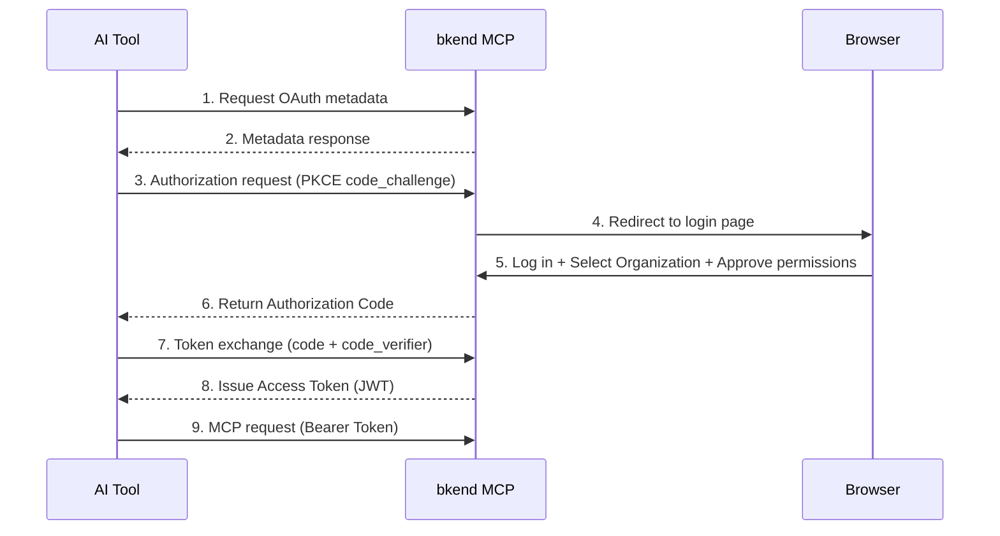

# OAuth 2.1 Authentication Setup


💡 Learn about the OAuth 2.1 authentication flow and token management for the bkend MCP server.


## Overview

bkend MCP authenticates using [OAuth 2.1](https://datatracker.ietf.org/doc/html/draft-ietf-oauth-v2-1-12) and [PKCE (RFC 7636)](https://datatracker.ietf.org/doc/html/rfc7636). Most AI tools handle this process automatically, so all you need to do is log in through your browser.

***

## Authentication Flow



***

## Authentication Steps

### Step 1: Connect to the MCP Server from Your AI Tool

Set the bkend MCP server URL in your AI tool (Claude Code, Cursor, etc.). The authentication flow starts automatically on the first request.

### Step 2: Log In via Browser

Your browser opens automatically and displays the bkend console login page.

### Step 3: Select an Organization

After logging in, select the Organization to use with MCP.


💡 You only need an Organization to start using MCP tools. Even if you have no projects yet, you can create them directly with MCP tools.


### Step 4: Approve Permissions

Review the requested permissions and approve them. Once approved, the connection to your AI tool is established automatically.

***

## Token Management

### Token Lifetimes

| Token | Lifetime | Purpose |
|------|----------|------|
| Access Token | 1 hour | API authentication (`Authorization: Bearer {token}`) |
| Refresh Token | 30 days | Renew Access Token |
| Authorization Code | 10 minutes | Token exchange (single use) |

### Automatic Renewal

Most AI tools automatically renew the Access Token using the Refresh Token when it expires.

| Scenario | Resolution |
|------|----------|
| Access Token expired | Automatic renewal (via Refresh Token) |
| Refresh Token expired (30 days) | Re-authenticate in browser |
| Token revoked | Re-authenticate in browser |

***

## OAuth Metadata

You can retrieve the bkend MCP server's OAuth metadata from the standard endpoints.



```bash
curl https://api.bkend.ai/.well-known/oauth-protected-resource
```


```bash
curl https://api.bkend.ai/.well-known/oauth-authorization-server
```

```json
{
  "issuer": "https://api.bkend.ai/mcp",
  "authorization_endpoint": "https://api.bkend.ai/mcp/oauth/authorize",
  "token_endpoint": "https://api.bkend.ai/mcp/oauth/token",
  "registration_endpoint": "https://api.bkend.ai/mcp/oauth/register",
  "revocation_endpoint": "https://api.bkend.ai/mcp/oauth/revoke",
  "code_challenge_methods_supported": ["S256"]
}
```



***

## Dynamic Client Registration

If you are building a custom MCP client, use Dynamic Client Registration based on [RFC 7591](https://datatracker.ietf.org/doc/html/rfc7591).

```bash
curl -X POST https://api.bkend.ai/mcp/oauth/register \
  -H "Content-Type: application/json" \
  -d '{
    "client_name": "My Custom Client",
    "redirect_uris": ["http://localhost:3000/callback"]
  }'
```

```json
{
  "client_id": "dyn-xxxxxxxx",
  "client_name": "My Custom Client"
}
```


💡 MCP-compatible tools like Claude Code and Cursor handle Dynamic Client Registration automatically. Use this API only when building a custom implementation.


***

## Troubleshooting

### Authentication page does not open

1. Make sure a default browser is configured
2. Verify that a firewall or proxy is not blocking access to `https://api.bkend.ai/mcp`

### Connection fails after authentication

1. Confirm that you have an Organization in the bkend console
2. Verify that the OAuth authentication completed successfully
3. Remove the MCP server configuration from your AI tool and add it again

### "Token expired" error

This means the Refresh Token has expired (30 days). Restart your AI tool and re-authentication will proceed automatically in the browser.

***

## Next Steps

- [Claude Code Setup](04-claude-code-setup.md) — Claude Code integration
- [Cursor Setup](06-cursor-setup.md) — Cursor integration
- [MCP Tools Overview](../mcp/01-overview.md) — MCP tool list and parameters

## Reference Standards

- [OAuth 2.1](https://datatracker.ietf.org/doc/html/draft-ietf-oauth-v2-1-12)
- [RFC 7636 — PKCE](https://datatracker.ietf.org/doc/html/rfc7636)
- [RFC 7591 — Dynamic Client Registration](https://datatracker.ietf.org/doc/html/rfc7591)
