# Authentication Overview


💡 bkend provides various authentication methods including email, social login, and magic link.


## Overview

To separate data per user and enforce permissions like "only the author can edit their own posts," you need user authentication.

The bkend authentication system is a core feature that manages Users in your project. It provides authentication features through REST API, from sign-up and sign-in to session management and multi-factor authentication (MFA).

***

## Authentication Decision Tree

The following diagram guides you on which authentication method to use when calling the API.

```mermaid
flowchart TD
    A[API Call] --> B{Is the endpoint public?}
    B -->|Yes| C[No auth required — call directly]
    B -->|No| D{Who is calling?}
    D -->|App user| E["JWT Token<br/>Authorization: Bearer {accessToken}"]
    D -->|Server / Batch| F["API Key<br/>X-API-Key: sk_..."]
    E --> G{Token expired?}
    G -->|Yes| H["POST /v1/auth/refresh<br/>Issue new accessToken"]
    G -->|No| I[Proceed with API call]
    H --> I
    F --> I
```



| Auth Method | Use Case | Header |
|-------------|----------|--------|
| JWT (User Token) | API calls on behalf of a user from the app | `Authorization: Bearer {accessToken}` |
| API Key (Publishable) | Client-side API calls | `X-API-Key: pk_...` |
| API Key (Secret) | Server-side API calls | `X-API-Key: sk_...` |
| No Auth | Public endpoints (isPublic) | None |

***

## Authentication Methods

bkend supports the following authentication methods.

| Method | Description | Use Case |
|--------|-------------|----------|
| **Email + Password** | Traditional email/password authentication | General web/app services |
| **Magic Link** | Sends a one-time login link via email | Passwordless sign-in |
| **Google OAuth** | Social login with Google account | Quick social login |
| **GitHub OAuth** | Social login with GitHub account | Developer-oriented services |

***

## Authentication Flow


***

## JWT Tokens

bkend uses JWT (JSON Web Token) based authentication.

| Token | Purpose | Validity |
|-------|---------|----------|
| **Access Token** | Included in auth header for API requests | Short-lived (default 1 hour) |
| **Refresh Token** | Renew Access Token when expired | Long-lived (default 7 days) |

### Authorization Header

```text
Authorization: Bearer {accessToken}
```


⚠️ When your Access Token expires, use the Refresh Token to obtain a new Access Token. If the Refresh Token also expires, you must sign in again.


***

## Required Headers

All authentication API requests require the following headers.

| Header | Value | Required | Description |
|--------|-------|:--------:|-------------|
| `X-API-Key` | `{pk_publishable_key}` | Yes | Publishable Key issued from the console |
| `Authorization` | `Bearer {accessToken}` | Conditional | For endpoints that require authentication |


💡 You can issue a Publishable Key from the console. See [API Keys](../console/11-api-keys.md) for details.


***

## User Roles

Users registered in a bkend project can have the following roles.

| Role | Description |
|------|-------------|
| `admin` | Administrator -- full access to all data |
| `user` | Regular user -- default role |
| `guest` | Guest -- limited access |

Data access permissions vary by role. See [RLS Policies](../security/05-rls-policies.md) for details.

***

## Key Features

### Account Management

- [Email Sign-up](02-email-signup.md) -- Create an account with email and password
- [Email Sign-in](03-email-signin.md) -- Sign in with email and password
- [Magic Link](04-magic-link.md) -- Sign in via email without a password
- [Account Deletion](16-account-deletion.md) -- Delete your account

### Social Login

- [Social Login Overview](05-social-overview.md) -- Understanding OAuth authentication flow
- [Google OAuth](06-social-google.md) -- Google account integration
- [GitHub OAuth](07-social-github.md) -- GitHub account integration

### Security

- [Password Management](08-password-management.md) -- Password reset and change
- [Email Verification](09-email-verification.md) -- Verify email ownership
- [Session Management](10-session-management.md) -- View and terminate active sessions
- [Multi-Factor Authentication (MFA)](11-mfa.md) -- TOTP-based two-step verification

### User Management

- [Account Linking](12-account-linking.md) -- Link multiple social accounts
- [Invitation System](13-invitation.md) -- Invite users via email
- [User Profile](14-user-profile.md) -- Manage profile and avatar
- [User Management](15-user-management.md) -- User list, roles, and settings

### Settings

- [Auth Provider Configuration](17-provider-config.md) -- OAuth and email auth settings
- [Email Templates](18-email-templates.md) -- Customize authentication emails

***

## Next Steps

- [Email Sign-up](02-email-signup.md) -- Implement your first authentication
- [Auth & User REST API Reference](19-api-reference.md) -- Full API listing
- [Issue API Keys in Console](../console/11-api-keys.md) -- Generate API access tokens
- [Hands-on Project Cookbooks](../../cookbooks/README.md) -- Build real apps with authentication
