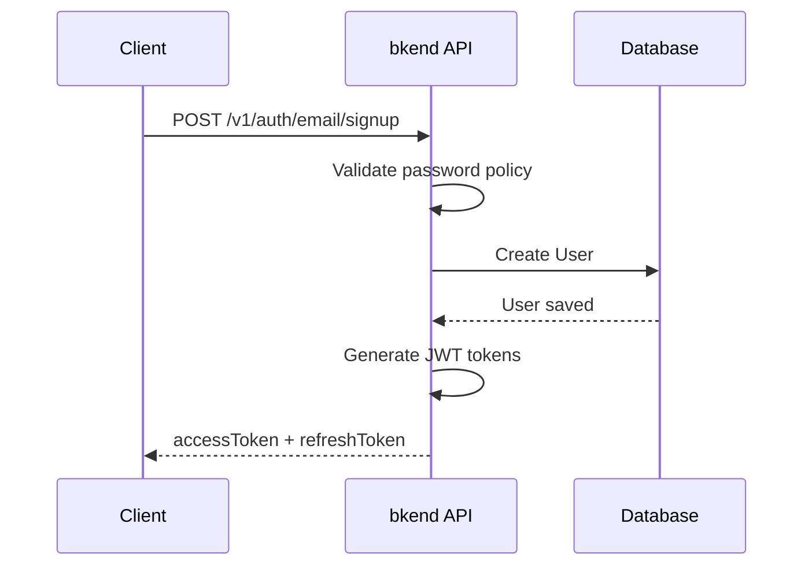

# Email Sign-up


Create a new User account with an email and password.



**Before You Start** — You need the following to proceed:
- [Project created](../getting-started/02-quickstart.md)
- [Email auth provider enabled](17-provider-config.md) (enabled by default)



**APIs Used in This Document**

| Endpoint | Method | Auth | Description |
|----------|:------:|:----:|-------------|
| `/v1/auth/email/signup` | POST | Not required | Email sign-up |


## Overview

Email sign-up is the most basic authentication method. A User enters an email and password to create an account and immediately receives JWT tokens.

***

## Sign-up Flow



***

## REST API

### POST /v1/auth/email/signup



```bash
curl -X POST https://api-client.bkend.ai/v1/auth/email/signup \
  -H "Content-Type: application/json" \
  -H "X-API-Key: {pk_publishable_key}" \
  -d '{
    "method": "password",
    "email": "user@example.com",
    "password": "MyP@ssw0rd!",
    "name": "John Doe"
  }'
```


```javascript
const response = await fetch('https://api-client.bkend.ai/v1/auth/email/signup', {
  method: 'POST',
  headers: {
    'Content-Type': 'application/json',
    'X-API-Key': '{pk_publishable_key}',
  },
  body: JSON.stringify({
    method: 'password',
    email: 'user@example.com',
    password: 'MyP@ssw0rd!',
    name: 'John Doe',
  }),
});

const data = await response.json();
// data.accessToken, data.refreshToken
```



### Request Parameters

| Parameter | Type | Required | Description |
|-----------|------|:--------:|-------------|
| `method` | `string` | Yes | Fixed value `"password"` |
| `email` | `string` | Yes | User email address |
| `password` | `string` | Yes | Password (see policy below) |
| `name` | `string` | Yes | User name |


Terms of service and privacy policy consent are required during sign-up. See [User Profile](14-user-profile.md) for details on terms.


### Password Policy

The default password policy requires a minimum of 6 characters.

| Rule | Default |
|------|---------|
| Minimum length | 6 characters |


**Strengthen your password policy before deploying to production.** You can configure requirements such as uppercase, lowercase, numbers, and special characters in [Auth Provider Configuration](17-provider-config.md).


### Success Response

```json
{
  "accessToken": "eyJhbGciOiJIUzI1NiIs...",
  "refreshToken": "eyJhbGciOiJIUzI1NiIs...",
  "tokenType": "Bearer",
  "expiresIn": 3600
}
```

| Field | Type | Description |
|-------|------|-------------|
| `accessToken` | `string` | JWT Access Token |
| `refreshToken` | `string` | JWT Refresh Token |
| `tokenType` | `string` | Token type (`"Bearer"`) |
| `expiresIn` | `number` | Access Token expiration time (seconds) |

### Error Responses

| Error Code | HTTP | Description |
|------------|:----:|-------------|
| `auth/invalid-email` | 400 | Invalid email format |
| `auth/invalid-password-format` | 400 | Password policy violation |
| `auth/email-already-exists` | 409 | Email already registered |

***

## Using in Your App

The `bkendFetch` helper automatically includes the required headers.

```javascript
import { bkendFetch } from './bkend.js';

const result = await bkendFetch('/v1/auth/email/signup', {
  method: 'POST',
  body: {
    method: 'password',
    email: 'user@example.com',
    password: 'MyP@ssw0rd!',
    name: 'John Doe',
  },
});

// Save tokens
localStorage.setItem('accessToken', result.accessToken);
localStorage.setItem('refreshToken', result.refreshToken);
```


See [Integrating bkend in Your App](../getting-started/03-app-integration.md) for `bkendFetch` setup.


***

## Email Verification

After sign-up, you can request email verification to send a verification email. Email verification is optional, but it is required for features like password reset.

See [Email Verification](09-email-verification.md) for details.

***

## Next Steps

- [Email Sign-in](03-email-signin.md) -- Sign in with the account you created
- [Magic Link](04-magic-link.md) -- Sign up/in without a password
- [Email Verification](09-email-verification.md) -- Verify email ownership
