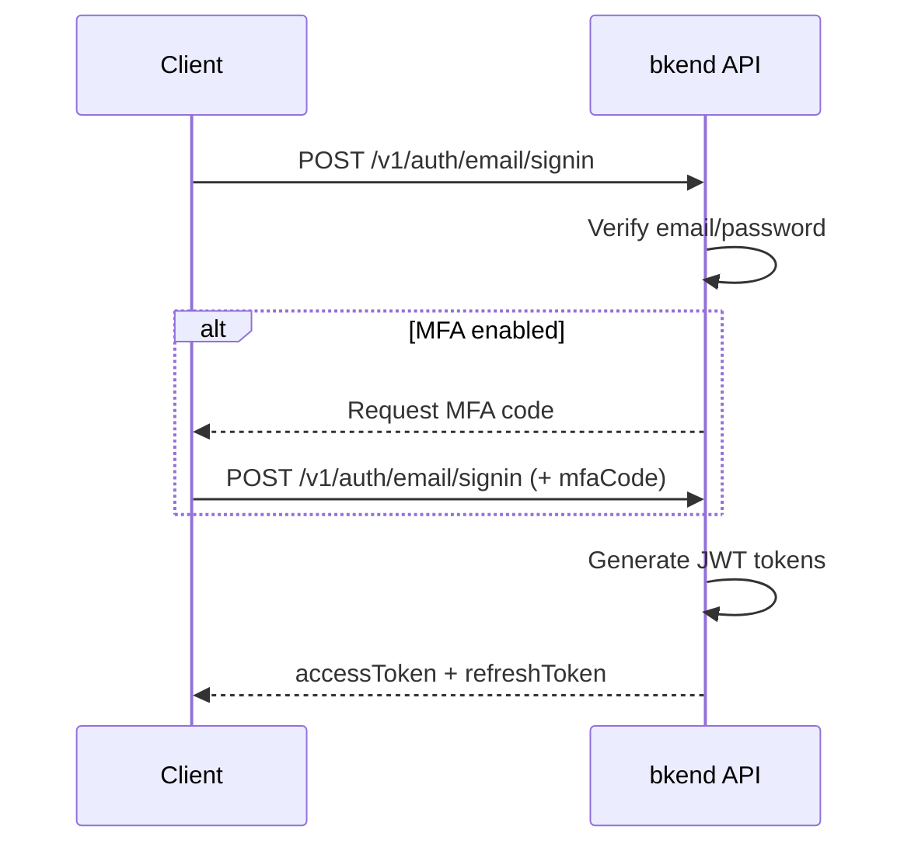

# Email Sign-in


Sign in with your email and password to receive JWT tokens.



**Before You Start** — You need the following to proceed:
- [Project created](../getting-started/02-quickstart.md)
- [Email sign-up](02-email-signup.md) completed (you need an account to sign in)
- [Email auth provider enabled](17-provider-config.md) (enabled by default)



**APIs Used in This Document**

| Endpoint | Method | Auth | Description |
|----------|:------:|:----:|-------------|
| `/v1/auth/email/signin` | POST | Not required | Email sign-in |
| `/v1/auth/refresh` | POST | Not required | Token refresh |


## Overview

Signing in with a registered email and password issues an Access Token and Refresh Token. Accounts with MFA enabled must also submit a TOTP code.

***

## Sign-in Flow



***

## REST API

### POST /v1/auth/email/signin



```bash
curl -X POST https://api-client.bkend.ai/v1/auth/email/signin \
  -H "Content-Type: application/json" \
  -H "X-API-Key: {pk_publishable_key}" \
  -d '{
    "method": "password",
    "email": "user@example.com",
    "password": "MyP@ssw0rd!"
  }'
```


```javascript
const response = await fetch('https://api-client.bkend.ai/v1/auth/email/signin', {
  method: 'POST',
  headers: {
    'Content-Type': 'application/json',
    'X-API-Key': '{pk_publishable_key}',
  },
  body: JSON.stringify({
    method: 'password',
    email: 'user@example.com',
    password: 'MyP@ssw0rd!',
  }),
});

const data = await response.json();
```



### Request Parameters

| Parameter | Type | Required | Description |
|-----------|------|:--------:|-------------|
| `method` | `string` | Yes | Fixed value `"password"` |
| `email` | `string` | Yes | Registered email address |
| `password` | `string` | Yes | Password |
| `mfaCode` | `string` | Conditional | 6-digit TOTP code when MFA is enabled |

### When MFA Is Enabled

Accounts with MFA enabled must include `mfaCode` in the request.

```bash
curl -X POST https://api-client.bkend.ai/v1/auth/email/signin \
  -H "Content-Type: application/json" \
  -H "X-API-Key: {pk_publishable_key}" \
  -d '{
    "method": "password",
    "email": "user@example.com",
    "password": "MyP@ssw0rd!",
    "mfaCode": "123456"
  }'
```

### Success Response

```json
{
  "accessToken": "eyJhbGciOiJIUzI1NiIs...",
  "refreshToken": "eyJhbGciOiJIUzI1NiIs...",
  "tokenType": "Bearer",
  "expiresIn": 3600
}
```

### Error Responses

| Error Code | HTTP | Description |
|------------|:----:|-------------|
| `auth/invalid-email` | 400 | Invalid email format |
| `auth/invalid-credentials` | 401 | Email or password mismatch |
| `auth/mfa-required` | 403 | MFA code required |
| `auth/invalid-mfa-code` | 401 | Invalid MFA code |
| `auth/account-banned` | 403 | Account is suspended |

***

## Using in Your App

The `bkendFetch` helper automatically includes the required headers.

```javascript
import { bkendFetch } from './bkend.js';

const result = await bkendFetch('/v1/auth/email/signin', {
  method: 'POST',
  body: {
    method: 'password',
    email: 'user@example.com',
    password: 'MyP@ssw0rd!',
  },
});

localStorage.setItem('accessToken', result.accessToken);
localStorage.setItem('refreshToken', result.refreshToken);
```


See [Integrating bkend in Your App](../getting-started/03-app-integration.md) for `bkendFetch` setup.


***

## Token Refresh

When your Access Token expires, use the Refresh Token to obtain new tokens.

```bash
curl -X POST https://api-client.bkend.ai/v1/auth/refresh \
  -H "Content-Type: application/json" \
  -H "X-API-Key: {pk_publishable_key}" \
  -d '{
    "refreshToken": "{refresh_token}"
  }'
```

See [Session Management](10-session-management.md) for details.

***

## Next Steps

- [Magic Link](04-magic-link.md) -- Sign in without a password
- [Password Management](08-password-management.md) -- Password reset
- [Multi-Factor Authentication (MFA)](11-mfa.md) -- Set up two-step verification
