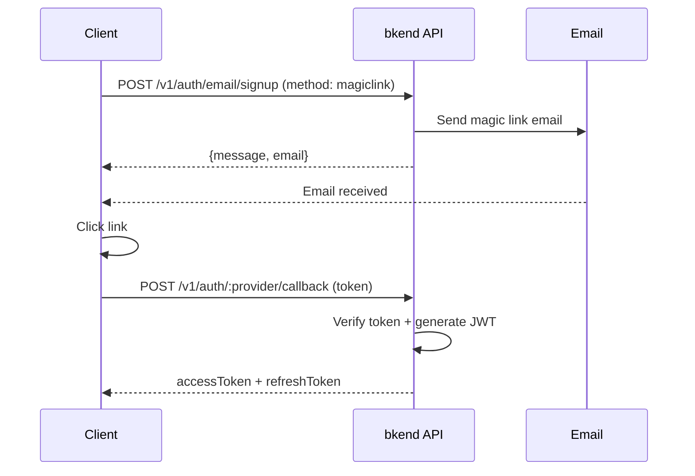

# Magic Link Authentication


💡 Sign up and sign in using just an email link, without a password.


## Overview

Magic Link is an authentication method that sends a one-time login link via email without requiring a password. When a User clicks the link in the email, authentication is completed automatically.

***

## Magic Link Flow



***

## Magic Link Sign-up

### POST /v1/auth/email/signup



```bash
curl -X POST https://api-client.bkend.ai/v1/auth/email/signup \
  -H "Content-Type: application/json" \
  -H "X-API-Key: {pk_publishable_key}" \
  -d '{
    "method": "magiclink",
    "email": "user@example.com",
    "callbackUrl": "https://myapp.com/auth/callback"
  }'
```


```javascript
const response = await fetch('https://api-client.bkend.ai/v1/auth/email/signup', {
  method: 'POST',
  headers: {
    'Content-Type': 'application/json',
    'X-API-Key': '{pk_publishable_key}',
  },
  body: JSON.stringify({
    method: 'magiclink',
    email: 'user@example.com',
    callbackUrl: 'https://myapp.com/auth/callback',
  }),
});
```



### Request Parameters

| Parameter | Type | Required | Description |
|-----------|------|:--------:|-------------|
| `method` | `string` | Yes | Fixed value `"magiclink"` |
| `email` | `string` | Yes | User email address |
| `callbackUrl` | `string` | Yes | Redirect URL after authentication |

### Success Response

```json
{
  "message": "Magic link sent successfully",
  "email": "user@example.com"
}
```


💡 If you request a magic link sign-up with an already registered email, a login link is sent instead. No separate sign-up/sign-in branching is needed.


***

## Magic Link Sign-in

### POST /v1/auth/email/signin

```bash
curl -X POST https://api-client.bkend.ai/v1/auth/email/signin \
  -H "Content-Type: application/json" \
  -H "X-API-Key: {pk_publishable_key}" \
  -d '{
    "method": "magiclink",
    "email": "user@example.com",
    "callbackUrl": "https://myapp.com/auth/callback"
  }'
```

The request parameters are the same as sign-up.

***

## Callback Handling

When a User clicks the magic link in the email, they are redirected to the `callbackUrl` with a `token` parameter in the URL.

```text
https://myapp.com/auth/callback?token={magic_link_token}
```

Use this token to obtain JWT tokens.

### POST /v1/auth/email/callback

```bash
curl -X POST https://api-client.bkend.ai/v1/auth/email/callback \
  -H "Content-Type: application/json" \
  -H "X-API-Key: {pk_publishable_key}" \
  -d '{
    "token": "{magic_link_token}"
  }'
```

### Success Response

```json
{
  "accessToken": "eyJhbGciOiJIUzI1NiIs...",
  "refreshToken": "eyJhbGciOiJIUzI1NiIs...",
  "tokenType": "Bearer",
  "expiresIn": 3600,
  "is_new_user": true
}
```

| Field | Type | Description |
|-------|------|-------------|
| `is_new_user` | `boolean` | Whether the user is new (`true`: sign-up, `false`: sign-in) |

***

## Magic Link Settings

You can configure whether magic link is enabled and its expiration time in [Auth Provider Configuration](17-provider-config.md).

| Setting | Default | Description |
|---------|---------|-------------|
| `magicLinkEnabled` | `true` | Whether magic link is enabled |
| `magicLinkExpirationMinutes` | 15 | Link expiration time (minutes) |

***

## Error Responses

| Error Code | HTTP | Description |
|------------|:----:|-------------|
| `auth/invalid-email` | 400 | Invalid email format |
| `auth/invalid-token` | 401 | Invalid magic link token |
| `auth/token-expired` | 401 | Magic link has expired |
| `auth/magiclink-disabled` | 400 | Magic link is disabled |

***

## Next Steps

- [Social Login Overview](05-social-overview.md) -- OAuth authentication methods
- [Email Sign-up](02-email-signup.md) -- Password-based sign-up
- [Auth Provider Configuration](17-provider-config.md) -- Change magic link settings
