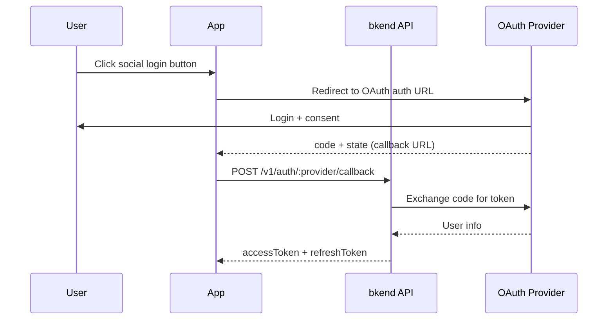

# Social Login Overview


Sign in easily through external OAuth providers such as Google and GitHub.


## Overview

Social login is an authentication method that allows users to sign in with an external authentication provider's account (Google, GitHub) based on the OAuth 2.0 protocol. Users can quickly sign up and sign in with their existing social accounts without a separate password.

***

## Supported Providers

| Provider | Protocol | Description |
|----------|----------|-------------|
| **Google** | OAuth 2.0 + OpenID Connect | Google account login |
| **GitHub** | OAuth 2.0 | GitHub account login |

***

## OAuth Authentication Flow



***

## Step 1: Redirect to the OAuth Provider URL

Construct the OAuth provider's authentication URL in your app and redirect the User.



```javascript
const GOOGLE_AUTH_URL = 'https://accounts.google.com/o/oauth2/v2/auth';
const params = new URLSearchParams({
  client_id: '{google_client_id}',
  redirect_uri: 'https://myapp.com/auth/callback',
  response_type: 'code',
  scope: 'openid email profile',
  state: crypto.randomUUID(),
});

window.location.href = `${GOOGLE_AUTH_URL}?${params}`;
```


```javascript
const GITHUB_AUTH_URL = 'https://github.com/login/oauth/authorize';
const params = new URLSearchParams({
  client_id: '{github_client_id}',
  redirect_uri: 'https://myapp.com/auth/callback',
  scope: 'user:email',
  state: crypto.randomUUID(),
});

window.location.href = `${GITHUB_AUTH_URL}?${params}`;
```



| Parameter | Description |
|-----------|-------------|
| `client_id` | Client ID issued from the OAuth provider's developer console |
| `redirect_uri` | Callback URL to redirect to after authentication |
| `response_type` | Fixed value `code` (Authorization Code Flow) |
| `scope` | Requested permission scope |
| `state` | Random value for CSRF protection -- must be verified in the callback |


`client_id` is safe to use on the client (frontend). The `Client Secret` is registered on the bkend server and should never be exposed to the client.


***

## Step 2: Handle the Callback

After authentication with the OAuth provider, you are redirected to the callback URL with an authorization code. Pass this code to the bkend API to obtain JWT tokens.

### POST /v1/auth/:provider/callback



```bash
curl -X POST https://api-client.bkend.ai/v1/auth/google/callback \
  -H "Content-Type: application/json" \
  -H "X-API-Key: {pk_publishable_key}" \
  -d '{
    "code": "{authorization_code}",
    "redirectUri": "https://myapp.com/auth/callback",
    "state": "{state_value}"
  }'
```


```javascript
// Extract code from callback URL
const urlParams = new URLSearchParams(window.location.search);
const code = urlParams.get('code');
const state = urlParams.get('state');

const response = await fetch('https://api-client.bkend.ai/v1/auth/google/callback', {
  method: 'POST',
  headers: {
    'Content-Type': 'application/json',
    'X-API-Key': '{pk_publishable_key}',
  },
  body: JSON.stringify({
    code,
    redirectUri: window.location.origin + '/auth/callback',
    state,
  }),
});

const data = await response.json();
// data.accessToken, data.refreshToken, data.is_new_user
```



#### Request Parameters

| Parameter | Type | Required | Description |
|-----------|------|:--------:|-------------|
| `code` | `string` | Conditional | OAuth authorization code |
| `redirectUri` | `string` | Yes | Redirect URI used during OAuth authentication |
| `idToken` | `string` | Conditional | ID token (for Google) |
| `accessToken` | `string` | - | OAuth access token |
| `state` | `string` | - | CSRF prevention state value |


You must provide at least one of `code` or `idToken`.


#### Success Response

```json
{
  "accessToken": "eyJhbGciOiJIUzI1NiIs...",
  "refreshToken": "eyJhbGciOiJIUzI1NiIs...",
  "tokenType": "Bearer",
  "expiresIn": 3600,
  "is_new_user": true
}
```

| Field | Type | Description |
|-------|------|-------------|
| `is_new_user` | `boolean` | `true`: first login (auto sign-up), `false`: existing user |

***

## Error Responses

| Error Code | HTTP | Description |
|------------|:----:|-------------|
| `auth/unsupported-provider` | 400 | Unsupported OAuth provider |
| `auth/oauth-not-configured` | 400 | OAuth configuration is incomplete |
| `auth/invalid-oauth-code` | 401 | Invalid authorization code |
| `auth/oauth-callback-failed` | 500 | OAuth callback processing failed |

***

## OAuth Configuration

To use social login, you must first configure the OAuth provider.

1. Create an OAuth app in each provider's developer console.
2. Obtain the `Client ID` and `Client Secret`.
3. Register them in bkend via [Auth Provider Configuration](17-provider-config.md).

***

## Next Steps

- [Google OAuth](06-social-google.md) -- Google login setup guide
- [GitHub OAuth](07-social-github.md) -- GitHub login setup guide
- [Account Linking](12-account-linking.md) -- Add social login to an existing account
