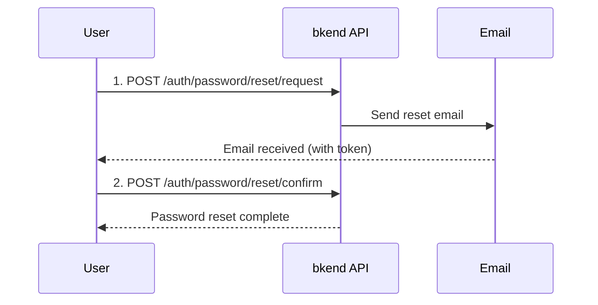

# Password Reset & Change


💡 Reset a forgotten password or change your existing one.


## Overview

bkend provides two password management features.

| Feature | Auth Required | Purpose |
|---------|:------------:|---------|
| **Password Reset** | No | Reset via email when you forget your password |
| **Password Change** | Yes | Change your password while signed in |

***

## Password Reset

A 3-step flow for Users who have forgotten their password to set a new one via email.



### Step 1: Request Reset

```bash
curl -X POST https://api-client.bkend.ai/v1/auth/password/reset/request \
  -H "Content-Type: application/json" \
  -H "X-API-Key: {pk_publishable_key}" \
  -d '{
    "email": "user@example.com"
  }'
```

| Parameter | Type | Required | Description |
|-----------|------|:--------:|-------------|
| `email` | `string` | Yes | Registered email address |


💡 For security, even if an unregistered email is entered, the same success response is returned. This prevents email existence from being exposed.


### Step 2: Confirm Password Reset

Submit the token from the email along with a new password.

```bash
curl -X POST https://api-client.bkend.ai/v1/auth/password/reset/confirm \
  -H "Content-Type: application/json" \
  -H "X-API-Key: {pk_publishable_key}" \
  -d '{
    "email": "user@example.com",
    "token": "{reset_token}",
    "newPassword": "NewP@ssw0rd!"
  }'
```

| Parameter | Type | Required | Description |
|-----------|------|:--------:|-------------|
| `email` | `string` | Yes | Email address |
| `token` | `string` | Yes | Reset token received via email |
| `newPassword` | `string` | Yes | New password (must comply with password policy) |

***

## Password Change

Change your current password to a new one while signed in.

### POST /v1/auth/password/change



```bash
curl -X POST https://api-client.bkend.ai/v1/auth/password/change \
  -H "Content-Type: application/json" \
  -H "X-API-Key: {pk_publishable_key}" \
  -H "Authorization: Bearer {accessToken}" \
  -d '{
    "currentPassword": "MyP@ssw0rd!",
    "newPassword": "NewP@ssw0rd!"
  }'
```


```javascript
const response = await fetch('https://api-client.bkend.ai/v1/auth/password/change', {
  method: 'POST',
  headers: {
    'Content-Type': 'application/json',
    'X-API-Key': '{pk_publishable_key}',
    'Authorization': `Bearer ${accessToken}`,
  },
  body: JSON.stringify({
    currentPassword: 'MyP@ssw0rd!',
    newPassword: 'NewP@ssw0rd!',
  }),
});
```



| Parameter | Type | Required | Description |
|-----------|------|:--------:|-------------|
| `currentPassword` | `string` | Yes | Current password |
| `newPassword` | `string` | Yes | New password (must differ from current) |

***

## Error Responses

| Error Code | HTTP | Description |
|------------|:----:|-------------|
| `auth/invalid-email` | 400 | Invalid email format |
| `auth/verification-token-not-found` | 404 | Reset token not found |
| `auth/verification-token-expired` | 401 | Reset token has expired (24 hours) |
| `auth/invalid-password-format` | 400 | Password policy violation (min 8 chars, at least 1 uppercase, lowercase, number, and special character) |
| `auth/weak-password` | 400 | Password found in leaked password database |
| `auth/invalid-password` | 401 | Current password does not match |
| `auth/same-as-previous-password` | 400 | New password is the same as current |
| `auth/account-not-found` | 404 | Account not found |


💡 After a successful password change, all sessions are invalidated and the user is forced to sign in again on all devices.


***

## Next Steps

- [Email Verification](09-email-verification.md) -- Verify email ownership
- [Multi-Factor Authentication (MFA)](11-mfa.md) -- Additional security setup
- [Auth Provider Configuration](17-provider-config.md) -- Change password policy
