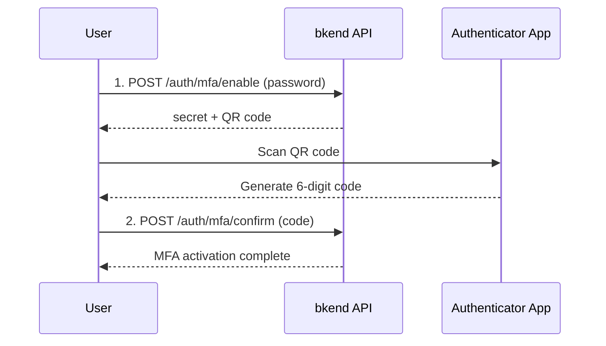

# Multi-Factor Authentication (MFA)


💡 Strengthen your account security with TOTP-based two-step verification.


## Overview

Multi-Factor Authentication (MFA) enhances account security by requiring an additional authentication step beyond the password. bkend supports TOTP (Time-based One-Time Password) and is compatible with apps like Google Authenticator and Authy.

***

## MFA Setup Flow



***

## Enable MFA

### Step 1: Prepare MFA Activation

```bash
curl -X POST https://api-client.bkend.ai/v1/auth/mfa/enable \
  -H "Content-Type: application/json" \
  -H "X-API-Key: {pk_publishable_key}" \
  -H "Authorization: Bearer {accessToken}" \
  -d '{
    "password": "MyP@ssw0rd!"
  }'
```

| Parameter | Type | Required | Description |
|-----------|------|:--------:|-------------|
| `password` | `string` | Yes | Current password (identity verification) |

**Response:**

```json
{
  "secret": "JBSWY3DPEHPK3PXP",
  "qrCodeUrl": "otpauth://totp/bkend:user@example.com?secret=JBSWY3DPEHPK3PXP&issuer=bkend",
  "backupCodes": [
    "a1b2c3d4",
    "e5f6g7h8",
    "..."
  ]
}
```

| Field | Description |
|-------|-------------|
| `secret` | TOTP secret key (for manual entry) |
| `qrCodeUrl` | QR code URL for the authenticator app |
| `backupCodes` | Backup recovery codes (save securely) |

### Step 2: Confirm MFA Activation

Enter the 6-digit code generated by your Authenticator app.

```bash
curl -X POST https://api-client.bkend.ai/v1/auth/mfa/confirm \
  -H "Content-Type: application/json" \
  -H "X-API-Key: {pk_publishable_key}" \
  -H "Authorization: Bearer {accessToken}" \
  -d '{
    "code": "123456"
  }'
```

| Parameter | Type | Required | Description |
|-----------|------|:--------:|-------------|
| `code` | `string` | Yes | 6-digit code from the Authenticator app |


✅ Once MFA is enabled, you must enter a 6-digit code along with your password for subsequent sign-ins.


***

## Disable MFA

### POST /v1/auth/mfa/disable

```bash
curl -X POST https://api-client.bkend.ai/v1/auth/mfa/disable \
  -H "Content-Type: application/json" \
  -H "X-API-Key: {pk_publishable_key}" \
  -H "Authorization: Bearer {accessToken}" \
  -d '{
    "password": "MyP@ssw0rd!",
    "code": "123456"
  }'
```

| Parameter | Type | Required | Description |
|-----------|------|:--------:|-------------|
| `password` | `string` | Yes | Current password |
| `code` | `string` | - | 6-digit code from the Authenticator app |


🚨 **Warning** -- Disabling MFA weakens your account security.


***

## MFA Sign-in

When signing in with MFA enabled, include `mfaCode` in the request.

```bash
curl -X POST https://api-client.bkend.ai/v1/auth/email/signin \
  -H "Content-Type: application/json" \
  -H "X-API-Key: {pk_publishable_key}" \
  -d '{
    "method": "password",
    "email": "user@example.com",
    "password": "MyP@ssw0rd!",
    "mfaCode": "123456"
  }'
```

***

## Error Responses

| Error Code | HTTP | Description |
|------------|:----:|-------------|
| `auth/invalid-credentials` | 401 | Incorrect password |
| `auth/invalid-mfa-code` | 401 | Incorrect MFA code |
| `auth/mfa-already-enabled` | 400 | MFA is already enabled |
| `auth/mfa-not-enabled` | 400 | MFA is not enabled on this account |

***

## Next Steps

- [Email Sign-in](03-email-signin.md) -- MFA sign-in
- [Session Management](10-session-management.md) -- Check active sessions
- [Security Best Practices](../security/07-best-practices.md) -- Security recommendations

## Reference Standards

- [RFC 6238 -- TOTP](https://datatracker.ietf.org/doc/html/rfc6238)
