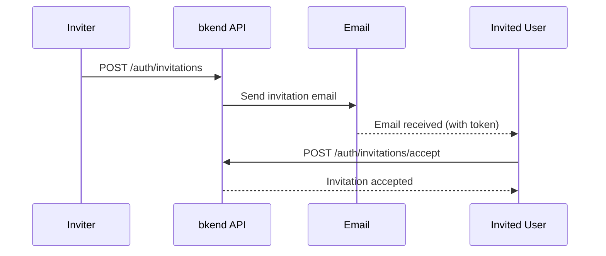

# Invitation System


💡 Invite users to your organization or project via email.


## Overview

The invitation system allows existing members to invite new users to an organization or project. Invited users can accept or decline the invitation by clicking the link in the email.

***

## Invitation Flow



***

## Create an Invitation

### POST /v1/auth/invitations



```bash
curl -X POST https://api-client.bkend.ai/v1/auth/invitations \
  -H "Content-Type: application/json" \
  -H "X-API-Key: {pk_publishable_key}" \
  -H "Authorization: Bearer {accessToken}" \
  -d '{
    "resourceType": "organization",
    "resourceId": "{org_id}",
    "resourceName": "My Organization",
    "email": "newuser@example.com",
    "name": "Jane Smith",
    "resourceRole": "member"
  }'
```



### Request Parameters

| Parameter | Type | Required | Description |
|-----------|------|:--------:|-------------|
| `resourceType` | `string` | Yes | `"organization"` or `"project"` |
| `resourceId` | `string` | Yes | Organization or project ID |
| `resourceName` | `string` | - | Resource name (displayed in the email) |
| `email` | `string` | Yes | Email address to invite |
| `name` | `string` | - | Name of the invited user |
| `resourceRole` | `string` | Yes | Role to assign |
| `inviterName` | `string` | - | Inviter's name (displayed in the email) |

### Success Response

```json
{
  "id": "invitation-uuid",
  "resourceType": "organization",
  "resourceId": "org-uuid",
  "resourceName": "My Organization",
  "resourceRole": "member",
  "email": "newuser@example.com",
  "status": "pending",
  "expiresAt": "2025-01-28T00:00:00.000Z",
  "invitedBy": "admin-uuid",
  "createdAt": "2025-01-21T00:00:00.000Z"
}
```


💡 Invitations expire after 7 days by default.


***

## List Invitations

### GET /v1/auth/invitations

```bash
curl -X GET "https://api-client.bkend.ai/v1/auth/invitations?resourceType=organization&status=pending&page=1&limit=10" \
  -H "X-API-Key: {pk_publishable_key}" \
  -H "Authorization: Bearer {accessToken}"
```

| Parameter | Location | Type | Required | Description |
|-----------|----------|------|:--------:|-------------|
| `resourceType` | Query | `string` | - | `organization` or `project` |
| `resourceId` | Query | `string` | - | Resource ID filter |
| `status` | Query | `string` | - | `pending`, `accepted`, `rejected`, `expired`, `revoked` |
| `page` | Query | `number` | - | Page number (default: 1) |
| `limit` | Query | `number` | - | Items per page (default: 10) |

***

## Get Invitation Details

### GET /v1/auth/invitations/:invitationId

```bash
curl -X GET https://api-client.bkend.ai/v1/auth/invitations/{invitationId} \
  -H "X-API-Key: {pk_publishable_key}" \
  -H "Authorization: Bearer {accessToken}"
```

***

## Accept an Invitation

### POST /v1/auth/invitations/accept

Accept an invitation using the token from the invitation email. This can be used without authentication.

```bash
curl -X POST https://api-client.bkend.ai/v1/auth/invitations/accept \
  -H "Content-Type: application/json" \
  -H "X-API-Key: {pk_publishable_key}" \
  -d '{
    "token": "{invitation_token}",
    "email": "newuser@example.com"
  }'
```

| Parameter | Type | Required | Description |
|-----------|------|:--------:|-------------|
| `token` | `string` | Yes | Invitation token (included in the email) |
| `email` | `string` | - | Email address (for additional verification) |

***

## Decline an Invitation

### POST /v1/auth/invitations/reject

```bash
curl -X POST https://api-client.bkend.ai/v1/auth/invitations/reject \
  -H "Content-Type: application/json" \
  -H "X-API-Key: {pk_publishable_key}" \
  -d '{
    "token": "{invitation_token}",
    "email": "newuser@example.com"
  }'
```

***

## Revoke an Invitation

### DELETE /v1/auth/invitations/:invitationId

Revoke an invitation. Only the inviter can revoke it.

```bash
curl -X DELETE https://api-client.bkend.ai/v1/auth/invitations/{invitationId} \
  -H "X-API-Key: {pk_publishable_key}" \
  -H "Authorization: Bearer {accessToken}"
```

***

## Invitation Statuses

| Status | Description |
|--------|-------------|
| `pending` | Pending -- no response yet |
| `accepted` | Accepted |
| `rejected` | Declined |
| `expired` | Expired (after 7 days) |
| `revoked` | Revoked (by the inviter) |

***

## Error Responses

| Error Code | HTTP | Description |
|------------|:----:|-------------|
| `auth/invalid-token` | 401 | Invalid invitation token |
| `auth/invitation-expired` | 400 | Invitation has expired |
| `auth/invitation-already-accepted` | 400 | Invitation already accepted |
| `auth/invitation-not-found` | 404 | Invitation not found |
| `auth/unauthorized` | 401 | Authentication required |

***

## Next Steps

- [Team Management](../console/06-team-management.md) -- Manage team members in the console
- [User Management](15-user-management.md) -- Change user roles
- [Authentication Overview](01-overview.md) -- Understanding the authentication flow
