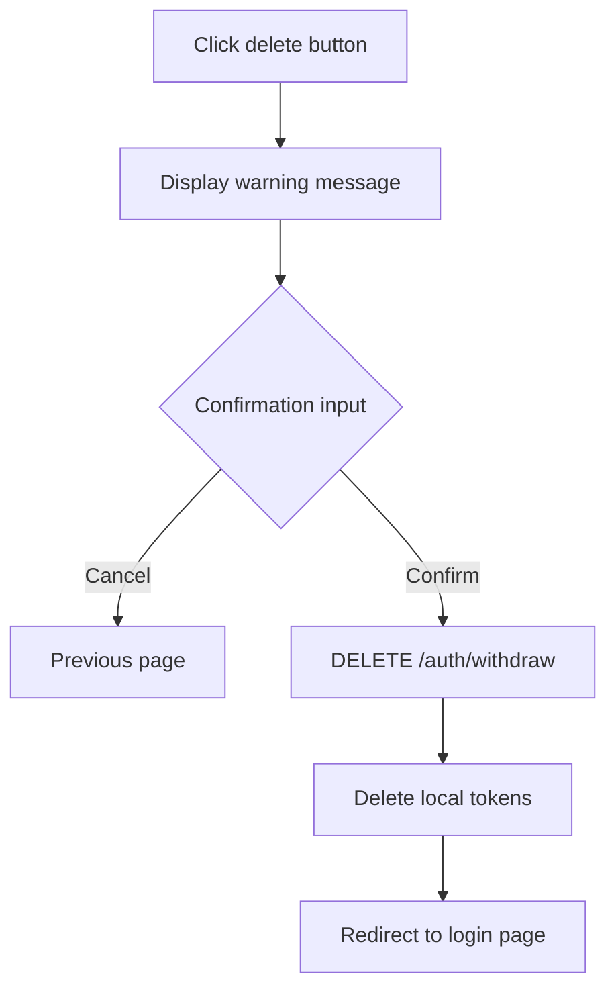

# Account Deletion


Users can delete their account to withdraw from the service.


## Overview

Account deletion (Withdraw) allows a User to delete their own account. Upon deletion, sessions are terminated and authentication data is removed.

***

## Delete Account

### DELETE /v1/auth/withdraw



```bash
curl -X DELETE https://api-client.bkend.ai/v1/auth/withdraw \
  -H "X-API-Key: {pk_publishable_key}" \
  -H "Authorization: Bearer {accessToken}"
```


```javascript
const response = await fetch('https://api-client.bkend.ai/v1/auth/withdraw', {
  method: 'DELETE',
  headers: {
    'X-API-Key': '{pk_publishable_key}',
    'Authorization': `Bearer ${accessToken}`,
  },
});

if (response.ok) {
  // Delete local tokens and redirect to login page
  localStorage.removeItem('accessToken');
  localStorage.removeItem('refreshToken');
  window.location.href = '/login';
}
```




**Warning** -- Account deletion is irreversible. Prompt the User for confirmation before proceeding.


***

## What Happens on Deletion

| Item | Action |
|------|--------|
| Sessions | All active sessions terminated |
| Tokens | Access Token and Refresh Token invalidated |
| Linked accounts | Social login connections removed |
| User data | Processed as soft delete |

***

## Recommended Confirmation UI

When implementing the deletion feature, add the following confirmation steps.



***

## Error Responses

| Error Code | HTTP | Description |
|------------|:----:|-------------|
| `auth/unauthorized` | 401 | Authentication required |

***

## Next Steps

- [Email Sign-up](02-email-signup.md) -- Create a new account
- [Session Management](10-session-management.md) -- Terminate sessions
- [Authentication Overview](01-overview.md) -- Understanding the authentication flow
