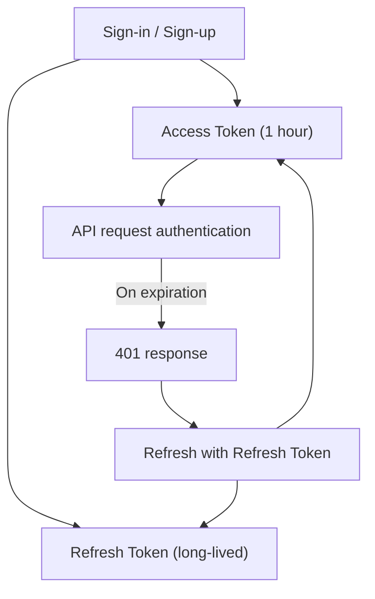
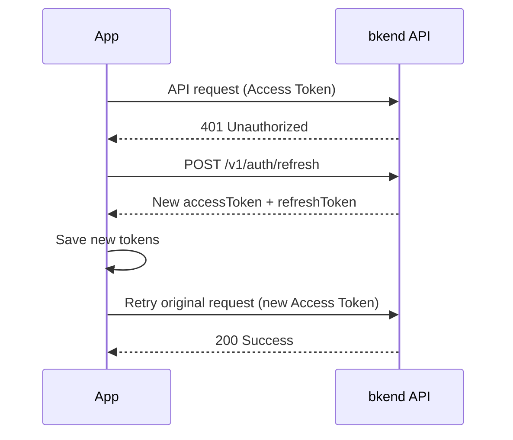
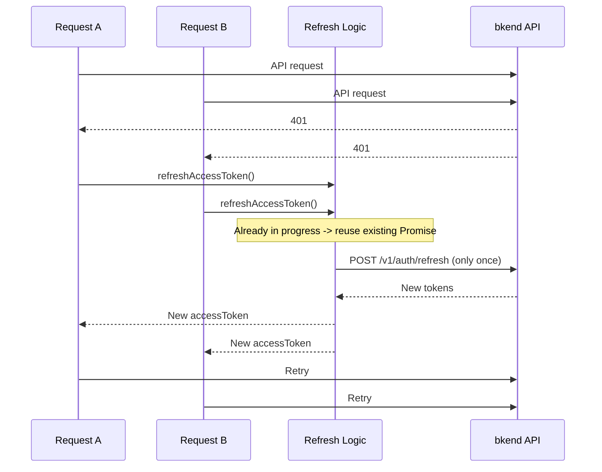

# Token Storage & Refresh


Learn how to securely store Access Tokens and Refresh Tokens, and automatically refresh them on expiration.


## Overview

bkend authentication uses JWT-based Access Token / Refresh Token pairs. The Access Token is used for API request authentication and expires after 1 hour (3600 seconds). An expired Access Token can be refreshed using the Refresh Token.

This document covers token storage locations, automatic refresh logic, token cleanup on sign-out, and how to implement all of this in a single fetch wrapper function.

***

## Token Structure



| Token | Purpose | Expiration |
|-------|---------|------------|
| `accessToken` | Used in the `Authorization` header for API requests | 3600 seconds (1 hour) |
| `refreshToken` | Refresh an expired Access Token | Long-lived (varies by server configuration) |

***

## Token Storage

Save the tokens returned on successful sign-in or sign-up.

```javascript
function saveTokens({ accessToken, refreshToken }) {
  localStorage.setItem('accessToken', accessToken);
  localStorage.setItem('refreshToken', refreshToken);
}

function getAccessToken() {
  return localStorage.getItem('accessToken');
}

function getRefreshToken() {
  return localStorage.getItem('refreshToken');
}
```


`localStorage` can be vulnerable to XSS (Cross-Site Scripting) attacks. In production environments, always follow these practices:
- Never insert user input directly into HTML.
- Never include untrusted third-party scripts.
- Set Content Security Policy (CSP) headers.


***

## Token Refresh API

### POST /v1/auth/refresh

Obtain a new token pair using the Refresh Token when the Access Token has expired.



```bash
curl -X POST https://api-client.bkend.ai/v1/auth/refresh \
  -H "Content-Type: application/json" \
  -H "X-API-Key: {pk_publishable_key}" \
  -d '{
    "refreshToken": "{refresh_token}"
  }'
```


```javascript
const response = await fetch('https://api-client.bkend.ai/v1/auth/refresh', {
  method: 'POST',
  headers: {
    'Content-Type': 'application/json',
    'X-API-Key': '{pk_publishable_key}',
  },
  body: JSON.stringify({
    refreshToken: localStorage.getItem('refreshToken'),
  }),
});

const { accessToken, refreshToken } = await response.json();
saveTokens({ accessToken, refreshToken });
```



| Parameter | Type | Required | Description |
|-----------|------|:--------:|-------------|
| `refreshToken` | `string` | Yes | JWT Refresh Token |

**Success Response:**

```json
{
  "accessToken": "eyJhbGciOiJIUzI1NiIs...",
  "refreshToken": "eyJhbGciOiJIUzI1NiIs...",
  "tokenType": "Bearer",
  "expiresIn": 3600
}
```


**Refresh Token Rotation Policy** -- A new Refresh Token is issued on refresh, and the previous Refresh Token is immediately invalidated. Always save the new token pair.



**Replay Attack Detection** -- If an already-invalidated Refresh Token is used (e.g., stolen and reused), bkend detects the replay attack and immediately invalidates **all sessions** for that user. All devices will be forced to sign in again.


***

## Automatic Refresh Logic

A pattern that automatically refreshes the token and retries the original request when a `401` response is received during an API call.



### bkendFetch Wrapper Function

The function below automatically adds authentication headers to all API requests and retries after refreshing tokens on expiration. Use this function instead of `fetch` throughout your app.


See [Integrating bkend in Your App](../getting-started/03-app-integration.md) for `bkendFetch` project setup and initialization.


```javascript
const BKEND_BASE_URL = 'https://api-client.bkend.ai';
const API_KEY = '{pk_publishable_key}';

// Prevent duplicate token refreshes
let refreshPromise = null;

async function refreshAccessToken() {
  // Reuse existing Promise if refresh is already in progress
  if (refreshPromise) return refreshPromise;

  refreshPromise = (async () => {
    const refreshToken = getRefreshToken();
    if (!refreshToken) {
      throw new Error('No Refresh Token available.');
    }

    const response = await fetch(`${BKEND_BASE_URL}/v1/auth/refresh`, {
      method: 'POST',
      headers: {
        'Content-Type': 'application/json',
        'X-API-Key': API_KEY,
      },
      body: JSON.stringify({ refreshToken }),
    });

    if (!response.ok) {
      clearTokens();
      throw new Error('Token refresh failed.');
    }

    const tokens = await response.json();
    saveTokens(tokens);
    return tokens.accessToken;
  })();

  try {
    return await refreshPromise;
  } finally {
    refreshPromise = null;
  }
}

async function bkendFetch(path, options = {}) {
  const url = `${BKEND_BASE_URL}${path}`;

  const headers = {
    'Content-Type': 'application/json',
    'X-API-Key': API_KEY,
    ...options.headers,
  };

  const accessToken = getAccessToken();
  if (accessToken) {
    headers['Authorization'] = `Bearer ${accessToken}`;
  }

  // First request
  let response = await fetch(url, { ...options, headers });

  // On 401, refresh token and retry
  if (response.status === 401 && getRefreshToken()) {
    try {
      const newToken = await refreshAccessToken();
      headers['Authorization'] = `Bearer ${newToken}`;
      response = await fetch(url, { ...options, headers });
    } catch (error) {
      // Refresh failed -> redirect to login page
      window.location.href = '/login';
      throw error;
    }
  }

  return response;
}
```

### Usage Examples

```javascript
// GET request
const me = await bkendFetch('/v1/auth/me');
const user = await me.json();

// POST request
const result = await bkendFetch('/v1/data/{table_name}', {
  method: 'POST',
  body: JSON.stringify({ name: 'New item' }),
});
```

***

## Concurrent Request Handling

When multiple API requests receive `401` simultaneously, token refresh may be triggered multiple times. The `bkendFetch` implementation above prevents this with the `refreshPromise` variable.



***

## Sign Out

When signing out, terminate the server-side session and delete local tokens.

### POST /v1/auth/signout

```bash
curl -X POST https://api-client.bkend.ai/v1/auth/signout \
  -H "X-API-Key: {pk_publishable_key}" \
  -H "Authorization: Bearer {accessToken}"
```

### Sign-out Implementation

```javascript
function clearTokens() {
  localStorage.removeItem('accessToken');
  localStorage.removeItem('refreshToken');
}

async function signOut() {
  try {
    await bkendFetch('/v1/auth/signout', { method: 'POST' });
  } finally {
    // Delete local tokens regardless of API call success
    clearTokens();
    window.location.href = '/login';
  }
}
```


Always call the server API before deleting local tokens on sign-out. If you only delete local tokens without the server call, the Refresh Token remains valid on the server.


***

## Error Responses

| Error Code | HTTP | Description |
|------------|:----:|-------------|
| `auth/unauthorized` | 401 | Authentication required |
| `auth/invalid-token` | 401 | Invalid token |
| `auth/invalid-refresh-token` | 401 | Refresh Token does not match or session not found |
| `auth/session-expired` | 401 | Session has expired (7 days) |
| `auth/token-expired` | 401 | Refresh Token has expired |

***

## Next Steps

- [Auth Form Patterns](21-auth-form-patterns.md) -- Implement sign-up/sign-in forms
- [Session Management](10-session-management.md) -- View and terminate sessions remotely
- [Security Best Practices](../security/07-best-practices.md) -- Token security recommendations
- Example Projects -- Check token management implementation in [blog-web](../../examples/blog-web/) | [recipe-web](../../examples/recipe-web/) | [shopping-mall-web](../../examples/shopping-mall-web/)
