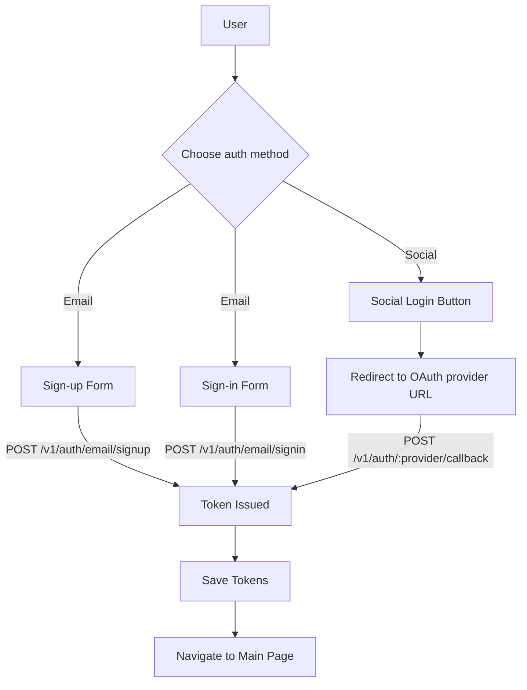
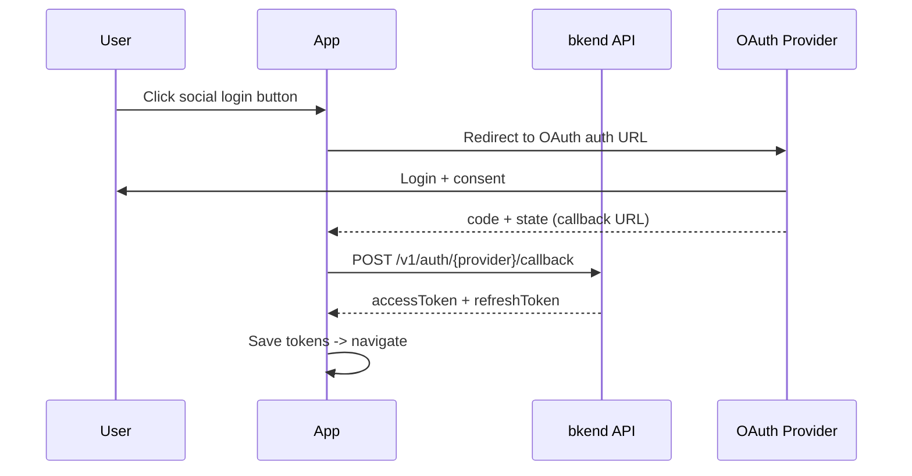
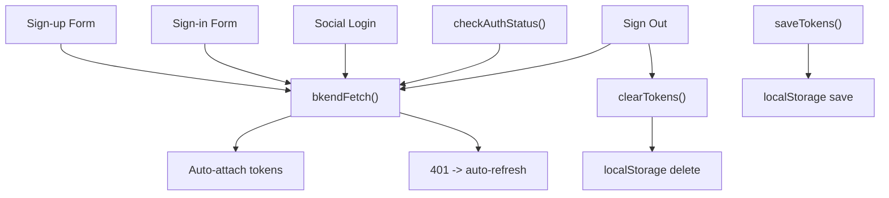

# Auth Form Patterns


Learn practical patterns for implementing sign-up, sign-in, and social login forms in JavaScript.


## Overview

This document covers framework-agnostic authentication form patterns in pure JavaScript. The same API call logic can be applied in any framework -- React, Vue, Svelte, and more.

All examples assume that the `bkendFetch` wrapper function is set up in your app. See [Token Storage & Refresh](20-token-management.md) for setup instructions.

***

## Authentication Flow Summary



***

## Sign-up Form

### POST /v1/auth/email/signup

Collect email, password, and name to create a new User account.

### HTML Structure

```html
<form id="signup-form">
  <input type="text" name="name" placeholder="Name" required />
  <input type="email" name="email" placeholder="Email" required />
  <input type="password" name="password" placeholder="Password (min. 6 characters)" required />
  <button type="submit">Sign Up</button>
  <p id="signup-error" style="color: red;"></p>
</form>
```

### JavaScript Implementation

```javascript
const signupForm = document.getElementById('signup-form');
const signupError = document.getElementById('signup-error');

signupForm.addEventListener('submit', async (e) => {
  e.preventDefault();
  signupError.textContent = '';

  const formData = new FormData(signupForm);
  const name = formData.get('name');
  const email = formData.get('email');
  const password = formData.get('password');

  try {
    const response = await bkendFetch('/v1/auth/email/signup', {
      method: 'POST',
      body: JSON.stringify({
        method: 'password',
        email,
        password,
        name,
      }),
    });

    if (!response.ok) {
      const { error } = await response.json();
      throw error;
    }

    const { accessToken, refreshToken } = await response.json();
    saveTokens({ accessToken, refreshToken });

    // Sign-up success -> navigate to main page
    window.location.href = '/';
  } catch (error) {
    signupError.textContent = getSignupErrorMessage(error.code);
  }
});

function getSignupErrorMessage(code) {
  const messages = {
    'auth/invalid-email': 'Please enter a valid email address.',
    'auth/invalid-password-format': 'Password must be at least 6 characters.',
    'auth/email-already-exists': 'This email is already registered.',
  };
  return messages[code] || 'Sign-up failed. Please try again.';
}
```

### Request Parameters

| Parameter | Type | Required | Description |
|-----------|------|:--------:|-------------|
| `method` | `string` | Yes | Fixed value `"password"` |
| `email` | `string` | Yes | User email address |
| `password` | `string` | Yes | Password (minimum 6 characters) |
| `name` | `string` | Yes | User name |

### Error Handling

| Error Code | HTTP | Description | Example Message |
|------------|:----:|-------------|-----------------|
| `auth/invalid-email` | 400 | Invalid email format | "Please enter a valid email address." |
| `auth/invalid-password-format` | 400 | Password policy violation | "Password must be at least 6 characters." |
| `auth/email-already-exists` | 409 | Email already registered | "This email is already registered." |

***

## Sign-in Form

### POST /v1/auth/email/signin

Sign in with a registered email and password.

### HTML Structure

```html
<form id="signin-form">
  <input type="email" name="email" placeholder="Email" required />
  <input type="password" name="password" placeholder="Password" required />
  <button type="submit">Sign In</button>
  <p id="signin-error" style="color: red;"></p>
</form>
```

### JavaScript Implementation

```javascript
const signinForm = document.getElementById('signin-form');
const signinError = document.getElementById('signin-error');

signinForm.addEventListener('submit', async (e) => {
  e.preventDefault();
  signinError.textContent = '';

  const formData = new FormData(signinForm);
  const email = formData.get('email');
  const password = formData.get('password');

  try {
    const response = await bkendFetch('/v1/auth/email/signin', {
      method: 'POST',
      body: JSON.stringify({
        method: 'password',
        email,
        password,
      }),
    });

    if (!response.ok) {
      const { error } = await response.json();
      throw error;
    }

    const { accessToken, refreshToken } = await response.json();
    saveTokens({ accessToken, refreshToken });

    // Sign-in success -> navigate to main page
    window.location.href = '/';
  } catch (error) {
    signinError.textContent = getSigninErrorMessage(error.code);
  }
});

function getSigninErrorMessage(code) {
  const messages = {
    'auth/invalid-email': 'Please enter a valid email address.',
    'auth/invalid-credentials': 'Email or password is incorrect.',
    'auth/mfa-required': 'MFA authentication is required.',
    'auth/account-banned': 'This account has been suspended.',
  };
  return messages[code] || 'Sign-in failed. Please try again.';
}
```

### Error Handling

| Error Code | HTTP | Description | Example Message |
|------------|:----:|-------------|-----------------|
| `auth/invalid-email` | 400 | Invalid email format | "Please enter a valid email address." |
| `auth/invalid-credentials` | 401 | Email or password mismatch | "Email or password is incorrect." |
| `auth/mfa-required` | 403 | MFA code required | "MFA authentication is required." |
| `auth/account-banned` | 403 | Suspended account | "This account has been suspended." |


For security, do not distinguish between "Email does not exist" and "Password is incorrect." For the `auth/invalid-credentials` error, display a combined message like "Email or password is incorrect."


***

## Social Login

### OAuth Flow

Social login follows a redirect-based OAuth flow.



### Social Login Buttons

```html
<div id="social-login">
  <button onclick="socialLogin('google')">Continue with Google</button>
  <button onclick="socialLogin('github')">Continue with GitHub</button>
</div>
```

```javascript
// OAuth provider auth URLs
const OAUTH_URLS = {
  google: 'https://accounts.google.com/o/oauth2/v2/auth',
  github: 'https://github.com/login/oauth/authorize',
};

const OAUTH_SCOPES = {
  google: 'openid email profile',
  github: 'user:email',
};

function socialLogin(provider) {
  const redirectUri = window.location.origin + '/auth/callback';
  const state = crypto.randomUUID();
  const params = new URLSearchParams({
    client_id: getOAuthClientId(provider), // Get from app config
    redirect_uri: redirectUri,
    response_type: 'code',
    scope: OAUTH_SCOPES[provider],
    state,
  });

  // Save provider and state for verification in the callback
  sessionStorage.setItem('oauth_provider', provider);
  sessionStorage.setItem('oauth_state', state);

  window.location.href = `${OAUTH_URLS[provider]}?${params}`;
}
```

### Callback Page Implementation

After authentication with the OAuth provider, you are redirected to the callback URL (`/auth/callback`). On this page, pass the authorization code to the bkend API to obtain tokens.

```javascript
// Runs on the /auth/callback page
async function handleOAuthCallback() {
  const urlParams = new URLSearchParams(window.location.search);
  const code = urlParams.get('code');
  const state = urlParams.get('state');
  const provider = detectProvider(); // Extract provider from URL path or state

  if (!code) {
    window.location.href = '/login?error=oauth-failed';
    return;
  }

  try {
    const redirectUri = window.location.origin + '/auth/callback';
    const response = await bkendFetch(`/v1/auth/${provider}/callback`, {
      method: 'POST',
      body: JSON.stringify({ code, redirectUri, state }),
    });

    if (!response.ok) {
      const { error } = await response.json();
      throw error;
    }

    const { accessToken, refreshToken, is_new_user } = await response.json();
    saveTokens({ accessToken, refreshToken });

    if (is_new_user) {
      // New User -> onboarding page
      window.location.href = '/onboarding';
    } else {
      // Existing User -> main page
      window.location.href = '/';
    }
  } catch (error) {
    window.location.href = '/login?error=oauth-failed';
  }
}

// Auto-execute on page load
handleOAuthCallback();
```

### Social Login Error Handling

| Error Code | HTTP | Description |
|------------|:----:|-------------|
| `auth/unsupported-provider` | 400 | Unsupported OAuth provider |
| `auth/oauth-not-configured` | 400 | OAuth configuration is incomplete |
| `auth/invalid-oauth-code` | 401 | Invalid authorization code |
| `auth/oauth-callback-failed` | 500 | OAuth callback processing failed |

***

## Check Auth Status

### GET /v1/auth/me

Check the current auth status on page load and branch the UI based on authentication.

```javascript
async function checkAuthStatus() {
  const accessToken = getAccessToken();
  if (!accessToken) {
    return null;
  }

  try {
    const response = await bkendFetch('/v1/auth/me');

    if (!response.ok) {
      return null;
    }

    return await response.json();
  } catch (error) {
    return null;
  }
}

// Run on page load
async function initApp() {
  const user = await checkAuthStatus();

  if (user) {
    // Signed in -> show main UI
    showMainContent(user);
  } else {
    // Not signed in -> redirect to login page
    window.location.href = '/login';
  }
}
```

**Response example:**

```json
{
  "id": "550e8400-e29b-41d4-a716-446655440000",
  "role": "user",
  "name": "John Doe",
  "email": "user@example.com",
  "emailVerified": "2025-01-15T09:30:00.000Z",
  "image": "https://example.com/avatar.jpg",
  "onboardingStatus": "completed",
  "createdAt": "2025-01-01T00:00:00.000Z"
}
```

***

## Overall Structure Example

Here is how to organize all auth-related code into a single module.



```javascript
// auth.js -- Authentication utility module

// -- Token storage/retrieval --
function saveTokens({ accessToken, refreshToken }) {
  localStorage.setItem('accessToken', accessToken);
  localStorage.setItem('refreshToken', refreshToken);
}

function getAccessToken() {
  return localStorage.getItem('accessToken');
}

function getRefreshToken() {
  return localStorage.getItem('refreshToken');
}

function clearTokens() {
  localStorage.removeItem('accessToken');
  localStorage.removeItem('refreshToken');
}

// -- Sign out --
async function signOut() {
  try {
    await bkendFetch('/v1/auth/signout', { method: 'POST' });
  } finally {
    clearTokens();
    window.location.href = '/login';
  }
}

// -- Check auth status --
async function checkAuthStatus() {
  const accessToken = getAccessToken();
  if (!accessToken) return null;

  try {
    const response = await bkendFetch('/v1/auth/me');
    if (!response.ok) return null;
    return await response.json();
  } catch {
    return null;
  }
}
```


See [Token Storage & Refresh](20-token-management.md) for the full `bkendFetch` function implementation.


***

## Next Steps

- [Token Storage & Refresh](20-token-management.md) -- `bkendFetch` wrapper function implementation
- [Password Management](08-password-management.md) -- Password reset form
- [Multi-Factor Authentication (MFA)](11-mfa.md) -- MFA code input form
- [Account Linking](12-account-linking.md) -- Add social login to an existing account
- Example Projects -- Check auth form implementation in [blog-web](../../examples/blog-web/) | [social-network-app](../../examples/social-network-app/)
