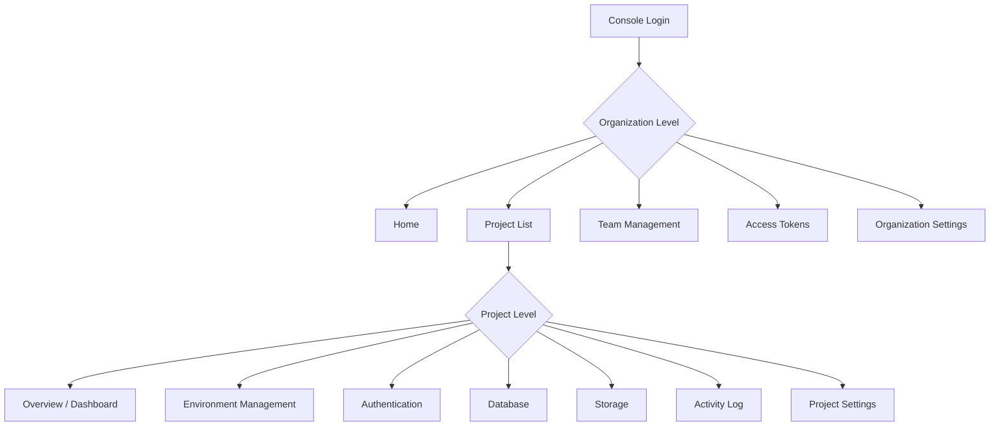

# Console Overview


The bkend console is a web-based management tool for visually managing projects, databases, authentication, and storage.


## Overview

From the bkend console (`https://console.bkend.ai`), you can manage Organizations, Projects, and Environments, as well as perform all configuration tasks such as table design, authentication setup, and API Key issuance.

***

## Console Structure

The console is organized into two levels: **Organization level** and **Project level**.

***

## Organization Level Menu

After selecting an organization, the following menus are available.

| Menu | Description | Documentation |
|------|-------------|---------------|
| **Home** | Organization dashboard | This document |
| **Projects** | Project list and creation | [Project Management](04-project-management.md) |
| **Team** | Invite members and manage roles | [Team Management](06-team-management.md) |
| **Access Tokens** | API access token management | [API Key Management](11-api-keys.md) |
| **Settings** | Organization name, deletion | [Organization Management](03-org-management.md) |

***

## Project Level Menu

After selecting a project, the following menus are available.

| Menu | Description | Documentation |
|------|-------------|---------------|
| **Overview** | Project dashboard and statistics | [Dashboard](10-dashboard.md) |
| **Environments** | dev/staging/prod environment management | [Environment Management](05-environment.md) |
| **Authentication** | Auth providers, user list | [Authentication Overview](../authentication/01-overview.md) |
| **Database** | Table list, data browsing | [Table Management](07-table-management.md) |
| **Storage** | File list, upload | [Storage Overview](../storage/01-overview.md) |
| **Activity** | Audit log | - |
| **Settings** | API Key, project settings | [Project Settings](12-settings.md) |

***

## Accessing the Console

1. Go to [https://console.bkend.ai](https://console.bkend.ai).
2. Sign in with **Google**, **GitHub**, or a **magic link**.
3. Select an existing organization or create a new one.


Console login accounts are for Tenants only. They are completely separate from User (app end-user) accounts.


***

## Next Steps

- [Console Sign Up & Login](02-signup-login.md) — Create your console account
- [Organization Management](03-org-management.md) — Create and configure an organization
- [Project Management](04-project-management.md) — Create a project
- [Quick Start](../getting-started/02-quickstart.md) — Build your first project in 10 minutes
