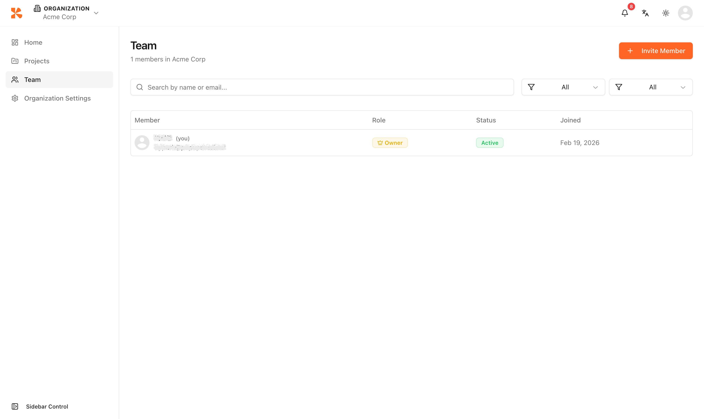
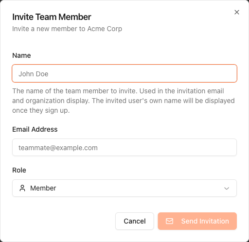

# Team Management


💡 This guide explains how to invite team members to your Organization and manage their roles.


## Overview

Team management is handled at the Organization level. Invited team members can access all projects within the Organization. Permissions vary by role.

<figure><figcaption></figcaption></figure>

***

## Inviting Team Members

1. Click **Team** in the organization-level sidebar.
2. Click the **Invite Member** button.
3. Enter the following information.

| Field | Description |
|-------|-------------|
| **Name** | Display name for the invited member |
| **Email** | Email address of the team member to invite |
| **Role** | Choose from Member role (Admin and Billing roles will be available in a future update) |

4. Click **Send Invitation**.

<figure><figcaption></figcaption></figure>


💡 When the invited member clicks the link in the invitation email, they automatically join the Organization.


***

## Permissions by Role

| Permission | Owner | Admin | Member | Billing |
|------------|:-----:|:-----:|:------:|:-------:|
| Create/delete projects | ✅ | ✅ | ❌ | ❌ |
| Manage tables/schemas | ✅ | ✅ | ✅ | ❌ |
| Invite/manage members | ✅ | ✅ | ❌ | ❌ |
| Manage billing/plans | ✅ | ❌ | ❌ | ✅ |
| Delete organization | ✅ | ❌ | ❌ | ❌ |

***

## Pending Invitations

Below the member list, a **Pending Invitations** section displays all invitations that have not yet been accepted.

| Action | Description |
|--------|-------------|
| **Resend** | Re-send the invitation email |
| **Cancel** | Revoke the pending invitation |

***

## Changing a Member's Role

1. Find the member in the team list.
2. Click the role dropdown and select a new role.
3. Confirm the role change in the dialog.


⚠️ Role changes take effect immediately. Make sure to assign the appropriate permissions for the member.


***

## Removing a Member

1. Find the member in the team list.
2. Click the **Remove** button.
3. Confirm the removal in the dialog. Access is revoked immediately.

***

## Next Steps

- [Table Management](07-table-management.md) — Create and manage tables
- [Project Settings](12-settings.md) — Configure project-specific settings
- [Organization Management](03-org-management.md) — Modify organization settings
