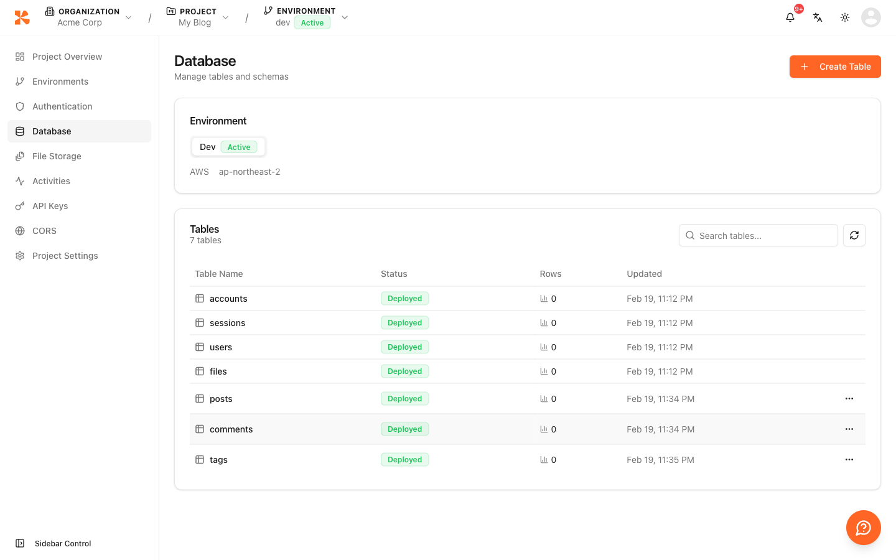
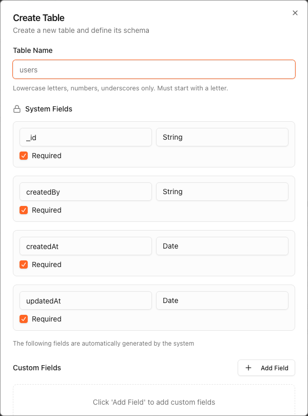
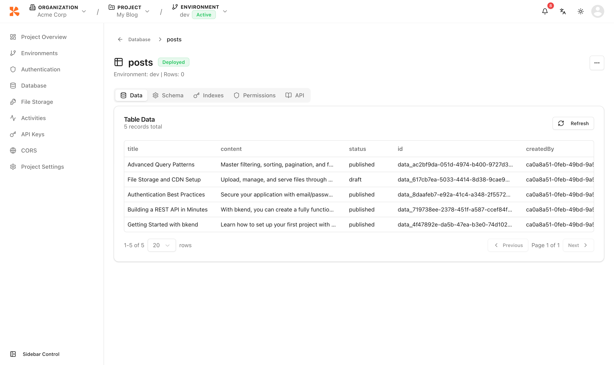
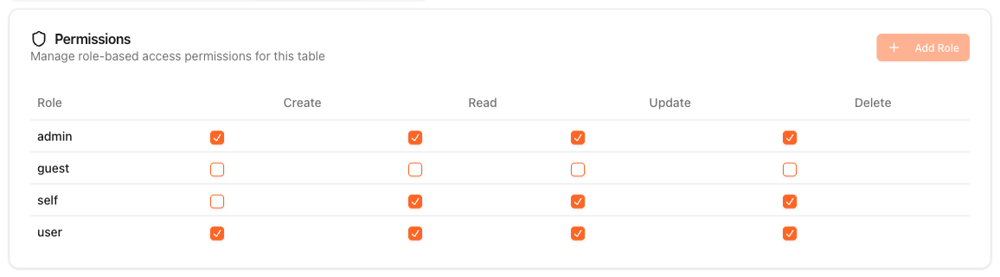

# Table Management


💡 This guide explains how to create tables and manage data from the console. Tables can only be created via the console or MCP tools.


## Overview

Use the Database menu to create, browse, and delete tables. Table creation and management is done through the console UI or [MCP Table Management Tools](../mcp/04-table-tools.md). Only data CRUD operations are available via the REST API.

***

## Viewing the Table List

1. Click **Database** in the project-level sidebar.
2. View all tables in the current environment.

<figure><figcaption></figcaption></figure>

| Displayed Info | Description |
|----------------|-------------|
| **Table Name** | Table identifier |
| **Status** | deployed / deploying / updating / failed |
| **Rows** | Number of stored records |
| **Updated** | Last modified date |


💡 System tables (`accounts`, `sessions`, `users`, `files`) are created automatically and cannot be edited or deleted.


***

## Creating a Table



1. Click the **Create Table** button.
2. Enter a table name (e.g., `posts`).
3. Click **Create**.
4. Add columns in the [Schema Editor](08-schema-editor.md).


Request in natural language from your AI tool.

```text
"Create a posts table.
- title: string (required)
- content: string (required)
- published: boolean (default: false)"
```

The MCP tool will automatically create the table and add the columns.



<figure><figcaption></figcaption></figure>


💡 When you create a table, the `id`, `createdAt`, and `updatedAt` fields are added automatically.


***

## Table Detail Page

Click a table in the table list to open the detail page. The detail page has the following tabs.

<figure><figcaption></figcaption></figure>

| Tab | Description |
|-----|-------------|
| **Data** | Browse, search, and paginate stored records |
| **Schema** | View and edit column definitions |
| **Indexes** | Manage indexes for query performance |
| **Permissions** | Configure RBAC permissions per role |
| **API Docs** | View auto-generated REST API documentation for this table |

<figure><figcaption></figcaption></figure>

***

## Deleting a Table


🚨 **Danger** — Deleting a table permanently removes all its data. This action cannot be undone.


1. Click the menu on the table you want to delete in the table list.
2. Select **Delete**.
3. Enter the table name and click **Confirm Delete**.

***

## Next Steps

- [Schema Editor](08-schema-editor.md) — Add, modify, and delete columns
- [Index Management](09-index-management.md) — Improve query performance with indexes
- [Database Overview](../database/01-overview.md) — CRUD data via the REST API
- [MCP Table Management Tools](../mcp/04-table-tools.md) — Manage tables with AI tools
