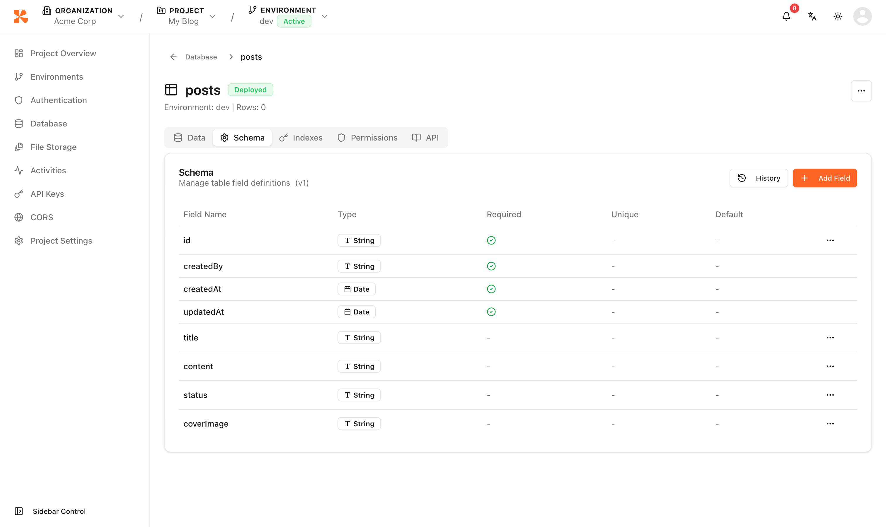
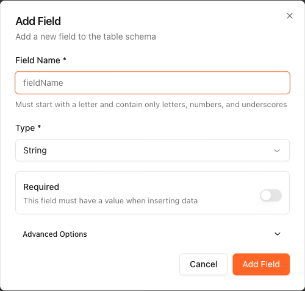
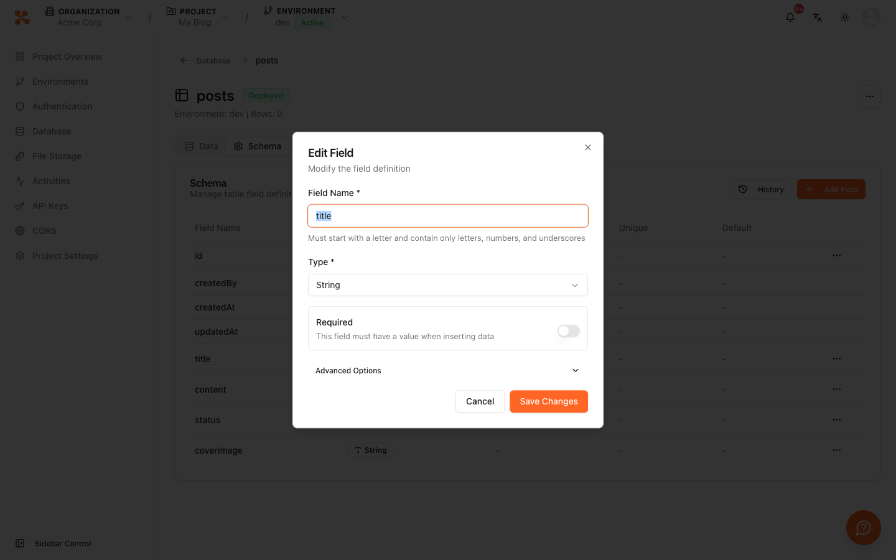
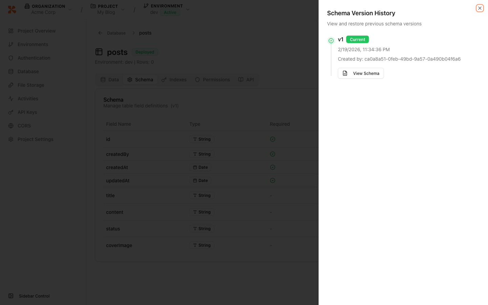

# Schema Editor


💡 This guide explains how to use the schema editor to add, modify, and delete table columns.


## Overview

Use the schema editor to design the column structure of your tables. It supports 7 column types, and you can configure required, default value, and unique constraints.

***

## Opening the Schema Editor

1. Click **Database** → select a table.
2. Click the **Schema** tab.

<figure><figcaption></figcaption></figure>

***

## Column Types

| Type | Description | Examples |
|------|-------------|----------|
| **string** | Text string | Name, email, URL |
| **number** | Number (integer/float) | Age, price, quantity |
| **boolean** | True/false | Published status, active state |
| **date** | Date/time | Birthday, reservation date |
| **object** | JSON object | Metadata, settings |
| **array** | JSON array | Tag list, categories |
| **reference** | Reference to another table | Author ID, category ID |

***

## Adding a Column



1. Click the **Add Field** button.
2. Enter the following information.

| Field | Description |
|-------|-------------|
| **Column Name** | Field identifier (snake_case recommended) |
| **Type** | Choose from 7 types |
| **Required** | NOT NULL constraint |
| **Default Value** | Automatically applied when no value is provided |
| **Unique** | UNIQUE constraint |

3. Click **Save**.

<figure><figcaption></figcaption></figure>


Request in natural language from your AI tool.

```text
"Add a views column to the posts table. Number type, default value 0"
```



***

## Modifying a Column

1. Click the **Edit** icon on the column you want to modify.
2. Change the type, required status, default value, etc.
3. Click **Save**.

<figure><figcaption></figcaption></figure>


⚠️ Changing the type of a column that already contains data may cause compatibility issues with existing data. Proceed with caution.


***

## Deleting a Column


🚨 **Danger** — Deleting a column permanently removes all data in that column.


1. Click the **Delete** icon on the column you want to remove.
2. The column is deleted after confirmation.

***

## Auto-generated Fields

Every table automatically includes the following fields.

| Field | Type | Description |
|-------|------|-------------|
| `id` | string | Unique identifier (auto-generated) |
| `createdAt` | date | Creation timestamp (auto-recorded) |
| `updatedAt` | date | Last modified timestamp (auto-updated) |

***

## Schema Version History

Every time the schema is modified (column added, edited, or deleted), a new version is automatically recorded. You can view the full version timeline and roll back to a previous version if needed.

1. Open the **Schema** tab of a table.
2. Click the **History** button in the top right.

<figure><figcaption></figcaption></figure>

### Viewing Version Details

Each version entry shows the version number, creation date, and creator. Click **View Schema** to inspect the full schema definition (JSON) of that version.

| Field | Description |
|-------|-------------|
| **Version** | Incrementing version number (v1, v2, ...) |
| **Current** | Green badge indicates the active version |
| **Created At** | Date and time the version was created |
| **View Schema** | View the full JSON schema of this version |

### Rolling Back


⚠️ Rolling back does not delete existing versions. It copies the target version's schema and creates a **new version** based on it.


1. In the version history panel, find the version you want to restore.
2. Click the **Rollback** button (not shown on the current active version).
3. Confirm in the dialog.


🚨 **Danger** — Rolling back may cause compatibility issues if your application depends on columns that were added after the target version. Verify your app's data access patterns before rolling back.


***

## Next Steps

- [Index Management](09-index-management.md) — Optimize query performance
- [Understanding the Data Model](../database/02-data-model.md) — Data modeling guide
- [Inserting Data](../database/03-insert.md) — Add data via the REST API
