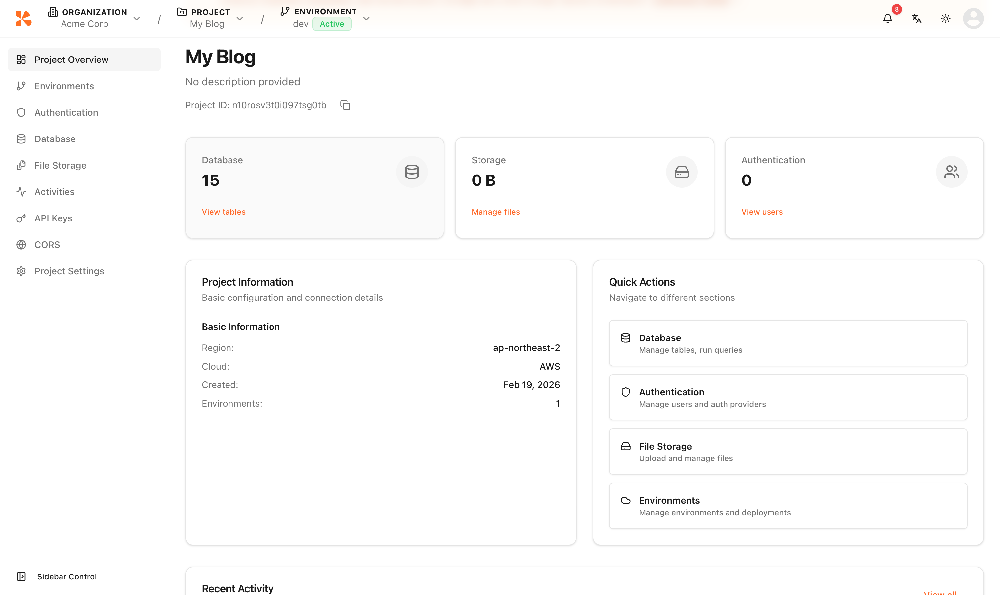

# Dashboard


💡 The dashboard is the landing page after you log in to the console. It directs you to your last-used organization and project.


## Overview

When you access the console, the dashboard automatically redirects you based on your current context.

***

## Redirect Behavior

| Context | Redirect Target |
|---------|----------------|
| Organization and project already selected | Project overview page |
| Organization selected, no project | Organization home page |
| No organization | Console home with **Create Organization** prompt |


💡 If you have previously selected an organization and project, the console remembers your selection and redirects you directly.


***

## Project Overview

After selecting a project, click **Overview** in the project-level sidebar to view the project landing page.

<figure><figcaption></figcaption></figure>

***

## Next Steps

- [API Key Management](11-api-keys.md) — Issue REST API access tokens
- [Project Settings](12-settings.md) — Configure detailed project settings
- [Table Management](07-table-management.md) — Create and manage tables
