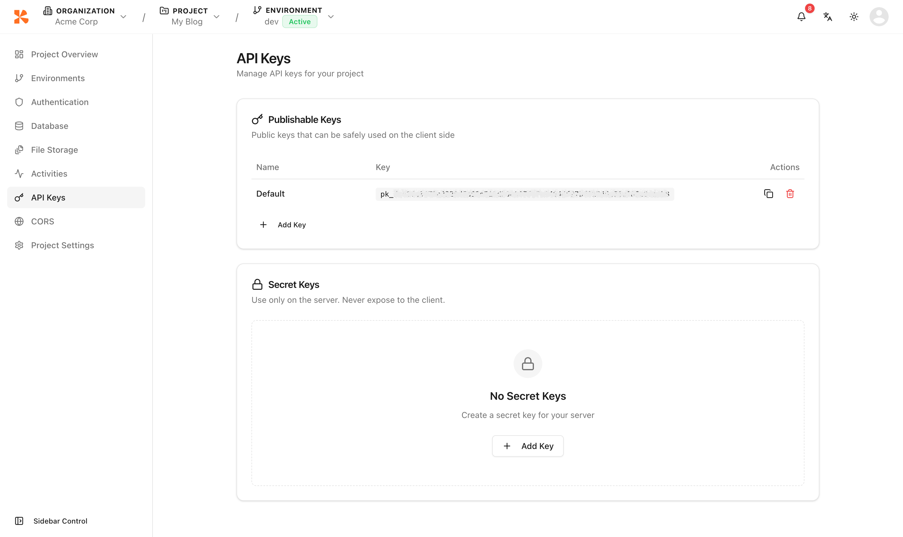
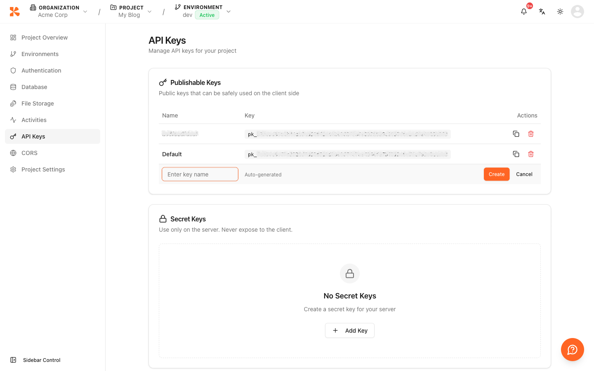

# API Key Management


💡 This guide explains how to issue and manage API Keys for calling the REST API.


## Overview

To call the bkend REST API from your app, you need an API Key. API Keys are managed independently per environment. There are two types: **Publishable Keys** for client-side use and **Secret Keys** for server-side use.

***

## Opening the API Keys Page

Click **API Keys** in the project-level sidebar.

The page is divided into two sections:

| Section | Prefix | Usage |
|---------|--------|-------|
| **Publishable Keys** | `pk_` | Client-side (browser, mobile app) — limited permissions |
| **Secret Keys** | `sk_` | Server-side only — full permissions |

<figure><figcaption></figcaption></figure>

***

## Creating a Publishable Key

1. In the **Publishable Keys** section, click the **Add Key** button.
2. Enter a name (e.g., `my-app-key`) and click **Create**.
3. The key is created and added to the list.

<figure><figcaption></figcaption></figure>


💡 Publishable Keys are always visible in the list and can be copied at any time by clicking the key value.


***

## Creating a Secret Key

1. In the **Secret Keys** section, click the **Add Key** button.
2. Enter a name (e.g., `server-key`) and click **Create**.
3. The full key value is displayed once with a highlight. Copy it immediately.


🚨 **Danger** — Secret Key values are only shown once at creation time. After navigating away, only a masked version is displayed. If lost, you must delete the key and create a new one.



⚠️ Secret Keys (`sk_` prefix) must never be exposed to the client. Use them only in server-side environments.


***

## Using an API Key

Include the Publishable Key in the `X-API-Key` header. Add an `Authorization` header when authenticated requests are required.

```bash
curl https://api-client.bkend.ai/v1/data/posts \
  -H "X-API-Key: {pk_publishable_key}" \
  -H "Authorization: Bearer {accessToken}"
```

***

## Viewing the API Key List

The API Keys page displays all keys for the current environment.

| Displayed Info | Description |
|----------------|-------------|
| **Name** | Identifying name of the key |
| **Key** | Masked key value (click to copy) |
| **Actions** | Delete button |

***

## Deleting an API Key

1. Find the key you want to delete in the list.
2. Click the **Delete** button.
3. Enter the key name in the confirmation dialog and click **Confirm Delete**.
4. The key is immediately invalidated.


⚠️ Deleting a key causes API calls to fail for all apps using it. Replace the key in your apps before deleting.


***

## Next Steps

- [Project Settings](12-settings.md) — Check your Project ID and other settings
- [Understanding API Keys](../security/02-api-keys.md) — Publishable Key vs Secret Key
- [Integrating bkend with Your App](../getting-started/03-app-integration.md) — Connect your API with a fetch helper
