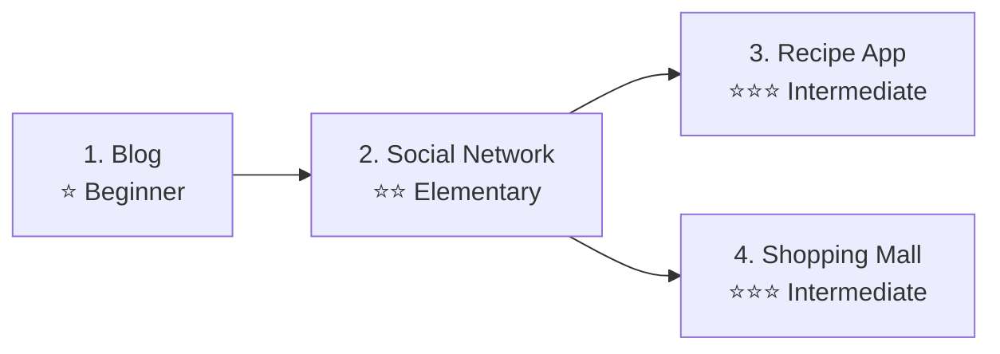

# Hands-on Project Cookbooks


💡 Step-by-step tutorials for building real apps from scratch with bkend.


## Overview

This cookbook series guides you through building real services using bkend's **Authentication**, **Dynamic Tables**, and **Storage**. Each cookbook can be followed in two ways:

| Track | Approach | Audience |
|-------|----------|----------|
| **Console + REST API** | Configure via Console UI, process data with curl/JavaScript | App developers |
| **MCP (AI Tools)** | Request backend setup from AI using natural language | AI agent users |

***

## Cookbook List

| # | Cookbook | Difficulty | Key Features | Dynamic Tables |
|:-:|---------|:----------:|--------------|----------------|
| 1 | [Blog](./blog/) | ⭐ | Article CRUD, images, tags, bookmarks | articles, tags, bookmarks |
| 2 | [Social Network](./social-network/) | ⭐⭐ | Profiles, posts, comments, follows, feed | profiles, posts, comments, likes, follows |
| 3 | [Recipe App](./recipe-app/) | ⭐⭐⭐ | Recipes, ingredients, meal plans, shopping lists | recipes, ingredients, meal_plans, shopping_lists, cooking_logs |
| 4 | [Shopping Mall](./shopping-mall/) | ⭐⭐⭐ | Products, carts, orders, reviews | products, carts, orders, reviews |

***

## Learning Path



### Beginners

Start with **Blog**. You will learn the basics of table creation, data CRUD, and file uploads.

### Experienced Users

Pick any cookbook that interests you. Each cookbook can be completed independently.

***

## Cookbook Structure

```text
{cookbook}/
├── README.md                    # Introduction + table design
├── quick-start.md               # Quick start
└── full-guide/
    ├── 00-overview.md           # Project overview
    ├── 01-auth.md               # Authentication setup
    ├── 02-{feature}.md          # Core feature 1
    ├── 03-{feature}.md          # Core feature 2
    ├── 04-{feature}.md          # Core feature 3
    ├── 05-{feature}.md          # Core feature 4
    ├── 06-ai-prompts.md         # AI prompt collection
    └── 99-troubleshooting.md    # Troubleshooting
```

***

## Prerequisites

Complete the following items before starting a cookbook.

| Item | Description | Reference |
|------|-------------|-----------|
| bkend account | Sign up on the console | [Console Sign Up](../console/02-signup-login.md) |
| Create a project | Create a new project on the console | [Project Management](../console/04-project-management.md) |
| API Key | Issue from Console → **API Keys** | [API Key Management](../console/11-api-keys.md) |
| AI tools (optional) | Install Claude Code or Cursor | [MCP](../mcp/01-overview.md) |

***

## bkend Features Used

| bkend Feature | Usage in Cookbooks | Reference |
|---------------|-------------------|-----------|
| Authentication | Email sign-up/sign-in, social login | [Authentication Overview](../authentication/01-overview.md) |
| Dynamic Tables | Data CRUD, filtering, pagination | [Database Overview](../database/01-overview.md) |
| Storage | Image/file uploads | [Storage Overview](../storage/01-overview.md) |
| MCP Tools | Manage tables/data with AI | [MCP](../mcp/01-overview.md) |

***

## Live Demos

Live demos of each cookbook deployed to production. Log in with the demo account (`demo@bkend.ai` / `Bkend123$`) to try them out.

| Cookbook | Platform | Live Demo |
|---------|----------|-----------|
| Blog | Web | [bkend-blog.netlify.app](https://bkend-blog.netlify.app/) |
| Recipe App | Web | [bkend-recipe.netlify.app](https://bkend-recipe.netlify.app/) |
| Shopping Mall | Web | [bkend-shopping-mall.netlify.app](https://bkend-shopping-mall.netlify.app/) |
| Social Network | iOS | [Appetize.io Simulator](https://appetize.io/app/ios/com.bkend.example.socialNetworkApp?device=iphone14pro&osVersion=17.2) |

👉 See the [Live Demos](./live-demos.md) page for more details.

***

## Example Projects

Example projects that implement each cookbook as actual code. Mock mode is supported so you can run them immediately without a bkend server.

| Cookbook | Example Project | Platform |
|---------|----------------|----------|
| Blog | [blog-web](../../examples/blog-web/) | Next.js |
| Social Network | [social-network-app](../../examples/social-network-app/) | Flutter |
| Recipe App | [recipe-web](../../examples/recipe-web/) · [recipe-app](../../examples/recipe-app/) | Next.js · Flutter |
| Shopping Mall | [shopping-mall-web](../../examples/shopping-mall-web/) | Next.js |

***

## Reference Docs

- [Quick Start Guide](../getting-started/02-quickstart.md) — Initial bkend setup
- [Integrate bkend in Your App](../getting-started/06-app-integration.md) — bkendFetch helper
- [Error Handling Guide](../guides/11-error-handling.md) — Common error responses
