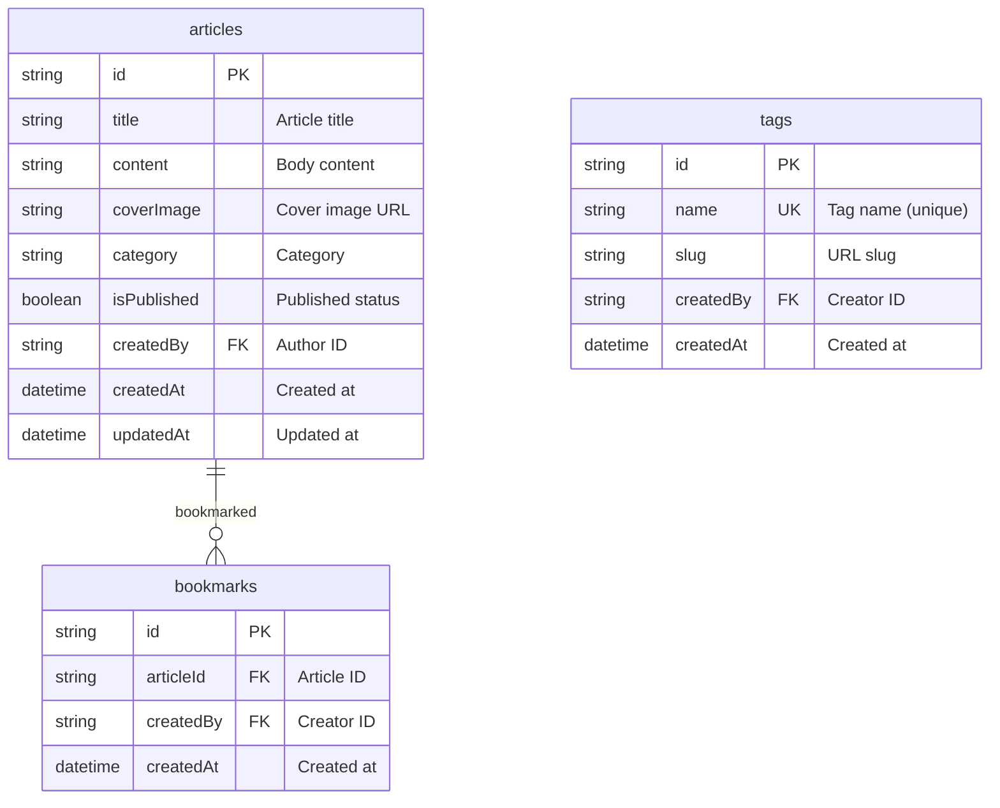

# Blog Cookbook


💡 Build a personal blog from scratch with bkend. Implement article CRUD, image attachments, tag classification, and bookmarks step by step.


## What You Will Build

After completing this cookbook, you will have a personal blog with the following features.

| Feature | Description |
|---------|-------------|
| Sign Up / Sign In | Email-based authentication |
| Article CRUD | Create, read, update, delete articles |
| Cover Image | Attach images to articles |
| Tag Classification | Categorize articles with tags |
| Bookmarks | Save articles of interest |

***

## Difficulty

⭐ **Beginner** — Suitable for first-time bkend users. Learn basic table design and data CRUD.

| Item | Details |
|------|---------|
| Estimated Learning Time | Quick Start 5 min, Full Guide 2 hours |
| Platform | Web + App |

***

## bkend Features Used

| bkend Feature | Usage in Cookbook | Reference |
|---------------|-----------------|-----------|
| Authentication | Email sign-up / sign-in, token management | [Authentication Overview](../../authentication/01-overview.md) |
| Dynamic Tables | articles, tags, bookmarks data CRUD | [Database Overview](../../database/01-overview.md) |
| Storage | Article cover image upload | [Storage Overview](../../storage/01-overview.md) |
| MCP Tools | Manage tables and data with AI | [MCP](../../mcp/01-overview.md) |

***

## Table Design

***

## Learning Path

| Order | Chapter | Key Content |
|:-----:|---------|-------------|
| - | [Quick Start](quick-start.md) | Write your first article in 5 minutes |
| 0 | [Project Overview](full-guide/00-overview.md) | Overall structure, table design, API summary |
| 1 | [Authentication Setup](full-guide/01-auth.md) | Email sign-up/sign-in, token management |
| 2 | [Article CRUD](full-guide/02-articles.md) | Create, read, update, delete articles |
| 3 | [Image Attachments](full-guide/03-files.md) | Upload cover images, attach to articles |
| 4 | [Tag Management](full-guide/04-tags.md) | Create tags, assign tags to articles |
| 5 | [Bookmarks](full-guide/05-bookmarks.md) | Save articles of interest, bookmark list |
| 6 | [AI Prompt Collection](full-guide/06-ai-prompts.md) | AI usage scenarios |
| 99 | [Troubleshooting](full-guide/99-troubleshooting.md) | Common error responses |

***

## Prerequisites

| Item | Description | Reference |
|------|-------------|-----------|
| bkend account | Sign up on the console | [Console Sign Up](../../console/02-signup-login.md) |
| Create a project | Create a new project on the console | [Project Management](../../console/04-project-management.md) |
| API Key | Issue from Console → **API Keys** | [API Key Management](../../console/11-api-keys.md) |
| AI tools (optional) | Install Claude Code or Cursor | [MCP](../../mcp/01-overview.md) |

***

## Reference Docs

- [Quick Start Guide](../../getting-started/02-quickstart.md) — Initial bkend setup
- [Integrate bkend in Your App](../../getting-started/06-app-integration.md) — bkendFetch helper
- [Error Handling Guide](../../guides/11-error-handling.md) — Common error responses
- [blog-web Example Project](../../../examples/blog-web/) — Full code implementing this cookbook in Next.js

***

## Next Steps

- [Get Started in 5 Minutes](quick-start.md) — Jump right in
- [Project Overview](full-guide/00-overview.md) — Understand the overall structure first
